# 再培训，还是不培训？

> 原文：<https://towardsdatascience.com/to-retrain-or-not-to-retrain-80b20c0a6e53?source=collection_archive---------29----------------------->

## 让我们分析一下 ML 模型的更新

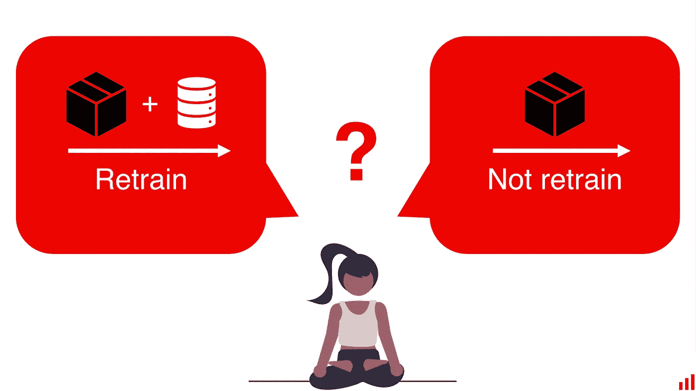

图片作者。

是时候重新训练你的机器学习模型了吗？

尽管数据科学完全是关于…数据的，但令人惊讶的是，这个问题的答案往往基于直觉。

一些人连夜重新训练模型——因为这很方便。其他人每个月都这样做——这似乎是对的，而且必须有人来选择时间表。或者甚至是“当用户来抱怨的时候”——哎哟！

我们能做得更好吗？

为了更准确地回答再培训的问题，我们可以将其转换为三个。

**首先，我们通常应该多长时间重新培训一次给定的模型？**我们可以通过查看过去的漂移速度来预先了解我们的再培训需求。

**其次，我们现在应该重新培训这种模式吗？**我们的模型目前表现如何，有什么有意义的变化吗？

**第三，稍微细致一点。**我们应该重新培训，还是应该更新模型？我们可以简单地在旧的训练管道中输入新的数据。或者回顾一切，从特性工程到整个架构。

让我们开始吧。

# 为什么

图片作者。

首先，我们为什么要谈论改变模型？当我们建造它们时，我们确实尽了最大努力。

**最明显的答案:机器学习模型会变老。即使没有什么大的变化发生，微小的变化也会累积。我们可以经历[数据漂移，概念漂移，或者两者兼而有之](https://evidentlyai.com/blog/machine-learning-monitoring-data-and-concept-drift)。**

为了跟上时代，模特应该重新学习模式。他们需要查看更能反映现实的最新数据。

这就是我们所说的“再培训”:将新数据添加到旧的培训管道中，并再次运行它们。

**根据域的不同，模型衰减可快可慢。**

*不同型号的衰减速度不同。(图片由作者提供)。*

例如，制造过程趋于稳定。一个质量预测模型可以持续一整年。或者等到第一次外部变化，比如新的原料供应商。

消费者需求可能更加不稳定。每个新一周的数据都可能带来一些你更好考虑的新奇事物。

当然，没有什么是一成不变的。我们已经看到，生产模式需要在每一个生产批次之后进行更新，而销售却保持着令人厌烦的稳定。

**在欺诈检测等案例中，我们必须考虑对手。他们可能会很快适应。新型欺诈——我们模型的新概念——会不时出现。**

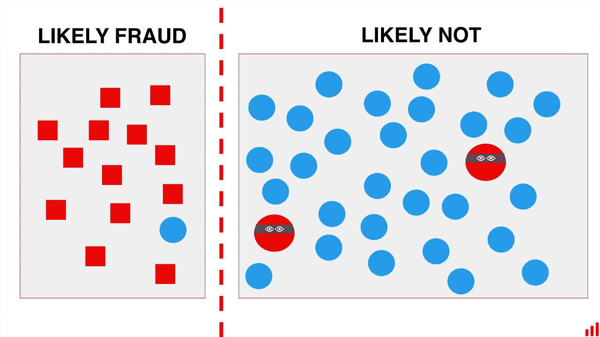

如果模型保持不变，对手可以随着时间的推移适应它。(图片由作者提供)。

以搜索引擎优化为例。坏演员可能会试图玩弄系统。在这种情况下，模型再训练可能有双重原因。首先，我们这样做是为了保持排名质量。第二，解决这种不想要的行为。

即使排名质量保持不变，更新也是有意义的！目标是通过改变系统运行的方式使适应变得更加困难。

在实时系统中，我们可能非常关心最近的反馈。

*推荐模型需要对最近的用户反馈做出反应。(图片由作者提供)。*

考虑音乐推荐。如果用户否决了几首歌曲，推荐引擎应该在几秒钟内做出反应。

这并不意味着模型不再有效。我们不必总是完全重新训练它！但是我们需要考虑最新的口味。

例如，我们可以重新平衡用户偏好的权重。我们可以降低特定口味的重要性，提升其他口味。这种调整在计算上很快，我们可以在运行中完成。

**这只是几个例子。**不同的车型有不同的保养需求。它们从微小的在线校准到完全的离线更新或者两者的结合。有些模型漂移很快，有些没那么快。我们可以每天运行我们的培训管道，或者每月运行一次。

我们无法为所有型号和应用定义一个通用的时间表。但至少当谈到常规模型“老化”时，我们可以用一种系统的方式来解决它。

我们将在下面描述这种方法。

在更复杂的情况下，您可能需要修改它——使用这些检查作为灵感！

# 第一部分。预先确定再培训策略

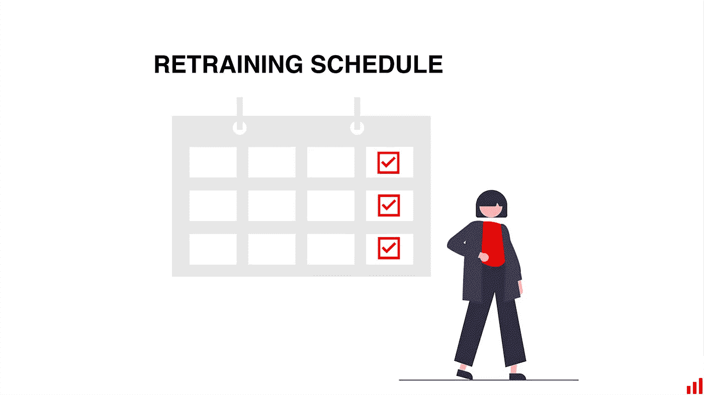

图片作者。

我们的第一个问题来了。我们应该多长时间对模型进行一次再培训，这到底有没有必要？

像往常一样，我们可以从数据中学习！

为了制定时间表，我们可以做一些检查。根据您的模型的关键程度，您可能会经历其中的一些或全部。

# 检查#1。模型需要多少数据？

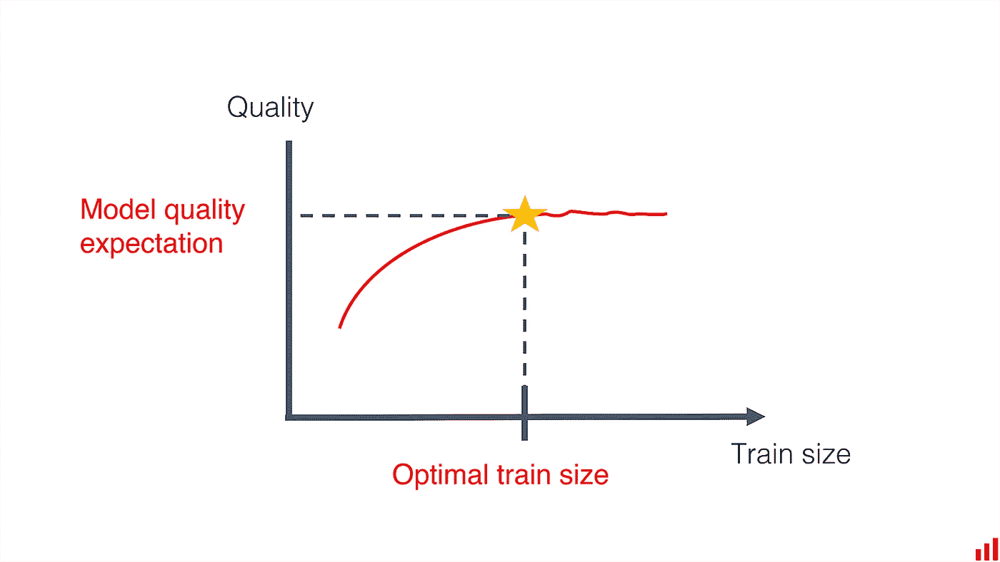

图片作者。

是的，学习曲线。

我们的目标是首先了解我们需要多少数据来训练模型。我们可能拥有太多，也可能太少。

在讨论再培训之前，这是一个需要检查的问题:我们完成培训了吗？

这张支票有很好的副作用。我们可能会减少训练数据量。此外，我们可以了解每个数据块包含多少信号。

我们从哪里开始？

**如果你有很长一段时间的训练数据，你可以检查一下是否需要全部。**

假设我们有 5 年的历史数据。我们可以看到在完整数据集上训练的模型是否比仅在最近时期训练的模型做得更好。

也许，仅仅一两年的数据就足以得到同样的结果？

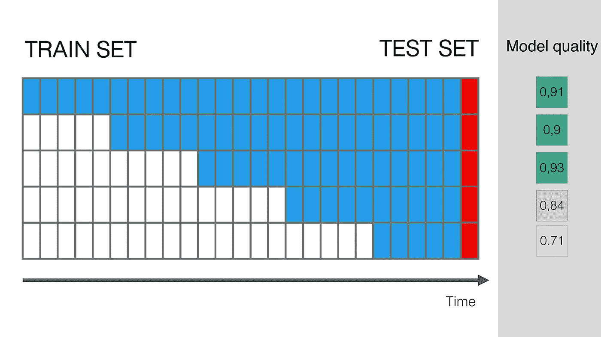

*在本例中，我们可能决定丢弃 40%的旧数据。(图片由作者提供)。*

如果您处理时间序列数据和已知的季节模式，您可能需要自定义测试设计。但是在很多数据丰富的情况下，这种粗略的检查有助于方便地减少训练样本的大小。

你也可以直接进行更细致的测试。

当没有明显的数据过剩时，这一条是有意义的。或者当数据不是连续的时候:我们可能只是有一组带标签的对象，比如图像或文本。

那我们该怎么办？

这种检查类似于我们在梯度方法中定义训练迭代次数的方式。或者在模型验证期间选择集合中的树的数量，例如在随机森林算法中。

这是一个复习:为了达到一个最佳的数字，我们评估的替代品。我们挑选最小和最大数量的树。我们定义步骤。然后，我们检查所有选项的模型质量。当然，要注意交叉验证！

接下来，我们绘制模型质量如何依赖于树的数量。在某种程度上，它到达了一个平台:添加更多的树并不能提高性能。

**我们可以采用这种方法来检查增加更多的数据是否会提高模型质量。**

在这种情况下，没有时间维度。我们将训练集中的每个观察视为一个单独的条目。想象一个带标签的图片，一个信用申请人，一个用户会话，等等。

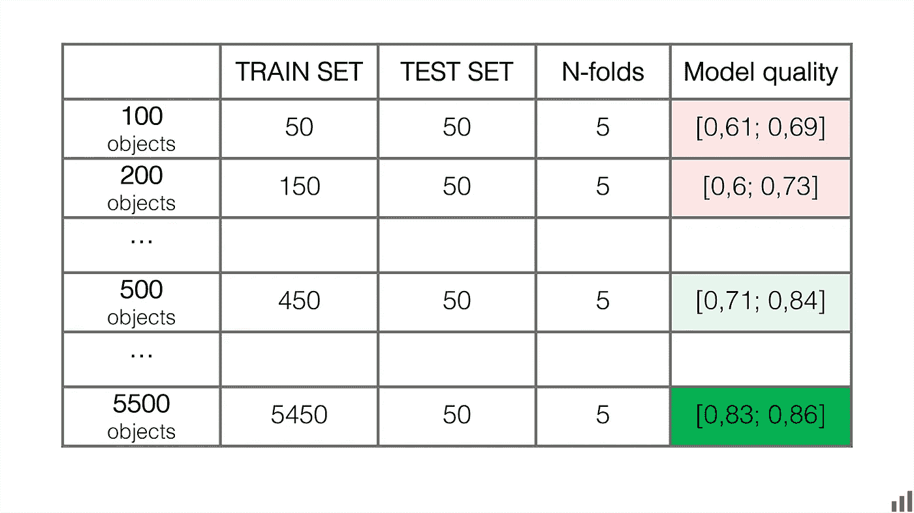

图片作者。

如何进行？

*   获取可用的培训数据
*   修复测试集
*   选择初始训练数据大小—可能是一半，也可能是 10%
*   定义步长-要添加的训练数据量
*   开始倒吧！

我们可以使用随机分割方法，并通过改变训练规模来执行交叉验证。这个想法是评估**数据量**对模型性能的影响。

在某些时候，我们可以到达一个平台期，然后就到此为止。增加更多的数据无法改善结果。

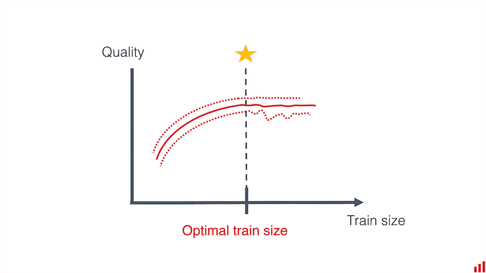

图片作者。

我们可以回过头来决定训练一个足够好的模型所需的最佳样本量。如果它比我们拥有的训练集小，我们可能会很高兴丢弃“额外的”数据。这使得训练更加轻便。

或者，我们可能还没有到达顶峰！如果质量不断提高，我们的模型需要更多的数据。

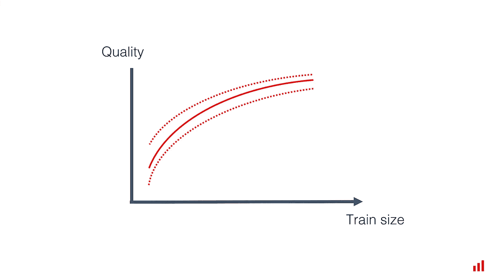

图片作者。

提前知道这一点真好！

检查模型衰减的速度还没有意义。我们仍处于改进阶段。假设获得更好的模型具有商业意义，我们应该在这方面努力。

也许，我们可以得到更多的标签数据？否则，做好持续改进和频繁再培训的准备——直到我们达到最佳表现。

通过外推结果，我们还可以粗略地估计我们需要多少实例来达到目标质量。这是一个来自 Keras 教程的图像分类案例。

**作为一个副作用，这个练习给了我们一种“尺度感”**模型质量变化有多快？需要 10 次观察还是至少 100 次？获取如此大量的新数据需要几天或几个月吗？

当我们对衰变和再训练进行更多的分析时，它将帮助我们选择一个合理的“步骤”。

**这个检查本身并没有告诉我们多长时间重新训练一次模型。**为什么？并非所有的数据都同样有用。比如说，更多“有价值”的数据可能只在周末到达。当我们混合数据时，我们忽略了这个因素。

还有一些检查要进行。

继续下一个！

# 检查#2。生产过程中质量下降的速度有多快？

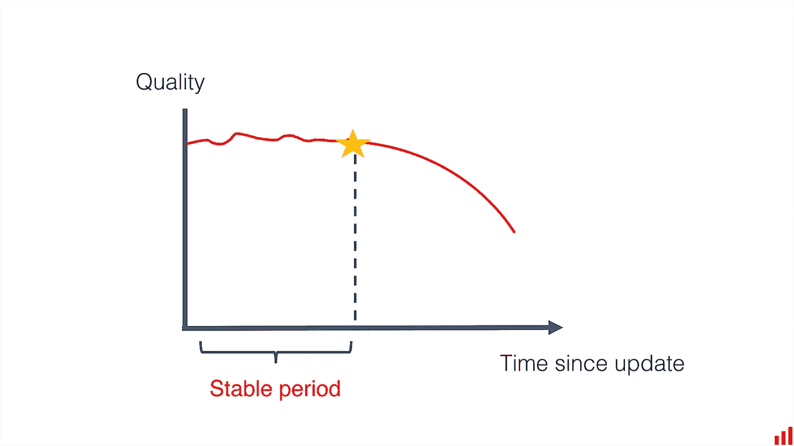

图片作者。

这是另一个有用的启发。

让我们假设有一个平均的，预期的漂移速度。这可能是用户口味演变或设备磨损的速度。

然后，我们可以回顾我们的数据，并对其进行评估！

我们可以根据旧数据训练我们的模型，并将其连续应用到后期。

然后，我们将计算我们的模型在“变老”时表现如何目标是检测模型性能何时显著下降。

这种单点估算已经可以降低不确定性。我们可以粗略估计我们的模型老化的速度:是一周还是一个月？或者更多？

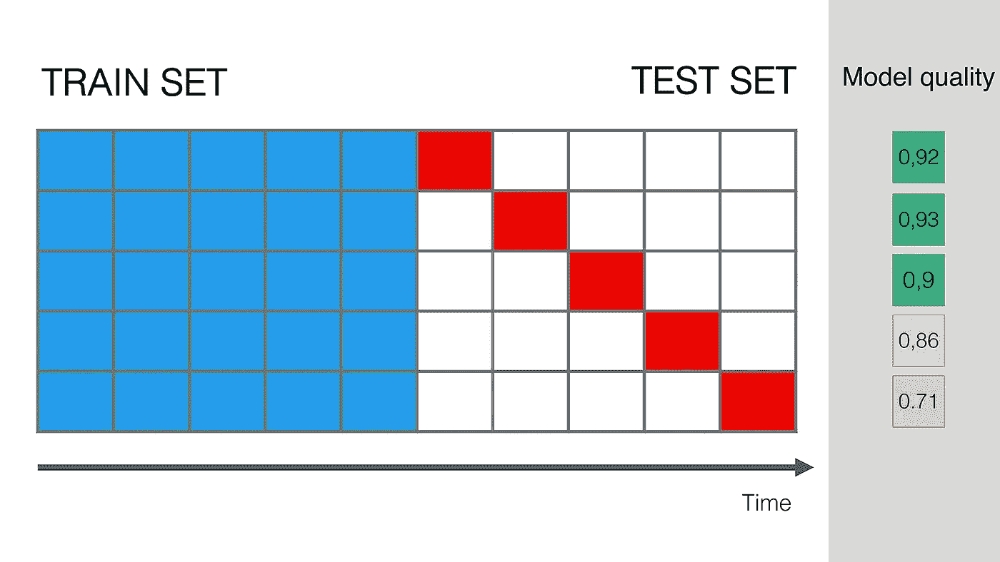

*在本例中，我们仅在 3 个时间间隔后观察到性能下降。(图片由作者提供)。*

如果我们有足够的数据，我们可以重复这个检查几次，改变初始训练集。然后我们可以对结果进行平均(考虑异常值，如果有的话！)

这样，我们可以得到更精确的评估。

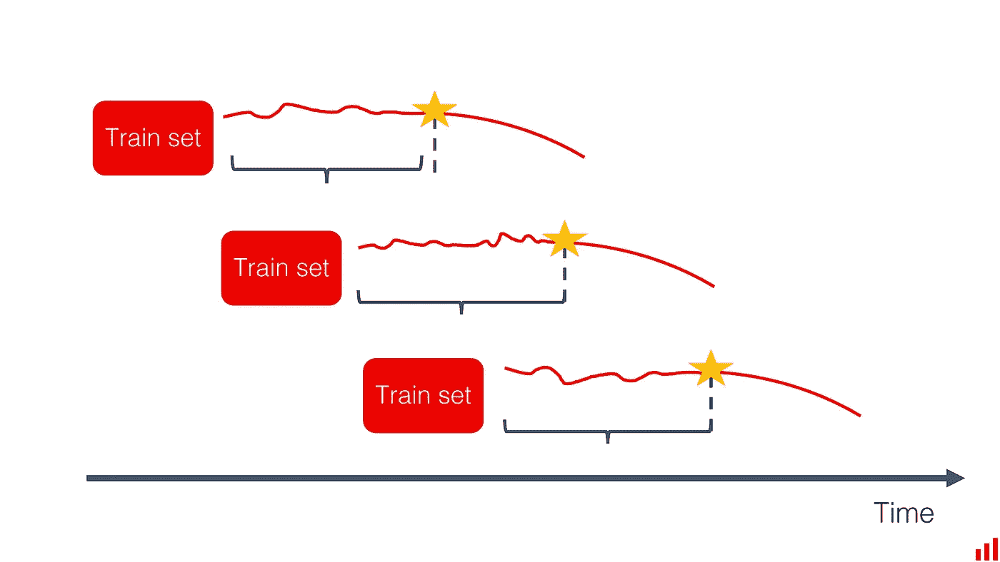

图片作者。

当然，在练习过程中，模型训练方法应该保持不变。否则，模型参数对衰减的影响可能大于环境的变化。

警告:如果您的数据中有一些重要的子群体，您可能希望将这些子群体的模型质量作为一个单独的指标来检查！

**测试结果可能会有所不同。有时，你会发现你的模型非常稳定:即使是 6 个月大的模型也能和新模型表现一样好！**

在其他情况下，你会看到模型衰减很快。

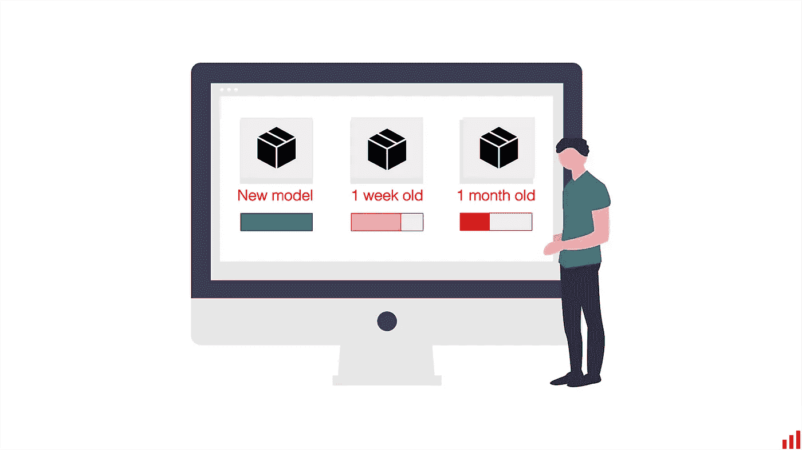

有些型号可能会很快过时。(图片由作者提供)。

如果这很难处理，你可能会决定重新考虑你的训练方法。

一些可供考虑的选项:

*   使模型更“重”但更稳定。例如，添加更多数据源或执行更复杂的特征工程。该模型表面上看起来性能较差，但从长远来看更加稳定。
*   **让模特更有活力。**在较短的时间内训练模型，但要经常校准(每小时一次？)或者考虑主动学习。
*   **分别解决模型缺陷。**模型可能只在特定的部分快速退化。我们可以有选择地应用模型来排除那些([查看本教程](https://evidentlyai.com/blog/tutorial-2-model-evaluation-hr-attrition)中我们解释的想法！)并使用一些非 ML 的方法。也许，依靠良好的旧规则或人在循环中？

如果我们已经决定了结果，让我们写下数字！这个预期的衰减速度是我们再训练方程中的一个关键变量。

# 估计过去的漂移总是有意义的吗？

不总是。

背后的假设是世界变化的渐进速度。

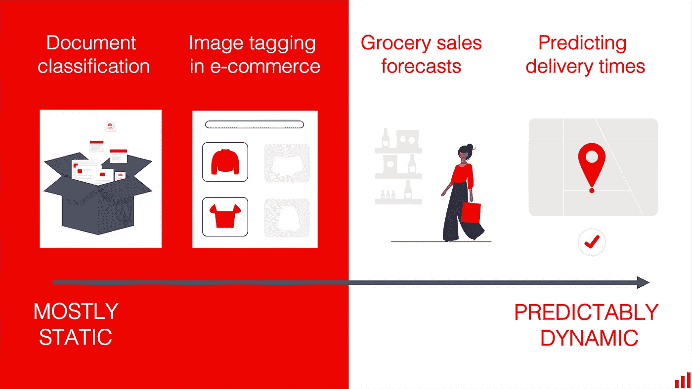

有些问题本质上是模式动态的。(图片由作者提供)。

如果您正在创建一个图像模型来检测路标，那么问题是另一种类型的。你必须小心黑暗和嘈杂图像的“长尾”，但实际的迹象几乎没有变化。

文本模型也是如此，比如情感分析或实体提取。他们仍然需要更新，但很少遵循时间表。与其检查衰退的速度，不如寻找表现不佳的部分并监控变化更有意义。

**其他情况更可预测动态。**思考消费者行为、移动模式或电力消耗等时间序列问题。

假设一定的变化速度通常是有意义的。查看过去的漂移来估计模型退化的速率也是如此。

这些数据经常带有时间戳。你可以很容易地跳上“时间机器”进行计算。

# 检查#3。你多久收到一次新数据？

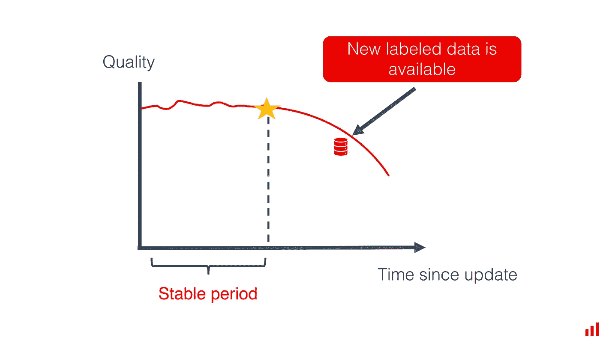

图片作者。

我们大概了解了我们的再培训需求。但是有一个问题。我们能重新训练它吗？

要运行再训练管道，我们需要知道目标值或者有新标记的数据。

如果反馈很快，这不是问题。

但是有时候，会有延迟。我们可能需要专家贴标签。或者，干脆等着！

**检查哪个先出现是有意义的:新数据还是模型衰退。**

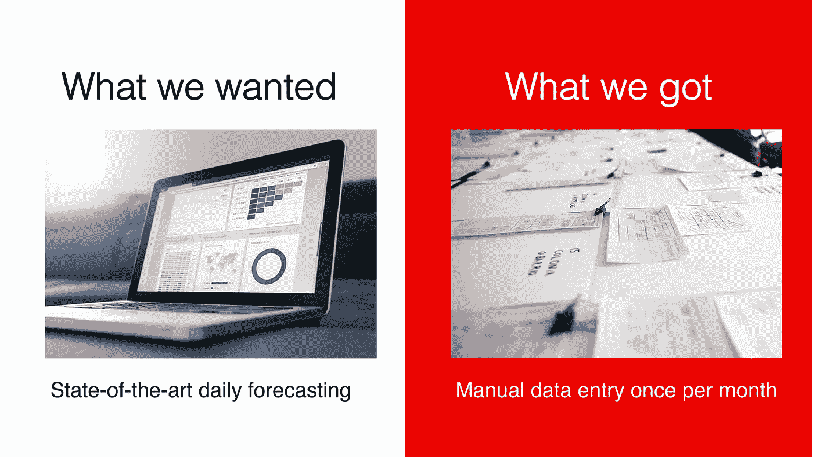

图片作者。

这主要是一个业务流程问题:数据生成的速度有多快，以及它何时到达您的数据仓库。

比方说，我们了解到，从历史上看，我们的销售模式会在两周内降级。但是实际零售额的新数据每月只收集一次。这限制了我们的再培训能力。

我们能弥补吗？一些可供考虑的选项:

*   一连串的模型。有些数据是否可以更早得到？例如，一些销售点可能会在月底前交付数据。然后，我们可以创建几个具有不同更新时间表的模型。
*   **混合模式集合。**我们可以组合不同类型的模型，以更好地应对衰退。例如，使用销售统计数据和业务规则作为基线，然后在其上添加机器学习来纠正预测。粗略的规则可能在接近期末时表现得更好，这将有助于保持整体性能。
*   **重建模型使其更加稳定。**回到训练！我们也许可以用测试性能的一些数字来换取更慢的退化。
*   **调整预期。**模型有多重要？我们可能会接受现实，顺其自然。只是不要忘记传达现在预期的性能指标！在第一个测试周，这款车型将无法实现其全明星表现。

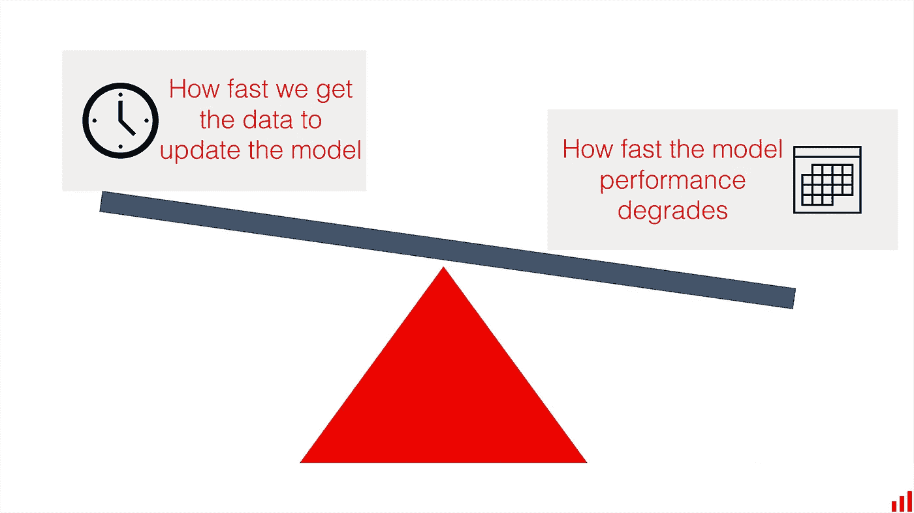

图片作者。

这对我们的再培训计划意味着什么？

此时，我们可以进入两种情况之一:

*   **我们追求的是车型质量。它降级的速度比新数据进来的速度快。我们没有太多的选择。每当有足够大的数据到达时，我们应该重新训练模型。**
*   **你有一个新数据点队列。**我们很快获得新数据，但我们的“旧”模型仍然表现出色！我们需要决定是否更频繁或更少地对其进行再培训。

如果我们有这种选择时间表的奢侈，我们最终会得到这个问题。

# 检查#4。你应该多长时间再培训一次？

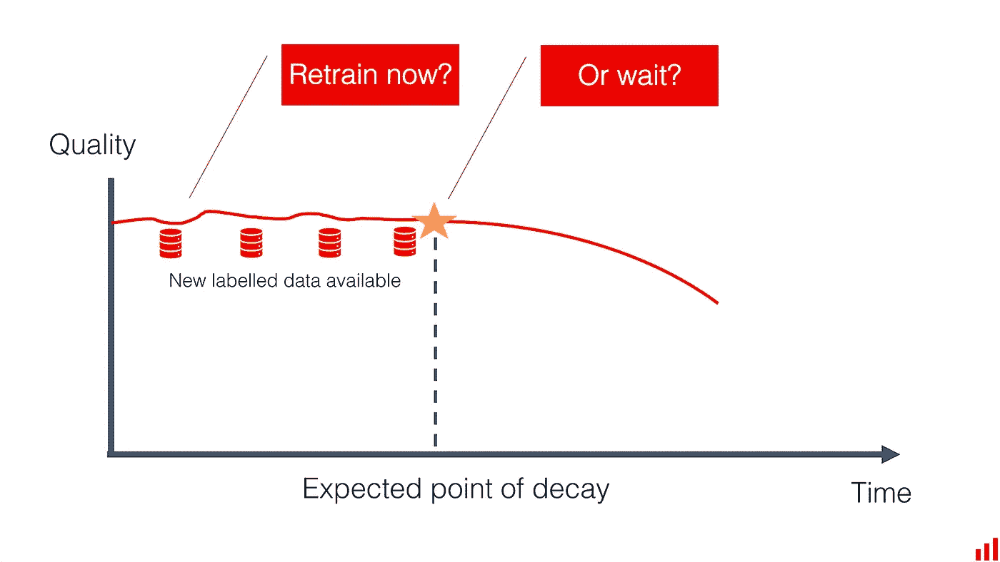

图片作者。

到目前为止，我们对我们的模型轮廓已经略知一二了。

让我们考虑一个具体的例子。

*   我们的型号**足够好**。不需要一直更新它来变得更好。
*   通常大约需要 **60 天**才能看到业绩下滑。
*   新标记的数据在每周的**结束时出现。**

那么，确切地说，我们应该计划什么时候对它进行再培训呢？周刊？每月？每 60 天？

当然，你可以选择一个数字。过度的再培训也有不好的一面(稍后会有更多的介绍！)但不应该使模型变得更糟。

也就是说，我们可以做出更具分析性的选择。

我们可以像以前一样遵循类似的方法。在这种情况下，我们从衰减点之外选择测试集。然后，我们在性能稳定期间运行我们的实验。

我们开始以较小的增量添加更多的数据:在我们的例子中是一周接一周。

我们的目标是检测测试集的质量何时开始提高。

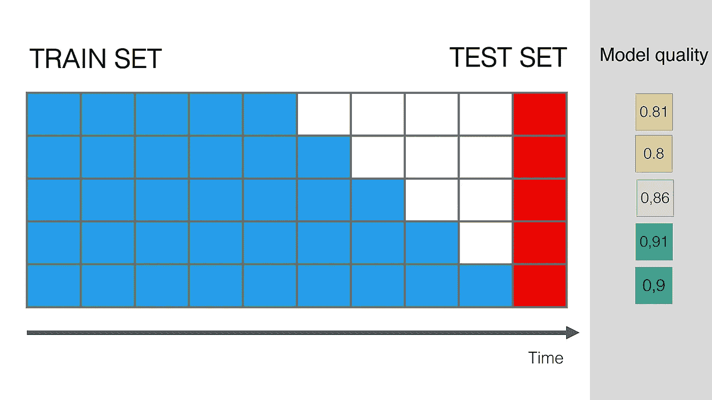

图片作者。

**我们可能学到的是，在小桶中添加数据并不总是会改变结果。**

例如，用每日数据重新训练模型对测试性能没有影响。我们需要几个星期才能看到结果。

更频繁地重新训练模型是没有意义的！

这通常是由于同样的“数据有用性”现象可能会有季节性模式或随着时间的推移积累的罕见事件的临界质量。该模型需要更多的数据来捕捉这些变化。

训练窗口的现实选择可能比看起来要小。

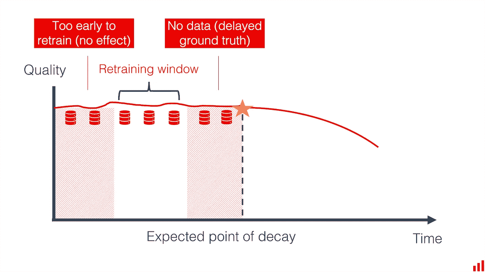

图片作者。

要做出具体选择，您可以考虑每个新铲斗带来的改进程度。在等式的另一半，考虑频繁再培训的成本和麻烦。

你也可以重复检查几次，看看什么时候你得到了一个有意义的平均质量增益。

或者是——在这条更窄的走廊里选一个数字。

# 频繁再培训有什么问题？

人们可以说:原则上，这不应该造成伤害。

我们为什么要自寻烦恼？比需要更频繁地更新模型有什么问题？

原因是，它增加了复杂性和成本，并且经常容易出错。

**不要修复没坏的东西:这句格言也适用于机器学习。**

*并非每一次型号更新都是火箭发射，但它们也不是免费的。(图片由作者提供)。*

更新是有代价的。

这涉及到直接的计算成本。有时候，贴标签的。然后，需要团队的参与！

是的，您可以自动触发更新。但是想象一下，一个新的模型在验证过程中由于数据问题或微小的质量下降而失败。这个团队会急于解决这个问题！

这是一个非常不必要的干扰——当这个模型不需要重新训练的时候。

**并不总是只有数据科学团队参与其中。**

新模型可能需要其他利益相关方的签署。这可能意味着整个验证过程！这增加了相当一部分组织和合规成本。

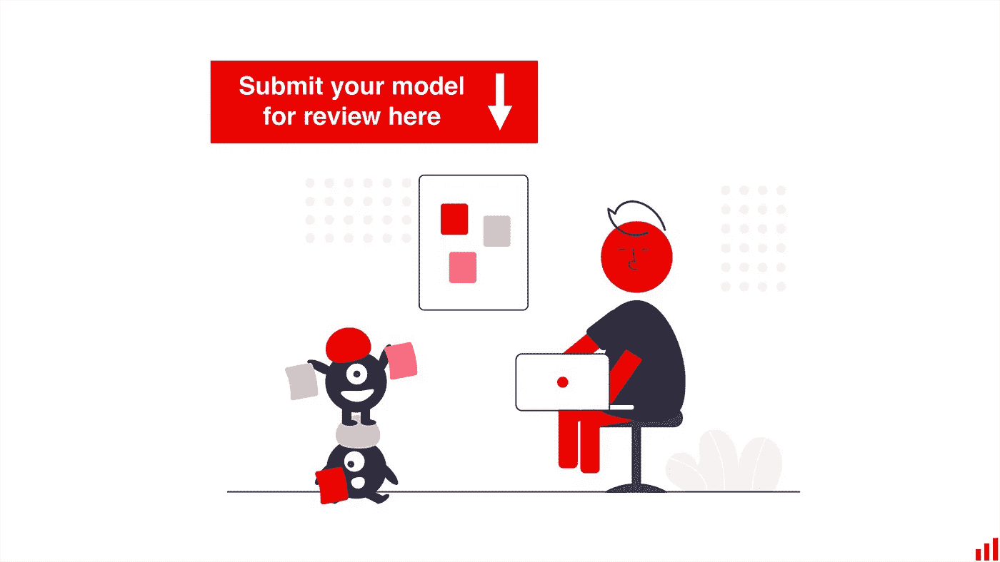

图片作者。

**最后，我们需要证明架构决策的合理性。**

如果我们还没有建立再培训管道，我们需要决定我们需要的系统有多复杂。

如果我们每个季度只对我们的模型进行一次再培训，我们可以得到一个更简单的服务架构。如果我们需要每日更新，我们应该预先投资一个更复杂的工具集。我们最好这样做，知道预期的质量提升！

当然，如果您已经有了一个高级的 MLOps 平台，计算成本很低，并且用例并不重要，您可能会放弃所有这些顾虑。

否则，更精确地维护模型是值得的！

# 检查#5。您应该丢弃旧数据吗？

这是额外的一个。

让我们假设我们为模型再训练定义了一个合理的时间表。具体应该怎么执行呢？我们应该接受新数据，放弃旧数据吗？该不该留“尾巴”？

这也是我们可以思考的问题。

假设我们的模型配置文件如下所示:

*   我们在培训中使用了 6 个数据“桶”。
*   该模型在接下来的 3 年中表现良好。
*   然后，在第四个阶段质量下降。
*   我们决定在每两个新的“桶”数据之后进行再训练。

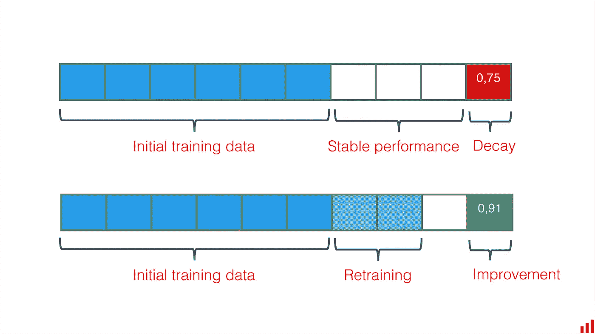

图片作者。

让我们保持再培训计划不变。那就两桶吧。我们知道他们带来了我们需要的质量提升！

然后，我们可以尝试逐桶排除旧数据。我们的目标是评估这些“旧”数据对性能的影响。

这类似于我们考虑从初始训练中排除旧数据时的第一次检查。但是现在，我们使用一个定义好的测试集(具有已知的衰减)和一个更精确的步骤(考虑丢弃几个月的数据，而不是几年的数据)。

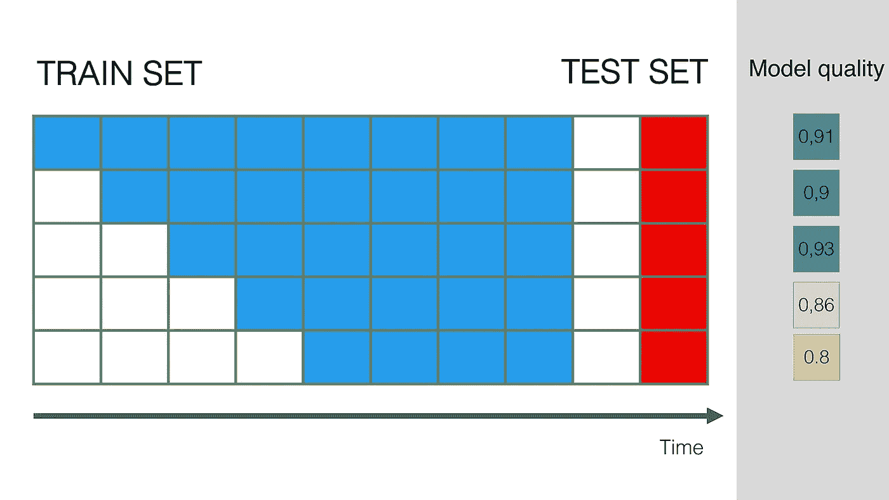

图片作者。

我们能得到哪个结果？

**丢弃旧数据会让模型变得更糟。**好吧，让我们暂时保留这一切吧！

**丢弃旧数据不影响质量。**需要考虑的事情:我们可以让模型更新更加轻量级。例如，我们可以在每次添加新数据时排除一桶旧数据。

**丢弃旧数据提高质量！这些事情发生了。我们的模型忘记了过时的模式，变得更加相关。这是需要知道的一件好事:我们在一个快速变化的世界中运营，模型不应该太“保守”！**

我们可能会研究更复杂的组合:

*   **保留代表较少的人群和小类的数据。丢弃过去的数据可能会不成比例地影响不太受欢迎的类的性能。这是一个重要的事情来控制。你可能会决定有选择地删除旧数据:删除经常使用的，保留不常用的。**
*   **为较新的数据分配较高的权重。**如果旧数据使模型变得更糟，您可能会决定降低其重要性，但不会完全排除它。如果你觉得有创造力，你可以针对不同的课程以不同的速度去做！

# 听起来很复杂！我需要这些吗？

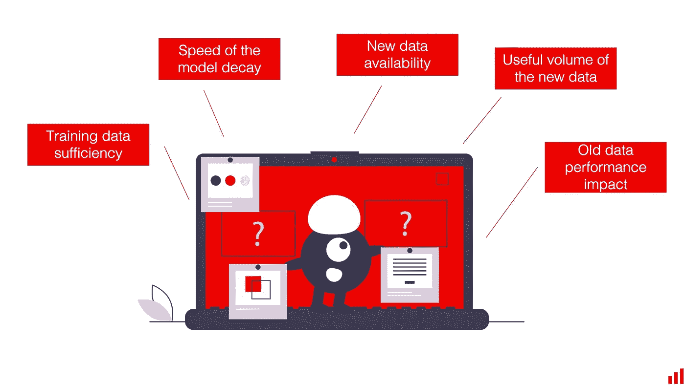

图片作者。

看情况。

规划你的再培训绝对有意义。你想要多精确？您的用例将比其他任何东西更能定义它。

一些模型是轻量级的，使用很少的数据，在生产中不会造成重大风险。这里没什么好想的！只需要一两次健全检查就可以了。

其他的非常关键，需要广泛的治理和详细的计划来维护它们。额外详细地研究你的模型行为可能是个好主意。

这两种估计都不是精确的方法。但所有这些在从业者的食谱中都是有用的启发。

**与往常一样，分析最好与常识和适当的假设相结合！**

# 第二部分。监控运行中的模型性能

接下来是第二部分。

直到现在，我们一直在研究过去。一旦模型被激活，我们就进入野外！

时间表是有帮助的，但不是绝对可靠的。在模型操作的过程中，事情可能会发生变化。

我们如何知道是时候更新生产中的模型了？

监控！合理规划之上的现实检查。

我们需要评估实时数据的性能，并将其与我们的基准进行比较。这通常是过去一段时间的训练数据。

这样，我们就能知道是否比计划的更早进行干预。或者相反，跳过一个更新，所有的事情都考虑到了。

到底要找什么？

# 检查#1。监控性能变化

图片作者。

如果很快了解了基本事实，就可以计算实际的性能指标。

这可以是一个[回归模型](https://evidentlyai.com/blog/evidently-016-regression-model-performance)的平均误差率，或者是一个[概率分类模型](https://evidentlyai.com/blog/evidently-018-classification-model-performance)的精度。理想情况下，应该添加一个业务指标来直接跟踪模型对 it 的影响。如果你有特定的重要部分，也要关注它们。

你可以设置一个[仪表盘](https://github.com/evidentlyai/evidently)和监控阈值，以便在出现问题时提醒你，或者设置自动再培训的触发器。

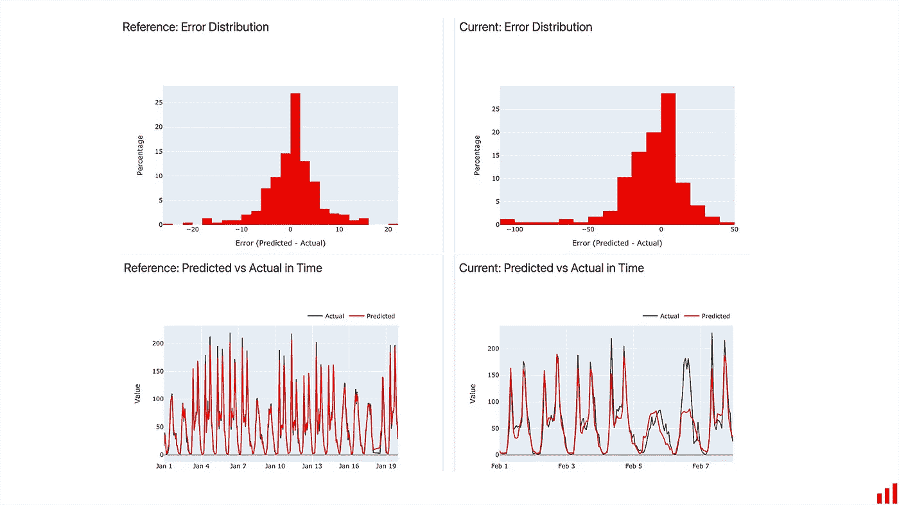

[显然](https://github.com/evidentlyai/evidently) *仪表板:需求预测模型的错误监控。*

**设置阈值通常是用例特有的。有时，即使很小的下跌也会导致商业损失。你可以确切地知道每一个准确率要花费你多少钱。在其他情况下，波动没那么重要。**

在初始性能评估期间设置这些阈值是有意义的。哪个质量下降够严重？了解了业务案例，您就可以明确什么值得关注——以及再培训工作。

**此时，您还可以使用新记录的数据重新运行之前的一些检查。**

你的离线训练数据总有可能不能完全代表真实世界。您可以验证您对模型衰退的评估与实际事态的匹配程度。

如果您在模型评估中使用黄金集，您可能还需要检查和更新它。动态数据可以带来您希望模型能够很好处理的新的极限情况或分段。

# 检查#2。监控数据的变化

如果你不能立即得到事实真相呢？

我们可能会再次被困在等候室:期待实际值或新标签。当这种情况发生时，我们只剩下故事的前半部分:数据！

我们可以将[数据漂移](https://evidentlyai.com/blog/evidently-001-open-source-tool-to-analyze-data-drift)和[预测漂移](https://evidentlyai.com/blog/evidently-014-target-and-prediction-drift)作为代理来评估可能的模型衰减。

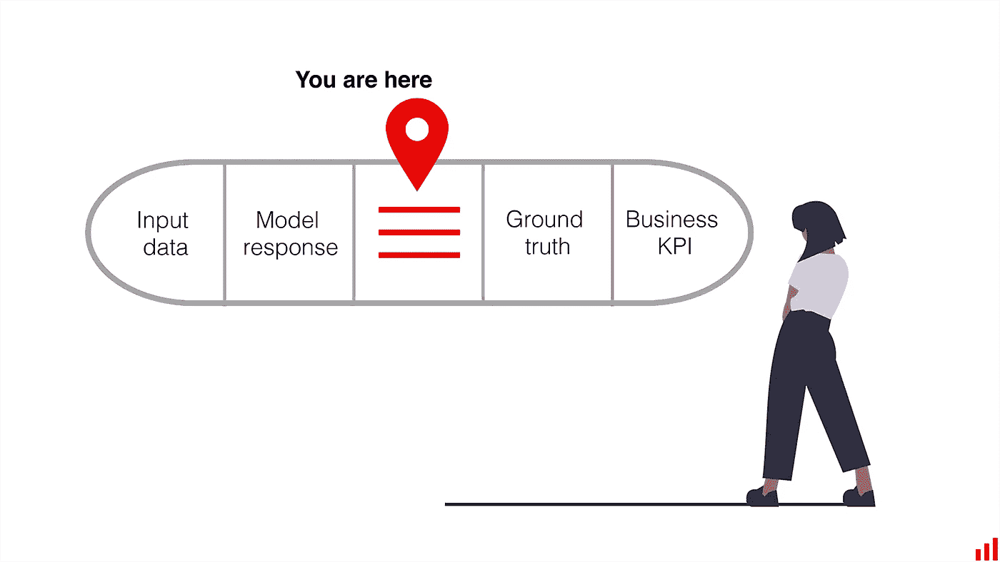

图片作者。

知道了输入数据和模型响应的形状，我们就可以评估两者与训练相比有多么不同。

假设您每月运行一个模型，为您的客户选择合适的营销方案，并将其传递给呼叫中心团队。您可以从检查输入数据的[统计漂移](https://evidentlyai.com/blog/evidently-001-open-source-tool-to-analyze-data-drift)开始。

如果输入数据的分布保持稳定，您的模型应该能够处理它。在大多数情况下，甚至不需要更新模型。它没坏！

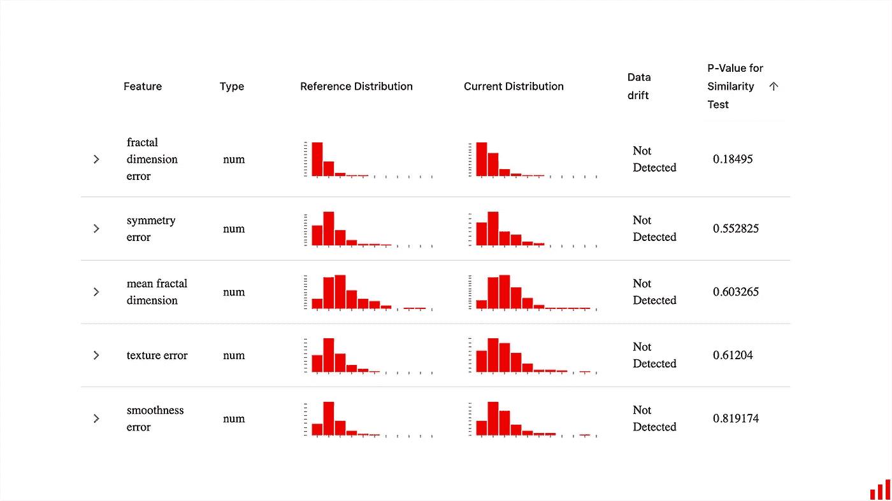

[显然](https://github.com/evidentlyai/evidently) *仪表盘:在特征分布中没有检测到漂移。*

**如果检测到漂移，它会发出预警。你可能会重新思考如何根据预测采取行动。例如，您可能决定在您的概率分类中设置一个不同的决策阈值[或排除一些片段。](https://evidentlyai.com/blog/tutorial-2-model-evaluation-hr-attrition)**

如果您可以获得新的标记数据并重新训练，那么是时候这样做了！

**关键特征的漂移通常先于可见模型的衰减。**在本[教程](https://evidentlyai.com/blog/tutorial-1-model-analytics-in-production)中，我们举例说明了这个例子。在模型性能失控前几周，关键特征发生了变化。

这就是为什么即使新标签来的很快，你也可能想要关注数据漂移。

对于高度关键的模型，这是一个方便的提前通知。

# 第三部分。再培训与更新

假设我们尽了最大努力为模型衰变做准备。我们得到了正确的估计，以确定再培训计划。我们构建了警报来检测实时变化。

但当它们发生时，我们只剩下最后一个问题。到底要怎么行动？

**默认的想法是保持你的模型不变，并给它注入新的数据。**这是我们在检查最佳训练窗口时的假设。

丢弃一些旧数据，添加一些新数据，重复相同的训练管道。在任何性能下降的情况下，这是一个合理的步骤。

但它可能并不总能解决问题！

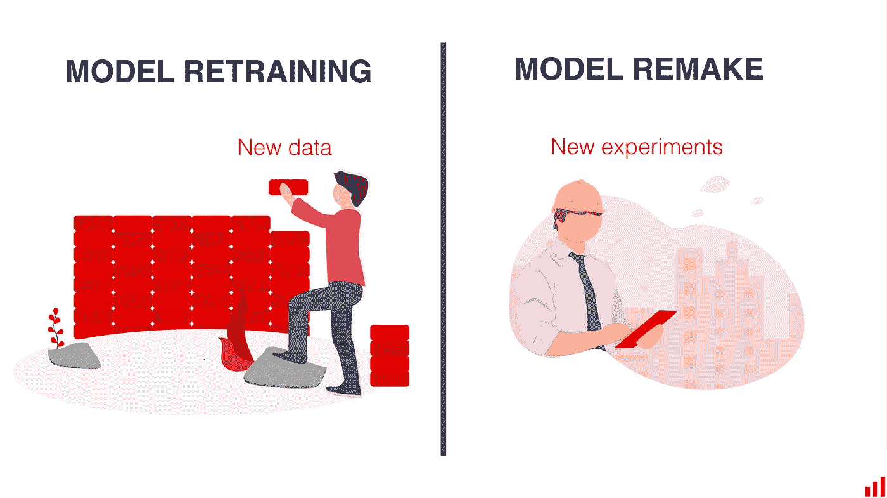

图片作者。

如果我们面临重大转变，我们可能需要重新思考我们的模型。想象一个重大的外部变化，比如面对一个全新的客户群。

也许，我们需要调整模型参数或者改变它的架构？审查预处理或后处理？重新加权数据以优先考虑最近的例子？构建一个集合来解释新的细分市场？

在这里，它更像是一门艺术，而不是科学。解决方案取决于用例、变更的严重性以及数据科学家的判断。

**奖牌的另一面是:我们也许能够改进这个模型！**我们本可以从更简单的限量款开始。随着收集的数据越来越多，我们也许能够重建它并捕捉更复杂的模式。也许，还会从其他来源添加新功能？

警告:这个新模型可能有不同的衰变曲线！

为了做好这两方面的准备，我们需要三样东西。

**首先，记住更新选项。**

如果天真的再培训是唯一考虑的选择，我们可能会完全错过维护模型的其他方法。安排一些定期的时间来检查现有模型的改进潜力是有意义的。

**其次，建立模型分析实践。**

这是什么意思呢？让您的模特行为更加清晰可见！

不仅仅是像 ROC AUC 一样的[单一性能指标。我们可以搜索表现不佳的部分、数据中的变化、特征相关性、模型错误中的模式等等。](https://evidentlyai.com/blog/tutorial-1-model-analytics-in-production)

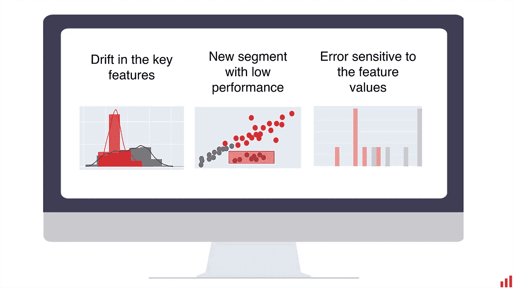

图片作者。

要获得这些见解，您可以向您的监控仪表板添加更多视图。或者，在预定的模型检查期间分批进行深潜。

有一个清晰的背景有助于区分实验的优先次序，并知道如何行动。

**第三，设计沟通渠道。**

数据并不总是“自己”改变

假设您的业务涉众正在计划对您的模型所涉及的流程进行更新。在您的监控中，您不应该将一个新的产品线作为“突然的数据漂移”来了解！这是你可以被告知为“更冷”的开始准备模型的事情。

模型更新和再训练可能依赖于这样的外部触发器:业务决策、直接请求、数据存储过程中的变化。应该有办法精简那些！

图片作者。

# 总结

那么我们应该什么时候重新培训我们的模型呢？

为了找出特定用例的答案，您可能需要考虑一些事情。

**1。计划定期再培训。我们可以衡量再培训的必要性和可能性，并选择最佳的再培训策略，而不是随意制定时间表。**

**2。监控实际性能。**我们应该关注生产模式。我们可以及时检测到衰变并进行干预，否则就会感到安心。

**3。分析一下。简单的再培训并不是唯一的选择。通过获得模型性能的详细可见性，我们可以决定如何准确地响应变化**

*最初发表于*[*https://evidentlyai.com*](https://evidentlyai.com/blog/retrain-or-not-retrain)*并与* [*埃琳娜·萨穆伊洛娃*](https://www.linkedin.com/in/elenasamuylova/) *合著。*

*在 appeally AI，我们创建了开源工具来分析和监控机器学习模型。在 GitHub* *上查看我们的* [*项目，如果喜欢就给它一颗星吧！*](https://github.com/evidentlyai/evidently)

想留在圈子里吗？

*   [*注册*](https://evidentlyai.com/blog/retrain-or-not-retrain#signup) *订阅我们的每月简讯。*
*   *关注* [*推特*](https://twitter.com/EvidentlyAI) *和*[*Linkedin*](https://www.linkedin.com/company/evidently-ai/)*。*
*   *加入我们的* [*不和谐社区*](https://discord.gg/xZjKRaNp8b) *聊天连线。*