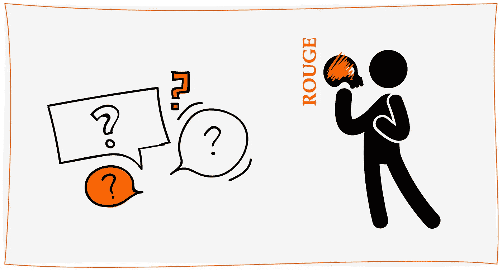
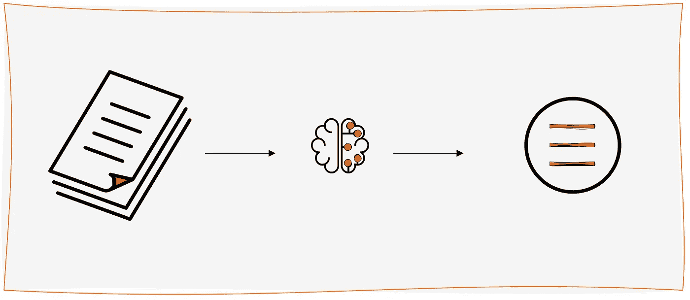
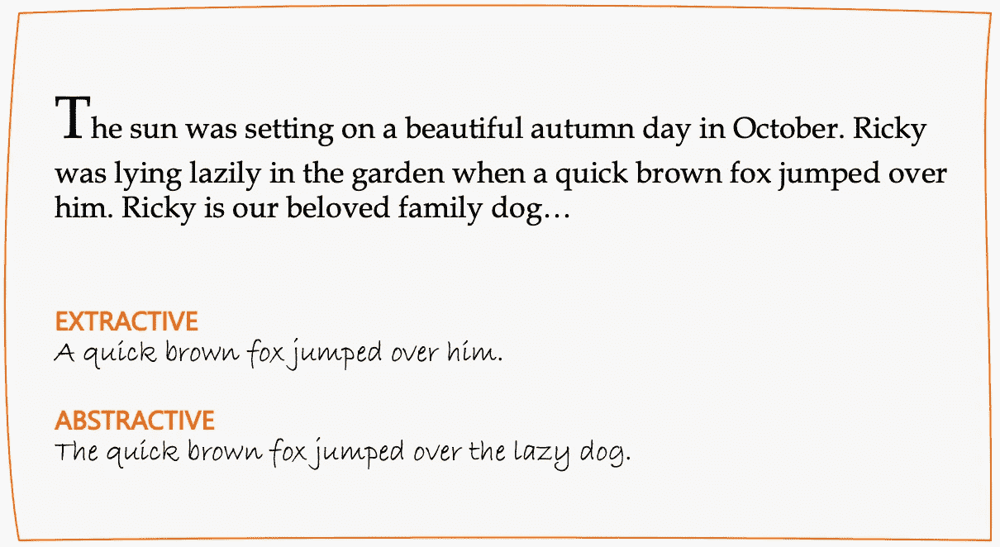
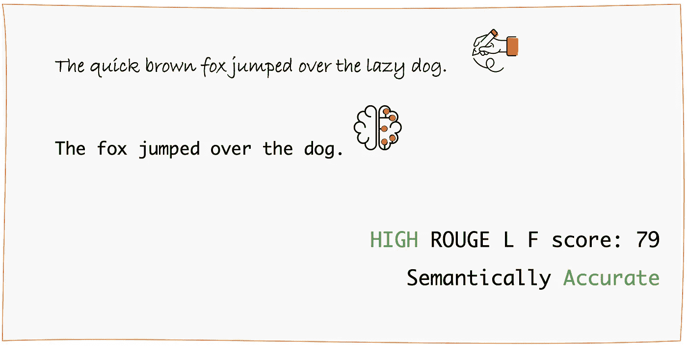
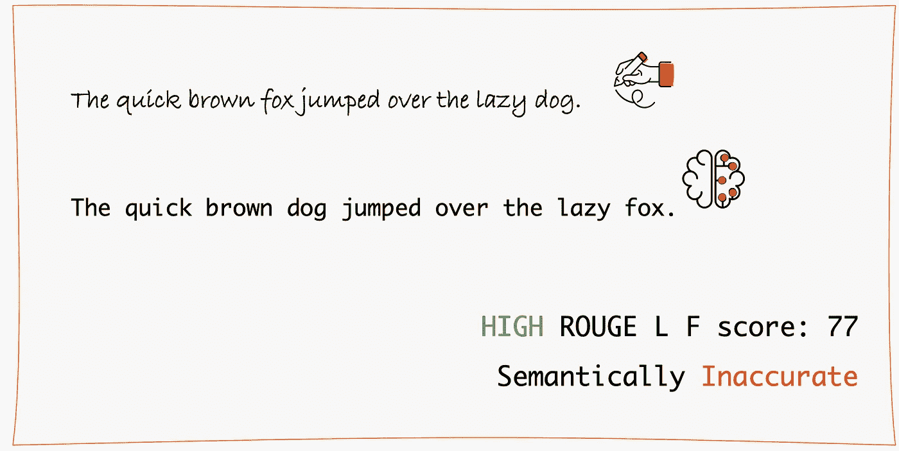
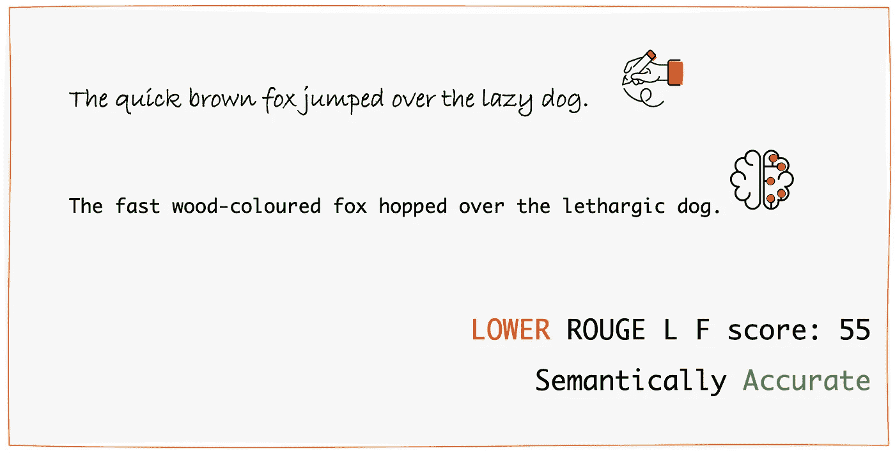

# 去胭脂还是不去胭脂？

> 原文：<https://towardsdatascience.com/to-rouge-or-not-to-rouge-6a5f3552ea45?source=collection_archive---------11----------------------->

## [实践教程](https://towardsdatascience.com/tagged/hands-on-tutorials)

## …为什么我称之为抽象文本摘要的代理度量。

作者图片

# 在本文中，我们将了解…

…提取和抽象文本摘要之间的区别。

…胭脂的分数是多少。

…失败的原因和原因。

# 文本摘要

我们将文本摘要称为训练人工智能(AI)模型以从较大文本块中产生较小文本块的过程。其中“较小的块”可以是人类可以总结的任何东西——标题、关键事实、结果、较大块的本质等等。

作者图片

**我们怎么知道机器写的摘要是好是坏？**

…坦白地说，好或坏到底意味着什么。

在回答这个问题之前，我们先来谈谈总结。

# 提取与抽象

人类和现在的机器可以做两种类型的文本摘要[1]。

*   **提取**:直接从文本中提取单词和短语。
*   **abstract**:生成语义一致的词和短语，确保原文的关键信息得以保留。

“举个例子怎么样”你在想？我知道，我有时会读心术。；)

作者图片

如你所见，后者——抽象概括，更类似于人类写总结的方式。由于这种复杂性，它的可行性真正依赖于人工智能和深度学习的进步[2]。

# 使用 ROUGE 进行评估

在实践中，一个最常用的度量标准是所谓的 **ROUGE score** (面向回忆的 Gisting 评估替角)[3]。

计算胭脂分数的算法考虑连续的记号，也称为 n 元文法。将来自一个文本(例如，人类编写的摘要)的 n 元语法与另一个文本(例如，机器编写的摘要)的 n 元语法进行比较。n 元语法的大重叠导致高胭脂分数和低重叠——低胭脂分数。ROUGE 有多种变体，如单字母组合、双字母组合、最长公共子序列等。还有胭脂精度，召回和 F-score [4]。

> ROUGE 是抽象总结的代理指标。

当目标是抽象摘要时，ROUGE 最好仅用作机器编写的摘要与人类编写的摘要有多少重叠的初始指示符，因为它没有考虑摘要的语义含义和事实准确性。

对于文本摘要，我们想要查看最长公共子序列(ROUGE L ),因为这将给我们最长的重叠。

# 我们来看一个例子！

在下面的图 1 中，我们可以看到左上角首先是人工编写的摘要，然后是机器编写的摘要。

这两个词有相当好的重叠，因此我们可以看到胭脂的分数很高(79%)。并且机器生成的摘要在语义上也是准确的。所以这太棒了！——胭脂给了我们一个很好的暗示。

图 1:高胭脂&语义准确(图片由作者提供)

在下一个场景中(图 2 ),我们再次在左上角看到了人类和机器编写的摘要。然而，这一次当我们仔细阅读机器编写的摘要时，我们可以看到，实际上机器弄错了——是狐狸跳过了狗，而不是狗跳过了狐狸！

我们看到，这里 ROUGE 未能给我们一个好的指示，因为它仍然显示机器编写的摘要的高 ROUGE 分数(77%)，但该摘要实际上是不正确的。

图 2:高胭脂，但语义不准确(图片由作者提供)

这里是我们的最后一个场景(图 3 ),其中机器生成的摘要事实上是正确的，但 ROUGE 分数没有给我们一个好的指示(55%),因为它告诉我们摘要是平庸的。

图 3:胭脂较低，但语义准确(图片由作者提供)

如果你对**抽象的摘要**感兴趣，那么你不能期望人类编写的摘要中有很多单词和短语与机器编写的摘要重叠。

要重现这些结果你可以使用[这个](https://pypi.org/project/rouge/)胭脂库。

# 所以，去胭脂还是不去胭脂？

当处理抽象概括时，我们应该使用 ROUGE 度量来获得**对重叠的感觉**。为了语义和事实的准确性，我强烈建议你总是咨询人类编写的摘要领域的主题专家！

# 开放式问题

1.  我们如何度量抽象性/可提取性？—请继续关注我的下一篇博文。；)
2.  你能推荐任何表明语义和事实准确性的工具吗？—这对于 NLP 社区来说仍然是一个挑战[5，6]。
3.  总结模型呢？—您可以找到不同摘要模型的概述，以及它们在 NLP Progress 中相对于其他模型的排名[7]。
4.  … ?

# 资源

[1] Abigail See 等，“驯服递归神经网络以获得更好的摘要”，2017。[http://www . abigailsee . com/2017/04/16/taming-rnns-for-better-summarying . html](http://www.abigailsee.com/2017/04/16/taming-rnns-for-better-summarization.html)

[2]马頔·苏莱曼等，“基于深度学习的抽象文本摘要:方法、数据集、评估措施和挑战”，*工程中的数学问题*，第 2020 卷，文章 ID 9365340，29 页(2020)。[https://doi.org/10.1155/2020/9365340](https://doi.org/10.1155/2020/9365340)

[3]李金耀，“胭脂:一个用于自动评价摘要的包”(2004)。[https://www.aclweb.org/anthology/W04-1013.pdf](https://www.aclweb.org/anthology/W04-1013.pdf)

[4]卡维塔·加内桑，《胭脂入门，以及如何用它来评价摘要》(2017)。[https://www . freecodecamp . org/news/what-is-rouge-and-how-it-works-for-evaluation-of-summaries-e 059 FB 8 AC 840/](https://www.freecodecamp.org/news/what-is-rouge-and-how-it-works-for-evaluation-of-summaries-e059fb8ac840/)

[5]张宇慧等人，“对抽象概括中事实正确性评估的仔细检查”(2020)。[https://web . Stanford . edu/class/archive/cs/cs 224n/cs 224n . 1204/reports/custom/report 53 . pdf](https://web.stanford.edu/class/archive/cs/cs224n/cs224n.1204/reports/custom/report53.pdf)

[6] Kryscinski，w .等人，“评估抽象文本摘要的事实一致性”(2020)。 *ArXiv，abs/1910.12840* 。

[7]塞巴斯蒂安·鲁德，《总结》， *NLP 进展。*http://nlpprogress.com/english/summarization.html