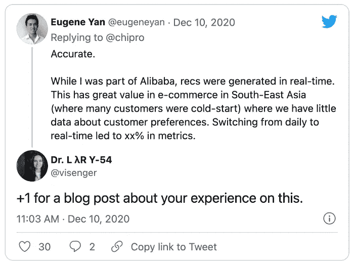
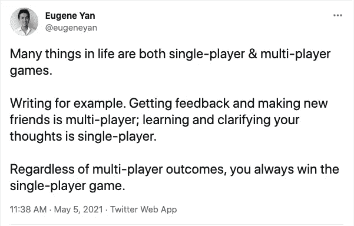
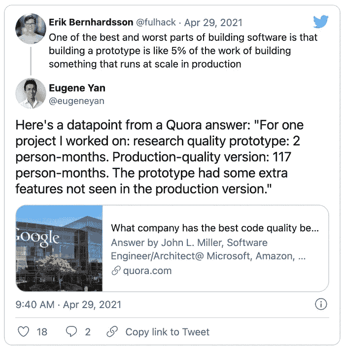

# 为了加速你的学习，选择困难的项目

> 原文：<https://towardsdatascience.com/to-turbocharge-your-learning-pick-hard-projects-c0943d1fe27d?source=collection_archive---------21----------------------->

## [作者聚焦](https://towardsdatascience.com/tagged/author-spotlights)

## 找到你的定位，写作如何既是多人游戏又是单人游戏，以及为什么我们都需要更多地考虑 ML 系统

*在 Author Spotlight 系列中，TDS 编辑与我们社区的成员谈论他们在数据科学领域的职业道路、他们的写作以及他们的灵感来源。今天，我们很荣幸地邀请到埃利奥特·冈恩*<https://medium.com/u/aad1101621dd?source=post_page-----c0943d1fe27d-------------------------------->**与尤金·严* *进行对话。**

**

*照片由尤金·严提供*

*Eugene Yan 设计、构建和运营机器学习系统，为大规模客户提供服务。他目前是亚马逊的应用科学家。此前，他在 Lazada 和 uCare.ai 领导数据科学团队。他在[eugeneyan.com](https://eugeneyan.com/)撰写和谈论数据科学、数据/ML 系统和职业发展，并在 [@eugeneyan](https://twitter.com/eugeneyan) 发布推文。*

## *你选择了一条相当有趣的职业道路进入数据科学领域。从获得心理学学位进入该领域，到在 Lazada 获得“火箭”角色，现在是亚马逊的应用科学家。你能分享一下你是如何进入这个领域的吗？*

*我不记得是从数据科学开始作为职业目标的。当时，我最感兴趣的是人们如何感知、决定和行为。这也是我当初进入心理学的原因。毕业后，我最初的目标是成为一名工业和组织心理学家，帮助人们在工作中更有效率、更快乐。不幸的是，没有任何角色适合应届毕业生(也许我不够好，哈哈)。*

*我最终加入了[新加坡贸易和工业部](https://www.mti.gov.sg/)。我专注于投资方面，试图让公司投资海外变得更容易、更安全。它主要涉及谈判投资和自由贸易协定，分析法律文本，研究仲裁案件。旅行是令人兴奋的，但过了一会儿，我开始怀念与数据打交道的日子。*

*在空闲时间，我参加了统计学、SQL 和 r 的在线课程。我还参加了初级数据职位的面试，并最终在 IBM 找到了一份数据分析师的工作。第一年，我主要从事分析项目，比如构建供应链仪表盘，为品牌搜集和分析 Twitter 数据。一年后，我有机会加入劳动力分析团队，从事工作需求预测和构建内部工作推荐引擎。这项工作与我最初的目标相似，即利用数据帮助工作中的人们，只是我花了更长的时间来实现这一目标。*

*尽管如此，另一个机会来了，那就是加入一家电子商务初创公司(Lazada)。我很好奇在政府和 IBM 工作过之后，在一家初创公司工作会是什么样的，于是我采取了这个行动。我已经写了关于[那是如何发生的](https://eugeneyan.com/writing/psych-grad-to-data-science-lead/)，这里就不赘述了。(Lazada 最终被阿里巴巴收购，又在一家医疗科技初创公司工作了一段时间后，我加入了亚马逊。)*

## *你特别自豪的一个项目是什么？*

*我的第一个自学项目永远是我的最爱。为了那个项目，我用从亚马逊搜集的数据建立了一个 ML 系统来给[的产品](https://eugeneyan.com/writing/product-categorization-api-part-3-creating-an-api/)分类——根据标题分成数千种类别。机器学习方法是贝叶斯信息标准(Bayes-ic ),但它工作得很好(前 3 名的准确度为 0.965)。它最终演变成包括[图像分类](https://eugeneyan.com/writing/image-categorization-is-now-live/)和[图像搜索](https://eugeneyan.com/writing/image-search-is-now-live/)。(Lazada 也使用其中的一部分来帮助卖家对产品进行分类。)*

*我为这种努力感到自豪，因为当我开始时，我对机器学习和编程几乎一无所知，不得不(很大程度上)努力让它工作。为了训练和部署模型，我必须学习如何使用 AWS EC2、S3 和 Route53。为了服务我的模型，我不得不学习如何将它包装在 Flask 应用程序中，用 Bootstrap 和 HTML 构建一个基本的前端，并用 Nginx 处理。对于图像分类和搜索，我不得不学习如何将深度学习应用于计算机视觉，以及如何使用预先训练好的模型(例如 [VGG](https://arxiv.org/abs/1409.1556) 、 [ResNet](https://arxiv.org/abs/1512.03385) )进行迁移学习。*

*我花了很多周末在 Python、 [Theano](https://en.wikipedia.org/wiki/Theano_(software)) 、HTML、AWS 等上面纠结。我在这个项目上倾注的巨大努力可能解释了为什么我对它如此自豪。我从那个项目中学到的东西极大地促进了我的学习，并且也提高了我的工作效率。*

**

*寻找有“酒窝”的相似沙发(图片由 Eugene Yan 提供)*

## *你已经写了许多文章，涵盖了各种各样的主题，从[一个数据科学组合展示了什么](https://eugeneyan.com/writing/data-science-portfolio-how-why-what/)，到[在生产中维护模型](https://eugeneyan.com/writing/practical-guide-to-maintaining-machine-learning/)，以及[一系列工业中的 ML 学习系统指南](https://eugeneyan.com/start-here/)。你创作如此多产的过程是怎样的？*

*我在笔记的某个地方列了一个潜在主题的清单。每当一篇文章有了灵感，我就会添加进去——它实际上只是一个标题列表。例如，一位朋友最近感叹教育利益相关者机器学习能做什么和不能做什么的困难——我认为这将是一个有趣的话题，并将其添加到列表中。我也通过我的[话题调查](https://eugeneyan.com/topic-poll/)和 [AMA](https://github.com/eugeneyan/ama/) 得到问题，并和朋友聊天。*

*只是在那个单子上草草记下标题，就让我注意到了。当我遇到相关的材料或参考资料时，我会把它们加在这些标题下。标题可以在这个列表上停留几个月或几年。可能有一半不会发展成文章，因为我可能会发现我没有什么新奇的东西可以贡献出来。*

*每周一次，我会选择一个我最感兴趣的话题去探索。在这一周的早些时候，我写了一个作品的基本大纲，主要是使用[为什么，什么，如何](https://eugeneyan.com/writing/writing-docs-why-what-how/)的结构。我的目标是把想到的东西都写进草稿里，而不是关心语言、内容、来源等等。这大约需要一到两个小时。*

*第二天，我浏览了一下大纲，然后试着凭记忆重写。这迫使我重新组织思路和内容。有时，细节或整个章节被忽略了——这表明它们对论文来说并不重要。尽管如此，我还是比较了我以前的大纲和新大纲，以确保新大纲更好，并且我没有排除任何重要的东西。我在不同的日子里迭代一两次大纲，每次花一到两个小时。但是如果我对那个主题的想法特别模糊，我可能需要三四次迭代。*

*不管大纲是什么状态，周六早上我就开始把大纲转换成散文。到这个时候，大纲已经相当详细了，只需要把要点改写成句子和段落。这需要五到十五个小时。一旦完成，我编辑一次语法和拼写，另一次可读性。我总是在星期天晚上装船。*

## *写这样的文章，你最喜欢的事情是什么？*

*我喜欢写作迫使我研究、学习和总结我的想法，尤其是像[拆卸](https://eugeneyan.com/tag/teardown/)和[调查](https://eugeneyan.com/tag/survey/)这样的技术性更强的作品。写作是一种无价的学习技巧。当我尝试写作时，我的知识出现了缺口。这导致我在完成作品之前需要更多的研究和学习。*

*我也喜欢写作帮助我反思、收集和组织我的想法。这主要适用于我根据经验撰写的文章，比如阅读论文的[好处](https://eugeneyan.com/writing/why-read-papers/)和[如何在生产中维护 ML 系统](https://eugeneyan.com/writing/practical-guide-to-maintaining-machine-learning/)。当需要我再次宣讲这些话题时，我会深入思考，甚至有一个分享的网址。*

*关于写作，我最喜欢的是它的可伸缩性。写作是 O(1)。写给一个人或者一万个人都是一样的努力。当我被多次问及同一个问题时，我会尝试写下这个问题(例如，[如何编写 ML 设计文档](https://eugeneyan.com/writing/ml-design-docs/)，[各种数据/ML 角色的区别](https://eugeneyan.com/writing/data-science-roles/))。作为额外收获，我的写作让我结识了新朋友，如其他 ML 从业者、风投、初创公司创始人等，并带来了几个有趣的机会。*

**

*上面的[推文](https://twitter.com/visenger/status/1337110777900249097?s=20)导致了对[实时推荐系统](https://eugeneyan.com/writing/real-time-recommendations/)的报道。*

## *你希望更多地看到 DS/ML 中的哪种写作？*

*我是一个务实的人，喜欢实用的内容。我喜欢能从别人的成功或错误中学习并应用到工作中的内容。这就是为什么我策划了 [applied-ml](https://github.com/eugeneyan/applied-ml) 库。当我设计自己的 ML 系统时，阅读其他公司如何处理和解决 ML 问题很有帮助。尽管如此，我还是希望人们能分享更多关于失败的东西。也许不是每一个失败的实验，但是关于如何*而不是*解决问题的一般经验将会是一个很好的节省时间的方法。*

*我也喜欢作者包括[消融研究](https://en.wikipedia.org/wiki/Ablation_(artificial_intelligence))的论文。令人惊讶(也有点悲哀)的是，我们可以用深度学习做很多事情，但对它如何学习却知之甚少。*

*同样，我喜欢关于人工智能系统的具体细节的内容，其中作者分享了机器学习、工程和产品如何结合在一起，来构建一些帮助人们的东西。我们需要更多这样的案例研究类型的内容来帮助社区学习如何有效地应用 ML。*

## *你有一个非常全面的写作哲学。随着越来越多的工程师开始写作，你对希望提高写作水平并在网上脱颖而出的读者有什么建议？*

*开始吧。开始吧。*

*对此，我通常会得到两种回答:“如果我写得不好怎么办？”或者“但是我还没有找到自己的定位！”*

*不用担心你写的不好。事实是，几乎没有人会去读你的前十几篇文章(除非你在像*数据科学*这样的大刊物上写作😉).所以跳舞吧，就像没有人在看一样，写作吧，就像没有人在阅读一样。开始的时候，你在写练习。*

*同样，你也不会光靠思考就找到自己的定位。你通过写很多，把它放在那里，看看有什么共鸣来找到它。也许在 20 首左右之后，你回头看，会发现主题从你的作品中浮现出来。你只能向后看才能把这些点联系起来——最好的方法是通过持续运输来获得大量的点。*

> **“你无法把向前看的点点滴滴串联起来；你只能回头看才能把它们联系起来。—史蒂夫·乔布斯**

*也就是说，我学到了一些关于写作的经验，让写作变得更容易、更愉快。我之前已经[详细地](https://eugeneyan.com/writing/what-i-did-not-learn-about-writing-in-school/)写过这个问题，我将在这里分享其中的要点:*

*   *写作是 80%准备，20%写作。*
*   *写作对每个人来说都很难。*
*   *你没有找到自己的定位；你的利基找到你。*
*   *你的写作如果没用就一无是处。*
*   *你的声音不是你怎么写的；你的声音就是你。*

*我觉得你的作品在网上不突出也没关系。写作既是多人游戏，也是单人游戏。这是一个多人游戏，其他人可以参与并分享你的作品，给你反馈，和你交朋友。这是单人游戏，因为当你写作时，你在学习，深入思考，理清你的想法。不管多人游戏的结果如何，你总是赢得单人游戏。*

**

*从[这里发推文](https://twitter.com/eugeneyan/status/1389967622922412032)*

## *你对未来几年的 DS/ML 社区有什么希望？*

*我希望看到社区更多地考虑 ML 系统——而不仅仅是 ML 模型——以及事物的生产方面。我有一种感觉，现在，大多数人认为培训和获得良好的验证结果是终点线。*

*然而，要让你的模型产生影响，还有很多工作要做。您必须建立数据管道，协调和安排它们，部署、测试、监控、扩展基础架构的延迟和吞吐量，制定数据隐私、安全、随叫随到等政策。所有这些都需要时间，很容易是训练和验证原型模型时间的 20-100 倍。*

**

*"原型具有生产版本中没有的额外功能。"(链接到[的推文](https://twitter.com/eugeneyan/status/1387808907796512768?s=20))*

*在你发货后，这只是一个起点。你必须保持它的可持续性。想象一下，每季度发布一次 ML 应用程序。一年后，您将有四个应用程序需要维护——在没有太多运营负担的情况下，您将如何做到这一点？*

*我也祝愿更多的数据科学家专注于问题公式化。例如，要识别社交网络上的滥用，你可以把它框定为一个受监督或不受监督的问题。受监督的方法需要高质量的标签。无监督方法有多种风格，如离群点检测(如隔离森林)或网络分析(如不良因素的图形聚类)。*

*我们如何构建问题对结果有着巨大的影响。这也适用于选择正确的阳性标签*和阴性标签*—[阴性采样是一门晦涩的艺术](https://eugeneyan.com/writing/machine-learning-metagame/#more-system--training-data-design-less-model-design)。思考你的损失函数如何与你的离线验证指标(recall@k，nDCG)相关联，以及如何与在线 A/B 测试指标(点击、转化)和下游业务指标(收入、客户终身价值)相关联，也是很有用的。*

*想了解更多关于 Eugene 的工作和数据科学兴趣的信息吗？他邀请你在他的 [AMA](https://eugeneyan.com/ama/) 上发表任何问题。你会在[他的媒体简介](https://eugeneyan.medium.com/)，在[他的网站](https://eugeneyan.com/)，以及[他的推特账户](https://twitter.com/eugeneyan)上找到他的文章。以下是我们最近最喜欢的一些。*

*   *[你真的不需要另一门 MOOC](/you-dont-need-another-mooc-d6719352830a) ( *TDS* ，2021 年 5 月):尤金解释了及时学习如何比参加另一门在线课程更有效。开始做一个项目，让挑战引导你的下一步。*
*   *[Chip Huyen 谈她的职业、写作和机器学习](/informal-mentors-chip-huyen-4d81ee3add98) ( *TDS* ，2021 年 3 月):尤金是一位优秀的采访者，他和 Chip Huyen 分享了一次聊天，内容是她如何应对挑战以及写作如何改变她的生活。*
*   *[数据发现平台及其开源解决方案](/data-discovery-platforms-f611ab4fc1c8) ( *TDS* ，2021 年 3 月):着眼于解决数据可发现性问题的关键特性。*

*请继续关注我们即将推出的下一位专题作者。如果你对你想在这个空间看到的人有建议，请在评论中给我们留言！*