# 称重还是不称重——这是一个普通的问题

> 原文：<https://towardsdatascience.com/to-weigh-or-not-to-weigh-this-is-the-average-question-ece33fad9180?source=collection_archive---------22----------------------->

## 平均值是一个简单的计算。但有时，还有更多需要探索。让我们浏览一下这个主题，并在 Power BI 中实现这些计算。


[奋斗博主](https://unsplash.com/@strivingblogger?utm_source=medium&utm_medium=referral)在 [Unsplash](https://unsplash.com?utm_source=medium&utm_medium=referral) 上的照片

# 介绍

我在学校学会了如何计算平均值:取一串数字，对它们求和，然后用结果除以数字的个数，就大功告成了。

这个计算听起来很简单。


巴勃罗·阿罗约在 [Unsplash](https://unsplash.com?utm_source=medium&utm_medium=referral) 上的照片

几天前我发现，平均计算中可能有比预期多得多的东西。

在本文中，我将向您展示平均值计算的一些变体。然后我切换到 Power BI 在 DAX 中执行这些计算。

# 你介意做一些数学吗？

让我们看看下表中的虚拟销售数据:

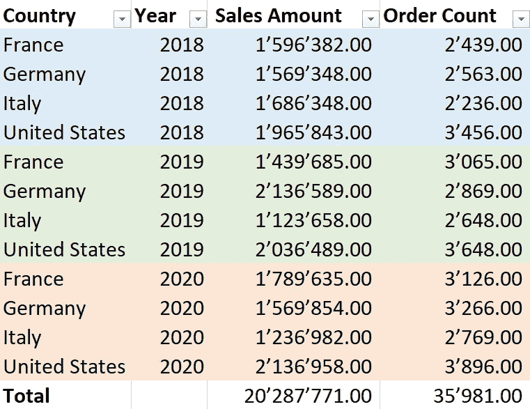

图 1 —示例数据(图片由作者提供)

我想按国家和年份计算订单的平均值。最后，我想计算一个总体平均值。

好的，接下来让我们将“销售额”列中的值除以订单数:

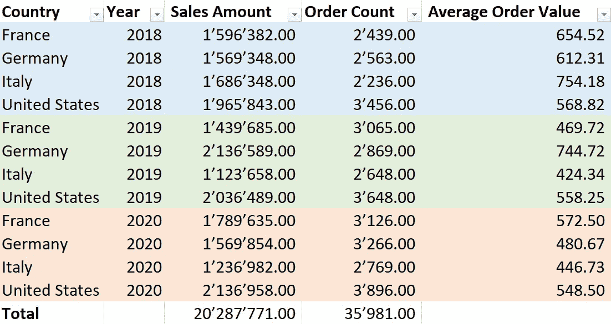

图 2 —每个国家和年份的平均值(图片由作者提供)

现在令人毛骨悚然的问题是:我应该如何计算总数？

# 计算平均值

原来有两种方式，导致了两种不同的结果。

为了缩短表格，我仅按照 2019 年来过滤表格:

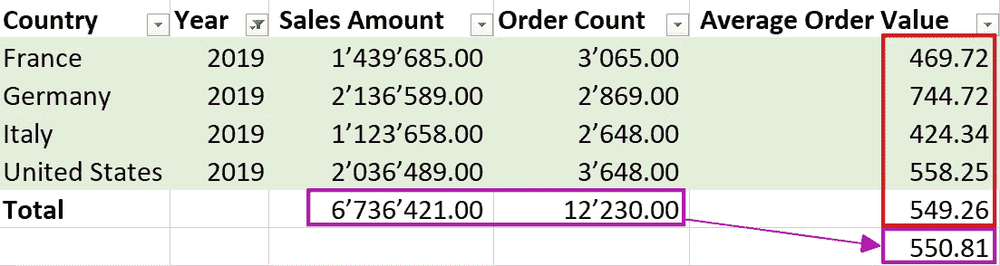

图 3 —两个平均值(图片由作者提供)

第一个平均值(549.81)是“订单平均值”列中所有值的平均值。

第二个平均值(550.81)的计算方法是将总销售额除以总订单数。

哪个是正确的？

嗯，两个都是对的。
看你想算什么了。

第一个平均值是四个值的简单平均值，第二个平均值由每个国家的订单数加权。一个国家的订单数量越多，这个国家对结果的影响就越大。

让我们看看 2020 年加权平均的更好例子:

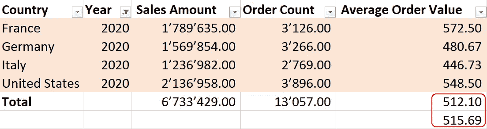

图 4—2020 年的平均值(图片由作者提供)

在这里，您可以看到第二个平均值比第一个平均值高，因为美国的订单数远远高于第一个平均值。因此，美国的高阶计数对结果的影响更大。

我将这个结果称为“加权平均”。

如果您想消除订单数量的权重，您必须使用第一个平均值。姑且称之为“未加权平均值”。

等等，我们还没说完。

# 给平均值增加额外的权重

有时，您需要通过向数据添加权重或等级来操纵计算。

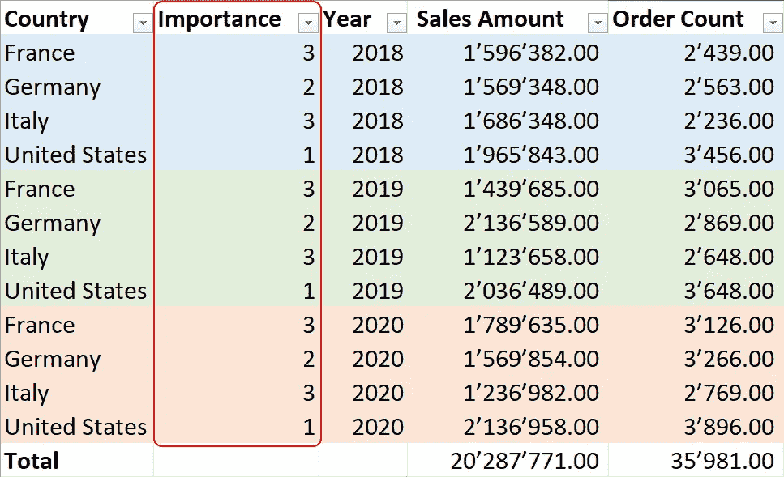

图 5 —具有重要性的样本数据(图片由作者提供)

我引入了“重要性”列来操纵结果。

这一栏标明哪个国家最重要，必须影响结果。

我们将使用以下公式来计算结果:

总销售额=总和(销售额*重要性)

订单总数=总和(订单总数*重要性)

之后，我们可以计算平均值来得到结果。

结果如下:

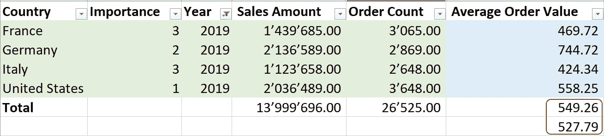

图 6-2019 年重要性平均值(作者图片)

如您所见，加权平均结果比以前低得多，因为我们使用了“重要性”列来操纵每个国家的权重。由于法国和意大利的重要性最高，该值更接近其平均订单值。

未加权平均值与销售额之间的关系相同，订单数保持不变。甚至在与重要性相乘之后。

权重因子是强调数据部分与您选择的方面的重要性或相关性的适当方法。

现在我们可以切换到 Power BI，在 DAX 中实现这些计算。

# 在 Power BI 中实现

**加权平均**

我们可以用一个简单的方法来实现加权平均:

```
Average Sales Amount per Order =
DIVIDE( [Online Sales (By Customer)]
      ,[Order Count (By Customer)]
      )
```

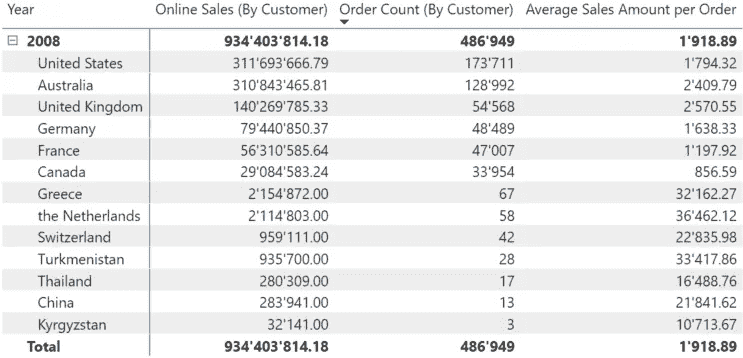

图 7 —功率 BI 的加权平均值(图片由作者提供)

过滤器上下文确保总平均值的计算是正确的:

934'403'814.18 / 486'949 = 1'918.894

**未加权平均值**

然而，计算未加权平均值则是另一回事。

我的第一个想法是预先计算所有的平均值，然后根据它们计算平均值。

该度量必须识别筛选器上下文是否包含国家/地区，如果包含，则必须将销售额除以订单计数。

一段时间后，我发现我们可以通过以下措施在 DAX 中解决这个问题:

```
Average per Country =
    AVERAGEX(VALUES(‘Geography’[Region Country])
        ,DIVIDE([Online Sales (By Customer)]
               ,[Order Count (By Customer)] )
        )
```

结果看起来像这样:

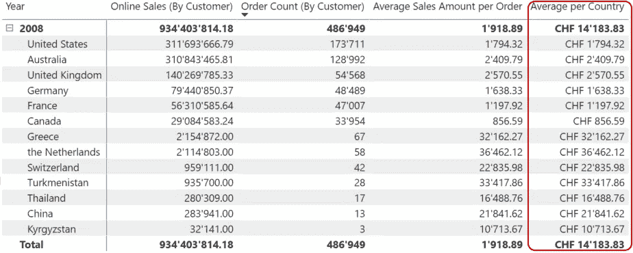

图 8 —每个国家的平均值(图片由作者提供)

当你把这个表导出到 Excel 中，就可以计算出每笔订单的平均销售额，你会得到 14'183.83。

当您想要将状态添加到表中时，棘手的部分就来了:

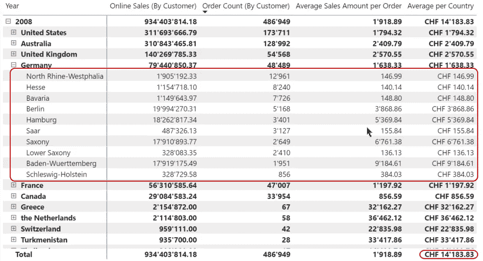

图 9 —每个国家的平均水平(按作者分类的图片)

当您现在导出表格时，平均结果将会不同。

为了得到正确的结果，我们必须向模型中添加一个新的度量:

```
Average per Country and State =
    AVERAGEX(SUMMARIZE(‘Geography’
                ,‘Geography’[Region Country]
                ,‘Geography’[State Province])
        ,DIVIDE([Online Sales (By Customer)]
                ,[Order Count (By Customer)] )
        )
```

该方法将计算每个国家/地区和州的正确值，并且在总体水平上:

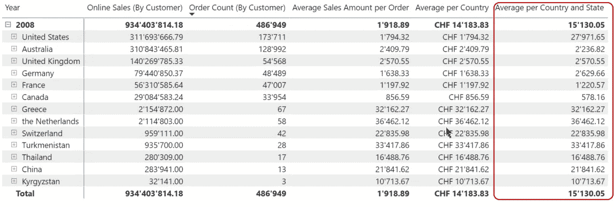

图 10 —每个国家和州的平均修正值(图片由作者提供)

同样，这两种方法都是正确的。这取决于你的用户期望什么样的结果。你必须事先和你的利益相关者谈清楚这个问题。

**加权平均列**

现在我想加一个排名来定义每个国家的重要性。排名越高，这个国家对结果的影响力就越高。

为了这个计算，我给每个国家添加了一个任意的排名栏。每个国家的排名在 1 到 6 之间:

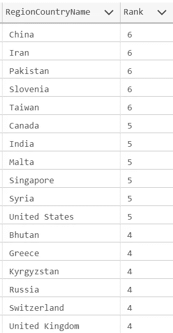

图 11-国家排名(作者图片)

现在我需要在计算中包括等级:

```
Average using Rank =
VAR SalesAmount = SUMX(‘Online Sales’
                        ,’Online Sales’[SalesAmount] *
                        RELATED(‘Customer’[Country Rank])
                        )VAR OrderCount = SUMX(‘Online Sales’
                      ,’Online Sales’[First Order Line Count] *
                      RELATED(‘Customer’[Country Rank])
                      )RETURN
IF(HASONEVALUE(‘Customer’[Region Country])
        ,[Average Sales Amount per Order]
        ,DIVIDE(SalesAmount, OrderCount)
        )
```

让我们从这一措施的底部开始:

我使用 IF(hasone value(' Customer '[Region Country])来检查当前的过滤器上下文是否包含一个或多个国家。

如果当前的过滤上下文只包含一个国家，我可以使用[每个订单的平均销售额]来计算每个国家的平均值。这个方法非常有效，并且每一行都提供了正确的值。在这种情况下，是否将州或城市添加到报告中并不重要。结果是一样的。

只要当前过滤上下文包含多个国家，我就需要使用每个国家的排名来计算加权平均值。

我通过使用 SUMX 将在线销售表中每笔交易的销售额乘以国家排名来进行计算。

下图显示了所有测量的结果:

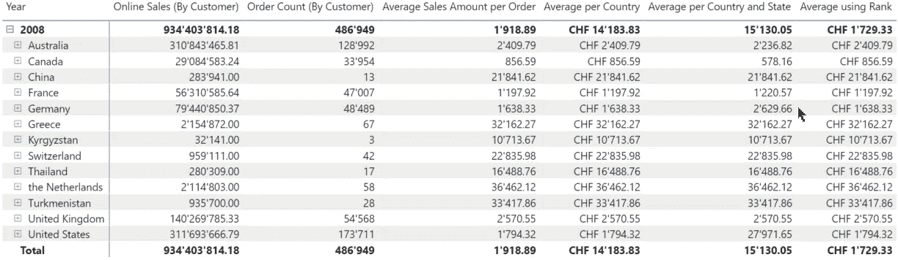

图 12 —所有度量(作者图片)

正如您所看到的，Total 行上的所有结果都与预期的不同。

**注意:**这是一个可能方法的例子，并没有给出明确的解决方案。根据您的数据和要求，您的解决方案可能与我的不同。

# 其他可能的方法

如果您需要为一个特定的场景准备度量，准备一个带有预先计算结果的 DAX 表可能是一个好主意。

我的示例中使用的 Contoso 数据模型在 Online Sales 表中包含 1200 万行，在 Customer 表中包含不到 20，000 行。本例中使用的矩阵计算结果不到一秒钟。

您的数据可以包含更多的数据，因此可能比我的例子慢。

在这种情况下，DAX 表是一个可行的解决方案。这种方法的缺点是其他表不能筛选结果，例如产品组。如果您需要这样做，您需要定义所需的关系，并相应地准备 DAX 表。

注意添加这样的列可能会意外地改变结果。

# 结论

当我开始写这篇文章时，我已经想到了 DAX 表的解决方案，因为它看起来很容易准备。

但是我不能说我喜欢它，因为这种方法在过滤结果的可能性方面增加了一些限制。

当我搜索计算加权平均值的可能方法时，我找到了这个网站:[如何在维基上计算加权平均值](https://www.wikihow.com/Calculate-Weighted-Average)

当将这种方法应用于 Excel 中的示例数据时，结果令我困惑。在与一位数学家同事交谈后，我们发现了计算平均值的不同方法。

尽管我已经写到一半了，我还是用我的新知识重新开始写这篇文章。

无论如何，我惊讶地发现，我可以通过不同的方式计算平均值来获得不同的含义。这个发现为我打开了一个新的世界，因为我也需要开始与我的客户讨论这个问题。


约翰·巴克利在 [Unsplash](https://unsplash.com?utm_source=medium&utm_medium=referral) 上拍摄的照片

直到现在，我的生活还不够复杂。叹息…