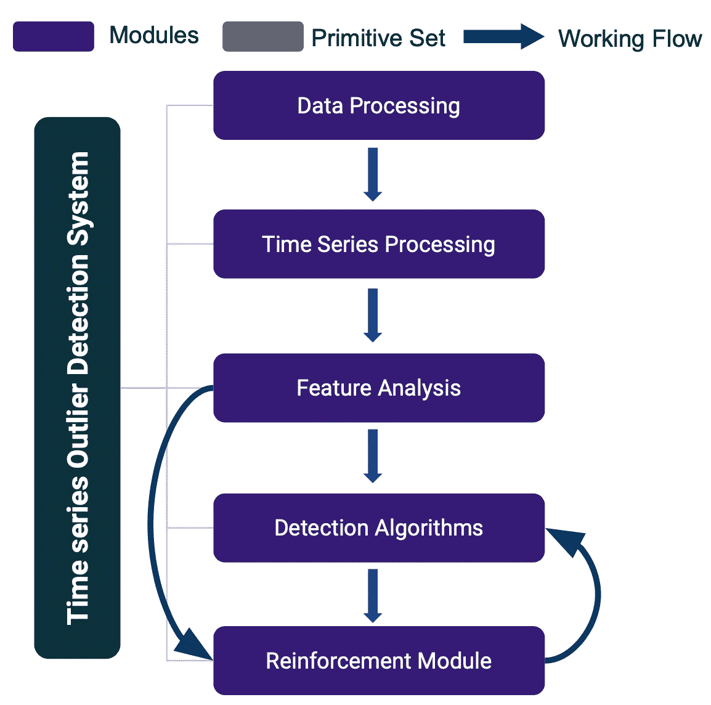
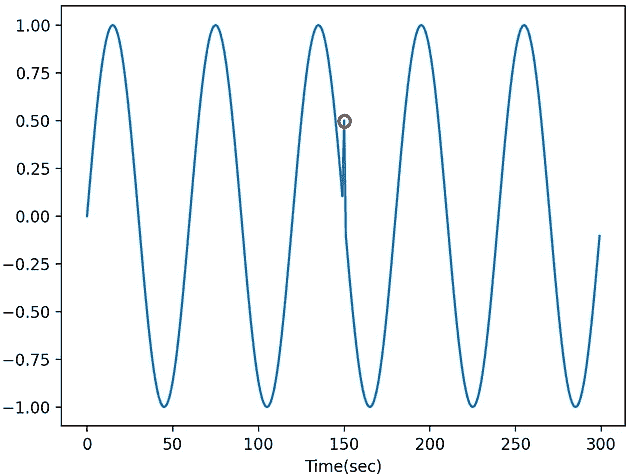
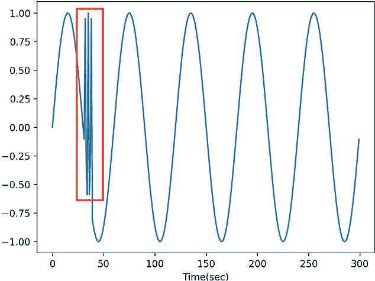
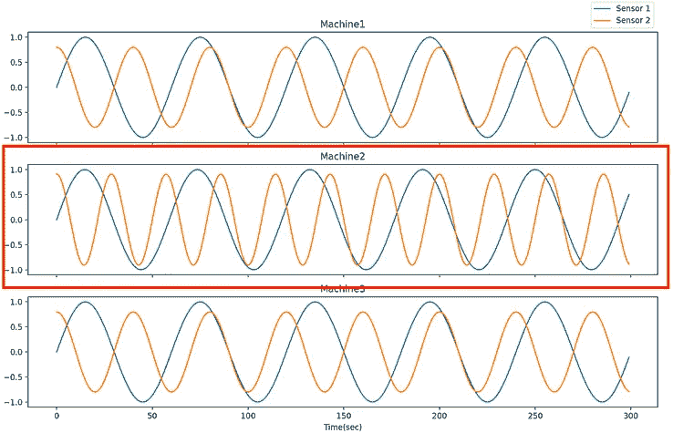

# TODS:从时间序列数据中检测不同类型的异常值

> 原文：<https://towardsdatascience.com/tods-detecting-outliers-from-time-series-data-2d4bd2e91381?source=collection_archive---------3----------------------->

## 用自动机器学习构建用于时间序列异常检测的机器学习管道。


[https://github.com/datamllab/tods](https://github.com/datamllab/tods)。图片作者。

时间序列异常检测旨在识别数据中意外或罕见的情况。离群点检测作为数据分析的重要任务之一，在时间序列数据上有着广泛的应用，如欺诈检测、故障检测、网络安全攻击检测等。例如，Yahoo [1]和 Microsoft [2]已经建立了他们自己的时间序列异常值检测服务来监控他们的业务数据并触发异常值警报。对于时间序列数据，异常值可以分为三种情况:点异常值、模式异常值和系统异常值。

在本文中，我将介绍一个用于构建机器学习管道的开源项目，以检测时间序列数据中的异常值。本文将简要介绍三种常见的异常值以及相应的检测策略。然后将提供基于两个支持的 API 的示例代码:用于开发时序异常检测管道的 TODS API 和用于使用第三方包进行实验的 scikit-learn API。

# 概观



TODS 的结构图。作者图片

[TODS](https://github.com/datamllab/tods)【3】是一个全栈的机器学习系统，用于多元时间序列数据上的离群点检测。TODS 为构建基于机器学习的异常检测系统提供了详尽的模块，包括:数据处理、时间序列处理、特征分析、检测算法和强化模块。通过这些模块提供的功能包括:用于一般目的的数据预处理、时间序列数据平滑/变换、从时间/频率域提取特征、各种检测算法以及涉及人类专家来校准系统。可以对时间序列数据执行三种常见的异常值检测场景:逐点检测(作为异常值的时间点)、模式检测(作为异常值的子序列)和系统检测(作为异常值的时间序列集)。



当时间序列中存在潜在的系统故障或小故障时，通常会出现逐点异常值。这种异常值以全局(与整个时间序列中的数据点相比)或局部(与相邻点相比)的方式存在于单个数据点上。全局异常值通常是显而易见的，检测全局异常值的常见做法是获得数据集的统计值(例如，最小值/最大值/平均值/标准偏差)并设置用于检测异常点的阈值。局部异常值通常出现在特定的上下文中，具有相同值的数据点如果没有出现在特定的上下文中，就不会被识别为异常值。检测局部异常值的常用策略是识别上下文(通过季节性趋势分解、自相关)，然后应用统计/机器学习方法(例如，自回归、IsolationForest、OneClassSVM)来检测异常值。

当数据中存在异常行为时，通常会出现模式异常值。模式异常值是指时间序列数据的子序列(连续点)，其行为与其他子序列相比是不寻常的。检测模式异常值的常见实践包括不一致分析(例如，[矩阵剖面图](/the-matrix-profile-e4a679269692) [6]，hotax[7])和子序列聚类[4]。不一致分析利用滑动窗口将时间序列分割成多个子序列，并计算子序列之间的距离(例如欧几里德距离)以找到时间序列数据中的不一致。子序列聚类也将子序列分割应用于时间序列数据，并采用子序列作为每个时间点的特征，其中滑动窗口的大小是特征的数量。然后，采用诸如聚类(例如，KMeans、PCA)或逐点异常值检测算法的无监督机器学习方法来检测模式异常值。

当许多系统中的一个系统处于异常状态时，系统孤立点经常发生，其中系统被定义为多元时间序列数据。检测系统异常值的目的是从许多相似的系统中找出一个处于异常状态的系统。例如，从具有多条生产线的工厂中检测异常生产线。检测这种异常值的常用方法是执行逐点异常值检测和模式异常值检测，以获得每个时间点/子序列的异常值分数，然后采用集成技术为每个系统生成总体异常值分数，用于比较和检测。

# **通过 Scikit-learn API 进行实验**

在建立机器学习管道的开始，需要进行大量的实验来调整或分析算法。在 TODS，sci kit-learn like API 可用于大多数模块，允许用户灵活地将单个函数调用到实验脚本中。这是一个使用 UCR 数据集[5]识别模式异常值的调用矩阵配置文件的示例。

小实验的 Sklearn 界面。

```
Accuracy Score:  0.89 precision    recall  f1-score   support0       0.90      0.98      0.94      9005
1       0.21      0.04      0.06       995accuracy                               0.89     10000
   macro avg       0.55      0.51      0.50     10000
weighted avg       0.83      0.89      0.85     10000
```

# **用 TODS API 建造管道**

在管道勘探的后期阶段，有必要在没有开发工作的情况下以可重复的方式管理实验，因为将会有更多的超参数和组件组合。在 TODS，我们的管道构建和执行 API 允许用户用一个脚本生成各种可重复的管道。生成的管道将存储为描述文件，其类型如。json 或者。yml 文件，可以很容易地用不同的数据集复制/执行，并与同事共享。以下示例利用 TODS API 在中建立自动编码器管道。json 格式，并使用 TODS 后端引擎运行管道，以检测雅虎网络入侵数据集中的离群点[1]。

**第一步:生成管道描述文件** 管道生成脚本如下。虽然它看起来比 Scikit-learn 界面长，但是用户可以很容易地用 candidate 添加超参数

管道施工脚本

**第二步:管道运行**
创建管道描述文件后，我们可以如下运行管道描述文件，并评估无监督管道:

管道运行脚本

```
 metric     value       normalized     randomSeed
      PRECISION  0.285714    0.285714       0 
      RECALL     0.800000    0.800000       0       
      F1_MACRO   0.708549    0.708549       0       
      F1         0.421053    0.421053       0
```

尽管这个 API 需要一个脚本来生成管道描述文件，但它提供了灵活的接口来生成多个管道。生成具有不同污染率的多条自动编码器管线的示例可在[这里](https://github.com/datamllab/tods/blob/benchmark/benchmark/realworld_data/pipeline_construction/neural/build_AE_pipeline.py)找到。

# **带标签信息的自动模型发现**

除了手动创建管道，TODS 还利用 TODS API 来提供自动化的模型发现。自动模型发现的目标是根据验证集中的标签信息和给定的计算时间限制寻找最佳流水线。

自动化模型发现示例

```
****************************************************
Search History:
----------------------------------------------------
Pipeline id: 0601567a-2b70-4a22-aa26-c5522be70ee7
     metric     value  normalized  randomSeed  fold
0  F1_MACRO  0.708549    0.708549           0     0
----------------------------------------------------
Pipeline id: 538e4929-603c-4e88-9717-79d77ac6a9e2
     metric     value  normalized  randomSeed  fold
0  F1_MACRO  0.616695    0.616695           0     0
----------------------------------------------------
Pipeline id: eaf6d5aa-f497-4176-9d2a-063d516eaa25
     metric    value  normalized  randomSeed  fold
0  F1_MACRO  0.55474     0.55474           0     0
----------------------------------------------------
Pipeline id: f2efd81c-9fbc-46c6-aebd-ec7ec0c2dbd2
     metric     value  normalized  randomSeed  fold
0  F1_MACRO  0.531302    0.531302           0     0
----------------------------------------------------
Pipeline id: 9d59afd8-4667-435c-b105-74c6a68a8f43
     metric     value  normalized  randomSeed  fold
0  F1_MACRO  0.509059    0.509059           0     0
********************************************************************************************************
Best pipeline:
----------------------------------------------------
Pipeline id: 0601567a-2b70-4a22-aa26-c5522be70ee7
Pipeline json: {"id": "0601567a-2b70-4a22-aa26-c5522be70ee7", "schema": "[https://metadata.datadrivendiscovery.org/schemas/v0/pipeline.json](https://metadata.datadrivendiscovery.org/schemas/v0/pipeline.json)", "created": "2021-06-22T03:58:47.893794Z", "inputs": [{"name": "inputs"}], "outputs": [{"data": "steps.7.produce", "name": "output predictions"}], "steps": [{"type": "PRIMITIVE", "primitive": {"id": "c78138d9-9377-31dc-aee8-83d9df049c60", "version": "0.3.0", "python_path": "d3m.primitives.tods.data_processing.dataset_to_dataframe", "name": "Extract a DataFrame from a Dataset"}, "arguments": {"inputs": {"type": "CONTAINER", "data": "inputs.0"}}, "outputs": [{"id": "produce"}]}, {"type": "PRIMITIVE", "primitive": {"id": "81235c29-aeb9-3828-911a-1b25319b6998", "version": "0.6.0", "python_path": "d3m.primitives.tods.data_processing.column_parser", "name": "Parses strings into their types"}, "arguments": {"inputs": {"type": "CONTAINER", "data": "steps.0.produce"}}, "outputs": [{"id": "produce"}]}, {"type": "PRIMITIVE", "primitive": {"id": "a996cd89-ddf0-367f-8e7f-8c013cbc2891", "version": "0.4.0", "python_path": "d3m.primitives.tods.data_processing.extract_columns_by_semantic_types", "name": "Extracts columns by semantic type"}, "arguments": {"inputs": {"type": "CONTAINER", "data": "steps.1.produce"}}, "outputs": [{"id": "produce"}], "hyperparams": {"semantic_types": {"type": "VALUE", "data": ["[https://metadata.datadrivendiscovery.org/types/Attribute](https://metadata.datadrivendiscovery.org/types/Attribute)"]}}}, {"type": "PRIMITIVE", "primitive": {"id": "a996cd89-ddf0-367f-8e7f-8c013cbc2891", "version": "0.4.0", "python_path": "d3m.primitives.tods.data_processing.extract_columns_by_semantic_types", "name": "Extracts columns by semantic type"}, "arguments": {"inputs": {"type": "CONTAINER", "data": "steps.0.produce"}}, "outputs": [{"id": "produce"}], "hyperparams": {"semantic_types": {"type": "VALUE", "data": ["[https://metadata.datadrivendiscovery.org/types/TrueTarget](https://metadata.datadrivendiscovery.org/types/TrueTarget)"]}}}, {"type": "PRIMITIVE", "primitive": {"id": "642de2e7-5590-3cab-9266-2a53c326c461", "version": "0.0.1", "python_path": "d3m.primitives.tods.timeseries_processing.transformation.axiswise_scaler", "name": "Axis_wise_scale"}, "arguments": {"inputs": {"type": "CONTAINER", "data": "steps.2.produce"}}, "outputs": [{"id": "produce"}]}, {"type": "PRIMITIVE", "primitive": {"id": "30bc7cec-2ccc-34bc-9df8-2095bf3b1ae2", "version": "0.1.0", "python_path": "d3m.primitives.tods.feature_analysis.statistical_mean", "name": "Time Series Decompostional"}, "arguments": {"inputs": {"type": "CONTAINER", "data": "steps.4.produce"}}, "outputs": [{"id": "produce"}]}, {"type": "PRIMITIVE", "primitive": {"id": "67e7fcdf-d645-3417-9aa4-85cd369487d9", "version": "0.0.1", "python_path": "d3m.primitives.tods.detection_algorithm.pyod_ae", "name": "TODS.anomaly_detection_primitives.AutoEncoder"}, "arguments": {"inputs": {"type": "CONTAINER", "data": "steps.5.produce"}}, "outputs": [{"id": "produce"}], "hyperparams": {"contamination": {"type": "VALUE", "data": 0.01}}}, {"type": "PRIMITIVE", "primitive": {"id": "2530840a-07d4-3874-b7d8-9eb5e4ae2bf3", "version": "0.3.0", "python_path": "d3m.primitives.tods.data_processing.construct_predictions", "name": "Construct pipeline predictions output"}, "arguments": {"inputs": {"type": "CONTAINER", "data": "steps.6.produce"}, "reference": {"type": "CONTAINER", "data": "steps.1.produce"}}, "outputs": [{"id": "produce"}]}], "digest": "d4333e1733f1f50395de84cb65e650023a58185dc90d89a698f7facdeb300d64"}
Output:
     d3mIndex  anomaly
0           0        0
1           1        0
2           2        0
3           3        0
4           4        0
...       ...      ...
1395     1395        0
1396     1396        0
1397     1397        1
1398     1398        1
1399     1399        0[1400 rows x 2 columns]
Scores:
     metric     value  normalized  randomSeed  fold
0  F1_MACRO  0.708549    0.708549           0     0
****************************************************
```

在管线搜索之后，允许用户通过管线 id 访问所有搜索到的管线，并保存任何管线描述文件以备将来使用。更多细节可以在[官方演示 jupyter 笔记本](https://github.com/datamllab/tods/blob/master/examples/Demo%20Notebook/TODS%20Official%20Demo%20Notebook.ipynb)中找到。

# 摘要

要了解这个项目的更多信息，请点击查看。该团队正在积极为该项目开发更多功能，包括带有可视化工具的图形用户界面、半监督学习算法和高级管道搜索器。目标是使时间序列数据的异常值检测变得容易和容易。我希望你喜欢阅读这篇文章，在接下来的文章中，我将详细介绍检测时间序列数据中不同类型异常值的常用策略，并介绍 TODS 具有合成标准的数据合成器。

# 参考

[1]蒂尔、马库斯、沃尔夫冈·科宁和托马斯·贝克。" webscope S5 数据集上的在线异常检测:一项比较研究." *2017 进化与自适应智能系统(EAIS)* 。IEEE，2017。
[2]任，韩生，等.微软时间序列异常检测服务*第 25 届 ACM SIGKDD 知识发现国际会议论文集&数据挖掘*。2019.
【3】赖，k-h，查，d，王，g，徐，j，赵，y，库马尔，d，陈，y，尊卡瓦卡，p，万，m，马丁内斯，d，&胡，X. (2021)。TODS:一个自动时间序列异常检测系统。*AAAI 人工智能会议论文集*， *35* (18)，16060–16062。
[4]基奥，埃蒙等，“时间序列分段:一项调查和新方法。”*时序数据库中的数据挖掘*。2004.1–21
【5】[https://Wu . renjie . im/research/anomaly-benchmarks-is-infected/arxiv/](https://wu.renjie.im/research/anomaly-benchmarks-are-flawed/arxiv/)
【6】Yeh，Chin-Chia Michael，等，“矩阵剖面 I:时间序列的所有对相似性连接:包括主题、不一致和形状的统一视图。” *2016 IEEE 第 16 届国际数据挖掘大会(ICDM)* 。Ieee，2016。
[7]基奥、埃蒙、林欣童和艾达芙。"热 sax:有效地发现最不寻常的时间序列子序列."*第五届 IEEE 数据挖掘国际会议(2005 年 ICDM)*。Ieee，2005 年。