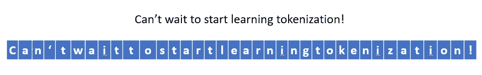
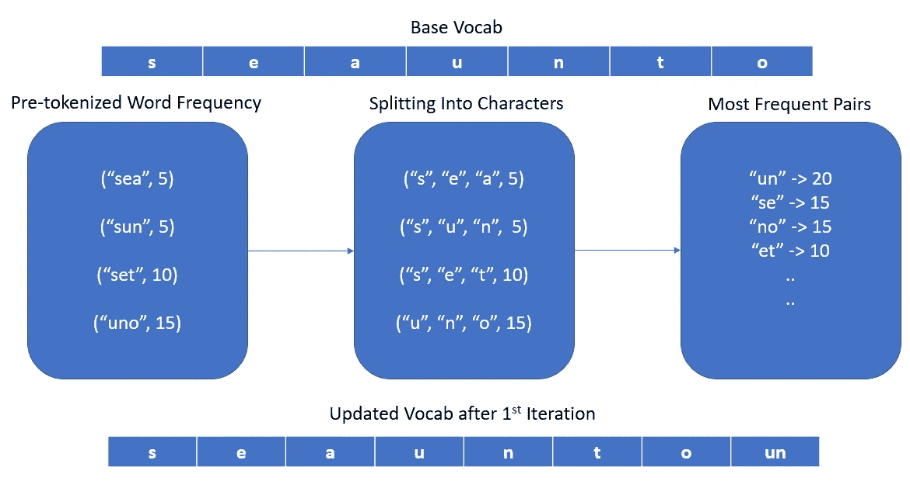
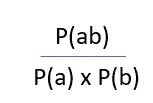

# 符号化算法解释

> 原文：<https://towardsdatascience.com/tokenization-algorithms-explained-e25d5f4322ac?source=collection_archive---------12----------------------->

## [入门](https://towardsdatascience.com/tagged/getting-started)

## 满足您所有令牌化需求的一站式商店

由[布雷特·乔丹](https://unsplash.com/@brett_jordan?utm_source=medium&utm_medium=referral)在 [Unsplash](https://unsplash.com?utm_source=medium&utm_medium=referral) 上拍摄的照片

# 介绍

对于外行来说，让我们从正式介绍标记化的概念开始— **标记化**是一种简单的方法，它将输入的文本数据分割成单独的有意义的标记，这些标记可以被机器进一步理解和处理。**记号**可以是单词、字符，甚至是子单词，这取决于所采用的分裂算法。在本文中，我们将讨论所有三种主要的记号——单词、字符和子单词。我们还将重点关注最近大多数 SOTA 模型使用的子单词标记化算法— **字节对编码(BPE)、单词片段、单字符和句子片段**。讨论结束时，您将对上述每一种方法有一个具体的了解，并且能够决定哪种标记化方法最适合您的需要。

# 基于单词的标记化

顾名思义，在基于单词的记号化方法中，整个单词由标点、空格、分隔符等分隔。被视为令牌。分离边界可能是特定于任务的，有时可能取决于您正在处理的数据的性质。用于标记 Twitter tweets 的基于单词的标记器会稍微偏离用于标记新闻文章本身的标记器。

为了正确理解，让我们从一个例子开始，展示仅基于空白字符执行的标记化

空间标记化

使用这种方法，您可以看到“标记化！”被视为单个令牌。如果你要在一个更大的数据集上运行它，这种方法将产生一个巨大的词汇表，因为无数的单词和标点符号组合将被视为与基础单词不同的标记。为了解决这个问题，让我们尝试标记标点符号和空白。

空格和标点符号化

现在，结果看起来比之前的输出要好一些。尽管如此，我希望你能理解，在英语中，如果不理解标点符号所处的上下文，并不是所有的标点符号都可以被视为象征性的界限。在上下文中，我们最好在这些场景中区别对待*撇号*——*、【let】和【don】、*——*[" do "、" n t "]*记号将提供比 *["don "、"'"、"' t"]* 更有意义的语义，而我们可以使用 *["let "、" '、" ' s"]。*

这就把我们带到了基于**规则的**单词分词器的话题。SpaCy 提供了一个伟大的基于规则的标记器，它应用特定于语言的规则来生成语义丰富的标记。感兴趣的读者可以先睹为快，看看 spacy 定义的规则。

基于规则的标记化—空间

这种方法非常简单，如果您能够忍受过多的处理时间和处理能力，它在大多数情况下都很有效。否则，仍然需要注意——随着训练数据的增加，词汇量也会增加。在一个巨大的语料库上用这种基于单词的标记化来训练一个模型会产生一个极其沉重的模型，并且需要过高的资源。

那么，你会问，为什么不仅仅使用字符集作为标记来减少词汇量呢？

# 基于字符的标记化

可以想象，基于字符的标记化将所有基本字符视为标记。它们可以是 UNICODE、ASCII 等。按照你的要求。继续上面的例子，结果看起来会像这样:

基于字符的标记化

当然，模型的复杂性和规模会大大降低，因为词汇表限制在 200 个左右。然而，标记不再携带有意义的语义。在上下文中，基于单词的标记化中的“国王”和“王后”的表示比字母“k”和“q”的上下文无关嵌入包含更多的信息。这就是语言模型在基于字符的标记上训练时表现不佳的原因。

如果性能对于您的业务需求来说并不重要，并且您愿意为了更高的速度和更少的计算强度而牺牲性能，那就去追求吧。

否则，如果你想两全其美，标记化算法找到一个中间地带**是至关重要的，这个中间地带**可以保留尽可能多的语义上有意义的信息，同时也在一定程度上限制模型的词汇大小。认识一下我们的新朋友，分词标记化！

# 基于子词的标记化

如果基于字符和单词的标记化不能让您的船漂浮起来，那么这是您应该保证的最佳点——不受无意义的标记的限制，也不需要太多的时间和处理能力。子词标记化方法旨在仅使用尽可能多的 *N* 个标记来表示数据集中的所有词，其中 *N* 是一个超参数，根据您的需求来决定。一般来说，对于基本模型，它徘徊在大约 30，000 个令牌。多亏了这些方法，不需要无限的词汇表，我们现在就可以很好地捕捉上下文无关的语义丰富的令牌表示。

我们现在将讨论一些用于执行子词标记化的最佳且广泛使用的算法。

## 字节对编码(BPE)

字节对编码首先需要对输入文本进行预标记化——这可以像空格标记化一样简单，或者您可以使用基于规则的标记化器(如 SpaCy)来执行预标记化步骤。

现在，我们形成了一个基本词汇表，它只不过是语料库中所有独特字符的集合。我们还计算每个单词的频率，并将每个单词表示为基本词汇中的单个字符的列表。

现在合并开始。根据以下标准，只要不超过最大大小，我们就继续向我们的基本 vocab 添加令牌——出现次数最多的令牌对被合并并作为新令牌引入。重复此步骤，直到达到配置的最大 vocab 大小。

字节对编码算法

## **字块**

词块和 BPE 在实现子词标记化的方法上非常相似。之前我们看到 BPE 的主要标准是选择一个频率最高的候选配对。Word Piece 关注的不是最大化频率，而是最大化候选对的可能性——这可以通过下面的公式来简洁地总结:

其中 a、b 是词汇中的标记

## Unigram

使用 BPE 的一个缺点是，在对单词进行标记时，如果出现歧义，它无法提供选择标记的排序机制。为了更好地理解这一点，假设我们的基本词汇由以下标记组成— *the，th，at，eat，re* ，如果我们被要求对单词 *theatre —* 进行标记，我们会看到两个选项，其中任何一个都不在另一个*之前— (the，at，re)或(th，eat，re)。* BPE 专注于每一步的最佳预测，这是一个更贪婪的解决方案，因此在某些情况下可能会产生不太可能的结果。然而， **Unigram** 坚持预测**最有可能的结果令牌**，考虑训练期间学习到的概率。

在训练的每个阶段，我们计算每个子词标记的概率，并定义如果每个子词标记被丢弃将导致的损失值。然后，我们挑选掉总体损失最小的记号，本质上是那些对集合增加很少价值的记号。

## 句子片段

现在到了 NLP 社区所见证的最后也是最巧妙的方法之一。**句片**就像是本文到目前为止所描述的所有子词分词方法之父。它是**语言不可知的**——适用于所有语言，因为它不需要预标记器来处理语言特定的属性。它将空格视为一个独立的符号，从而完全解决了解码问题(我知道这听起来很简单！).与其他子词标记化方法相比，它的总体速度**更快**，这使得它成为大多数用例的首选标记化方法。如需进一步阅读，可查阅已发表的[句子篇论文](https://arxiv.org/abs/1808.06226)。

在本文中，我们介绍了一些最好的、广泛使用的标记化算法，权衡了它们的优缺点，并讨论了它们可能是正确选择的情况。希望您现在已经准备好了，可以更轻松地处理不同的标记化策略了！