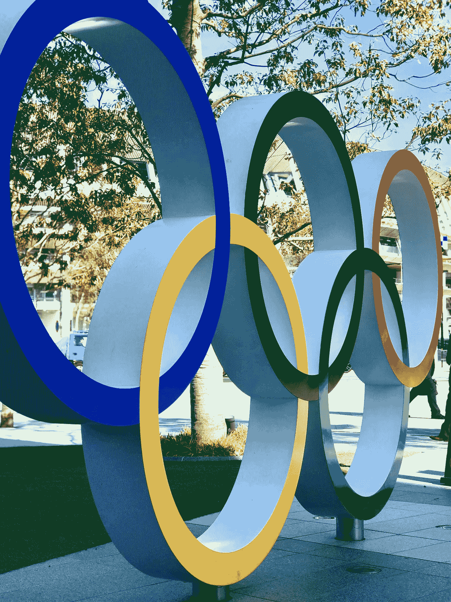
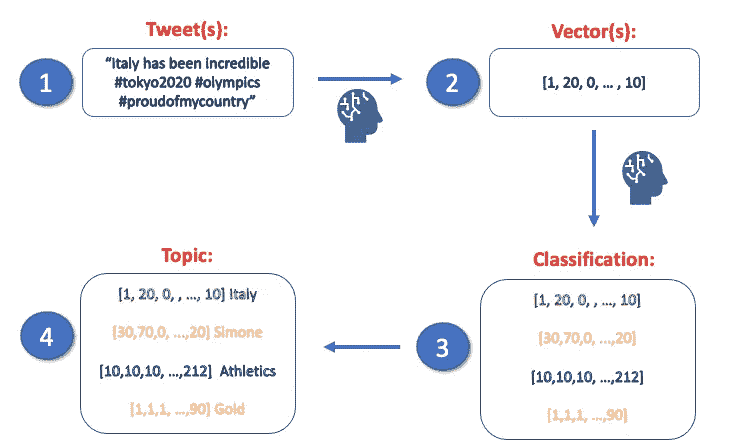

# 东京 2020 使用 Python 通过机器学习进行主题建模

> 原文：<https://towardsdatascience.com/tokyo-2020-tweets-topic-modelling-with-machine-learning-using-python-fd82b46b46bc?source=collection_archive---------26----------------------->



[阿莱士·史密斯](https://unsplash.com/@mcghavan?utm_source=unsplash&utm_medium=referral&utm_content=creditCopyText)在 [Unsplash](https://unsplash.com/s/photos/olympics?utm_source=unsplash&utm_medium=referral&utm_content=creditCopyText) 上拍照

## 以下是如何使用机器学习按照主题对东京 2020 推文进行分类。

**不出所料，两周以来，一切都与奥运有关。**

许多伟大的故事被创造出来，许多明星诞生，许多不可思议的事件发生。而且，在社交媒体**时代，“如果你没有发布，那就从来没有发生过”。因为这个原因，很多人在推特上谈论奥运，分享他们的感受和想法。**

我们的目标是**为推文的主题建模。**这意味着，给定一条 tweet 作为输入，我们想要自动理解给定 tweet 的主题。

以下是一些带有一般句子的例子:

```
INPUT SENTENCE:
I'm so angry, so I think I'm going to buy a **cheeseburger**TOPIC:
**cheeseburger**INPUT SENTENCE:
This fast food makes the best **cheeseburger** of the entire cityTOPIC: 
**cheeseburger**INPUT SENTENCE: 
I really like **Coke**, so I think I'm going to buy a couple of bottles.TOPIC:
**Coke**
```

当然，如果你看第二句话，另一个话题可能是“**快餐”**或“**城市”**。事实上，我们更可能有一个主题列表，并筛选出最有影响力的主题。

我们开始吧！

## 0.图书馆

如题，我们将使用 **Python** 。特别是，我们将使用这些库:

## 1.想法是:

NLP 任务与其他任务(如表格数据分类)的不同之处在于**您需要将单词/句子转换成向量。** 所以你要做的第一件事就是把你的推文转换，表示到一个 N 维空间。

通常，N 非常大，因此您可能希望通过使用合适的方法(例如 PCA)来降低**维度**。

一旦完成，你需要使用一个**聚类**模型，以一种无人监管的方式对这些推文进行分类。

因此，你将得到 k 个分类的向量。最后一步是使用原始推文，并查看每个类别最常用的单词。
这个会给你每个班的**题目**。因此，您将拥有数据集中所有 tweets 的主题**。**



我制作的图像

下面详细解释一下:

## 2.数据集:

我在这里找到了数据集，用熊猫导入，出于计算原因只选择了 5000 条推文:

## 3.从文本到矢量:

用于文本预处理的一个很好的模型是 **BERT** 。一篇精彩的文章展示了为什么以及如何使用 BERT 来达到这个目的，这篇文章是。以下是如何将你的文本转换成矢量:

让我们使用 PCA*来绘制我们的向量:

1.  **二维主成分分析:**

**2。3D 主成分分析:**

为了清楚地理解我们可能想要使用 PCA 分解方法的多少特征，让我们使用**解释的方差比:**

好的，所以 **5 个组件就足够了，当然是**(记住，在 Python 中，你从 0 开始计数)。

> * PCA 是一种用于**根据每个轴包含的信息减少数据维数的方法。**我们正在使用它，因为我们的向量有 700 多个维度，它可能会干扰我们的过程。

## 4.分类和主题建模:

如果我们想要精确，我们不应该谈论**分类，**因为它是一种受监督的方法。相反，我们正在以一种无人监督的方式对我们的数据进行聚类，因为我们根本没有标签。
我们将使用的非常简单的方法是 [**sklearn K-Means。**](https://scikit-learn.org/stable/modules/generated/sklearn.cluster.KMeans.html) 没有什么比这更复杂的了:

```
from sklearn.cluster import KMeans 
cluster = KMeans(n_clusters=20, random_state=0).fit(pca_data)
```

那么我们就用 **TF-IDF*** 来了解哪些词出现的次数最多(但排除比较**太多的**像“这个”，或者“那个”或者“安”)。

完整的代码可以在这里找到:

> * TF-IDF 是一种以智能方式计算单词在一类文档中出现的次数的方法。聪明的地方在于，如果这个词也出现在所有其他类中，它可能不会影响(像“The”或“an”)，因此，它不会被认为是“频繁的”。

## 5.最终结果:

下面是我们获取**主题的方法:**

1.  按照 **TF-IDF** 的降序排列每一类中的单词
2.  仅在具有最高 TF-IDF 的类中考虑每个单词**(单词的 TF-IDF 值可以根据我们考虑的类而改变)**
3.  保持**最高 TF-IDF 值的字为代表整个类的字。**

这是代码:

当然，这种方法并不完美，但确实有些有趣的地方。

这 13 节课都是关于 biles 的。5 类是关于**美国的。**几乎每个班级都有一个特定的主题。

## 考虑因素:

当体育赛事发生时，我们会感到很亲近。整个国家在比赛的最后一秒屏住呼吸，分享胜利的喜悦或失败的悲伤。

如果你喜欢这篇文章，你想知道更多关于机器学习的知识，或者你只是想问我一些你可以问的问题:

A.在 [**Linkedin**](https://www.linkedin.com/in/pieropaialunga/) 上关注我，在那里我发布我所有的故事
B .订阅我的 [**简讯**](https://piero-paialunga.medium.com/subscribe) 。这会让你了解新的故事，并给你机会发短信给我，让我收到你所有的更正或疑问。
C .成为 [**推荐会员**](https://piero-paialunga.medium.com/membership) ，这样你就不会有任何“本月最大数量的故事”，你可以阅读我(以及成千上万其他机器学习和数据科学顶级作家)写的任何关于最新可用技术的文章。