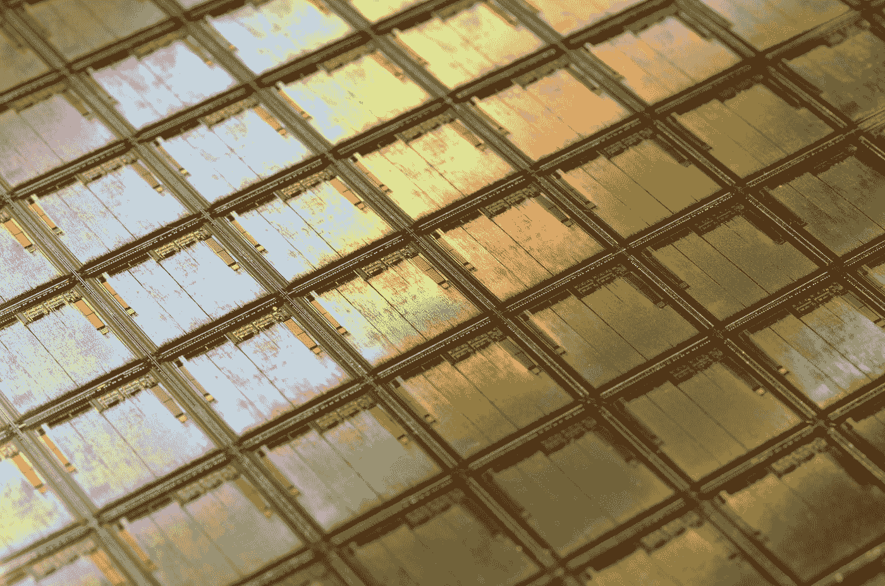
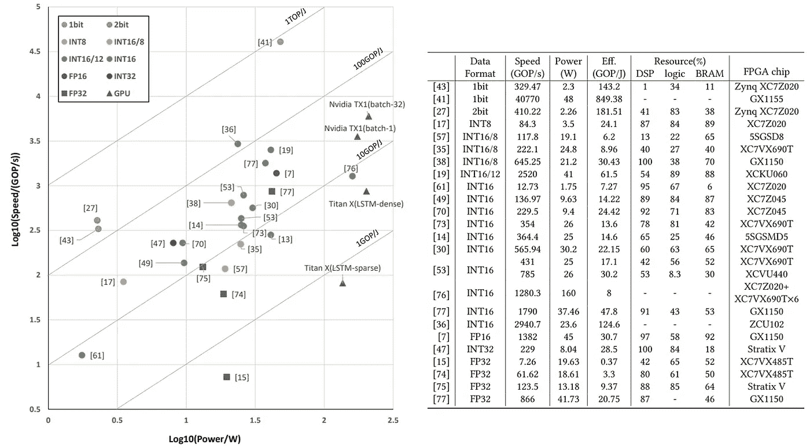

# 明日汽车硅脑，是怎么做出来的？

> 原文：<https://towardsdatascience.com/tomorrows-car-silicon-brain-how-is-it-made-9090e1f06c9d?source=collection_archive---------34----------------------->

## [行业笔记](https://towardsdatascience.com/tagged/notes-from-industry)

## 自动驾驶汽车的神经网络加速器——GPU、FPGA 还是 ASIC？

自动驾驶系统极其复杂。它们紧密集成了感知和决策等多种最先进的技术。只有精心设计的硬件才能支持这些特别需要资源的任务。此外，自动驾驶是首批严重依赖机器学习算法的嵌入式应用之一。因此，大量的研究工作被投入到开发满足特定要求的神经网络加速器中，例如冗余和功率效率。

由[劳拉·奥克](https://unsplash.com/@viazavier?utm_source=medium&utm_medium=referral)在 [Unsplash](https://unsplash.com?utm_source=medium&utm_medium=referral) 上拍摄的照片

自动驾驶汽车的发展无疑是当前人工智能领域最具挑战性的任务之一。自动驾驶机器必须精确地感知其环境，并计划一系列适当的行动来安全地在道路上导航。它必须处理各种各样的情况。路况、天气、复杂的道路交叉口、行人和其他道路使用者都是不确定性的来源，使场景理解变得复杂。尽管如此，这项任务至关重要。对汽车周围环境的全面了解是安全有效地在世界上导航所必需的。自动驾驶汽车装载了收集大量数据的传感器，以实现这一目标。但是，原始数据用处不大；必须要分析。

鉴于任务的复杂性，场景理解需要学习算法，尤其是神经网络。注意，在最先进的硬件平台上，这种算法的训练过程可能需要几天时间——多个强大的图形处理单元(GPU)或张量处理单元(TPU) [1] -。因此，这项任务显然不是在驾驶时执行的。嵌入式硬件只需计算神经网络中数据的正向传播，也称为推理。尽管如此，推论也是资源密集型的。尤其是必须达到更高刷新率以减少感知延迟。幸运的是，大多数神经网络中的前向传播可以计算为点积，这是高度并行化的操作。因此，中央处理单元(CPU)由于其有限的内核数量而明显不适合。如今，GPU 被用于许多机器学习应用程序，既用于训练，也用于推断。

尽管如此，对于关键的嵌入式系统，它仍然缺乏效率和可靠性。为此，该行业正在开发替代品。神经网络加速器(NNA)是专门用于神经网络计算的硬件系统。我们将主要讨论其中的两种:现场可编程门阵列和专用集成电路，如特斯拉的 FSD 计算机。

# 自动驾驶车辆嵌入式计算机要求

今天，最先进的自主系统主要依靠计算机视觉。事实上，自动驾驶汽车的主要计算任务是从图像中提取特征。系统必须理解它所感知到的东西。卷积神经网络(CNN)已被证明在这项任务中非常强大。它们通常由多层卷积、激活函数、汇集和解卷积组成。数据流经网络的所有层，从图像甚至视频中提取有趣的信息。这种算法的存储和计算成本很高。例如，一个 224×224 图像的经典分类器 ResNet152 需要 113 亿次浮点运算(TFLOP)来执行推理过程，并需要 400MB 内存来存储模型参数[2]。此外，目前的自动驾驶汽车有多个分辨率高得多的摄像头。以特斯拉 Model 3 为例。它有 8 个摄像头，分辨率为 1280 × 960。实时分析所有 8 个视频源。我们可以很容易地想象这需要巨大的计算能力。然而，卷积运算通常占通过 CNN 推理过程执行的运算的 98%以上。ReLU 和 pooling 是毫不费力的逻辑函数。他们只占不到 0.5%的业务。由于卷积是基于点积的，因此必须设计硬件来提高点积效率，这最终会转化为几个并行的乘法/加法运算。

自动驾驶汽车的嵌入式系统也有与安全性、可靠性和实时性要求相关的特定约束。有三个主要挑战需要克服:

*   处理流水线必须足够快，以消化收集的大量传感器数据。系统速度越快，在给定的时间框架内可以分析的数据就越多。请注意，系统运行的帧速率至关重要。感知系统的刷新率必须很高，以允许系统对意外情况做出快速反应，甚至(尤其是)高速反应。
*   必须避免单点故障。该系统必须足够健壮以从故障部分恢复。该系统不仅必须在资源减少的情况下运行，而且还必须检测故障。这个问题通常通过冗余和结果比较来解决。两条独立的计算流水线同时运行。当结果不匹配时，检测到错误。
*   该系统必须尽可能节能。自动驾驶汽车通常是电动的。因此，能源效率对于实现远程传输至关重要。此外，高功耗意味着散热解决方案和电源的额外重量和成本。

# 三种主要类型的计算平台

## 图形处理单元

Nvidia Drive platform 目前正引领基于 GPU 的自动驾驶嵌入式系统市场。这种通用计算解决方案集成了 Drive 软件堆栈，旨在让汽车制造商专注于其自动驾驶解决方案的软件实施。DrivePX 架构的最新版本——也是最强大的版本——提供了两个 Tegra X2 SOC。每个芯片包含四个 ARM A57 CPUs 和一个 Pascal GPU。两个 GPU 都有专用内存和优化的 DNN 加速指令。为了容纳大量传输的数据，每个 Tegra 都使用 PCI-E Gen2 × 4 总线直接连接到 Pascal GPU，总带宽为 4.0 GB/s。优化的输入/输出架构和 DNN 加速允许每个 Tegra 芯片执行 24 TFLOP/s

然而，这种系统的功耗高达 250 W。这种功耗确实成为嵌入式系统的一大障碍。因此，即使是 GPU 专家也在 2022 年生产的新平台上整合 ASICs。Nvidia Drive AGX Orin 宣布通过六种不同类型的处理器的组合提供 200 TFLOP/s 的速度，包括 CPU、GPU、深度学习加速器(DLA)、可编程视觉加速器(PVA)、图像信号处理器(ISP)和立体/光流加速器。

## 现场可编程门阵列(FPGA)

近年来，FPGAs 已经成为算法加速的绝佳选择。与 CPU 或 GPU 相反，FPGA 专门配置为运行目标算法。手头的任务因此以更高的效率执行。如果没有经验测量，很难估计 FPGA 的浮点性能，但对于几十瓦的功耗，几个 TFLOP/s 是很容易实现的。纯 FPGA 必须通过 PCIe 连接与主机系统一起工作，以提供数据，在我们的例子中，是图像和其他传感器输出。FPGA 通常仅用作推理目的的神经网络加速器。根据神经网络结构配置芯片，并将模型参数存储在存储器中。FPGA 内部存储器很少超过几百兆，这对于存储大多数 CNN 参数来说太小了。需要像 DDR SDRAM 这样的外存。这种外部存储器的带宽和功耗是重新获得高系统性能的瓶颈。

尽管如此，高端 FPGA 可以在我们的应用中实现良好的性能。比如 Xilinx 的 [Zynq UltraScale MPSoC](https://www.xilinx.com/applications/automotive/automated-driving.html) 。它的设计考虑到了自动驾驶任务，在速度和效率方面都可以超过特斯拉 K40 GPU 三倍以上(14 FPS/W vs. 4 FPS/W) [3]运行 CNN 推断。在实时 1080p 视频流中，它可以达到 60 FPS 的目标跟踪任务。采用多种硬件级技术在 FPGA 上设计神经网络加速器，以提高其性能和效率。计算单元的设计尤为关键。事实上，FPGA 上可用的低级组件(门、触发器)是有限的。因此，可以用较小的计算单元设计来实现更多的计算单元和更高的峰值性能。此外，对于精心设计的计算单元阵列，可以提高工作频率。Guo 等人[3]描述了通过优化计算单元设计来提高性能的三种主要技术:

*   **低位宽计算单元:**输入数组的位宽直接影响计算单元的大小。位宽越小，计算单元就越小。大多数用于神经网络应用的最新 FPGA 设计都用定点单元取代了 32 位浮点单元。虽然 16 位单元被广泛采用，但对于低至 8 位的单元来说也有可能实现良好的结果[5]。一般来说，CNN 和神经网络对降低的精度非常宽容[4]。
*   **快速卷积方法:**卷积运算可以通过多种算法加速。例如，离散傅立叶变换或 Winograd 方法可以通过合理的内核大小获得巨大的性能增益(4 倍)[3]。
*   **频率优化方法:**片内 SRAM 和数字信号处理(DSP)单元之间的路由可能会限制峰值工作频率。DSP 单元的不同工作频率可以与用作本地 ram 的相邻片一起使用，以分隔时钟域。这项技术是作为 Xilinx 的 CHaiDNN-v2 项目的一部分实现的[5]。他们实现了两倍的峰值工作频率。

ZynqNet FPGA 加速器[6]是一个全功能的概念验证 CNN 加速器，实现了这些技术以及更多。顾名思义，这个框架是为 Xilinx Zynq 板开发的。它使用嵌套循环算法来加速 CNN 推理，从而最小化算术运算和内存访问的数量。

## 专用集成电路(ASIC) —特斯拉 FSD 计算机

专用集成电路允许硬件实现的完全灵活性。因此，可以满足特定的要求，以实现特定任务的极高性能。对于有足够资源开发这种复杂系统的汽车制造商来说，这种解决方案无疑是必由之路。虽然它为自动驾驶汽车提供了最好的性能，但开发时间和价格同样巨大。

> “我问埃隆·马斯克(Elon Musk)是否愿意花所有的钱来做完全定制设计，他问，‘我们会赢吗？’。我说，‘是啊，当然！’所以他说，‘我加入！。”—2019 年自治日期间，特斯拉硅工程副总裁皮特·班农(Pete Bannon)。

特斯拉全自动驾驶(FSD)计算机在 2019 年 4 月 22 日的 Autonomy Day 期间展示。该系统自发布以来就在所有特斯拉汽车上运行，并被证明效果非常好。根据 Elon Musk 的说法，FSD 计算机最终将为 5 级自动驾驶系统提供动力。该 ASIC 是对以下要求的响应:

*   电脑必须在 100 W 以下运行。
*   它必须至少处理 50 TFLOP/s 的神经网络模型。
*   对于数据预处理和后处理来说，适度的 GPU 仍然是必要的。然而，随着软件和人工智能技术的进步，在通用硬件上运行的经典算法可能会过时。
*   安全和安保在设计中至关重要。失败的百分比必须低于人类在驾驶时失去意识的概率。这一要求意味着完全的硬件冗余:每台 FSD 计算机有两个电源和两个独立的计算单元。
*   每个图像和数据集都是独立处理的(批量为一个)以减少延迟。
*   广泛的连接端口，以适应汽车的多个传感器。

由于应用的性质，FSD 计算机非常适合于图像处理。其接口提供 2.5Gpixel/s 串行输入，以适应汽车周围的高度摄像头，以及用于雷达等其他传感器的 LPDDR4 DRAM 接口。此外，独立的图像信号处理器负责降噪、色调映射(突显阴影中的细节)，外部 H.265 视频编码器模块用于数据导出。这个不寻常的模块是特斯拉软件开发过程中的一个关键元素。数据是大多数机器学习算法的基石。特斯拉的车队是训练自动驾驶模型的大量视频数据来源。多年来构建特斯拉的数据库是其成功的关键因素。轻型数据处理在支持 32 位和 16 位浮点的 GPU 上运行，运行频率为 1 GHz，可实现 600 GFLOP/s。运行频率为 2.2GHz 的 12 个 ARM CPUs 用于几个次要任务。

尽管如此，FSD 计算机的主要目的是它的神经网络加速器(NNA)。为了安全起见，每台电脑都配有两个独立的 NNA。每个 NNA 有 32 Mb 的 SRAM 来保存临时结果和模型参数。请注意，DRAM 存储器比 SRAM (100 倍)更耗能。在每个时钟周期内，2056 字节的激活数据和 1028 字节的参数在每个 NNA 的 96 × 96 (9216)乘加阵列中组合。该数据流需要至少 1TB/s 的 SRAM 带宽(每个加速器)。乘法/加法阵列具有就地累加功能，每个周期最多可进行 10，000 次运算。因此，每个 NNA 在 2 GHz 下的运行速度为 36 TFLOP/s。但是，NNA 针对点积进行了优化。非线性运算在这些芯片上表现很差或者根本不表现。为 ReLU 和池操作添加了专用模块。

Tesla 软件的当前版本需要分析每幅图像 35 GOP。因此，FSD 计算机每秒可以分析总共 1050 帧。在运行测试版的全自主自驾软件时，FSD 电脑的 NNA 功耗为 72W — 15W。

# 系统比较

由于嵌入式系统的复杂性，其评估变得越来越困难。证明改进的最有效方式是一个标准的基准测试套件，以代表自动驾驶应用程序中使用的工作负载。我们可以将基准工具分为两类:数据集和工作负载压力。KITTI [7]是第一个针对自动驾驶的数据集基准。它包含许多感知传感器数据，如单目/立体图像和 3D 激光雷达点云。提供与数据相关的基本事实，以评估多种自动驾驶场景中的算法性能，如车道检测、里程计、物体检测和跟踪。这种数据集可以用作系统压力源，以评估其在自驾车相关任务中的峰值性能。第二类基准旨在通过一套应用和视觉内核评估新颖的硬件架构。CAVBench [8]目前是自动驾驶计算系统性能评估的良好起点。它是一套应用程序，通过基于数据集模拟不同的场景来创建虚拟环境，从而评估现实世界的性能。多种工作负载评估任务可用:对象检测、对象跟踪、电池诊断、语音识别、边缘视频分析和 SLAM。这种任务离散化允许开发人员找到系统的性能瓶颈。

不幸的是，在自动驾驶边缘计算社区，没有普遍采用的基准或评估流程。尽管如此，郭等人[3]已经能够比较多个最先进的神经网络推理加速器。

图 1:最先进的神经网络加速器设计的性能和资源利用的比较[3]

图 1 比较了不同基于 FPGA 的加速器和 GPU 加速器的计算能力和效率。一般来说，在 10100 GOP/j 范围内，FPGA 的能效略高于 GPU，但是，GPU 的速度性能仍然更胜一筹。提高基于 FPGA 的解决方案性能的主要挑战是可扩展性。Zhang 等人[9](图 1 中的参考文献[76])提出了一种基于 FPGA 集群的解决方案来实现 GPU 性能。他们使用 16 位定点设计将 Xilinx 的 6 个 Virtex-7 FPGA(设备 XC7VX690T)组合在一起。虽然这种架构相当于 GPU 的计算能力，但它也具有较低的能效。

然而，基于 FPGA 的 NNA 是一个快速发展的研究领域。大量工作致力于优化架构，以获得越来越好的能效和计算能力。事实上，基于 GPU 的解决方案已经达到了架构优化的高度。它们的性能现在主要取决于材料的物理极限和制造方法。另一方面，面向硬件的解决方案仍有很大的发展空间。甚至像 AMD、Intel 或 Nvidia 这样通用处理器专家现在也将他们的努力集中在硬件加速器上。

ASICs 仍然是表现最好的 NNA。例如，特斯拉 FSD 计算机总共执行 144 TFLOP/s，而 Nvidia 驱动程序架构在特斯拉的自动驾驶软件堆栈上运行的最高速度为 24 TFLOP/s。FPGA 有望赶上 ASIC 的性能，ASIC 的开发需要大量的工程努力。不仅要设计一个 ASIC，而且整个软件体系结构也必须适应。每个 ASIC ANN 都需要一个特定的编译器来部署神经网络。

# 结论

自动驾驶汽车不是普通的系统。他们对确保用户及其环境的安全有着严格的要求。自动驾驶计算机面临的挑战是提供足够的计算能力、鲁棒性和能效。通用计算处理器不是可行的选择，因为它们缺乏有效运行神经网络的并行化能力。事实上，任何 NNA 的关键特征是 CNN 中使用的点积操作的优化。

优化水平根据平台的自由度而变化。目前最灵活的人工神经网络是基于 GPU 的。尽管如此，由于有数千个内核，它们在神经网络上的表现异常出色。但是这些性能是以低能效为代价的。FPGAs 提供的灵活性稍差，必须配置为在相似的功耗水平下提供比 GPU 更好的性能。然而，FPGAs 很难扩展。大量的工作放在使用 FPGA 作为 NNA。最后，从各个角度来看，从底层开始构建的静态硬件系统(ASICs)目前提供了最好的性能；耐用性、能效和计算能力。

虽然 ASICs 的表现令人难以置信的好，但只有大公司才能负担得起它们的开发。同样，FPGAs 仍然是复杂的系统，需要精心设计的算法才能高效运行。由于这些原因，GPU 仍然广泛用于自动驾驶汽车，但可定制的硬件将很快取代它们。

## 个人想法

自主车辆开发是一个年轻的研究领域。开发人员目前正在探索教会机器驾驶的可能性。因此，机器学习解决方案不断发展。虽然 CNN 是目前的标准，但新的有前途的架构，如变形金刚[10]，目前正在计算机视觉领域出现。由于这些解决方案规定了硬件级别的要求，NNA 目前很难进行大量优化。

软件和人工神经网络必须同时开发，以达到最佳性能。至少，机器学习模型可以优化，以充分利用可用的硬件平台。以端到端驱动算法的挑战为例[11]。这种方法肯定能产生更好的结果。然而，对于当前的 NNA 平台，它重新获得了太复杂的神经网络。

另一方面，通过添加人类工程向量将系统分为感知系统和决策系统允许拆分架构。特斯拉目前采用第二种解决方案是有充分理由的:它简化了计算。许多其他神经网络优化是可用的。然而，从数学的角度来看，它们往往是反直觉的(模型是建立在数学的基础上的)。例如，机器学习工程师更喜欢更深的网络而不是大型层，因为它可以优化通用处理器或 GPU 的计算成本。在定制硬件 NNA 上不一定是这种情况。

**感谢阅读**。在 [LinkedIn](https://www.linkedin.com/in/arthurfdlr/) 上与我联系，继续讨论！

# 参考

[1] Norman P. Jouppi，Cliff Young，Nishant Patil，David Patterson 等..张量处理单元的数据中心性能分析。 [arXiv:1704.04760](https://arxiv.org/abs/1704.04760) 。

[2]，何，，，任，.用于图像识别的深度残差学习。CVPR。 [arXiv:1512.03385](https://arxiv.org/abs/1512.03385) 。

[3]开元郭、曾、金城余、、等。基于 FPGA 的神经网络加速器综述。arXiv:1712.08934 。

[4] Suyog Gupta 和 Ankur Agrawal 和 Kailash Gopalakrishnan 和 Pritish Narayanan。数值精度有限的深度学习。 [arXiv:1502.02551](https://arxiv.org/abs/1502.02551) 。

[5] Xilinx CHaiDNN-v2 项目。https://github.com/Xilinx/chaidnn[访问时间:2020 年 3 月 21 日。](https://github.com/Xilinx/chaidnn)

[6]大卫·格施文德。ZynqNet:FPGA 加速的嵌入式卷积神经网络。 [arXiv:2005.06892](https://arxiv.org/abs/2005.06892)

[7] A. Geiger、P. Lenz 和 R. Urtasun。我们准备好自动驾驶了吗？KITTI vision 基准套件，正在进行中。IEEE 会议。计算机。Vis。模式识别。(CVPR)，2012 年 6 月，第 3354–3361 页

[8]王永元、刘绍林、吴晓红和史文伟。CAVBench:联网和自动驾驶汽车的基准套件，正在进行中。IEEE/ACM 研讨会。边缘计算。(秒)，2018 年 10 月，第 30–42 页

[9]，，孙家钰，孙光宇，，罗，.高能效 CNN 在深度流水线 FPGA 集群上的实现，2016 年低功耗电子与设计国际研讨会论文集。ACM，326–331。

[10] Alexey Dosovitskiy 和 Lucas Beyer 和 Alexander 和 Dirk Weissenborn 和 Xiaohua Zhai 和 Thomas Unterthiner 和 Mostafa Dehghani 和 Matthias Minderer 和 Georg Heigold 和 Sylvain Gelly 以及 Jakob Uszkoreit 和 Neil Houlsby。一幅图像相当于 16x16 个字:大规模图像识别的变形金刚。arXiv:2010.11929 。

[11]陈，张健宇，许卓和 m .富冢。基于顺序潜在表征学习的端到端自动驾驶感知。arXiv:2003.12464 。