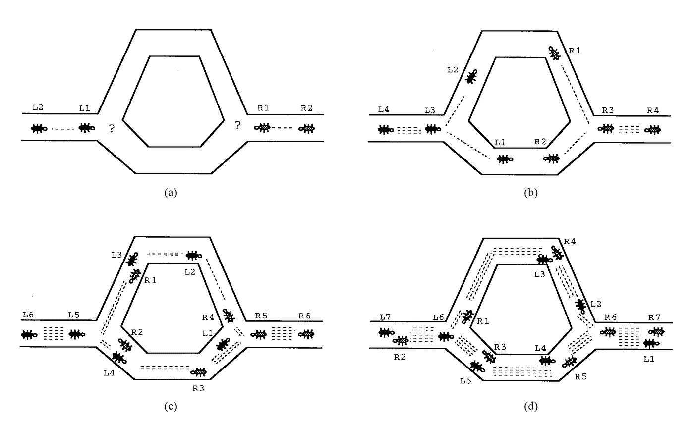
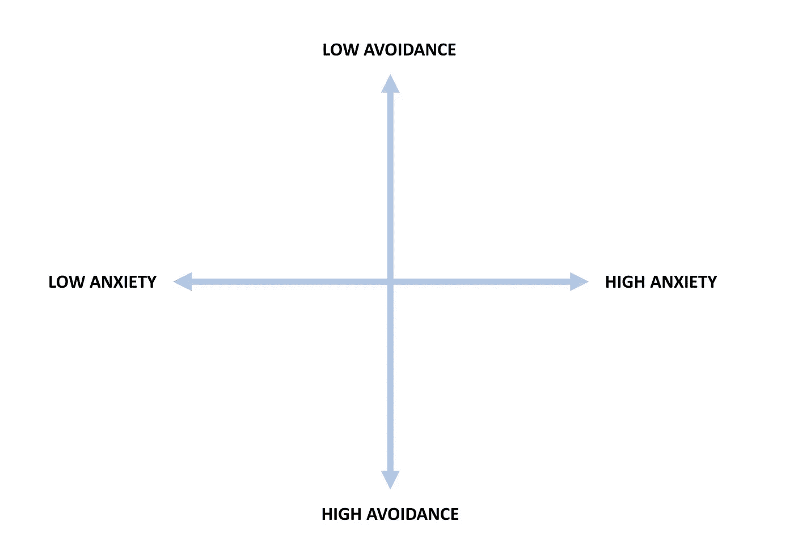
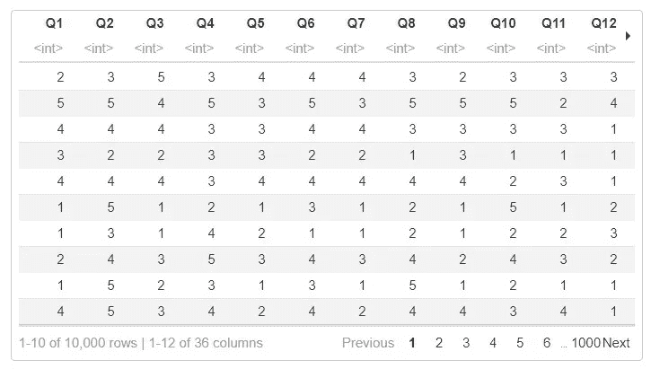
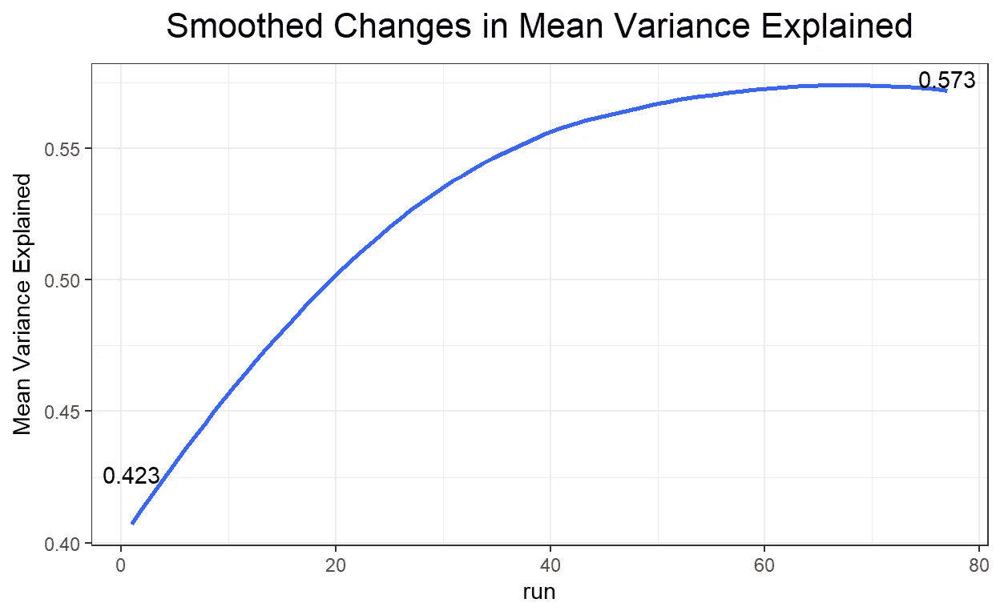

# 调查问题太多？让蚁群优化来处理吧。

> 原文：<https://towardsdatascience.com/too-many-survey-questions-let-ant-colony-optimization-handle-it-e6bb6e764643?source=collection_archive---------47----------------------->


史蒂夫拍摄的照片。 on [Unsplash](https://unsplash.com?utm_source=medium&utm_medium=referral)

你的调查问题太多了吗？您是否担心您的参与者可能会厌倦在调查过程中回答问题？在本文中，我描述了如何在 r。

在社会和行为科学领域，研究人员经常使用在线调查和问卷从参与者样本中收集数据。此类工具提供了一种收集大量个人信息的高效且有效的方式。

> 调查用于从人们那里收集信息，以描述、比较或解释他们的知识、感受、价值观和行为。*【1】*

有时，参与者可能会厌倦在调查过程中回答问题，尤其是在调查非常长的情况下。这就是所谓的**疲劳调查**。当参与者感到疲惫时，他们可能会跳过问题，由于回答不够努力而提供不准确的回答，甚至完全放弃调查。为了缓解这一问题，我们需要缩短调查长度——要么手动删除一些问题，要么使用优化算法自动完成。

**蚁群优化**是计算机科学中一种先进的优化算法。ACO 最初是受到阿根廷蚂蚁的集体行为的启发，这种行为被称为 iridomyrmex humilis。在寻找食物时，这些蚂蚁将信息素丢在地上，并跟随其他蚂蚁先前丢下的信息素。由于最短的路径更有可能保留信息素，蚂蚁可以沿着这条路径更快地找到有希望的食物源(见图 1)。



**图 1:** 真正的蚂蚁是如何找到最短路径的。(a)蚂蚁到达决策点。(b)一些蚂蚁选择上面的路径，一些选择下面的路径。选择是随机的。(c)由于蚂蚁以大致恒定的速度移动，选择较低的较短路径的蚂蚁比选择较高的较长路径的蚂蚁更快地到达对面的决策点。(d)信息素在较短的路径上以较高的速率积累。虚线的数量大约与蚂蚁储存的信息素的数量成比例(来源: [Dorigo，Maniezzo 和 Colorni (1996)](https://ieeexplore.ieee.org/document/484436) ，第 54 页)

工程师们决定用阿根廷蚁群的运作方式作为类比来解决最短路径问题，并创造了 ACO 算法[3]。然后，其他研究人员已经开始将相同的算法应用于不同的选择问题，例如在一项调查中选择“最佳”问题。研究表明，ACO 优于传统的问题选择方法，例如选择具有高度相关性的问题[4]。

# 例子

在本例中，我们将使用[亲密关系体验(ECR)](http://labs.psychology.illinois.edu/~rcfraley/measures/brennan.html) 调查。该调查由 36 个问题组成，测量成年人的两个依恋维度:回避和焦虑(见图 2)。这些问题基于 5 分制的李克特量表(即 1 =完全不同意，5 =完全同意)。奇数编号的问题(即问题 1、3、5 等。)属于回避分量表(如 Q1。我不喜欢向伴侣展示我内心深处的感受。)，而其余的问题属于焦虑分量表(例如，Q2。我担心被抛弃。).对于每个分量表，较高的调查分数表明较高水平的回避(或焦虑)。在这些维度中的一个或两个维度上得分高的人被认为有不安全的成人依恋倾向[5]。



**图二。**成人依恋个体差异的二维模型(来源:改编自[http://labs . psychology . Illinois . edu/~ RCF raley/measures/measures . html](http://labs.psychology.illinois.edu/~rcfraley/measures/measures.html)的图)

ERC 调查的[原始数据集](http://openpsychometrics.org/_rawdata/ECR-data-1March2018.zip)可在开源心理测量项目[网站](https://openpsychometrics.org/)上获得。出于演示目的，我们将根据以下规则使用原始数据集的子集:

*   来自美国的受访者必须参与调查，
*   受访者必须在 18 至 30 岁之间，并且
*   受访者必须回答所有问题。

最终数据集在[这里](https://raw.githubusercontent.com/okanbulut/tds/main/scale_abbreviation/ecr_data.csv)可用。

使用 ACO 算法，我们希望将调查长度减少到 12 个问题(即每个子量表 6 个问题)。首先，我们将数据集导入到 R:

```
ecr <- read.csv("ecr_data.csv", header = TRUE)
```



**图 3。**ECR 数据集的预览(图片由作者提供)

其次，我们将在 R 中激活包含 **antcolony.lavaan** 函数的**简写**包，以使用 ACO 算法缩短调查。

```
library("ShortForm")
```

第三，我们将定义 ECR 调查的因子结构。也就是说，有两个维度(回避和焦虑)，每个维度都与 18 个问题相关联。

```
model <- '
Avoidance =~ Q1+Q3+Q5+Q7+Q9+Q11+Q13+Q15+Q17+Q19+Q21+Q23+Q25+Q27+Q29+Q31+Q33+Q35
Anxiety =~ Q2+Q4+Q6+Q8+Q10+Q12+Q14+Q16+Q18+Q20+Q22+Q24+Q26+Q28+Q30+Q32+Q34+Q36
'
```

接下来，我们将定义在选择过程中每个维度可以使用哪些问题。在本例中，我们希望与每个子量表相关的所有问题都被视为“候选”问题。

```
items <- list(c(paste0("Q", seq(1, 35, by = 2))),
              c(paste0("Q", seq(2, 36, by = 2))))
```

在最后一步，我们将把所有东西放在一起实现 ACO 算法。在准备 **antcolony.lavaan** 函数时，我们将使用默认值。然而，一些参数，如蚂蚁，蒸发和步骤，可以被修改，以找到一个最佳的结果(或减少计算时间)。

现在，我们可以继续查看结果。首先，我们将看到 ACO 选择了哪些问题。以下输出显示了选定的问题(“1”)和排除的问题(“0”)。

```
ecr_ACO[[1]]# Returned output below: cfi    tli   rmsea mean_gamma Q1 Q3 Q5 Q7 Q9 Q11 Q13 Q15 Q17
[1,] 0.9814 0.9768 0.05723      0.755  0  1  1  1  0   0   1   0   1 Q19 Q21 Q23 Q25 Q27 Q29 Q31 Q33 Q35 Q2 Q4 Q6 Q8 Q10 Q12 Q14 Q16
[1,]   0   0   1   0   0   0   0   0   0  1  1  1  1   1   0   0   0 Q18 Q20 Q22 Q24 Q26 Q28 Q30 Q32 Q34 Q36
[1,]   0   0   1   0   0   0   0   0   0   0
```

接下来，我们将检查每个维度选择了哪些问题。

```
cat(ecr_ACO$best.syntax)# Returned output below:Avoidance =~ Q7 + Q17 + Q13 + Q9 + Q5 + Q3
Anxiety =~ Q2 + Q10 + Q6 + Q22 + Q8 + Q4
```

我们还可以看到从 **antcolony.lavaan** 返回的结果。例如，在算法的每次迭代中，我们可以看到模型中解释的差异量的变化。

```
plot(ecr_ACO, type = "variance")# Other alternative plots
# plot(ecr_ACO, type = "gamma")
# plot(ecr_ACO, type = "pheromone")
```



**图 4:**ACO 中多次运行解释的差异量(图片由作者提供)

# 结论

在上面的例子中，ACO 能够制作一个简短的 ECR 调查版本，只包含 12 个问题。 **antcolony.lavaan** 函数很快找到最优解。然而，搜索过程的速度取决于蚂蚁的数量、蒸发率、模型拟合指数以及为这些指数建立的临界值。例如，可以修改截止值(例如，CFI > .90，TLI > .90)以加速搜索过程。我希望这个例子能帮助你创建更短更有效的调查。

**注:** [这篇文章的扩展版](https://okan.cloud/posts/2021-01-19-how-to-shorten-a-measurement-instrument-automatically-part-ii/)在我的个人博客上有。

# **参考文献**

[1]芬克，阿琳(2015)。*如何进行调查:分步指南*。Sage 出版公司。

[2]戈斯、阿隆、德内堡、J.-L .、玛丽·帕斯特尔斯。J. (1989 年)。阿根廷蚂蚁的自我组织捷径。自然科学协会。

[3]m . Dorigo，v . manie zzo 和 a . color ni(1996 年)。蚂蚁系统:由一群合作的代理优化。 *IEEE 系统、人和控制论汇刊，B 部分(控制论)*26(1):29–41。

[4]莱特，王伟林，黄，李一中，马可利迪斯(2008).用蚁群优化算法开发短量表的项目选择。*多元行为研究*43(3):411–31。

[5]魏，m .，罗素，D. W .，马林克罗特，b .，，沃格尔，D. L. (2007)。亲密关系体验量表简表:信度、效度和因子结构。*人格评估杂志*88(2):187–204。