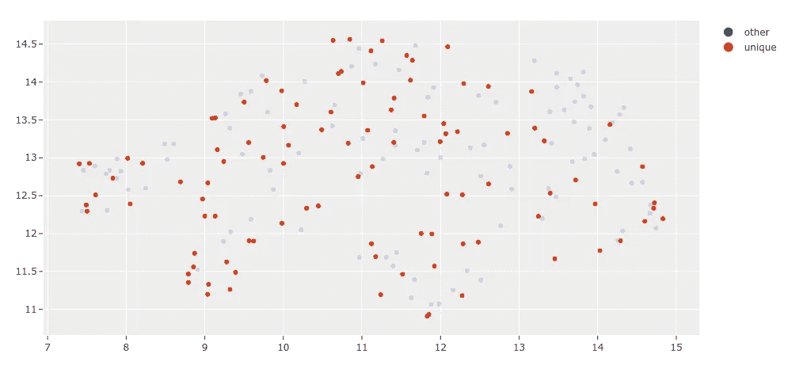

# 如何用 CVAT 和五十一注释和改进计算机视觉数据集

> 原文：<https://towardsdatascience.com/tools-to-annotate-and-improve-computer-vision-datasets-f9b99cdb0e04?source=collection_archive---------7----------------------->

## 使用开源工具 551 和 CVAT 构建高效标注工作流和训练更好模型的技巧

[](https://voxel51.com/docs/fiftyone/integrations/cvat.html)

图像 505f00d8762c07fc 来自在[五十一](https://fiftyone.ai)中可视化的开放图像数据集(图像由作者提供)

每个人都想培养伟大的模特。机器学习社区已经有一段时间以模型为中心，每个人都试图创建下一个最好的模型。最近，通过像[软件 2.0](https://karpathy.medium.com/software-2-0-a64152b37c35) 这样的想法，向以数据为中心的工作流转变的重要性变得越来越突出。在为你的任务训练模型时，[你可能会发现，对你的模型最大的改进](http://googleresearch.blogspot.com/2009/03/unreasonable-effectiveness-of-data.html)将来自仔细管理和改进你用来训练模型的数据集，而不是担心你正在使用的特定模型架构。

**在数据集监管和注释领域，** [**五十一**](https://fiftyone.ai) **和**[**CVAT**](https://github.com/openvinotoolkit/cvat)**是两种领先的开源工具，分别处理数据集监管和改进工作流的不同部分，每个部分都有数万名用户**。此外，这些工具[现在与](https://voxel51.com/docs/fiftyone/integrations/cvat.html)紧密集成，允许更快、更高效的工作流程。 [FiftyOne](https://fiftyone.ai) 是一个数据集管理和模型分析工具，提供灵活的 API 和直观的应用程序，作为开源的“数据集 IDE” [CVAT](https://github.com/openvinotoolkit/cvat) 是领先的开源图像和视频注释工具之一，由于其广泛的功能集和易于使用的界面而被广泛采用。51 和 CVAT 之间的集成允许您在 51 中管理和探索数据集，然后只需一行代码就可以将样本或现有标签发送到 CVAT 进行注释。

这篇文章涵盖了两个工作流程的例子，展示了如何使用 51 和 CVAT 之间的集成。第一个工作流智能地选择未标记数据的子集，并将其发送到 CVAT 进行注释。第二个工作流评估现有数据集以查找注记错误，并使用 CVAT 来提高数据集的质量。这两个例子都显示了与 551 和 CVAT 合作进行注释工作流是多么容易，从而更快地开发更好的模型所需的微调的计算机视觉数据集。

***免责声明*** *:我是 Voxel51 的工程师，在做五十一！*

# 跟随在科拉布

文章中展示的例子可以通过 Google Colab 直接在你的浏览器中运行。[点击此链接查看](https://voxel51.com/docs/fiftyone/tutorials/cvat_annotation.html)！


Colab 笔记本随这篇文章一起出现(图片由作者提供)

# 设置

为了跟随这篇文章中的例子，你需要设置 51 和 CVAT。

对于 FiftyOne，你只需要[安装开源 Python 包](https://voxel51.com/docs/fiftyone/getting_started/install.html):

```
pip install fiftyone
```

对于 CVAT，您需要在[cvat.org](https://cvat.org/)([或本地设置 CVAT](https://openvinotoolkit.github.io/cvat/docs/administration/basics/installation/))上进行记账。在本地设置 CVAT 的主要好处是避免 cvat.org 的 10 个任务和 500 Mb 限制。


[CVAT 登录界面](https://cvat.org/auth/register)(图片由作者提供)

运行本文中的例子时，511 需要连接到你的 CVAT 账户。将您的 CVAT 用户名和密码传递给 FfityOne 的最简单方法是将它们存储在环境变量中。

```
export FIFTYONE_CVAT_USERNAME=<YOUR_USERNAME>
export FIFTYONE_CVAT_PASSWORD=<YOUR_PASSWORD>
```

如果您不想使用这些环境变量，[查看向 fiftone](https://voxel51.com/docs/fiftyone/integrations/cvat.html#setup)提供您的 CVAT 用户名和密码的替代方法。

本帖还运行了一些需要 TensorFlow 的深度模型:

```
pip install tensorflow
```

如果你有一个 GPU 和/或想用 Conda 设置 Tensorflow 或 PyTorch，请查看这篇文章。

# 概观

在您自己的数据上使用 51 和 CVAT 之间的这种集成的基本工作流程包括:[将您的数据](https://voxel51.com/docs/fiftyone/user_guide/dataset_creation/index.html)(可能还有现有标签)加载到 51 中，[浏览您的数据集](https://voxel51.com/docs/fiftyone/user_guide/using_views.html)以找到需要检查或注释的子集，[将这些子集上传到 CVAT](https://voxel51.com/docs/fiftyone/integrations/cvat.html) ，在 CVAT 对它们进行注释，以及[将更新后的标签](https://voxel51.com/docs/fiftyone/integrations/cvat.html)加载回 51 中。

# 未标记的数据集标注

对于大多数机器学习项目来说，第一步是收集特定任务所需的数据集。特别是对于计算机视觉项目来说，这通常会产生数以千计的图像或视频，这些图像或视频是从像 [Flickr](https://www.flickr.com/) 这样的互联网来源收集的，或者是由数据采集团队的新镜头捕捉的。

对于包含数千或数百万样本的集合，注释每个样本的成本可能是天文数字。因此，确保只将最有用和最相关的数据发送给注释是有意义的。衡量数据在训练模型中有多“有用”的一个标准是该示例相对于数据集的其余部分有多独特。多个相似的例子不会像视觉上独特的例子那样给模型提供那么多新的信息来学习。

[FiftyOne 提供了](https://voxel51.com/docs/fiftyone/user_guide/brain.html)一套方法来计算数据集属性，如样本硬度、标签错误率，以及对该工作流程最重要的[视觉相似性/唯一性](https://voxel51.com/docs/fiftyone/user_guide/brain.html#visual-similarity)。

## 加载数据

我们从[加载一组未标记的图像到 51 个](https://voxel51.com/docs/fiftyone/user_guide/dataset_creation/index.html)开始。这只用一行代码就可以完成。例如，如果您正在[使用您自己的数据](https://voxel51.com/docs/fiftyone/user_guide/dataset_creation/index.html)，您可以运行以下内容:

然而，在这篇博客中，我们将使用内置的[51 数据集 Zoo](https://voxel51.com/docs/fiftyone/user_guide/dataset_zoo/index.html) 从 [Open Images V6 数据集](https://voxel51.com/docs/fiftyone/integrations/open_images.html)下载一些图像。

不管怎样，让我们创建数据集`[persistent](https://voxel51.com/docs/fiftyone/user_guide/using_datasets.html#dataset-persistence)`,这样我们就可以关闭 Python 会话，并在需要时重新加载数据集。

既然数据已经加载，让我们在 [FiftyOne 应用](https://voxel51.com/docs/fiftyone/user_guide/app.html)中可视化它。


打开在[第五十一](https://fiftyone.ai)中可视化的图像(图片由作者提供)

## 寻找独特的样本

让我们对数据集运行`[compute_similarity()](https://voxel51.com/docs/fiftyone/user_guide/brain.html#visual-similarity)`方法，以便根据数据集中所有其他样本的视觉相似性来索引数据集中的所有样本。一旦完成，我们就可以使用索引来根据视觉相似性找到最独特的样本。还有其他衡量独特性的方法，但在这篇博客中，我们主要关注这种基于相似性的方法。

我们还可以[可视化](https://voxel51.com/docs/fiftyone/user_guide/plots.html)选择的确切样本。默认情况下，这种可视化是用降维包`umap-learn`计算的:

```
pip install umap-learn
```



由[第 51 个大脑](https://voxel51.com/docs/fiftyone/user_guide/brain.html)选择的独特样本图(图片由作者提供)

现在让我们在数据集内创建一个[视图](https://voxel51.com/docs/fiftyone/user_guide/using_views.html)，该数据集只包含所选的独特样本，并对它们进行可视化。

减少了需要注释的样本数量后，注释该数据集的时间和成本也减少了。

## 注释样本

无论您是自己注释数据还是有一个注释团队，从 FiftyOne 向 CVAT 上传数据的工作流程几乎是相同的。样本集合上的`[annotate()](https://voxel51.com/docs/fiftyone/api/fiftyone.core.collections.html#fiftyone.core.collections.SampleCollection.annotate)`方法允许您为正在注释的标签指定名称、类型和类别。

例如，如果我们为类“person”、“vehicle”和“animal”注释分段掩码，我们可以运行下面的代码。假设您想自己注释这些样本，那么一旦加载了数据，您可以使用 CVAT 编辑器自动启动一个浏览器窗口。对于这个示例帖子，让我们只加载视图中的几个示例。

`results`对象可用于获取已创建任务的当前状态。

```
Status for label field 'segmentations':

	Task 386 (FiftyOne_example_dataset_segmentations):
		Status: annotation
		Assignee: None
		Last updated: 2021-08-20T21:22:37.928988Z
		URL: [http://cvat.org/tasks/386](http://localhost:8080/tasks/386)

		Job 441:
			Status: annotation
			Assignee: None
			Reviewer: None
```


在 [CVAT](https://github.com/openvinotoolkit/cvat) 给一张图片做注解(图片由作者提供)

一旦注释完成并保存在 CVAT，我们就可以下载注释并自动更新我们的数据集。


在 [CVAT](https://github.com/openvinotoolkit/cvat) 标注的图片在[第五十一](https://fiftyone.ai)可视化(图片由作者提供)

如果您想要将数据集上传到一个注释者团队，那么您可以提供注释者和审阅者的 CVAT 用户名，这些用户名将被分配循环方式。`segment_size`参数用于定义 CVAT 任务中每个任务的最大图像数量。


在 [CVAT](https://github.com/openvinotoolkit/cvat) 分配给用户的工作(图片由作者提供)

对于较大的数据集，注记过程可能需要一些时间。我们提供的`anno_key`存储了关于在数据集上运行的注释的相关信息。当注释准备好导入回 FiftyOne 时，我们可以很容易地这样做:

# 数据集改进

在许多项目中，数据集已经存在，并用于训练模型。在这种情况下，时间的最佳利用可能会提高数据集的质量，这通常比优化模型体系结构的类似努力提供更大的性能增益。

FiftyOne 提供了强大的 API 和应用程序工作流来识别需要更新的样本/注释，并且与 CVAT 的紧密集成允许您采取必要的措施来提高数据集的质量。

对于这个示例工作流，让我们从[第五十一数据集 Zoo](https://voxel51.com/docs/fiftyone/user_guide/dataset_zoo/index.html) 加载 [COCO 对象检测数据集](https://voxel51.com/docs/fiftyone/integrations/coco.html)。

在这种情况下，我们将使用来自 [FiftyOne Model Zoo](https://voxel51.com/docs/fiftyone/user_guide/model_zoo/index.html) 的模型，但是您也可以轻松地[将您自己的模型预测](https://voxel51.com/docs/fiftyone/tutorials/evaluate_detections.html)添加到您的数据集中。为了运行这个特定的模型，我们还需要安装 [TensorFlow 模型花园](https://github.com/voxel51/models),其中包含:

```
eta install models
```

**注意**:建议在有 GPU 的机器上运行！

让我们想象一下这些模型预测。


可可数据集在[五十一](https://fiftyone.ai)中可视化(图片由作者提供)

为了找到该模型表现如何的具体案例，[让我们来评估该模型](https://voxel51.com/docs/fiftyone/user_guide/evaluation.html):

```
0.3957238101325776
```

使用 FiftyOne 复杂的查询语言，我们可以[在数据集](https://voxel51.com/docs/fiftyone/user_guide/using_views.html)中构建不同的视图。具体来说，让我们找到模型对其预测有信心但预测被标记为不正确(假阳性)的样本。这表明模型可能是正确的，但是地面实况注释是不正确的。

浏览这些结果，我们可以看到一个模式出现。COCO 数据集在标签上包含一个`iscrowd`布尔属性，指示边界框是包含一群多个对象还是仅包含一个对象实例。在许多模型不正确的情况下，`iscrowd`属性被错误地注释或者完全丢失。


不正确的`iscrowd`标签出现在[第五十一](https://fiftyone.ai)(图片由作者提供)

我们可以通过点击选择相关样本并点击[标签按钮](https://voxel51.com/docs/fiftyone/user_guide/app.html#tags-and-tagging)来标记这些样本中的一些样本。


在[五十一](https://fiftyone.ai)中标记样本(图片由作者提供)

我们现在可以使用`annotate()`方法将这些样本和标签上传到 CVAT 进行重新标注。以下代码在您的帐户中的[cvat.org](https://cvat.org)上创建一个新任务，其中仅包含带有`requires_annotation`标签的样本:


更正 [CVAT](https://github.com/openvinotoolkit/cvat) 中的`iscrowd`标注(图片由作者提供)

在更新了所有示例中的相关注释之后，确保点击 CVAT 中的 save 按钮。现在重记已经完成，让我们将更新的标签加载回 51，并清理在 CVAT 创建的任务。


更新了[第五十一](https://fiftyone.ai)中的`iscrowd`注释(图片由作者提供)

正如我们所见，数据集上的`ground_truth`标签已经更新。让我们[在这些更新的标签上再次评估同一个型号](https://voxel51.com/docs/fiftyone/user_guide/evaluation.html)。

```
0.3984999388520894
```

**模型的[图](https://voxel51.com/docs/fiftyone/user_guide/evaluation.html#map-and-pr-curves)仅仅通过更新一个样本中的单个标签，就从 39.57%提升到了 39.85%！**下一步是花更多的时间探索 51 年的数据集，找出更多的注释错误，并将它们发送给 CVAT 的注释者团队进行审查和重新注释。可以指派特定的用户来注释或审阅通过该 API 创建的任务。

此工作流展示了如何改进数据集的验证拆分以及该拆分下模型的后续性能。在这一点上，我们实际上从未重新训练过模型！下一步是在整个数据集上迭代这个工作流，一次一个分割，直到它被完整地细化。然后，当需要训练模型时，演示与 [PyTorch 数据加载器](/stop-wasting-time-with-pytorch-datasets-17cac2c22fa8)或 [PyTorch Lightning Flash](https://voxel51.com/docs/fiftyone/integrations/lightning_flash.html) 集成的其他工作流是一个很好的起点。

# 摘要

构建高质量的数据集是产生高性能模型的最可靠的方法。用于构建和改进数据集的开源工具允许计算机视觉社区作为一个整体来开发更好的模型。[五十一](https://fiftyone.ai)和 [CVAT](https://github.com/openvinotoolkit/cvat) 是两个开源工具，现在紧密集成在一起，你可以用来从头管理和注释数据集，以及探索和重新注释现有的数据集以改进它们。

# 关于体素 51

[Voxel51](https://voxel51.com/) 总部位于密歇根州安阿伯，由密歇根大学教授 Jason Corso 博士和 Brian Moore 博士于 2016 年创立，是一家人工智能软件公司，通过提供开放核心软件构建模块，使计算机视觉和机器学习工程师能够快速设计数据驱动的工作流，从而实现软件 2.0 的民主化。

在 [fiftyone.ai](http://fiftyone.ai/) 了解更多！