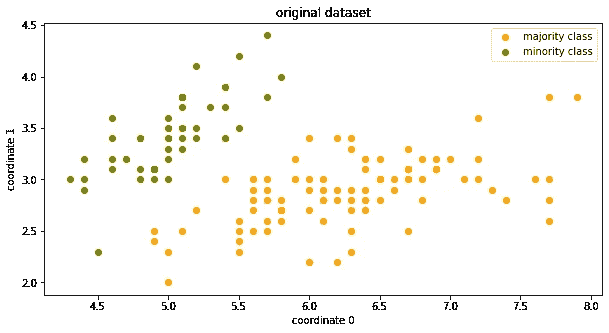
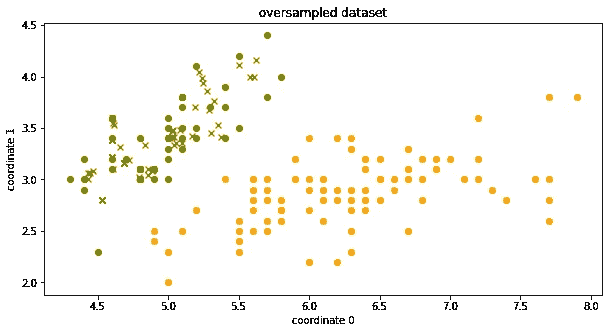
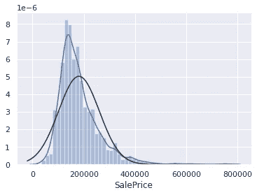

# 处理阶级不平衡的工具

> 原文：<https://towardsdatascience.com/tools-to-handle-class-imbalance-bff20c3bf099?source=collection_archive---------30----------------------->

## 数据科学

## 你的工具带上必须有工具

照片由 [Unsplash](https://unsplash.com/s/photos/balance?utm_source=unsplash&utm_medium=referral&utm_content=creditCopyText) 上的 [Aziz Acharki](https://unsplash.com/@acharki95?utm_source=unsplash&utm_medium=referral&utm_content=creditCopyText) 拍摄

C 类不平衡指的是属于每个类的观察值的数量与属于其他类的观察值的数量显著不同的情况。这是机器学习中的常见问题之一，因为大多数机器学习算法都偏向于具有更多观察值的类，而且这经常会通过消除稀有类和预测多数类来误导我们的最终目标。

有许多处理类不平衡的技术，如成本敏感学习、采样方法和 SMOTE。我们将看到一些 python 库，它们将帮助我们通过使用这些技术来解决这个问题，从而节省我们的时间并改善结果。

# Imb-learn:

不平衡学习是 scikit-learn-contrib 项目的一部分。这个软件包通过使用重采样技术的方法帮助我们处理类不平衡问题，例如

*   欠采样多数类
*   对少数民族阶层进行过度采样
*   结合过采样和欠采样技术
*   创建平衡数据集的集合

## 使用

让我们看看如何实现不平衡学习中的欠采样技术

首先，我们导入必要的库和所需的数据集，然后将它们分成训练集和测试集，对于这个例子，我们将使用 20 个新闻组数据集

现在，我们拟合一个朴素贝叶斯分类器并报告结果，正如您看到的度量宏平均 f1 分数(用于不平衡数据集)是 79%

我们修改了现有代码，添加了一个来自不平衡学习的 RandomUnderSampler，并安装了一个朴素贝叶斯分类器，您可以看到我们如何将 f1 分数从 79%提高到 85%

*RandomUnderSampler 通过随机选择替换或不替换的样本对大多数类别进行欠采样[1]。*因此，多数和少数阶级将成为平等的比例，这有助于改善指标

# SMOTE-变体:

SMOTE-Synthetic Minority over sampling Technique 的缩写，是一种广泛使用的处理类不平衡问题的重采样技术，这个包 smote-variants 实现了 SMOTE 技术的 80 多种变体，除了这些实现之外，这个框架还可以方便地启用任何数量的过采样技术来处理未知数据集上的类不平衡。

尽管不平衡学习包实现了 smote 技术，但 smote-variants 包提供了 smote 技术的其他变体来帮助实现，而且作者已经发表了一篇论文[2]，阐述了 SMOTE 技术在不平衡数据集上的所有比较和评估

## 用法:

smote-variants 包可以以各种方式用于解决类不平衡问题，我们将使用来自不平衡数据库库的不平衡数据集 iris0，该不平衡数据库具有许多不平衡数据集。

这是一个二元分类数据集，下图显示了类的散点图。从图中，我们可以注意到两个阶级之间的阶级不平衡

两类散点图

现在，我们可以使用 smote_variant 包中的 smote 技术对此数据集进行过采样

下图显示了使用 SMOTE 技术创建的新少数民族样本

带有 X 标记的样本是 SMOTE 新创建的

现在，我们可以使用这个过采样数据集来训练模型。查看[库](https://github.com/analyticalmindsltd/smote_variants)以获得更多示例。

# 回归重采样:

*难道在回归任务中也会发生职业不平衡的问题！？*

是的，当目标变量偏离特定范围时，这种情况会发生在回归任务中，即在特定范围内存在更多数量的样本，假设您正在为您所在的州构建一个预测房价的预测分析模型，但由于一些问题，您只能收集几个城市的数据。但是各个城市的房价不同，因此您当前数据集的目标变量现在与几个城市的房价有偏差，这将在您的模型中引起问题，因为您将对整个州使用您的模型。

偏斜度示例

为了避免这种情况，您可以使用此包，并使用不平衡学习包对数据集进行重新采样。

## 用法:

使用这个包相当简单明了

*   从包中导入重采样器类并初始化它。
*   使重采样器适合目标变量，这将通过宁滨目标变量来创建目标类
*   启动您喜欢的过采样技术，通过包中的*重采样*方法对数据集进行重采样(记住使用目标类而不是目标)

查看官方教程以获得更多示例[3]

# 感谢阅读:

如果你喜欢这篇文章或者有任何问题，请随时联系我

# 参考资料:

[1] [不平衡的 Github 回购-学习](https://github.com/scikit-learn-contrib/imbalanced-learn)

[2] [在大量不平衡数据集上对少数过采样技术的实证比较和评估](https://www.researchgate.net/publication/334732374_An_empirical_comparison_and_evaluation_of_minority_oversampling_techniques_on_a_large_number_of_imbalanced_datasets)

[3] [Github repo 的回归-重采样](https://github.com/atif-hassan/Regression_ReSampling/tree/master/tutorials)