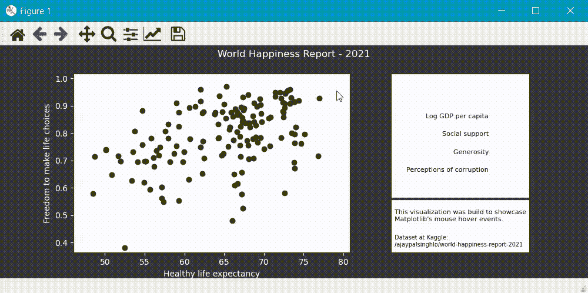
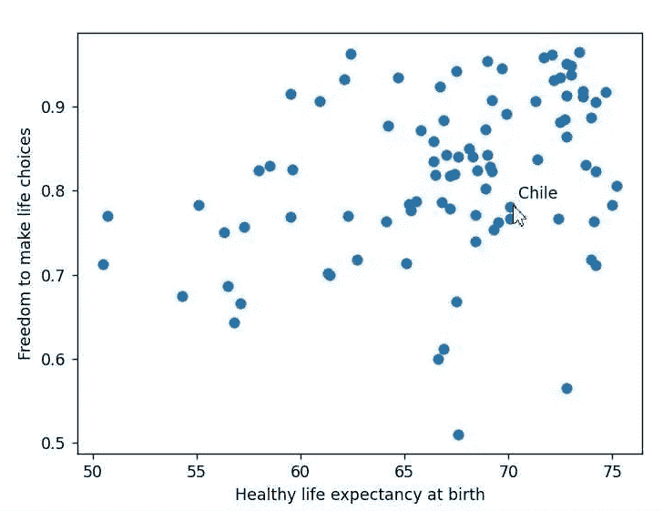
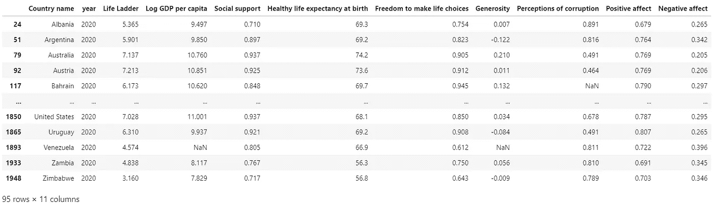
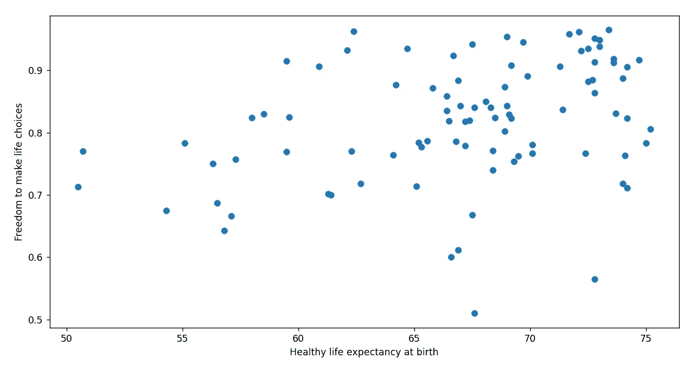
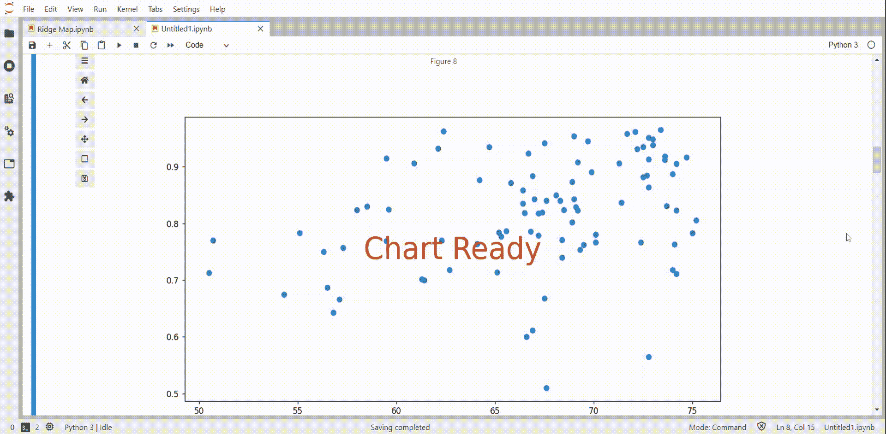
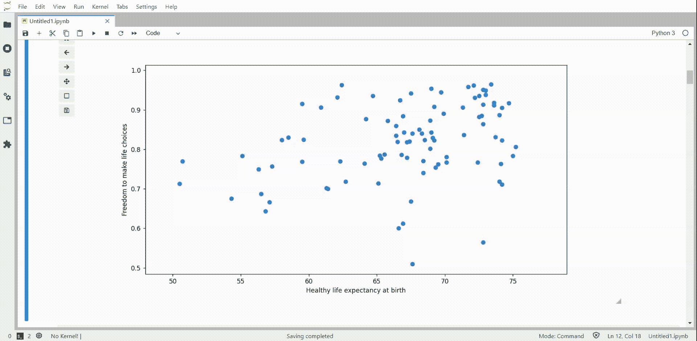
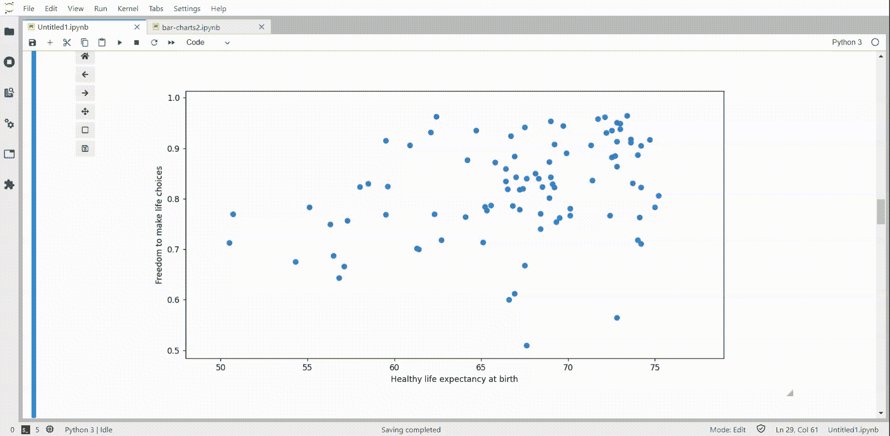
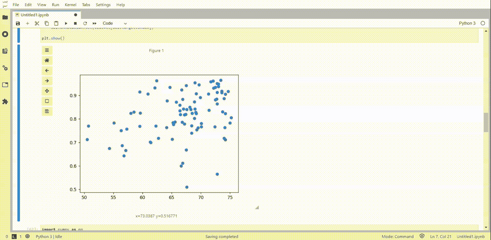
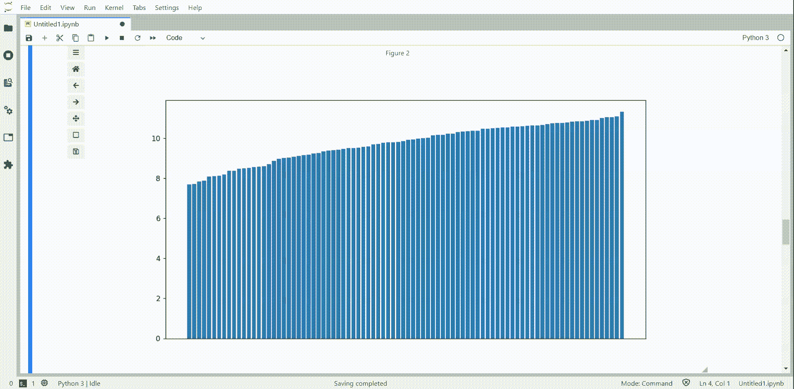

# Python 的 Matplotlib 工具提示

> 原文：<https://towardsdatascience.com/tooltips-with-pythons-matplotlib-dcd8db758846?source=collection_archive---------1----------------------->

## 如何在 Matplotlib 图表中添加工具提示



作者图片

允许用户悬停鼠标或点击我们的可视化的一部分，以获得更多的上下文是非常好的。工具提示是节省图表空间的绝佳方式。

例如，对于大多数散点图来说，标记每个点会变得很棘手。您可以对它们进行颜色编码并使用图例，但当数据太多时，即使这样也会变得混乱。



作者图片

在本文中，我们将了解如何使用事件处理程序并向 Matplotlib 图表添加工具提示。

## mpl_connect

对于下面的例子，我们将使用 Matplotlib 和 Pandas。数据来自《世界幸福报告》。你可以在他们的网站上找到一个. xls 作为“数据面板”,或者从 [Kaggle](https://www.kaggle.com/ajaypalsinghlo/world-happiness-report-2021) 获得一个. csv。

我正在使用 Jupyter Lab，所以我需要神奇的命令`%matplotlib widget`来正确地渲染图形。

根据您的 Jupyter 版本，您可能需要不同的命令，如`%matplotlib notebook`或`%matplotlib ipympl`。如果你正在运行一个脚本，你不需要任何东西。

```
import matplotlib.pyplot as plt
import pandas as pd
%matplotlib widget# [https://www.kaggle.com/ajaypalsinghlo/world-happiness-report-2021](https://www.kaggle.com/ajaypalsinghlo/world-happiness-report-2021)
df = pd.read_csv('data/world-happiness-report.csv')
df = df[df['year'] == 2020]x_name = 'Healthy life expectancy at birth'
y_name = 'Freedom to make life choices'
tooltip_name = 'Country name'x = df[x_name]
y = df[y_name]
tt = df[tooltip_name].valuesdf
```



作者图片

让我们从一个简单的散点图开始，并以此为基础进行构建。

```
fig, ax = plt.subplots(1, figsize=(12,6))ax.scatter(x, y)plt.xlabel(x_name)
plt.ylabel(y_name)plt.show()
```



简单散点图—图片由作者提供

现在，我们将创建一个函数，当鼠标悬停在可视化效果上时，将调用该函数。

简单地说，我们将添加一个文本“图表就绪”,我们的函数在被调用时会将该文本变为空白。

```
fig, ax = plt.subplots(1, figsize=(12,6))ax.scatter(x,y)
plt.xlabel(x_name)
plt.ylabel(y_name)**annot_x = (plt.xlim()[1] + plt.xlim()[0])/2
annot_y = (plt.ylim()[1] + plt.ylim()[0])/2
txt = ax.text(annot_x, annot_y, "Chart Ready", 
              ha='center', fontsize=36, color='#DD4012')****def hover(event):
    txt.set_text("")****fig.canvas.mpl_connect("motion_notify_event", hover)**plt.show()
```



检测光标移动-作者提供的图像

我们使用 Matplotlib 的 **"motion_notify_event"** 来检测鼠标移动，但是还有很多其他的事件可以尝试。

> button_press_event，button_release_event，draw_event，key_press_event，key_release_event，pick_event，resize_event，scroll_event，figure_enter_event，figure_leave_event，axes_enter_event，axes_leave_event，close_event。

## 光标 XY 坐标

我们的想法是用我们将使用的所有元素来绘制图表，然后使用事件来修改这些元素。

因此，即使某些元素只在特定事件被触发时显示，我们仍然应该在函数之外定义它。

我们在悬停函数中从 mpl_connect 接收到的事件具有一些有价值的属性；让我们试着得到鼠标的 XY 坐标。

```
plt.close('all')
fig, ax = plt.subplots(1, figsize=(12,6))ax.scatter(x,y)
plt.xlabel(x_name)
plt.ylabel(y_name)**lnx = plt.plot([60,60], [0,1.5], color='black', linewidth=0.3)
lny = plt.plot([0,100], [1.5,1.5], color='black', linewidth=0.3)
lnx[0].set_linestyle('None')
lny[0].set_linestyle('None')****plt.xlim(x.min()*0.95, x.max()*1.05)
plt.ylim(y.min()*0.95, y.max()*1.05)****def hover(event):
    lnx[0].set_data([event.xdata, event.xdata], [0, 1.5])
    lnx[0].set_linestyle('--')
    lny[0].set_data([0,100], [event.ydata, event.ydata])
    lny[0].set_linestyle('--')**

fig.canvas.mpl_connect("motion_notify_event", hover)plt.show()
```



用鼠标位置画线-作者图片

我们添加了线条，将它们的样式设置为 none，当检测到光标移动时，我们更改该线条的数据和样式来显示它。

## 工具提示

太好了！我们知道如何在绘图中添加和修改元素，以及如何检测光标的移动。

我们将创建一个空白注释，并检查鼠标位置是否在其中一个绘制点上。在这种情况下，我们会相应地更改注释的文本、位置和可见性。

```
plt.close('all')
fig, ax = plt.subplots(1, figsize=(12,6))# plot and labels
sc = ax.scatter(x,y)
plt.xlabel(x_name)
plt.ylabel(y_name)# cursor grid lines
lnx = plt.plot([60,60], [0,1.5], color='black', linewidth=0.3)
lny = plt.plot([0,100], [1.5,1.5], color='black', linewidth=0.3)
lnx[0].set_linestyle('None')
lny[0].set_linestyle('None')**# annotation
annot = ax.annotate("", xy=(0,0), xytext=(5,5),textcoords="offset points")
annot.set_visible(False)**# xy limits
plt.xlim(x.min()*0.95, x.max()*1.05)
plt.ylim(y.min()*0.95, y.max()*1.05)def hover(event):
 **# check if event was in the axis
    if event.inaxes == ax:**
        # draw lines and make sure they're visible
        lnx[0].set_data([event.xdata, event.xdata], [0, 1.5])
        lnx[0].set_linestyle('--')
        lny[0].set_data([0,100], [event.ydata, event.ydata])
        lny[0].set_linestyle('--')
 **lnx[0].set_visible(True)
        lny[0].set_visible(True)

        # get the points contained in the event
        cont, ind = sc.contains(event)
        if cont:
            # change annotation position
            annot.xy = (event.xdata, event.ydata)
            # write the name of every point contained in the event
            annot.set_text("{}".format(', '.join([tt[n] for n in ind["ind"]])))
            annot.set_visible(True)    
        else:
            annot.set_visible(False)
    else:
        lnx[0].set_visible(False)
        lny[0].set_visible(False)**fig.canvas.mpl_connect("motion_notify_event", hover)plt.show()
```



工具提示！—作者图片

在那里！

我们的图表上有一个工具提示，但它并不容易构建。我们正在绘制一个散点图，它使用方便的方法`.contains()`返回一个 PathCollection 对象。

Matplotlib 为不同的可视化返回不同的对象**。bar** 将返回 BarContainer，**。plot** 将返回 Line2D 列表，依此类推。

这意味着我们必须开发不同的解决方案来为每个可视化添加工具提示。

自由发展你的图表在每个事件中的表现是非常好的。但是取决于你的视觉化有多复杂，这可能会考验你的耐心。

幸运的是，在 Matplotlib 中添加工具提示还有其他解决方案。

## mpl 光标

这个便捷的包通过一些简单易用的方法来简化 Matplotlib 中的鼠标事件。

他们还有许多易于定制的例子。所以与其去挖掘 Matplotlib 的文档，去揣摩你的方式。您可以替换示例中的几行，并立即获得工具提示。

```
import matplotlib.pyplot as plt
import mplcursors
%matplotlib widgetfig, ax = plt.subplots()
sc = ax.scatter(x,y)# by default the tooltip is displayed "onclick"
# we can change it by setting hover to True
cursor = mplcursors.cursor(sc, hover=True)# by default the annotation displays the xy positions
# this is to change it to the countries name
[@cursor](http://twitter.com/cursor).connect("add")
def on_add(sel):
    sel.annotation.set(text=tt[sel.target.index])plt.show()
```



更简单的工具提示—按作者排序的图像

```
df = df.sort_values('Log GDP per capita')
df = df[df['Log GDP per capita'].notna()]fig, ax = plt.subplots(figsize=(12,6))
ax.bar(df['Country name'], df['Log GDP per capita'], align="center")
plt.xticks([])cursor = mplcursors.cursor(hover=mplcursors.HoverMode.Transient)
[@cursor](http://twitter.com/cursor).connect("add")
def on_add(sel):
    sel.annotation.set(text=df.iloc[sel.target.index]['Country name'])plt.show()
```



条形图中的工具提示—按作者分类的图像

## **结论**

总的来说，向 Matplotlib 图表添加工具提示会很快变得复杂，即使使用 Mplcursors，也没有想象中那么简单。


[代号](https://github.com/Thiagobc23/Matplotlib-tooltips-example) —图片作者

我的看法是，我们可以使用 Mplcursors 为您的可视化添加一些额外的功能，而不必做太多的努力。如果您愿意付出更多的努力，您可以用 Matplotlib 的所有可用事件构建最复杂的可视化。

Python 还有其他选项，比如用于设计交互式数据可视化的 Plotly 或者 MplD3，它通过将 Matplotlib 图表转换成 D3.js，为 Matplotlib 图表增加了一些额外的功能

感谢阅读！

所有图像都是我自己的。请随意使用它们。

**参考资料:**
[https://matplot lib . org/stability/users/event _ handling . html](https://matplotlib.org/stable/users/event_handling.html)；
[https://matplotlib . org/stability/API/后端 _ bases _ API . html](https://matplotlib.org/stable/api/backend_bases_api.html#matplotlib.backend_bases.MouseEvent)；
[https://matplotlib . org/stability/API/_ as _ gen/matplotlib . lines . line 2d . html](https://matplotlib.org/stable/api/_as_gen/matplotlib.lines.Line2D.html)；
[https://matplotlib . org/stability/API/_ as _ gen/matplotlib . pyplot . bar . html](https://matplotlib.org/stable/api/_as_gen/matplotlib.pyplot.bar.html)；
[https://mplcursors . readthedocs . io/en/stable/](https://mplcursors.readthedocs.io/en/stable/)；