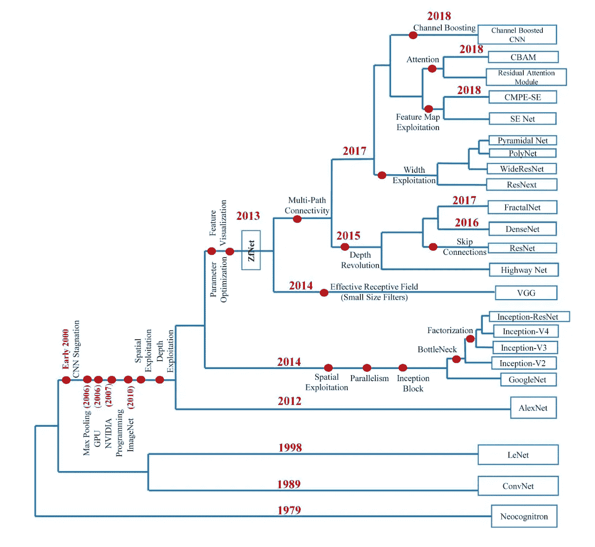
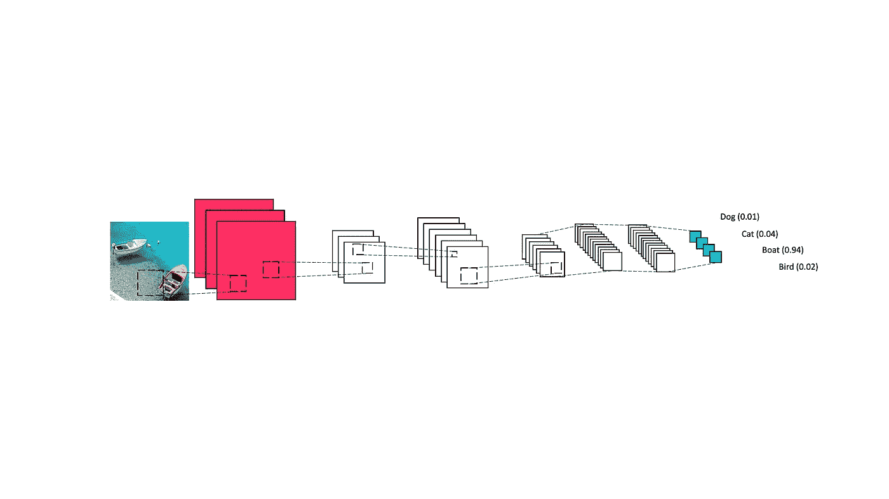
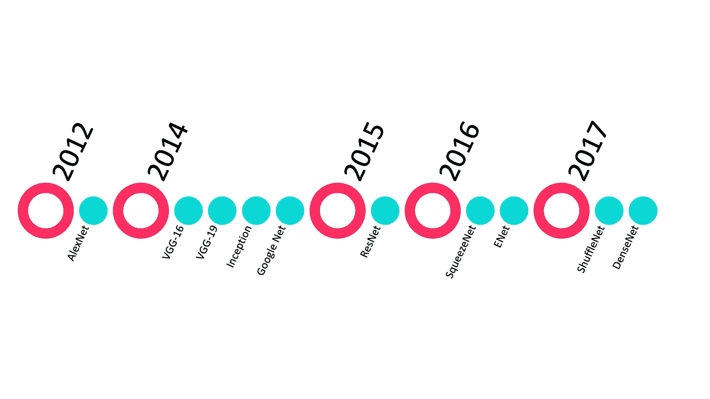
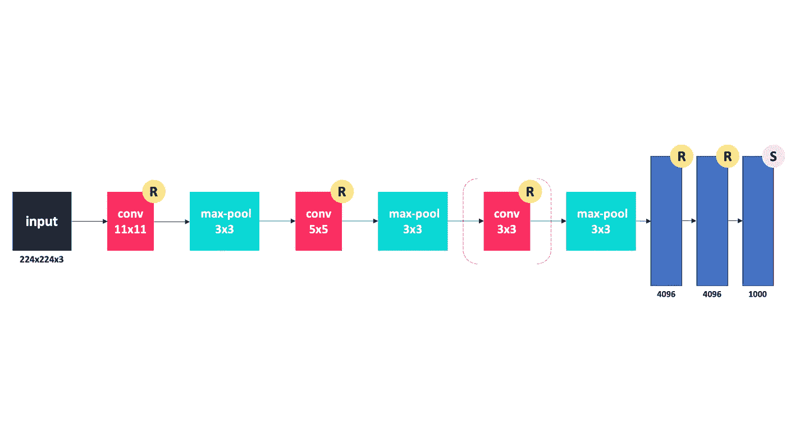
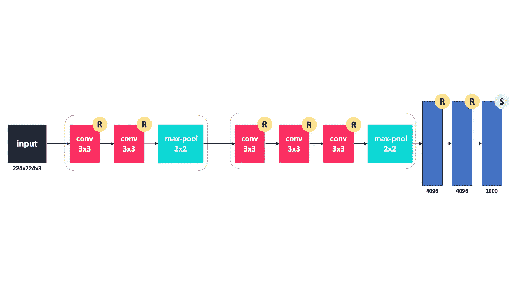

# 每个机器学习工程师都应该知道的 10 大 CNN 架构

> 原文：<https://towardsdatascience.com/top-10-cnn-architectures-every-machine-learning-engineer-should-know-68e2b0e07201?source=collection_archive---------4----------------------->

## 数据科学

## 2012 年至今

深度 CNN 的进化史(图片由作者提供)

卷积神经网络(CNN 或 ConvNet)是一种特定的深度学习架构。目前，有许多技术公司开发了积极的研究小组来探索 CNN 的新架构，如谷歌、微软和脸书，他们证明了 CNN 是理解和分析图像内容的最佳学习算法之一，在图像分割、分类、检测和检索相关任务中表现出高性能。

# *CNN*是什么？

CNN 是为图像识别任务设计的，最初应用于手写数字识别的挑战。CNN 的基本设计目标是创建一个网络，其中网络早期层的神经元将提取局部视觉特征，后期层的神经元将组合这些特征以形成更高阶的特征。

作者图片

几乎每个 CNN 都有三种主要类型的层，分别是卷积层、汇集层和全连接层。

# 十大 CNN 架构

多年来，已经开发了许多 CNN 架构的变体来解决现实世界的问题。LeNet 是 CNN 的第一个成功应用，由 Yann Lecun 在 20 世纪 90 年代开发，用于读取邮政编码、数字等。最新的工作被称为 LeNet-5，它是一个 5 层 CNN，在孤立字符识别上达到 99.2 %的准确率。

十大 CNN 架构(作者举例)

在本文中，我们将讨论每个机器学习工程师都应该知道的 10 大 CNN 架构，这些架构推动了全球深度学习领域的发展。

## AlexNet

2012 年，Alex Krizhevsky、Ilya Sutskever 和 Geoff Hinton 以 84.6%的测试准确率赢得了 ImageNet 大规模视觉识别挑战赛。该模型的表现明显优于第二名(前五名的误差为 16%，而第二名的误差为 26%)。Krizhevsky 使用 GPU 来训练 AlexNet，这使得 CNN 模型的训练速度更快，并开始了一波基于 CNN 的兴趣和新作品。

AlexNet 网络架构(由作者说明)

该网络由 5 个卷积层和 3 个全连接层组成。

## VGG-16

该模型在 ImageNet 中达到了 92.7%的 top-5 测试准确率，ImageNet 是一个包含属于 1000 个类的超过 1400 万个图像的数据集。这是由 2014⁴.牛津大学视觉几何小组实验室的卡伦·西蒙扬和安德鲁·齐塞曼提出的

VGG-16 网络架构(由作者说明)

VGG16 中的 16 是指它总共有 16 层有权重。

## VGG-19

VGG-19 是一个 19 层深的卷积神经网络，可以将图像分类为 1000 种对象类别，如键盘、鼠标和许多动物。该模型对 Imagenet 数据库中的 100 多万张图像进行了训练，准确率达到 92%。

## 盗梦空间和谷歌网

谷歌网络(或盗梦空间 v1)有 22 层 deep⁴.该模型以 93.3%的准确率赢得了 2014 年 ImageNet 竞赛的分类和检测任务。

## 雷斯内特

网络是由微软创建和熟悉的。该模型以 96.4%的准确率赢得了 2016 年 ImageNet 竞赛。由于其深度(达到 152 层)和残余块的引入，它是众所周知的。

## 挤压网

它由 18 个深层组成，可以将图像分为 1000 个对象类别，如键盘、鼠标、铅笔和许多动物。对于与 AlexNet 相同的精度，SqueezeNet 可以快 3 倍，小 500 倍。

## DenseNet

“DenseNet”这个名字指的是黄高、刘庄和他们的团队在 2017 年 CVPR 大会上开发的密集连接卷积 Networks⁷。它获得了最佳论文奖，并被引用了 2000 多次。传统的具有 n 层的卷积网络具有 n 个连接，但是由于前馈方式，DensetNet 总共具有 n(n+1)/2 个连接。

## Shuffile 网

这是一种极其高效的 CNN 架构，拥有 173 个深层，专为计算能力为 10–150 mflops⁶.的移动设备而设计在图像网络分类上，它设法获得比移动网络系统更低的 top-1 误差(绝对 7.8%)。

## ENet

有效的神经 Network⁸提供了实时执行逐像素语义分割的能力。ENet 的速度提高了 18 倍，所需的触发器数量减少了 75 倍，参数数量减少了 79 倍，精度与现有模型相当或更高。Enet 是语义分割中最快的模型。

# 结论

我们可以看到，随着时间的推移，在大多数情况下，精确度一直在逐渐提高。

# 参考

[1] Fukushima，K. Neocognitron:不受位置变化影响的模式识别机制的自组织神经网络模型。*生物。控制论* 36，193–202(1980)。https://doi.org/10.1007/BF00344251

[2] Y. LeCun、L. Bottou、Y. Bengio 和 P. Haffner。基于梯度的学习在文档识别中的应用。IEEE 会议录，1998。

[3]克里热夫斯基，亚历克斯&苏茨基弗，伊利亚&辛顿，杰弗里。(2012).基于深度卷积神经网络的图像网分类。神经信息处理系统。25.10.1145/3065386.

[4] C. Szegedy 等人，“用卷积走得更深”，2015 年 IEEE 计算机视觉和模式识别会议(CVPR)，波士顿，马萨诸塞州，2015 年，第 1–9 页，doi:10.1109/cvpr . 20015 . 486868666106

[5]西蒙扬，卡伦&齐塞尔曼，安德鲁。(2014).用于大规模图像识别的非常深的卷积网络。arXiv 1409.1556。

[6] X. Zhang，X. Zhou，M. Lin 和 J. Sun，“ShuffleNet:一种用于移动设备的极其高效的卷积神经网络”，2018 年 IEEE/CVF 计算机视觉和模式识别会议，犹他州盐湖城，2018 年，第 6848–6856 页，doi: 10.1109/CVPR.2018.00716

[7] G. Huang，Z. Liu，L. Van Der Maaten 和 K. Q. Weinberger，“密集连接的卷积网络”，2017 年 IEEE 计算机视觉和模式识别会议(CVPR)，檀香山，HI，2017，第 2261–2269 页，doi: 10.1109/CVPR.2017.243

[8]帕兹克、亚当&乔拉西亚、阿布舍克&金、桑皮尔&库尔切洛、尤金尼奥。(2016).ENet:一种用于实时语义分割的深度神经网络架构。