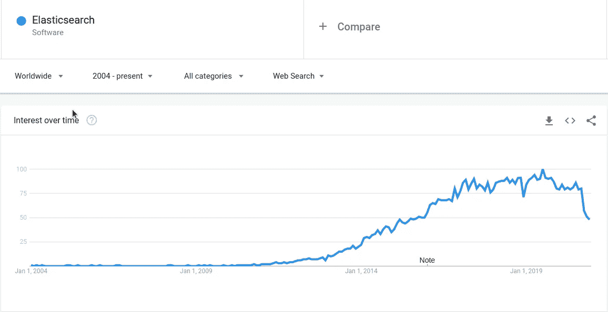
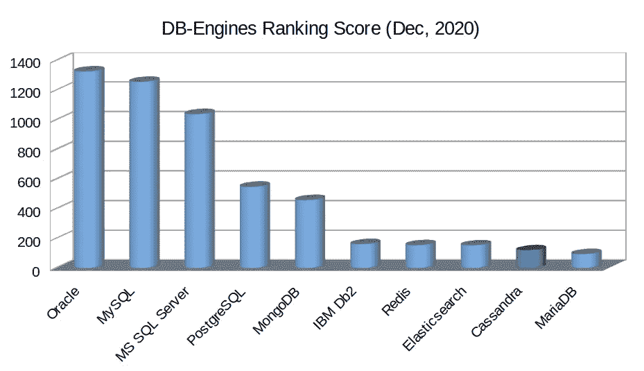
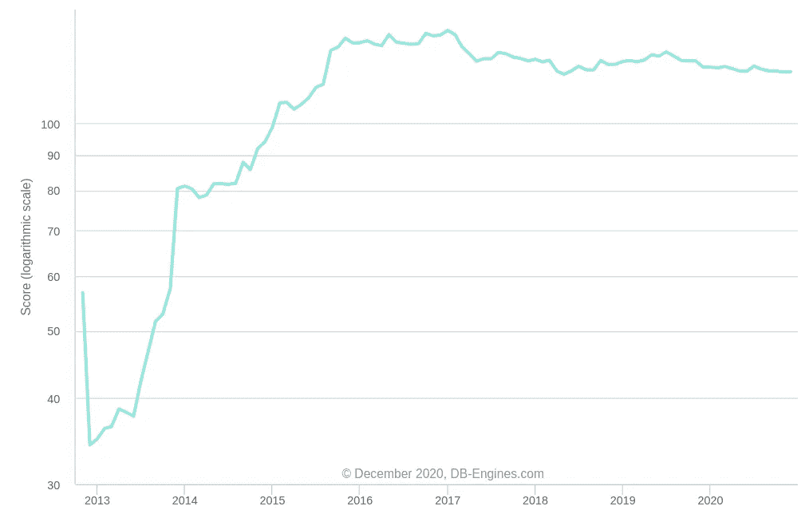

# 2021 年将使用的 10 大数据库

> 原文：<https://towardsdatascience.com/top-10-databases-to-use-in-2021-d7e6a85402ba?source=collection_archive---------0----------------------->

## MySQL，Oracle，PostgreSQL，微软 SQL Server，MongoDB，Redis，Elasticsearch，Cassandra，MariaDB，IBM Db2

图片来自 [Pixabay](https://pixabay.com/?utm_source=link-attribution&utm_medium=referral&utm_campaign=image&utm_content=1954920) 的[图米苏](https://pixabay.com/users/tumisu-148124/?utm_source=link-attribution&utm_medium=referral&utm_campaign=image&utm_content=1954920)

数据库是任何软件应用程序的基石。您将需要一个或多个数据库来开发几乎所有类型的软件应用程序:Web、企业、嵌入式系统、实时系统、AI、ML、HPC、区块链、物联网和许多其他应用程序。

> 二十年前，选择数据库要容易得多。在大多数情况下，您可以选择一个关系数据库系统，这样就完成了。但是在现代软件开发中，选择正确的数据库是最具挑战性的任务之一。

随着微服务、云、分布式应用、全球扩展、半结构化数据、大数据、快速数据、低延迟数据的兴起:传统的 **SQL** 数据库现在加入了各种[**【NoSQL】**](https://en.wikipedia.org/wiki/NoSQL)**。** [**NewSQL、**](https://en.wikipedia.org/wiki/NewSQL) 和 **Cloud** 数据库。

目前有多达 343 个 T21 数据库。在这里，我将根据以下标准从这些数据库中筛选出 10 个数据库:

*   关键特征
*   流行
*   趋势
*   主流用途
*   美好未来

我将针对每个数据库讨论以下内容:

*   概述，包括简史。
*   5 个关键特征。
*   何时使用它们。
*   何时不使用它们。
*   人气。
*   趋势。
*   数据库即服务(DBaaS)。
*   替代品。

# 1.关系型数据库

1995 年，两位软件工程师 [**迈克尔·维德纽斯**](https://en.wikipedia.org/wiki/Michael_Widenius) 和 [**大卫·阿克马克**](https://en.wikipedia.org/wiki/David_Axmark) **，**创造了开源关系数据库管理系统 [**MySQL**](https://www.mysql.com/) 。自诞生以来，MySQL 以其企业级的特性和免费、灵活( **GPL** )的社区许可，以及升级的商业许可，迅速在业界和社区中流行起来。在开源数据库中，PostgreSQL 侧重于创新和高级功能，而 MySQL 则侧重于健壮性、稳定性和成熟度。

今天，MySQL 是最流行和最广泛使用的 SQL 数据库之一。它也是 Web 应用程序中使用最多的数据库之一。一些世界上最大的网络规模的应用程序(如脸书，优步)使用 MySQL。

## 5 个关键特征

*   具有两种许可模式的开源 RDBMS:免费社区服务器和专有企业服务器。
*   提供 ACID 事务保证(使用 InnoDB 引擎)。就 CAP 而言，它提供了即时的一致性。
*   通过其**无共享 MySQL 集群**提供水平分区(分片)。因此，它提供了高可用性和高吞吐量，同时具有低延迟和接近线性的扩展能力。
*   通过 MySQL 集群，它提供了多主 ACID 事务。
*   多模型数据库，支持结构化数据(SQL)和半结构化数据(JSON)。

## 何时使用 MySQL

*   具有 ACID 事务保证的结构化数据(SQL)。
*   水平可伸缩性是一项关键要求，尤其是在写入大量数据时。
*   多主 ACID 事务是一个基本要求。
*   数据安全性是一个关键特性。
*   需要一个融合数据库，即一个数据库同时用于 OLTP 和 OLAP 工作负载。

## **何时不用 MySQL**

*   当需要在一个全球分布式数据库中处理数百万个事务时，就需要使用分布式 SQL 。
*   数据是非常相关的(例如，社交媒体)，即，像图表一样的数据。
*   数据是半结构化的，即具有高级查询功能的 JSON 数据。
*   高级数据保护(例如屏蔽、混淆、节流)是必须的。

## MySQL 即服务

*   [MySQL 数据库服务](https://www.oracle.com/mysql/)(多云、OLTP 和 OLAP)
*   [缩放网格](https://scalegrid.io/mysql.html)(水平缩放)
*   [Vitess](https://vitess.io/) (水平缩放)
*   [Aiven for MySQL](https://aiven.io/mysql) (多云)
*   [亚马逊 MySQL RDS](https://aws.amazon.com/rds/mysql/)
*   [Oracle MySQL 云服务](https://cloud.oracle.com/mysql)(横向扩展)
*   [Azure MySQL 数据库](https://azure.microsoft.com/en-us/services/mysql/)
*   [用于 MySQL 的谷歌云 SQL](https://cloud.google.com/sql/docs/mysql)

## 可供选择的事物

*   [甲骨文](https://www.oracle.com/database/)
*   [PostgreSQL](https://www.postgresql.org/)
*   [微软 SQL Server](https://www.microsoft.com/en-us/sql-server/sql-server-2019)
*   [马里亚布](https://mariadb.org/)
*   [IBM Db2](https://www.ibm.com/analytics/db2)
*   [亚马逊极光](https://aws.amazon.com/rds/aurora)
*   [谷歌云扳手](https://cloud.google.com/spanner)

## 人气:

MySQL 社区版是业内使用最广泛的免费数据库。此外，其商业版本在行业中广泛使用。

最著名的数据库排名网站 DB-Engines 将 MySQL 列为排名第二的数据库，仅次于 Oracle:

作者图片(数据: [DB-Engines](https://db-engines.com/en/ranking) )

《2020 年栈溢出开发者调查》将 MySQL 列为 2020 年最受欢迎的数据库:

来源:[堆栈溢出开发者调查，2020 年](https://insights.stackoverflow.com/survey/2020#technology-databases-all-respondents4)

## 趋势

有着 25 年历史的 MySQL 并不是目前最时髦的数据库。但与其他较老的数据库不同，它仍然保持着很高的吸引力，如下所示:

来源: [DB-Engines](https://db-engines.com/en/ranking_trend)

此外，谷歌趋势在过去几年中显示了一个相对稳定的图表:

来源:[谷歌趋势](https://trends.google.com/trends)

# 2.神谕

当 [**Edgar F. Codd**](https://en.wikipedia.org/wiki/Edgar_F._Codd) 发表了他的革命性论文“ [**一种用于大型共享数据银行的数据的关系模型**](https://web.archive.org/web/20070612235326/http://www.acm.org/classics/nov95/)”(1970)关于关系数据库管理系统(RDBMS)时，它彻底改变了数据库系统的面貌。这篇论文特别启发了一位年轻的软件工程师拉里·埃里森(现任甲骨文公司首席技术官)。他后来在 1979 年创造了世界上第一个商用 RDBMS 系统 [**甲骨文**](https://www.oracle.com/database/) 。从那时起，Oracle 一直是领先的商业 RDMBS 系统，并主导了 Unix 和 Linux 系统。在过去的 41 年里，Oracle 与时俱进，为 RDBMS 和整个数据库系统的创新做出了贡献。

目前，Oracle 是最受商业支持的数据库，也是广泛使用的 RDBMS 之一。它的最新版本( [**21.c**](https://blogs.oracle.com/database/introducing-oracle-database-21c) )增加了许多创新功能，这将使它在未来几年成为一个有吸引力的选择。

## 5 个关键特征

*   专有 RDBMS。
*   提供 ACID 交易保证。就 CAP 而言，它提供了作为单个服务器的即时一致性。
*   支持结构化数据(SQL)、半结构化数据(JSON、XML)、空间数据和 RDF 存储的高级多模型数据库。根据具体的数据模型提供多种访问模式
*   提供区块链表。
*   支持 OLTP 和 OLAP 工作负载。

## 何时使用 Oracle

*   如果公司想要一个聚合数据库或主数据库(一个数据库用于 OLTP 和 OLAP)。
*   具有结构化(SQL)数据的传统事务性工作负载，以及 ACID 事务保证是关键标准的情况。
*   需要区块链表。
*   用于数据仓库。
*   包括地理空间数据类型的多模型数据库是一项基本要求。

## **何时不使用甲骨文**

*   如果一个公司想在数据库上省钱。
*   多主 ACID 事务是一个必须具备的特性。
*   数据是半结构化的，即带有高级查询功能的 JSON 数据。
*   数据是非常相关的(例如，社交媒体)，即，像图表一样的数据。

## Oracle 即服务

*   [甲骨文融合数据库](https://www.oracle.com/cloud/solutions/converged-database/)
*   [面向甲骨文的亚马逊 RDS](https://aws.amazon.com/rds/oracle/)

## 可供选择的事物

*   [MySQL](https://www.mysql.com/)
*   [PostgreSQL](https://www.postgresql.org/)
*   [微软 SQL Server](https://www.microsoft.com/en-us/sql-server/sql-server-2019)
*   [马里亚布](https://mariadb.org/)
*   [IBM Db2](https://www.ibm.com/analytics/db2)
*   [亚马逊极光](https://aws.amazon.com/rds/aurora)
*   [谷歌云扳手](https://cloud.google.com/spanner)

## 流行

四十年来，Oracle 一直为其客户提供稳定、成熟的企业级数据库。尽管它面临着来自开源 SQL 数据库和 NoSQL 数据库的激烈竞争，但它仍然是 DB-Engines 排名中最受欢迎的数据库系统:

作者图片(数据: [DB-Engines](https://db-engines.com/en/ranking) )

然而，在 Stack Overflow 开发者调查中，它被排在第 8 位，因为该列表被开源数据库所主导:

来源:[堆栈溢出开发者调查，2020 年](https://insights.stackoverflow.com/survey/2020#technology-databases-all-respondents4)

## 趋势

甲骨文公司的最新版本可能会大赚一笔。因此，在过去几年里，它获得了很大的吸引力。考虑到市场正在转向开源数据库，这是一个壮举:

来源: [DB 引擎](https://db-engines.com/en/ranking_trend)

此外，Google trends 为 Oracle 显示了一条奇怪的平坦曲线，这对于商业数据库来说是罕见的:

来源:[谷歌趋势](https://trends.google.com/trends)

# 3.一种数据库系统

自 20 世纪 70 年代初以来， [**加州大学伯克利分校**](https://www.berkeley.edu/) 一直致力于通过其开创性的数据库项目 [**Ingres**](https://en.wikipedia.org/wiki/Ingres_(database)) 塑造现代数据库管理系统。1986 年，传奇人物 [**迈克尔·斯通布雷克**](https://en.wikipedia.org/wiki/Michael_Stonebraker) 领导 POSTGRES(后 Ingres)项目解决现有数据库项目的问题。 [**PostgreSQL**](https://www.postgresql.org/) 诞生于 POSTGRES 项目的一部分，是一个关系数据库管理系统。在过去的 30 年里，PostgreSQL 引领着现代数据库的发展，贡献了许多创新，迈克尔·斯通布雷克在 2014 年获得了图灵奖，主要是因为他在 PostgreSQL 方面的工作。

如今，PostgreSQL 是使用最多的数据库之一。它也是最先进的开源关系数据库。

## 5 个关键特征

*   开放源码 RDMBS，带有非常许可的 PostgreSQL 许可证。PostgreSQL 有许多扩展，具有各种高级特性。
*   提供 ACID 交易保证。就 CAP 而言，它提供了作为单个服务器的即时一致性。
*   作为 PostgreSQL 的扩展，Citus Data 提供了人们梦寐以求的**分布式 SQL** 特性，即具有 SQL 数据库的事务保证和 NoSQL 数据库的水平伸缩的数据库。
*   它提供了更高级的索引，如部分索引，布隆过滤器。此外，在 PostgreSQL 中创建索引是非阻塞的。
*   它是一个功能丰富的多模型数据库，支持结构化数据(SQL)、半结构化数据(JSON、XML)、键值、空间数据。

## 何时使用 PostgreSQL

*   数据是结构化的(SQL)，ACID 事务保证是具有严格数据完整性的关键标准。
*   当需要“**分布式 SQL** ”时，数百万个事务应该在一个全球分布式数据库中处理。
*   需要一个复杂的查询规划。
*   需要高级可靠性和灾难恢复，例如 PITR、主动备用。
*   包括地理空间数据类型的多模型数据库是预期的。

## **何时不使用 PostgreSQL**

*   多主 ACID 事务是一个必须具备的特性。
*   数据是半结构化的，即带有高级查询计划器的 JSON 数据。
*   需要融合数据库(OLTP 和 OLAP)。
*   数据是非常相关的(例如，社交媒体)，即，像图表一样的数据。

## PostgreSQL 即服务

*   【PostgreSQL 的 EDB(水平缩放)
*   [CitusData](https://www.citusdata.com/) (分布式 SQL)
*   [ScaleGrid](https://scalegrid.io/postgresql.html) (水平缩放)
*   [Aiven for PostgreSQL](https://aiven.io/postgresql) (多云)
*   [亚马逊 RDS for PostgreSQL](https://aws.amazon.com/rds/postgresql/)
*   [Azure PostgreSQL 数据库](https://azure.microsoft.com/en-us/services/postgresql/)
*   [Google Cloud SQL for PostgreSQL](https://cloud.google.com/sql/docs/postgres)

## 可供选择的事物

*   [MySQL](https://www.mysql.com/)
*   [甲骨文](https://www.oracle.com/database/)
*   [微软 SQL 服务器](https://www.microsoft.com/en-us/sql-server/sql-server-2019)
*   马里亚布
*   [IBM Db2](https://www.ibm.com/analytics/db2)
*   [亚马逊极光](https://aws.amazon.com/rds/aurora)
*   [谷歌云扳手](https://cloud.google.com/spanner)

## 流行

PostgreSQL 是最古老的开源免费数据库之一。它拥有巨大的社区支持，在社区和行业中都有使用。

根据数据库引擎，它是最受欢迎的数据库之一:

作者图片(数据: [DB-Engines](https://db-engines.com/en/ranking) )

根据 Stack Overflow 开发者调查，它是 2020 年第二受欢迎的数据库:

来源:[堆栈溢出开发者调查，2020 年](https://insights.stackoverflow.com/survey/2020#technology-databases-all-respondents4)

## 趋势

由于其先进的特性和创新，PostgreSQL 在推出 30 年后仍受到广泛关注，如下所示:

来源: [DB 引擎](https://db-engines.com/en/ranking_trend)

Google Trends 还显示，近年来 PostgreSQL 的吸引力有所增加，这证明了人们对 PostgreSQL 的兴趣越来越大:

来源:[谷歌趋势](https://trends.google.com/trends)

# 4.Microsoft SQL Server

1988 年， [**微软**](https://en.wikipedia.org/wiki/Microsoft) 联合 [**阿什顿-泰特**](https://en.wikipedia.org/wiki/Ashton-Tate) 和[**Sybase**](https://en.wikipedia.org/wiki/Sybase)**创建了一个 RDBMS 作为[**Sybase SQL Server**](https://en.wikipedia.org/wiki/Sybase_SQL_Server)**的变种。1989 年，他们发布了第一版 [**微软 SQL Server**](https://www.microsoft.com/en-us/sql-server/sql-server-2019) 。尽管不像其他产品那样具有创新性或先进性，但 Microsoft SQL Server 多年来经历了重大的更新和改进。最初是为 IBM<https://en.wikipedia.org/wiki/IBM>****[**OS/2、**](https://en.wikipedia.org/wiki/OS/2) 发布的，很快就为 Windows 系统发布了。在过去的三十年里，它是 Windows 系统中占主导地位的商业中型数据库。********

****目前，它是领先的商业数据库系统之一，拥有微软优秀的工具支持。****

## ****5 个关键特征****

*   ****拥有不同许可的专有 RDBMS:开发人员和快速(免费)、标准和企业(商业)。****
*   ****提供 ACID 交易保证。就 CAP 而言，它提供了作为单个服务器的即时一致性。****
*   ****通过 T-SQL 支持服务器端脚本。NET 语言、R、Python 和 Java。****
*   ****它是一个多模型数据库，支持结构化数据(SQL)、半结构化数据(JSON)、空间数据。****
*   ****出色的内部和云工具支持。此外，Azure 还提供了将内部 SQL Server 轻松迁移到云的工具。****

## ****何时使用 SQL Server****

*   ****数据是结构化的(SQL ),具有 ACID 事务保证。****
*   ****开发平台与其他微软产品紧密结合。****
*   ****Azure Cloud 是首选的公共云技术，更倾向于托管 SQL 数据库。****
*   ****一家公司已经有了 MS-SQL 数据库，并希望将它们迁移到云中。****

## ******何时不使用 SQL Server******

*   ****不适合数据库预算较低的公司。****
*   ****多主 ACID 事务是一个必须具备的特性。****
*   ****数据是半结构化的，即 JSON 数据，需要高级的查询操作。****
*   ****分布式 SQL 数据库是可取的。****
*   ****需要一个融合数据库。****

## ****SQL Server 即服务****

*   ****[Azure SQL](https://docs.microsoft.com/en-us/azure/azure-sql/) (水平缩放)****
*   ****[亚马逊 SQL Server RDS](https://aws.amazon.com/rds/sqlserver/)****
*   ****[谷歌云上的 SQL 服务器](https://cloud.google.com/sql-server)****

## ****可供选择的事物****

*   ****[MySQL](https://www.mysql.com/)****
*   ****[甲骨文](https://www.oracle.com/database/)****
*   ****[PostgreSQL](https://www.postgresql.org/)****
*   ****[马里亚布](https://mariadb.org/)****
*   ****[IBM Db2](https://www.ibm.com/analytics/db2)****
*   ****[亚马逊极光](https://aws.amazon.com/rds/aurora)****
*   ****[谷歌云扳手](https://cloud.google.com/spanner)****

## ****人气:****

****MS SQL 是 Windows 平台中最流行的商业数据库，也是 Azure Cloud 中首选的 SQL 数据库。由于这些事实，根据 DB-Engines 排名，它仍然是第三大最受欢迎的数据库:****

********

****作者图片(数据: [DB-Engines](https://db-engines.com/en/ranking) )****

****它也是栈溢出开发者调查中第三受欢迎的数据库:****

********

****来源:[堆栈溢出开发者调查，2020 年](https://insights.stackoverflow.com/survey/2020#technology-databases-all-respondents4)****

## ****趋势****

****MS SQL 是这个列表中最老的数据库之一。尽管它是一个可靠而稳定的数据库，但它不是最具创新性或最先进的数据库，并且有下降趋势，如 DB-Engines 趋势所示:****

********

****来源:[DB-引擎](https://db-engines.com/en/ranking_trend)****

****谷歌趋势显示 MS SQL 多年来呈下降趋势，这一趋势在 2021 年也不会改变:****

********

****来源:[谷歌趋势](https://trends.google.com/trends)****

# ****5.MongoDB****

****当我们需要在数据库中保存半结构化数据(例如，JSON、XML)时，有许多用例。此外，使用面向对象编程语言将数据加载和访问到 RDBMS 中需要额外的应用级映射([对象关系阻抗不匹配](https://en.wikipedia.org/wiki/Object%E2%80%93relational_impedance_mismatch))。为了解决这些问题，特别是处理文档数据，*公司 10gen* (现为 ***MongoDB Inc.*** )于 2009 年发布了 [**MongoDB**](https://www.mongodb.com/) 作为第一个文档数据库。在接下来的十年里，MongoDB 经历了重大改进。它解决了许多缺点(例如安全性)，并创新和开创了许多功能。****

****目前，它是主要的文件数据库和主要的 NoSQL 数据库。****

## ****5 个关键特征****

*   ****开放核心的 NoSQL 文档数据库(BSON)，拥有各种许可:社区服务器(免费)、企业服务器(商业)、Atlas(在云中管理)。****
*   ****通过自动分片提供水平扩展，并通过主从节点提供内置复制。CAP 方面，是 CP(一致和分区容忍)。****
*   ****具有快照隔离的分布式多文档 ACID 事务。****
*   ****丰富而强大的查询语言，使用聚合管道进行复杂查询。它还支持地图缩小查询、文本搜索、图形搜索和地理搜索。****
*   ****MongoDB Inc .也提供了基于 MongoDB 构建的全文搜索引擎(Atlas Search)和数据湖(Atlas Data Lake)。****

## ****何时使用 MongoDB****

*   ****数据是具有高级查询功能的文档或半结构化数据(例如 JSON、XML)。****
*   ****模式不断变化的快速应用程序开发。****
*   ****大型结构化数据被规范化为多个 SQL 表，在性能和复杂性方面受到影响。****
*   ****数据是无模式的。****
*   ****对于半结构化数据，一致性优于可用性。****

## ****何时不使用 MongoDB****

*   ****数据是结构化数据。****
*   ****数据是非常相关的(例如，社交媒体)，即，像图表一样的数据。****
*   ****用于数据仓库(OLAP 数据库)。****
*   ****写负载繁重时需要多主机写入。****
*   ****高可用性优先于一致性。****

## ****MongoDB 即服务****

*   ****[MongoDB 图集](https://www.mongodb.com/cloud/atlas)(全局缩放)****
*   ****[ScaleGrid MongoDB](https://scalegrid.io/mongodb.html) (托管 MongoDB)****
*   ****[用于 MongoDB 的 ApsaraDB](https://www.alibabacloud.com/product/apsaradb-for-mongodb)****

## ****可供选择的事物****

*   ****[亚马逊 DynamoDB](https://aws.amazon.com/dynamodb/)****
*   ****蔚蓝宇宙数据库****
*   ****[亚马逊文档数据库](https://aws.amazon.com/documentdb/)****
*   ****[沙发底座](https://www.couchbase.com/)****
*   ****[CouchDB](https://couchdb.apache.org/)****
*   ****[谷歌云 Firestore](https://cloud.google.com/firestore)****

## ****流行****

****作为著名的文档数据库，MongoDB 近年来人气飙升，根据数据库引擎排名，MongoDB 是第五大最受欢迎的数据库:****

********

****图片作者(数据: [DB-Engines](https://db-engines.com/en/ranking) )****

****2020 年堆栈溢出开发者调查也将 MongoDB 排在第五位:****

********

****来源:[堆栈溢出开发者调查，2020 年](https://insights.stackoverflow.com/survey/2020#technology-databases-all-respondents4)****

## ****趋势****

****近年来，MongoDB 的发展势头越来越猛，DB 引擎就说明了这一点:****

********

****来源: [DB 引擎](https://db-engines.com/en/ranking_trend)****

****Google Trends 还显示了 MongoDB 的上升趋势:****

********

****来源:[谷歌趋势](https://trends.google.com/trends)****

# ****6.雷迪斯****

****2009 年，一位意大利开发人员， [**萨尔瓦托勒·桑菲利波，**](https://twitter.com/antirez) 试图提高他的初创公司的可扩展性，并希望开发一个实时日志分析器。他在使用传统数据库系统时遇到了严重的伸缩问题，并创建了 [**Redis**](https://redislabs.com/) 作为分布式内存键值存储。Redis 很快得到了社区的支持，并发展成为一种高度可伸缩的内存数据结构存储，在业界得到了广泛应用。****

## ****5 个关键特征****

*   ****具有 BSD 3 条款许可的开放核心分布式内存中 NoSQL 数据结构存储。****
*   ****用作分布式内存中的键值数据库。也用作分布式缓存(有或没有数据库)或具有可选持久性的消息代理。****
*   ****支持广泛的数据结构:字符串、散列、列表、集合、带有范围查询的排序集合、位图、超级日志、地理空间索引和流。****
*   ****高度可扩展，内置复制、自动故障转移和通过 Redis 集群进行分片。CAP 方面，是 CP(一致和分区容忍)。****
*   ****高级缓存功能(LRU 驱逐策略、TTL 有限的密钥)。****

## ****何时使用 Redis****

*   ****需要分布式内存数据结构。****
*   ****例如，为了提高数据库访问性能，需要分布式和企业级缓存。****
*   ****用于会话管理。****
*   ****实时用例，例如库存系统。****
*   ****对于大量的数据集。****

## ******何时不使用 Redis******

*   ****一小组数据需要一个服务器内存数据结构存储。****
*   ****具有 ACID 事务保证的主数据存储(OLTP 数据库)。****
*   ****一小部分数据需要单个服务器缓存。****
*   ****数据是非常相关的(例如，社交媒体)，即，像图表一样的数据。****
*   ****当需要 OLAP 数据库时。****

## ****Redis 即服务****

*   ****[Redis 企业云](https://redislabs.com/redis-enterprise-cloud/overview/)(多云)****
*   ****[ScaleGrid Redis](https://scalegrid.io/redis.html) (托管 Redis)****
*   ****[Aiven for Redis](https://aiven.io/redis) (多云)****
*   ****[亚马逊 elastic cache](https://aws.amazon.com/elasticache/)****
*   ****[Redis 的 Azure 缓存](https://azure.microsoft.com/en-us/services/cache/)****
*   ****[谷歌记忆商店](https://cloud.google.com/memorystore)****

## ****可供选择的事物****

*   ****[Memcached](https://memcached.org/)****
*   ****[黑兹尔卡斯特](https://hazelcast.com/)****
*   ****[etcd](https://etcd.io/)****
*   ****Ehcache****
*   ****[Riak KV](https://riak.com/)****

## ****人气:****

****分布式内存数据存储和分布式缓存是几乎所有企业的常见用例。因此，Redis 在业界非常受欢迎，如下所示:****

********

****作者图片(数据: [DB-Engines](https://db-engines.com/en/ranking) )****

****Stack Overflow 开发者调查还将 Redis 列为第六大最受欢迎的数据库:****

********

****来源:[堆栈溢出开发者调查，2020 年](https://insights.stackoverflow.com/survey/2020#technology-databases-all-respondents4)****

## ****趋势****

****随着云和微服务的兴起，Redis 近年来受到了极大的关注，如下所示:****

********

****来源: [DB-Engines](https://db-engines.com/en/ranking_trend)****

****谷歌趋势还显示，自 Redis 成立以来，其趋势直线上升:****

********

****来源:[谷歌趋势](https://trends.google.com/trends)****

# ****7.弹性搜索****

****无论是小型创业公司，还是网络规模的电商公司，都需要全文搜索。 [**道格·切**](https://en.wikipedia.org/wiki/Doug_Cutting) 于 1999 年为全文检索目的开发了 Java 库 [**Lucene**](https://lucene.apache.org/) 。从那时起，Lucene 就是全文搜索的行业标准。[**elastic search**](https://www.elastic.co/)是基于 Lucene 的全文搜索引擎，最初由[**Shay Banon**](https://twitter.com/kimchy?lang=en)**开发，于 2010 年**发布。**它是一个分布式的、支持多租户的全文搜索引擎，提供 REST API。******

## ****5 个关键特征****

*   ****开放核心，分布式搜索引擎。****
*   ****通过自动分片提供水平缩放。它是最具扩展性的搜索引擎。在 CAP 方面，是 AP(可用和分区容忍)。****
*   ****提供 REST API，支持结构化和无模式数据(JSON)。因此，它特别适合于分析日志记录或监控数据。****
*   ****支持自动复制和跨集群复制(CCR)。****
*   ****强大的“弹性栈”(Elasticsearch，Kibana，Logstash，Beats)的一部分。组织在可观察性领域大量使用它。****

## ****何时使用 Elasticsearch****

*   ****需要中级到高级的全文搜索。****
*   ****高级机器学习功能(例如欺诈检测)需要近实时的全文搜索。****
*   ****具有高级工具支持的搜索引擎(Kibana、Logstash、Beats)。****
*   ****对于大量的数据集。****
*   ****使用半结构化数据(例如 JSON、日志数据)。****

## ******何时不使用橡皮筋搜索******

*   ****只需要基本的全文搜索功能。****
*   ****需要符合 ACID 的主数据库(OLTP 数据库)。****
*   ****数据集很小，只有结构化数据。****
*   ****只需要全文搜索，不需要复杂的工具(Kibana、Logstash)。****
*   ****当先进但昂贵的功能(如高级机器学习)不是关键需求时。****

## ****弹性搜索即服务****

*   ****[弹性云](https://cloud.elastic.co/)(多种云)****
*   ****[Aiven for Elasticsearch](https://aiven.io/elasticsearch) (多云)****
*   ****[亚马逊弹性搜索服务](https://aws.amazon.com/elasticsearch-service/)****

## ****可供选择的事物****

*   ****[阿帕奇 Solr](https://lucene.apache.org/solr/)****
*   ****[Splunk](https://www.splunk.com/)****
*   ****[阿尔戈利亚](https://www.algolia.com/)****

## ****人气:****

****最近，Elasticsearch 被大量用作搜索引擎和应用程序的可观察性。因此，在 DB-Engines 排名中，它是第八大最受欢迎的数据库和最受欢迎的搜索引擎:****

********

****图片作者(数据: [DB-Engines](https://db-engines.com/en/ranking) )****

****在 2020 年 Stack Overflow 开发者调查中，Elasticsearch 排名第 10 位，作为全文搜索引擎，这是一个巨大的成就:****

********

****来源:[堆栈溢出开发者调查，2020 年](https://insights.stackoverflow.com/survey/2020#technology-databases-all-respondents4)****

## ****趋势****

****最近，由于云计算和微服务的兴起，可观测性正引起人们极大的兴趣。作为现代可观测性堆栈的基石，弹性搜索近年来获得了巨大的牵引力:****

********

****来源:[数据库引擎](https://db-engines.com/en/ranking_trend)****

****来自 Google Trends 的数据也显示，近年来，人们对弹性搜索的兴趣显著上升:****

********

****来源:[谷歌趋势](https://trends.google.com/trends)****

# ****8.卡桑德拉****

****在 2000 年代中期，脸书发展迅速，需要大规模扩展的数据库。不幸的是，市场上没有能够满足脸书伸缩需求的数据库。受谷歌的 [**大表**](https://static.googleusercontent.com/media/research.google.com/en//archive/bigtable-osdi06.pdf) 论文(2006)和亚马逊的[**迪纳摩**](https://www.allthingsdistributed.com/files/amazon-dynamo-sosp2007.pdf) 论文(2007)、两位**脸书**工程师 [**阿维纳什·拉克什曼**](https://twitter.com/hedvigeng) (亚马逊迪纳摩论文的合著者) [**普拉尚特·马利克**](https://twitter.com/pmalik) **它是一个高度可扩展的数据库，在行业中广泛用于处理海量数据。******

## ****5 个关键特征****

*   ****具有 Apache 许可证 2.0 的开放核心分布式宽列存储数据库。****
*   ****用作 OLAP 数据库(如数据仓库)来处理海量数据。也用作时间序列数据库。****
*   ****提供线性水平扩展和具有自动分片功能的最具可扩展性的数据库之一。在 CAP 方面，是 AP(可用和分区容忍)。****
*   ****具有自动复制和多数据中心复制的分散式数据库(无领导)。因此，它是容错的，没有单点故障。****
*   ****有用户友好的和 SQL 一样的查询语言:卡珊德拉查询语言(CQL)。****

## ****何时使用 Cassandra****

*   ****作为典型的 OLAP 数据库，例如作为数据仓库。****
*   ****作为具有大量写操作的时序数据库。****
*   ****Web 规模的应用程序需要以线性可伸缩性处理大量的读写操作。****
*   ****适用于数据丢失可接受的高耐用性使用情形。****

## ******何时不使用 Cassandra******

*   ****作为需要 ACID 事务保证的主数据库(OLTP)。****
*   ****如果不需要线性可伸缩性或不需要高可用性。****
*   ****如果数据被频繁删除，其性能就会下降(“墓碑”)。****
*   ****它是基于 JVM 的，需要更多的节点，并且会导致高额的云费用。基于 C++的 Cassandra compliant[**ScyllaDB**](https://www.scylladb.com/)是节省云账单的更好选择。****

## ****卡珊德拉即服务****

*   ****[数据税 Astra(多云)](https://www.datastax.com/products/datastax-astra)****
*   ****[Aiven for Apache Cassandra](https://aiven.io/cassandra) (多云)****
*   ****[亚马逊管理的 Apache Cassandra 服务](https://aws.amazon.com/blogs/aws/new-amazon-managed-apache-cassandra-service-mcs/)****

## ****可供选择的事物****

*   ****[HBase](https://hbase.apache.org/)****
*   ****[ScyllaDB](https://www.scylladb.com/)****
*   ****[蔚蓝宇宙数据库](https://docs.microsoft.com/en-us/azure/cosmos-db/)****
*   ****[谷歌云 Bigtable](https://cloud.google.com/bigtable)****
*   ****[亚马逊密钥空间](https://aws.amazon.com/keyspaces/)****

## ****人气:****

****Cassandra 是最流行的 NoSQL 数据库和最流行的宽列存储数据库之一。它是第九大最受欢迎的数据库，如下所示:****

********

****作者图片(数据: [DB-Engines](https://db-engines.com/en/ranking) )****

****栈溢出开发者调查也将 Cassandra 排在 2020 年的第 12 位:****

********

****来源:[堆栈溢出开发者调查，2020 年](https://insights.stackoverflow.com/survey/2020#technology-databases-all-respondents4)****

## ****趋势****

****作为大规模 OLAP 工作负载的领先数据库，Cassandra 在 2016 年获得了巨大的牵引力，并且仍然保持着这一水平:****

********

****来源:[DB-引擎](https://db-engines.com/en/ranking_trend)****

****Google Trending 也显示出对 Cassandra 的长期稳定兴趣:****

********

****来源:[谷歌趋势](https://trends.google.com/trends)****

# ****9.MariaDB****

****当 Oracle 收购 Sun Microsystems 时，MySQL 的未来并不明朗，因为 Sun Microsystems 拥有它。MySQL 的联合创始人迈克尔·维德纽斯(Michael Widenius)分叉 MySQL，创建了 [**MariaDB**](https://mariadb.org/) 。MariaDB 是一个关系数据库管理系统，兼容 MySQL 协议和 MySQL 客户端。MySQL 服务器可以毫不费力地替换为 MariaDB 服务器，无需更改代码。与 MySQL 相比，MariaDB 更受社区驱动。****

## ****5 个关键特征****

*   ****使用 GPL v2 许可证的开源 RDBMS。它有两种许可模式:免费社区服务器和商业企业服务器。****
*   ****提供 ACID 事务保证(使用 InnoDB 引擎)。就 CAP 而言，它提供了作为单个服务器的即时一致性。****
*   ****通过其存储引擎“ColumnStore”，MariaDB 提供了具有大规模并行分布式数据架构的列存储。它还通过其 **MaxScale** 和 **Spider** 引擎提供水平分区(分片)。因此，MariaDB 也适合作为 OLAP 数据库。****
*   ****通过其图形计算引擎“OQGRAPH”，它支持分层和复杂的图形数据类型。****
*   ****凭借其 **Xpand** 智能存储，它提供了开箱即用的“**分布式 SQL** 特性。因此，它每秒提供数百万次交易。****

## ****何时使用 MariaDB****

*   ****数据是结构化的(SQL)，ACID 事务保证是一个关键标准。****
*   ****在需要在全球分布式数据库中处理数百万事务的情况下，需要使用“**分布式 SQL** ”。****
*   ****需要多主机集群和多节点数据仓库(OLAP)。****
*   ****需要多模型数据库，即一个数据库处理结构化、半结构化、图形和列数据。****
*   ****需要一个聚合数据库，即一个数据库用于 OLTP、OLAP 和图形工作负载。****

## ******何时不使用 MariaDB******

*   ****多主 ACID 事务是一个必须具备的特性。****
*   ****数据是半结构化的，即需要 JSON 数据和非常高级的查询功能。****
*   ****像降序，功能和不可见的高级索引是预期的。****
*   ****需要高级认证和授权(例如，密码重用策略、部分撤销)。****

## ****MariaDB 即服务****

*   ****[SkySQL](https://mariadb.com/products/skysql/) (分布式 SQL)****
*   ****[亚马逊 RDS for MariaDB](https://aws.amazon.com/rds/mariadb/)****
*   ****[Maria db 的 Azure 数据库](https://azure.microsoft.com/en-us/services/mariadb/)****

## ****可供选择的事物****

*   ****[MySQL](https://www.mysql.com/)****
*   ****[甲骨文](https://www.oracle.com/database/)****
*   ****[PostgreSQL](https://www.postgresql.org/)****
*   ****[微软 SQL Server](https://www.microsoft.com/en-us/sql-server/sql-server-2019)****
*   ****[IBM Db2](https://www.ibm.com/analytics/db2)****
*   ****[亚马逊极光](https://aws.amazon.com/rds/aurora)****
*   ****[谷歌云扳手](https://cloud.google.com/spanner)****

## ****人气:****

****四大 SQL 数据库主导着 SQL 数据库领域。作为这个榜单中最年轻的 SQL 数据库，MariaDB 获得人气并不容易。****

****但是 MariaDB 做得相当好，已经是最受欢迎的数据库之一，如下所示:****

********

****图片由作者提供(数据: [DB-Engines](https://db-engines.com/en/ranking)****

****根据 Stack Overflow Developer Survey 2020，它已经超过了许多成熟的数据库，如 Oracle 和 IBM DB2:****

********

****来源:[堆栈溢出开发者调查，2020 年](https://insights.stackoverflow.com/survey/2020#technology-databases-all-respondents4)****

## ****趋势****

****MariaDB 拥有许多创新和分布式 SQL 特性，是最流行的 SQL 数据库之一，如下所示:****

********

****来源: [DB-Engines](https://db-engines.com/en/ranking_trend)****

****此外，正如 Google Trends 所显示的那样，它近年来越来越受欢迎:****

********

****来源:[谷歌趋势](https://trends.google.com/trends)****

# ****10.IBM Db2****

****1966 年，IBM 为阿波罗计划<https://en.wikipedia.org/wiki/Apollo_program>**开发了第一个数据库管理系统 [**IMS**](https://en.wikipedia.org/wiki/IBM_Information_Management_System) (一个层次数据库)。当 IBM 工程师 Edgar F. Codd **发表他关于关系数据库的开创性论文时，IBM 不愿意放弃他们的 IMS 数据库。一旦 Oracle 发布了第一个关系数据库，IBM 很快纠正了它的路线，并在 1983 年发布了作为商业支持的 RDBMS 的 Db2。最初，IBM 为 IBM 的大型机发布了 Db2。1987 年，IBM 发布了适用于 Windows、Linux 和 Unix 系统的 Db2 LUW。这里我将讨论 Db2 LUW，因为 Db2 家族还有其他数据库。********

****多年来，IBM Db2 经历了许多重大变化，与 Oracle 发展得很像。****

## ****5 个关键特征****

*   ****Db2 是专有的 RDBMS，具有 ACID 事务保证。它有不同的许可:社区(免费)、标准和高级(商业)。****
*   ****最先进的多模型数据库之一，支持结构化数据(SQL)、半结构化数据(JSON)和图形数据。****
*   ****它也是一个聚合数据库(或主数据库)，并通过 IBM BLU 加速(内存计算、大规模并行计算、基于列的 Db2 影子表)拥有出色的 OLAP 支持。****
*   ****对 AI 的原生支持。****
*   ****通过 Db2 pureScale 提供水平扩展。****

## ****何时使用 Db2****

*   ****如果聚合数据库或主数据库(一个数据库用于多种用途)是关键要求。****
*   ****作为具有 ACID 事务保证的主数据库(OLTP 数据库)。****
*   ****数据库中的人工智能功能是竞争优势所必需的。****
*   ****作为 OLAP 数据库(如数据仓库)。****
*   ****该公司已经在使用 IBM Cloud 或 IBM [**Cloud Pack 用于数据**](https://www.ibm.com/products/cloud-pak-for-data) 。****

## ******什么时候不用 Db2******

*   ****如果公司想省钱或在预算内。****
*   ****多主 ACID 事务是一个必须具备的特性。****
*   ****数据是半结构化的，即带有高级查询功能的 JSON 数据。****
*   ****需要一个没有人工智能功能的纯 SQL 数据库。****
*   ****当只使用 Azure 或 Google Cloud 作为云提供商时。****

## ****Db2 即服务****

*   ****[云上的 IBM Db2](https://www.ibm.com/cloud/db2-on-cloud)****
*   ****[AWS market place 上的 Db2 工作组](https://aws.amazon.com/marketplace/pp/Amazon-Web-Services-IBM-DB2-Workgroup-Edition)****

## ****可供选择的事物****

*   ****[MySQL](https://www.mysql.com/)****
*   ****[甲骨文](https://www.oracle.com/database/)****
*   ****[PostgreSQL](https://www.postgresql.org/)****
*   ****[微软 SQL Server](https://www.microsoft.com/en-us/sql-server/sql-server-2019)****
*   ****[马里亚布](https://mariadb.org/)****
*   ****[亚马逊极光](https://aws.amazon.com/rds/aurora)****
*   ****[谷歌云扳手](https://cloud.google.com/spanner)****

## ****人气:****

****Db2 曾经是市场的领导者，但近年来已经失去了它的声望，因为现在数据库领域的竞争是多方面的。****

****尽管如此，它仍然是大中型企业中使用最多的数据库之一，并且在受欢迎程度方面享有突出的地位:****

********

****作者图片(数据: [DB-Engines](https://db-engines.com/en/ranking) )****

****在栈溢出开发者调查中，它的排名很低，这是有最近偏差的:****

********

****来源:[堆栈溢出开发者调查，2020 年](https://insights.stackoverflow.com/survey/2020#technology-databases-all-respondents4)****

## ****趋势****

****Db2 近年来也没有得到太多的关注，如下所示:****

********

****来源:[数据库引擎](https://db-engines.com/en/ranking_trend)****

****谷歌趋势也证实了其持续下降的趋势:****

********

****来源:[谷歌趋势](https://trends.google.com/trends)****

# ****结论****

****在这个列表中，我已经展示了 10 个在 2021 年使用的数据库。RDBMS 系统在列表中占主导地位。MySQL 和 PostgreSQL 是开源和免费数据库的领导者，紧随其后的是 MS SQL。MySQL 兼容的 MariaDB 越来越受欢迎。****

****在商业数据库中，Oracle 在其最新版本中增加了许多增值特性，向未来迈出了一大步。虽然 IBM Db2 仍在大型组织中使用，但会慢慢衰落。****

****在 NoSQL 数据库中，MongoDB(文档数据库)、Redis(内存键值存储)、Cassandra(宽列数据库)和 Elasticsearch(全文搜索引擎)都是各自领域的佼佼者。****

****该列表并不全面，许多重要的数据库类型无法进入前十名，如 NewSQL 数据库、云原生数据库。但它将给出 2021 年顶级数据库的高层次概述。****

# ****类似文章****

****</5-best-public-cloud-database-to-use-in-2021-5fca5780f4ef>  </21-predictions-about-the-software-development-trends-in-2021-600bfa048be>  </microservice-architecture-and-its-10-most-important-design-patterns-824952d7fa41> ****