# Numpy 中的 10 大矩阵运算及其示例

> 原文：<https://towardsdatascience.com/top-10-matrix-operations-in-numpy-with-examples-d761448cb7a8?source=collection_archive---------4----------------------->

## 使用 Python 执行线性代数


以赛亚·贝克斯在 [Unsplash](https://unsplash.com/) 上的照片

数据科学和机器学习所需的数学知识中，大约 30–40%来自线性代数。矩阵运算在线性代数中起着重要的作用。今天，我们在强大的 numpy 库的帮助下讨论 10 个这样的矩阵运算。Numpy 通常用于在 Python 中执行数值计算。它也有矩阵运算的特殊类和子程序包。矢量化的使用通过避免许多 for 循环，使 numpy 能够更有效地执行矩阵运算。

我将包括本文中讨论的每个矩阵操作的含义、背景描述和代码示例。本文末尾的“要点”部分将为您提供一些更具体的事实和矩阵运算的简要总结。因此，请务必也阅读该部分。

我将按以下顺序讨论每个矩阵运算。下面是我为大家精心挑选的 10 大矩阵运算列表。

1.  **内积**
2.  **点积**
3.  **转置**
4.  **追踪**
5.  **排名**
6.  **行列式**
7.  **真逆**
8.  **伪逆**
9.  **压平**
10.  **特征值和特征向量**

## 先决条件

为了充分利用本文，您应该了解 numpy 基础知识和数组创建方法。如果你没有那方面的知识，可以看看下面这篇我写的文章。

*   [面向数据科学的 NumPy:第 1 部分(NumPy 基础知识和数组创建)](/numpy-for-data-science-part-1-21e2c5ddbbd3)

先说第一个， ***内积*** 。

## 内积

***内积*** 取两个大小相等的向量，返回一个数字(标量)。这是通过将每个向量中的相应元素相乘并将所有这些乘积相加而计算出来的。在 numpy 中，向量被定义为一维 numpy 数组。

为了得到内积，我们可以使用 **np.inner()** 或者 **np.dot()** 。两者给出相同的结果。这些函数的输入是两个向量，它们的大小应该相同。

等到加载 Python 代码！

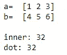

两个向量的内积(图片由作者提供)

## 点积

为矩阵定义了 ***点积*** 。它是两个矩阵中相应元素的乘积之和。要获得点积，第一个矩阵中的列数应该等于第二个矩阵中的行数。

在 numpy 中有两种创建矩阵的方法。最常见的一种是使用 numpy**ndarray 类 。这里我们创建二维 numpy 数组(ndarray 对象)。另一种是使用 numpy ***矩阵类*** 。这里我们创建矩阵对象。**

ndarray 和 matrix 对象的点积都可以使用 **np.dot()** 获得。

等到加载 Python 代码！

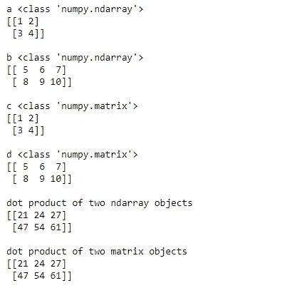

两个矩阵的点积(图片由作者提供)

当使用 ***** 运算符将两个 ndarray 对象相乘时，结果是*逐元素相乘*。另一方面，当使用 ***** 运算符将两个矩阵对象相乘时，结果是*点(矩阵)积*，它相当于前面的 ***np.dot()*** 。

等到加载 Python 代码！

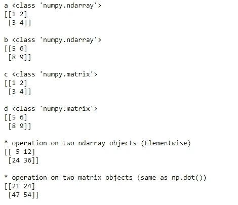

*运算符在矩阵和数组对象上的不同行为(图片由作者提供)

## **转置**

矩阵的 ***转置*** 是通过用矩阵的列交换矩阵的行而得到的。我们可以使用 **np.transpose()** 函数或者 NumPy**ndarray . transpose()**方法或者 **ndarray。T** (一种不需要括号的特殊方法)得到转置。都给出相同的输出。

等到加载 Python 代码！

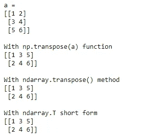

获取矩阵的转置(图片由作者提供)

转置也可以应用于向量。但是，从技术上讲，一维 numpy 数组是不能转置的。

```
import numpy as npa = np.array([1, 2, 3])
print("a = ")
print(a)
print("\na.T = ")
print(a.T)
```

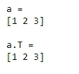

作者图片

如果真的要转置一个向量，应该定义为二维 numpy 数组，带双方括号。

```
import numpy as npa = np.array([[1, 2, 3]])
print("a = ")
print(a)
print("\na.T = ")
print(a.T)
```

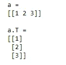

作者图片

## **追踪**

***迹*** 是方阵中对角元素的和。有两种方法可以计算迹线。我们可以简单地使用 ndarray 对象的 **trace()** 方法或者先得到对角元素，然后得到和。

```
import numpy as npa = np.array([[2, 2, 1],
               [1, 3, 1],
               [1, 2, 2]])
print("a = ")
print(a)
print("\nTrace:", a.trace())
print("Trace:", sum(a.diagonal()))
```

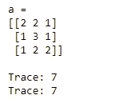

作者图片

## **排名**

矩阵的 ***秩*** 是矩阵的列或行所跨越(生成)的向量空间的维数。换句话说，它可以被定义为线性无关的列向量或行向量的最大数量。

使用 numpy ***linalg*** 包中的 **matrix_rank()** 函数可以找到矩阵的秩。

```
import numpy as npa = np.arange(1, 10)
a.shape = (3, 3)
print("a = ")
print(a)
rank = np.linalg.matrix_rank(a)
print("\nRank:", rank)
```

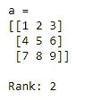

作者图片

## **行列式**

方阵的 ***行列式*** 可以计算 **det()** 函数，该函数也来自 numpy ***linalg*** 包。如果行列式为 0，则该矩阵不可逆。在代数术语中，它被称为奇异矩阵。

```
import numpy as npa = np.array([[2, 2, 1],
               [1, 3, 1],
               [1, 2, 2]])
print("a = ")
print(a)
det = np.linalg.det(a)
print("\nDeterminant:", np.round(det))
```

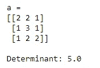

作者图片

## **真逆**

方阵的 ***真逆*** 可以使用 numpy ***linalg*** 包的 **inv()** 函数找到。如果方阵的行列式不为 0，则它有真逆。

```
import numpy as npa = np.array([[2, 2, 1],
               [1, 3, 1],
               [1, 2, 2]])
print("a = ")
print(a)
det = np.linalg.det(a)
print("\nDeterminant:", np.round(det))
inv = np.linalg.inv(a)
print("\nInverse of a = ")
print(inv)
```

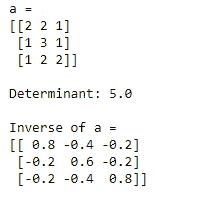

作者图片

如果你试图计算一个奇异矩阵(行列式为 0 的方阵)的真逆，你会得到一个错误。

```
import numpy as npa = np.array([[2, 8],
               [1, 4]])
print("a = ")
print(a)
det = np.linalg.det(a)
print("\nDeterminant:", np.round(det))
inv = np.linalg.inv(a)
print("\nInverse of a = ")
print(inv)
```

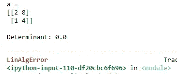

作者图片

## **伪逆**

使用 numpy ***linalg*** 包的 **pinv()** 函数，即使对于奇异矩阵(行列式为 0 的方阵)也可以计算出 ***伪(非真)逆*** 。

```
import numpy as npa = np.array([[2, 8],
               [1, 4]])
print("a = ")
print(a)
det = np.linalg.det(a)
print("\nDeterminant:", np.round(det))
pinv = np.linalg.pinv(a)
print("\nPseudo Inverse of a = ")
print(pinv)
```

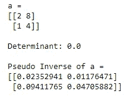

作者图片

方阵非奇异(行列式是 ***不是*** 0)的话，真逆和伪逆没有区别。

## **展平**

***Flatten*** 是将一个矩阵转换成一维 numpy 数组的简单方法。为此，我们可以使用 ndarray 对象的 **flatten()** 方法。

```
import numpy as npa = np.arange(1, 10)
a.shape = (3, 3)
print("a = ")
print(a)
print("\nAfter flattening")
print("------------------")
print(a.flatten())
```

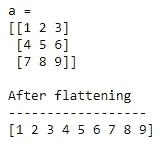

作者图片

## **特征值和特征向量**

设 **A** 为*n×n 矩阵*。一个标量 **λ** 称为 **A** 的一个 ***特征值*** 如果有一个非零向量 **x** 满足下式。

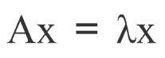

作者图片

向量 **x** 称为 **A** 对应 **λ** 的 ***特征向量*。**

在 numpy 中，可以使用 **eig()** 函数同时计算特征值和特征向量。

```
import numpy as npa = np.array([[2, 2, 1],
               [1, 3, 1],
               [1, 2, 2]])
print("a = ")
print(a)
w, v = np.linalg.eig(a)
print("\nEigenvalues:")
print(w)
print("\nEigenvectors:")
print(v)
```

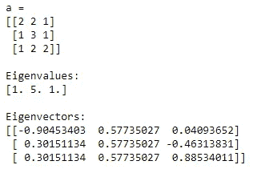

作者图片

特征值之和(1+5+1=7)等于同一个矩阵的迹(2+3+2=7)！特征值的乘积(1x5x1=5)等于同一个矩阵的行列式(5)！

特征值和特征向量在主成分分析(PCA)中非常有用。在 PCA 中，相关或协方差矩阵的特征向量表示主分量(最大方差的方向)，相应的特征值表示由每个主分量解释的变化量。如果你想更多地了解他们，请阅读下面我写的文章。

*   [使用 Scikit-learn 进行主成分分析(PCA)](/principal-component-analysis-pca-with-scikit-learn-1e84a0c731b0)
*   [用 R 和 Python 对乳腺癌数据进行主成分分析](/principal-component-analysis-for-breast-cancer-data-with-r-and-python-b312d28e911f)

# 关键要点

由于有了 numpy 库，只需一两行代码就可以轻松地执行矩阵运算。今天，我们已经在 numpy 中执行了 10 次矩阵运算。Numpy 有常用函数，也有专门用于线性代数的特殊函数，比如 ***linalg*** 包就有一些专门用于线性代数的特殊函数。

在 numpy 中，矩阵和 ndarrays 是两回事。熟悉它们的最好方法是自己尝试这些代码。检查矩阵和数组的维数总是比较好的。

在 Scikit-learn 机器学习库中，当我们创建和拟合模型时，今天讨论的大多数矩阵运算都在幕后工作。比如我们使用 Scikit-learn **PCA()** 函数时，特征值和特征向量都是在幕后计算的。Scikit-learn 和许多其他库(如 pandas、seaborn、matplotlib)都构建在 numpy 之上。所以，numpy 是一个强大的 Python 库。

我们还可以将一些矩阵运算组合在一起进行复杂的计算。比如你想把 3 个叫做 A，B，C 的矩阵依次相乘，我们可以用 **np.dot(np.dot(A，B)，C)** 。A、B、C 的尺寸要相应匹配。

感谢阅读！

本教程由[*Rukshan Pramoditha*](https://www.linkedin.com/in/rukshan-manorathna-700a3916b/)*，*数据科学 365 博客作者设计创作。

在 https://rukshanpramoditha.medium.com 阅读我的其他文章

2021–03–24