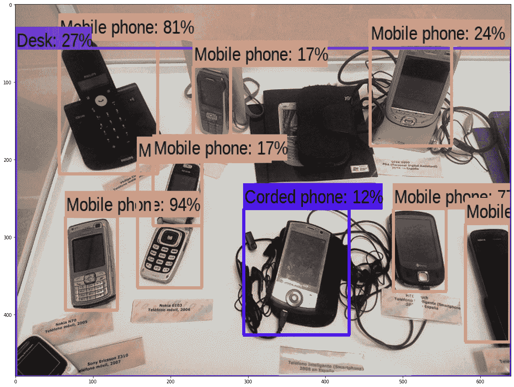

# 计算机视觉和医学成像初学者的十大项目

> 原文：<https://towardsdatascience.com/top-10-projects-for-beginners-in-computer-vision-and-medical-imaging-c138a646e44e?source=collection_archive---------1----------------------->

## [入门](https://towardsdatascience.com/tagged/getting-started)

## **计算机视觉和机器学习初学者综合实践指南**

当前计算机视觉和医学成像项目的组合(图片由作者提供)

(人工智能)和计算机科学，使自动化系统能够看到，即以类似人类的方式处理图像和视频，以检测和识别重要的对象或区域，预测结果，甚至将图像更改为所需的格式[1]。CV 领域中最受欢迎的用例包括自动驾驶的自动感知、模拟的增强和虚拟现实(ar、VR)、游戏、眼镜、房地产以及面向时尚或美容的电子商务。另一方面，医学图像(MI)处理涉及对通常为灰度级的医学图像(例如用于自动病理检测的 MRI、CT 或 X 射线图像)进行更详细的分析，这是一项需要训练有素的专家的眼睛进行检测的任务。MI 领域中最受欢迎的用例包括自动病理学标记、定位、与治疗或预后的关联以及个性化医疗。

在深度学习方法出现之前，2D 信号处理解决方案，如图像滤波、小波变换、图像配准，以及分类模型[2–3]被大量应用于解决方案框架。信号处理解决方案仍然是模型基线的首选，因为它们具有低延迟和跨数据集的高泛化能力。然而，深度学习解决方案和框架已经成为新宠，这是因为其端到端的性质完全消除了对特征工程、特征选择和输出阈值的需要。在本教程中，我们将为 CV 和 MI 领域的*初学者*回顾“*十大项目”*，并提供带有数据和起始代码的示例来帮助自定进度学习。

CV 和 MI 解决方案框架可以分为三个部分进行分析:*数据、过程*和*结果*【4】。重要的是，始终可视化此类解决方案框架所需的*数据*，使其具有格式“{X，Y}”，其中 X 表示图像/视频数据，Y 表示数据目标或标签。虽然自然出现的未标记图像和视频序列(X)可能是大量的，但是获取准确的标记(Y)可能是一个昂贵的过程。随着[5–7]等多种数据注释平台的出现，图像和视频可以针对每个用例进行标记。

由于深度学习模型通常依赖于大量带注释的数据来自动学习用于后续检测任务的特征，因此 CV 和 MI 域经常遭受“[小数据挑战](https://blog.fourthbrain.ai/check-out-our-graduates-final-projects)”，其中可用于训练机器学习模型的样本数量比模型参数的数量少几个数量级。“小数据挑战”如果得不到解决，可能会导致模型过拟合或欠拟合，从而无法推广到新的未知测试数据集。因此，为 CV 和 MI 域设计解决方案框架的*过程*必须始终包括模型复杂性约束，其中具有较少参数的模型通常是优选的，以防止模型欠拟合。最后，通过可视化解决方案对解决方案框架的结果进行定性分析，并根据众所周知的指标进行定量分析，如精确度、召回率、准确度以及 F1 或 Dice 系数[8–9]。

下面列出的项目在数据预处理和模型建立方面呈现了不同的难度级别(难度级别*简单、中等、困难*)。这些项目也代表了当前在研究和工程界流行的各种用例。项目是根据*目标、方法*和*结果*定义的。

**项目 1: MNIST 和时尚 MNIST 的图像分类(级别:简单)**

*目标:*处理大小为[28x28]像素的图像(X)并将它们分类到 10 个输出类别(Y)中的一个。对于 MNIST 数据集，输入图像是 0 到 9 范围内的手写数字[10]。训练和测试数据集分别包含 60，000 和 10，000 个标记图像。受手写数字识别问题的启发，推出了另一个数据集，称为时尚 MNIST 数据集[11]，其目标是将图像(大小为[28x28])分类为服装类别，如图 1 所示。

图 1:MNIST 和时尚 MNIST 各有 10 个输出类别的数据集。(图片由作者提供)

*方法:*当输入图像很小([28×28]像素)并且图像是灰度图像时，卷积神经网络(CNN)模型是合适的分类模型，其中卷积层数可以从单层变化到多层。colab 文件中提供了一个使用 Keras 构建 MNIST 分类模型的示例:

[MNIST 的 colab 文件](https://colab.research.google.com/github/AviatorMoser/keras-mnist-tutorial/blob/master/MNIST%20in%20Keras.ipynb#scrollTo=uPtlBJoPhI9f)

时尚 MNIST 数据集的另一个分类示例如下所示:

[时尚 MNIST Colab 文件](https://colab.research.google.com/github/tensorflow/tpu/blob/master/tools/colab/fashion_mnist.ipynb#scrollTo=DkYyndj8oO24)

在这两种情况下，要调整的关键参数包括层数、dropout、优化器(首选自适应优化器)、学习速率和内核大小，如下面的代码所示。由于这是一个多类问题，在最后一层使用“softmax”激活函数，以确保只有一个输出神经元的权重大于其他神经元。

多类问题的最终深度学习层。

*结果*:随着卷积层数从 1-10 增加，分类精度也增加。文献中对 MNIST 数据集进行了充分的研究，测试准确率在 96–99%之间。对于时尚 MNIST 数据集，测试准确率通常在 90-96%之间。下面的图 2 显示了使用 CNN 模型的 MNIST 分类结果的可视化示例。

图 2:MNIST 数据的 CNN 模型的可视化结果的例子。输入显示在左上角，并显示相应的层激活。最终结果在 5 到 8 之间。见前端可视化【https://www.cs.ryerson.ca/~aharley/vis/conv/ 

**项目 2:医学图像的病理分类(级别:简单)**

*目标:*将医学图像(使用光学相干断层扫描，OCT 获得)分类为正常、糖尿病性黄斑水肿(DME)、玻璃疣、脉络膜新生血管(CNV)，如[12]所示。如图 2 所示，数据集包含大约 84，000 幅训练图像和大约 1，000 幅带有标签的测试图像，并且每个图像具有 800 到 1，000 像素的宽度。

图 2:来自[12]中 Kaggle 数据集的 OCT 图像示例。

*方法:*深度 CNN 模型如 Resnet 和 CapsuleNet [12]已经被应用于对该数据集进行分类。数据需要调整到[512x512]或[256x256]才能输入标准分类模型。由于与非医学室外和室内图像相比，医学图像在每个图像帧的对象类别中具有较小的变化，因此发现训练大型 CNN 模型所需的医学图像的数量明显少于非医学图像的数量。[12]和 [OCT 代码库](https://github.com/anoopsanka/retinal_oct/blob/main/notebooks/11-Experiments_on_Supervised_Model.ipynb)中的工作演示了为测试图像的迁移学习和分类重新训练 ResNet 层。这里要调整的参数包括优化器、学习速率、输入图像的大小和 ResNet 层末尾的密集层数。

*结果:*对于 ResNet 模型，通过改变训练图像的数量，测试精度可以在 94–99%之间变化，如【12】所示。图三。定性地展示分类模型的性能。

图 3:使用 python 中的 [Gradcam 库](https://keras.io/examples/vision/grad_cam/)将每个病理的感兴趣区域(ROI)叠加在原始图像上。(图片由作者提供)

这些可视化是使用 [Gradcam 库](https://keras.io/examples/vision/grad_cam/)产生的，该库将 CNN 层激活结合到原始图像上，以理解感兴趣的区域，或者自动检测的重要特征，用于分类任务。使用 *tf_explain* 库的 Gradcam 的用法如下所示。

使用 tf_explain 来可视化可解释的热图。

**项目 3:多标签图像分类的人工智能可解释性(级别:简单)**

*目标:* CNN 模型支持端到端交付，这意味着不需要为分类设计和排列特征，并且模型结果是期望的过程结果。然而，如专题 2 的后面部分所示，可视化和解释 CNN 模型的性能通常是很重要的。一些众所周知的可视化和可解释库是 [tf_explain](https://tf-explain.readthedocs.io/en/latest/) 和[本地可解释的模型不可知解释(LIME)](https://homes.cs.washington.edu/~marcotcr/blog/lime/) 。在这个项目中，目标是实现多标签分类，并解释 CNN 模型将什么视为以特定方式分类图像的特征。在这种情况下，我们考虑一个多标签场景，其中一个图像可以包含多个对象，例如 [Colab for LIME](https://colab.research.google.com/github/arteagac/arteagac.github.io/blob/master/blog/lime_image.ipynb#scrollTo=8fPvSbn0woWP) 中的猫和狗。

这里，输入是包含猫和狗的图像，目标是识别哪些区域分别对应于猫或狗。

*方法:*在本项目中，每幅图像都经过超像素分割，将图像分割成几个像素颜色和纹理特征相似的子区域。划分的子区域的数量可以作为参数手动提供。接下来，调用 InceptionV3 模型来为每个超像素子区域分配属于 InceptionV3 最初被训练的 1000 个类别之一的概率。最后，对象概率被用作拟合回归模型的权重，该回归模型解释了对应于每个类别的 ROI，如图 4 和下面的代码所示。

设置 LIME 来解释图像中的区域重要性。

图 4:使用类回归模型解释图像超像素的可能性。(图片由作者提供)

*结果:*使用所提出的方法，大多数非医学图像中的感兴趣区域应该是可以解释的。这里显示的定性评估和可解释性在极端情况下，或者在模型错误分类或错过感兴趣的对象的情况下特别有用。在这种情况下，解释 CNN 模型在看什么，并相应地提高 ROI 以校正整体分类性能，可以帮助显著减少数据引起的偏差。

**项目 4:对新物体进行 2D 包围盒检测的迁移学习(级别:中等)**

*目标:*图像分类后的下一步是通过在感兴趣的物体周围放置边界框来检测它们。这是自动驾驶领域中的一个重要问题，以从静态对象(如路障、街道标志、树木和建筑物)中准确识别移动对象(如汽车和行人)。本项目与以前项目的主要区别在于数据的格式。这里，标签 Y 通常是每个感兴趣对象的[x，Y，w，h]的形式，其中(x，Y)通常表示边界框的左上角，而 *w* 和 *h* 对应于输出边界框的宽度和高度。在这个项目中，目标是利用预训练的分类器的特征提取能力，然后在一小组图像上重新训练它，以创建围绕新对象的紧密边界框。

*方法:*在代码[边界框 colab](https://colab.research.google.com/github/tensorflow/models/blob/master/research/object_detection/colab_tutorials/eager_few_shot_od_training_tf2_colab.ipynb) 中，我们可以扩展一个预训练的对象检测器，如具有 Resnet50 跳跃连接和特征金字塔网络主干的单次拍摄检测器(SSD)，它是为 MS-COCO 数据集[13]上的对象检测而预训练的，以检测一个完全看不见的新对象类别，在这种情况下是一个*橡皮鸭*。在这种转移学习设置中，来自对象检测器的早期层的已经学习的权重对于从图像中提取局部结构和纹理信息是有用的，并且只有最终的分类器层需要为新的对象类重新训练。这使得可以使用新对象的 5-15 幅图像来为新类别重新训练对象检测器，例如本用例中的橡胶鸭子。要调整的参数包括优化器、学习速率、输入图像大小和最终分类器层中的神经元数量。

*结果:*对象检测器和上面所示的先前的基于 CNN 的分类器模型之间的一个主要区别是称为并集上的交集(IoU) [11]的附加输出度量，其测量实际边界框和预测边界框之间的重叠程度。此外，对象检测器模型通常由分类器(预测对象类别)和边界框回归器(预测对象周围边界框的尺寸)组成。图 5 和下面的代码显示了 Google API 在新的不可见图像上进行对象检测的例子。

Google api 调用对象检测。

在[这些项目](https://blog.fourthbrain.ai/check-out-our-graduates-final-projects)中显示了 2D 包围盒检测器对专门用于自动驾驶的 3D 包围盒的扩展。

图 5:使用 tensorflow [api 进行对象检测](https://colab.research.google.com/github/tensorflow/hub/blob/master/examples/colab/object_detection.ipynb)的 2D 包围盒检测示例

**项目 5:个性化医疗和可解释性(等级:中等)**

*目标:*在这个项目中，目标是自动分割来自多个病理部位的 ROI，以对患者贫血样苍白的程度进行分类，并随着时间的推移跟踪苍白[13]。该项目与先前项目的两个主要区别在于:1)需要跨多个图像位置(例如结膜(眼睛下方)和舌头)检测苍白，以预测单个标记，如图 6 所示，2)需要显示对应于苍白的 ROI，并随时间进行跟踪。

图 6:使用从多个病理部位处理的图像的贫血样苍白检测的例子。(图片由作者提供)

*方法:*在这个项目中，使用 Keras 中的[图像数据生成器](https://keras.io/api/preprocessing/image/)对基于特征的模型和基于 CNN 的分类器进行大量数据扩充。为了融合来自多个病理部位的结果，可以应用早期、中期和晚期融合。[13]中的工作应用了后期融合，其中分类器之前的层被认为是图像的最佳特征表示，用于融合多个病理部位的特征。最后，如 [Deepdream Colab](https://colab.research.google.com/github/tensorflow/docs/blob/master/site/en/tutorials/generative/deepdream.ipynb) 所示，将 Deepdream 算法应用于原始眼睛和舌头图像，以可视化 ROI 并解释病理的程度。这个项目中要调整的参数包括项目 2 中的参数以及 Deepdream 可视化的附加梯度因子。

*结果:*此项工作的数据可用于[基准测试](https://sites.google.com/site/sohiniroychowdhury/automated-pallor-detection-project?authuser=0)。使用 Deepdream 算法，在图 7 中示出了可视化，其中，我们观察到与眼睛中的任何其他地方相比，在眼睛下方的血管中对应于苍白的特征的浓度更高。类似地，我们观察到舌头的内侧和外侧部分之间的特征差异。这些评估有助于为贫血患者创建个性化病理跟踪系统。

图 7:深度梦实现的特征集中的例子。在结膜或眼睛下方的血管区域观察到高浓度的梯度。(图片由作者提供)

**项目 6:用于对象检测的点云分割。(等级:硬)**

*目标:*在这个项目中，输入是点云流，即提供深度分辨率的激光雷达传感器的输出。激光雷达点云与影像之间的主要区别在于点云提供 3D 分辨率，因此每个体素(像素的 3D 等效物)表示对象相对于激光雷达源的位置以及对象相对于激光雷达源的高度。点云数据模型带来的主要挑战是:I)如果使用 3D 卷积，模型计算复杂；ii)对象变换不变性，这意味着旋转的对象应被检测为对象本身，如[13]所示。

*方法:*这个项目的数据集是 ModelNet40 形状分类基准，包含来自 40 个对象类的超过 12，000 个 3D 模型。对每个对象进行子采样，以提取固定数量的点，然后进行扩充，以适应形状的多次变换。接下来 1D 卷积被用于学习形状 *ness* 特征，使用 [Pointnet colab](https://colab.research.google.com/github/nikitakaraevv/pointnet/blob/master/nbs/PointNetClass.ipynb) 中的 Pytorch 库，如下所示。

Pointnet 类的定义。

要调整的参数包括优化器、学习率和损失函数。

*结果:*模型的结果可以使用下面的图 8 来总结。通过该方法可以实现高达 89%的对象分类训练准确度，该方法还可以扩展到 3D 语义分割。这项工作的扩展可以用于自动驾驶用例的 3D 边界框检测。

图 8:来自[15]的图像，该图像从点云中识别物体

**项目 7:使用 U-net 进行二值和多值图像语义分割。(中等)**

*目标:*到目前为止，CNN 模型已经被应用于自动学习特征，然后可以用于分类。这个过程被称为*特征编码*。下一步，我们应用与编码器结构相似的解码器单元来生成输出图像。编码器-解码器对的这种组合使得输入和输出能够具有相似的维度，即输入是图像，输出也是图像。

*方法:*具有剩余跳跃连接的编码器-解码器组合通常被称为 U-net [15]。对于二进制和多类问题，数据必须被格式化，使得如果 X(输入图像)具有维度[m×m]像素，Y 具有维度[m×m×d]，其中‘d’是要预测的类的数量。要调整的参数包括优化器、学习率和 U-net 模型的深度，如下面的[15]和图 9 所示。

图 9。U-net 模型示例。来源[https://papers with code . com/paper/multi runet-reflecting-the-u-net](https://paperswithcode.com/paper/multiresunet-rethinking-the-u-net)

*结果:*U-net 模型可以学习从大小数据集生成二元和多类语义图[16–17]，但发现它对数据不平衡很敏感。因此，选择正确的训练数据集对于获得最佳结果非常重要。这项工作的其他扩展将包括 DenseNet 到模型的连接，或其他编码器-解码器网络，如 MobileNet 或异常网络[17]。

**项目 8:姿态和意图分类的机器翻译(等级:硬)**

*目标:*姿态或手势的自动检测通常包括视频中的关键点识别(如骨骼结构的识别)，这些关键点识别可以导致行人姿态(站立、行走、移动)或意图(过马路，而不是过马路)等的识别。[18–19]，如下图 10 所示。对于这类问题，来自多个后续视频帧的关键帧信息被共同处理，以生成与[姿势/意图相关的预测。](https://www.youtube.com/watch?v=a7SrsA--mtA&t=1s)

图 10:来源:【https://matthew29tang.github.io/pid-model/#/pose/ 

*方法:*对于这个项目，所应用的模型类别被称为“*序列对序列”*模型，其中来自视频的一系列图像帧被处理以预测行人是否打算过马路。该过程首先使用 2D 包围盒检测器来隔离行人，然后通过实时跟踪来跨帧跟踪同一包围盒。最后，来自被跟踪的边界框和骨架特征的特征被用于训练一个 [DenseNet 模型](https://arxiv.org/abs/1608.06993)，该模型预测行人是否会在移动的汽车前面移动。要调整的参数包括来自项目 4 的边界框检测器参数、Densenet 模型的层数以及每个行人姿势所适合的骨骼点的数量。骨架点的数量越多，计算复杂度越高。

*结果:*上述方法的定性结果如下图 11 所示，其中红色方框表示行人将穿过街道，绿色方框表示行人不会与驶来的车辆穿过道路。[18–19]中的工作和 [Colab 文件](https://colab.research.google.com/drive/1InGYCg_SEosqumijaGyWzC9VoLPm5ZEx#scrollTo=DGgcEDqHNyUl&forceEdit=true&sandboxMode=true)可用于测试复合模型，该模型使用边界框内的特征和骨骼特征作为任何新数据集的早期融合设置，以从一系列图像帧中生成姿势相关预测。

图 11:在 JAAD [18]数据集上行人意图预测的例子。来源:[https://matthew29tang.github.io/pid-model/#/integrated/](https://matthew29tang.github.io/pid-model/#/integrated/)

**项目 9:用于数据增强的生成式对抗网络(GAN)(使用 Pix2pix 模型)(级别:硬)**

*目标:*CNN 模型的一个流行用例是使用 GANs 自动生成假图像。在这样的设置中，训练两个 CNN 模型:1)生成器，其目标是从噪声和一些约束中创建真实的假图像，2)鉴别器，其目标是从真图像中识别假图像。基础数据集需要成对的图像和语义分割图{X，Y}用于训练，如图 12 和 [GAN Colab](https://colab.research.google.com/github/Neyri/Projet-cGAN/blob/master/BE_cGAN_Enonce.ipynb) 中所示。

图 12:来自 [CMP 正面数据集](https://cmp.felk.cvut.cz/~tylecr1/facade/)的示例，使得语义分割图用于预测真实的 RGB(红绿蓝平面)图像。

*方法:*对于这个项目，pix2pix 设置依赖于条件 GANs 来训练基于 CNN 的*生成器*(这是一个修改的 U-net 模型)来生成难以从真实图像中区分/分类的假图像。GAN 模型通常利用损失函数，该损失函数是[最小最大损失](https://developers.google.com/machine-learning/gan/loss)或 GAN 损失以及实际图像和伪图像之间的平均绝对误差的组合。要调整的参数包括优化器、学习率、特征补丁大小(通常 30-70 像素宽和高是 [PatchGAN](https://paperswithcode.com/method/patchgan) 的首选)、输入图像大小和*生成器*模型的复杂性，如下所示。

发电机模型在 GANs 中的使用。

*结果:*[pix 2 pix 方法](https://github.com/yenchenlin/pix2pix-tensorflow)可用于从灰度图像生成彩色图像，从陆地图像生成地图图像，从线描图像生成 RGB 图像。该模型允许低维到高维的数据生成，这对于增加训练数据集和解决“小数据挑战”是至关重要的。

**项目 10:使用 CycleGAN 进行图像转换(级别:硬)**

*目标:*虽然 pix2pix 支持图像转换，但它需要成对的图像和目标标签，即出于训练目的需要图像及其相应的语义分割。然而，在成对输入和标签不可用的情况下，CycleGANs [17]可能是有用的。在 CycleGAN 模型中，使用了两组发生器/鉴别器组合。如果目标是将域 A 中的图像变换到域 B，则 Generator_1/Discriminator_1 用于将图像 A 变换到 B，而 Generator_2/Discriminator_2 用于将图像 B 变换回图像 A。因此在一个周期结束时，获得图像 A 的双重变换版本。总损失函数旨在减少以下各项之间的差异:1)在全周期结束时生成的图像 A 和实际图像 A，2)从周期中间到实际图像 B 生成的图像 B。

图 13:没有成对训练图像的图像变换的例子。https://github.com/xhujoy/CycleGAN-tensorflow 来源[。](https://github.com/xhujoy/CycleGAN-tensorflow)

(顶行)，Generator_1/Discriminator_1 以马图像为输入生成假斑马图像，(底行)Generator_2/Discriminator_2 以斑马图像为输入生成假马图像。

*方法:*使用 [CycleGAN Colab](https://colab.research.google.com/github/tensorflow/docs/blob/master/site/en/tutorials/generative/cyclegan.ipynb) ，我们观察到 CycleGAN 和条件 GAN (cGAN)模型之间的主要差异是损失函数，该函数包括项目 9 中为每个发生器/鉴别器对定义的 GAN 损失以及前向和后向循环一致性损失，该损失表示 A- > B 变换和 B- > A 变换的伪图像和原始图像之间的平均误差。要调整的其他参数包括生成器复杂度、优化器、学习速率、输入图像大小和周期损失函数。

*结果:* CycleGAN 已用于图像域转换功能，如白天到夜晚的时间转换[18]，可用于分别在白天和夜晚重复使用自动驾驶物体检测器的标签。这些模型也可以用于艺术变换、图像去噪和 AR/VR 变换。

**结论**

几种不同类型的基于 CNN 的模型框架可用于设计 CV 和 MI 问题的端到端解决方案。为了修改这种基于 CNN 的框架以适合各个数据集和用例，需要考虑的因素如下:1)需要调整的参数，2)损失函数的修改，3)用于模型训练的标记数据量，4)关于数据不平衡的考虑。

在扩展此处显示的 10 个项目中的任何一个时，理想的策略是首先通过将数据集格式化为与上面示例中类似的格式来复制手头数据集的现有代码库。一旦训练过程成功，下一步将是修改/预处理数据，然后调整模型参数和结果的定性和定量报告。值得注意的是，输出指标可能因图像域和使用情形而异。例如，在自动驾驶用例中，误报物体检测可能会因过度鸣响和干扰驾驶员而破坏驾驶体验，因此在这种用例中应尽量减少误报。或者，在医学图像病理学检测用例中，遗漏病理学远比自动过度检测更糟糕，因为专家最终会查看患者图像以丢弃假阳性。因此，假阳性和假阴性的权重并不总是相同的，在报告 CV 和 MI 解决方案的结果时，应该考虑到不同用例之间的差异。

本博客中展示的项目和资源应该可以帮助所有初学者和 CV、MI 爱好者开始他们自己的数据集自学之旅。

**参考文献**

[1]techno pedia[在线]:【https://www.techopedia.com/definition/32309/computer-vision T2

[2] Roychowdhury、Sohini、Dara D. Koozekanani 和 Keshab K. Parhi。"梦:使用机器学习的糖尿病视网膜病变分析."IEEE 生物医学和健康信息学杂志 18.5(2013):1717–1728。

[3]王，李一清。" Viola-Jones 人脸检测算法分析."4 号线图像处理(2014):128–148。

[4]S. Roychowdhury，“使用 U-net 转移学习多类图像分割的机器学习工程师教程”，走向数据科学[在线]:[https://towardsdatascience . com/A-Machine-Learning-engineers-Tutorial-to-Transfer-Learning-for-Multi-class-Image-Segmentation-b 34818 caec 6b](/a-machine-learning-engineers-tutorial-to-transfer-learning-for-multi-class-image-segmentation-b34818caec6b)

[5]A .杜塔等人。艾尔。https://www.robots.ox.ac.uk/~vgg/software/via/:[VGG 图像注释者【在线】](https://www.robots.ox.ac.uk/~vgg/software/via/)

[6]伯克利深层驱动。“Scalabel.ai”。[https://www.scalabel.ai/](https://www.scalabel.ai/)

[7]GNU 图像处理程序[在线][https://www.gimp.org/about/](https://www.gimp.org/about/)

[8]E. Solutions，“准确度、精确度、召回率和 F1 分数:性能测量的解释”，[在线]:[https://blog . ex silio . com/all/Accuracy-Precision-Recall-F1-Score-Interpretation-of-Performance-Measures/](https://blog.exsilio.com/all/accuracy-precision-recall-f1-score-interpretation-of-performance-measures/)

[9]E. Tiu，《度量评估你的语义分割模型》，[在线]:[https://towards data science . com/Metrics-to-Evaluate-your-Semantic-Segmentation-Model-6 BCB 99639 aa 2](/metrics-to-evaluate-your-semantic-segmentation-model-6bcb99639aa2)

[10]T. Kanstren《对精度、召回和 F1-Score 的看法》，走向数据科学[在线][https://towardsdatascience . com/A-Look-at-Precision-Recall-and-F1-Score-36 b5 FD 0 DD 3 EC](/a-look-at-precision-recall-and-f1-score-36b5fd0dd3ec)

[11]吴，明，张及甄。"使用 mnist 数据集的手写数字分类."课程项目 CSE802:模式分类与分析(2010)。

[12]Roychowdhury，Sohini 等人，“SISE-PC:用于解释病理学的半监督图像子采样”arXiv 预印本 arXiv:2102.11560 (2021)。[https://github.com/anoopsanka/retinal_oct](https://github.com/anoopsanka/retinal_oct)

13 Roychowdhury 等人。艾尔。"基于 Azure 的贫血样苍白智能监测系统."未来互联网 9.3 (2017): 39。

[14]N. Karaev，“点云上的深度学习:在 Google Colab 中实现 PointNet”，走向数据科学[在线]:[https://towardsdatascience . com/Deep-Learning-on-Point-clouds-Implementing-Point net-in-Google-Colab-1fd 65 CD 3a 263](/deep-learning-on-point-clouds-implementing-pointnet-in-google-colab-1fd65cd3a263)

[15]齐，查尔斯·r .等，“点网:用于三维分类和分割的点集的深度学习。”IEEE 计算机视觉和模式识别会议录。2017.

[16]曲，，等.“增强型 pix2pix 去雾网络”*IEEE/CVF 计算机视觉和模式识别会议论文集*。2019.

[17] Harms，Joseph 等人，“用于定量锥形束计算机断层成像的成对循环 GAN 基图像校正。”*医学物理*46.9(2019):3998–4009。

[18] Chowdhury，Sohini Roy 等人，“利用强化学习和 gans 进行自动增强，使用前摄像机图像对交通标志进行稳健识别。” *2019 第 53 届 Asilomar 信号、系统和计算机会议*。IEEE，2019。