# 人工智能十大研究论文

> 原文：<https://towardsdatascience.com/top-10-research-papers-in-ai-1f02cf844e26?source=collection_archive---------7----------------------->

## 被引用最多的影响我们今天日常生活的人工智能作品

每年，来自世界各地的科学家发表成千上万篇人工智能研究论文，但只有少数论文能够获得广泛的受众，并在世界上产生全球性影响。以下是过去 5 年在顶级人工智能会议上发表的前 10 篇最有影响力的研究论文。排名基于引用的数量，包括主要的人工智能会议和期刊。

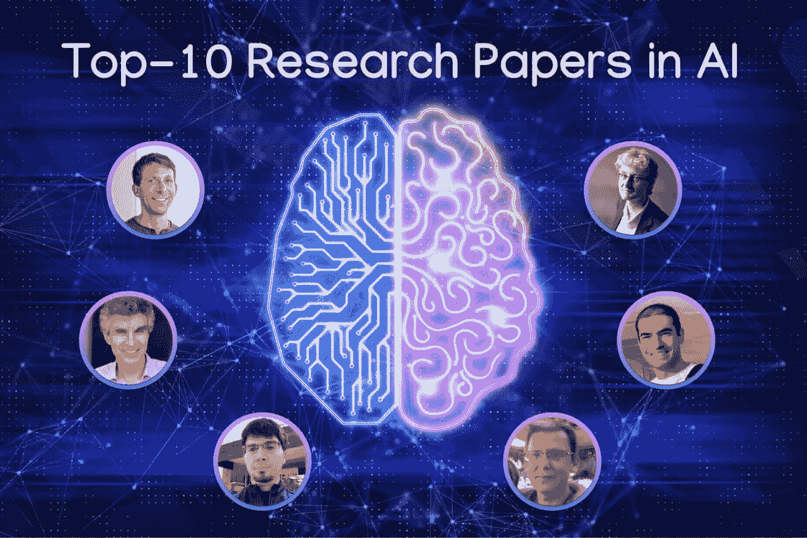

[来源。](https://www.shutterstock.com/)

# 10.

[**训诂治例**](https://arxiv.org/abs/1412.6572) **，*古德菲勒等人*，ICLR 2015，被 6995** 引用

**什么？**为神经网络生成对抗示例的第一批快速方法之一，并引入对抗训练作为正则化技术。

**影响:**暴露了一个有趣的现象，任何精确的机器学习模型的性能都可能因攻击者对输入进行微小的修改而显著降低。在其他任务和模态(例如文本和视频)中也观察到了这种现象，并导致了大量的研究工作，这些工作试图重新思考 ML 对现实世界关键任务的适用性。

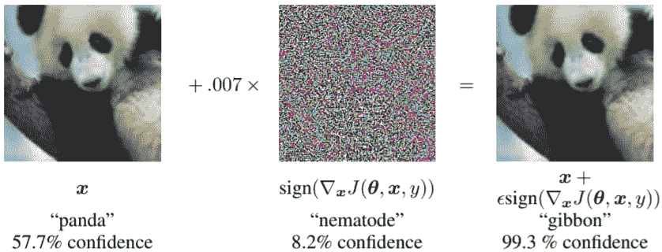

原始图像的轻微扰动会导致神经网络的严重错误分类。[来源。](https://arxiv.org/abs/1412.6572)

# 9.

[**带图卷积网络的半监督分类**](https://arxiv.org/abs/1609.02907) **， *Kipf 和 Welling* ，ICLR 2017，被 7021** 引用

**什么？**一个简单而有效的图形神经网络，在半监督节点分类任务上表现极佳。

**影响:**新药或高效储能催化剂的发现需要将分子建模为图形。图形卷积网络将深度学习的工具包带入了图形领域，显示了它相对于以前主导该领域的手工启发式方法的优越性。

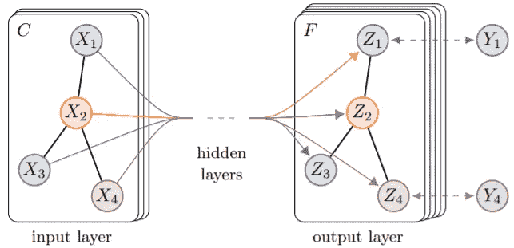

用图形卷积网络变换图形特征的例子。[来源。](https://arxiv.org/abs/1609.02907)

# 8.

[**深度卷积生成对抗网络的无监督表示学习**](https://arxiv.org/abs/1511.06434) **，拉德福德等，ICLR 2016，被 8681 引用**

**什么？**提出了 DCGAN，一种深度 CNN 架构，用于 GAN 模型的生成器，以获得前所未有的自然图像。

**影响:**gan 是机器学习模型，能够生成人、动物或物体的新图像，因此负责在照片编辑和设计应用程序中流行的机器的创造力。现在，所提出的方法对于生成新的逼真图像的所有现代 GAN 模型都是基本的。

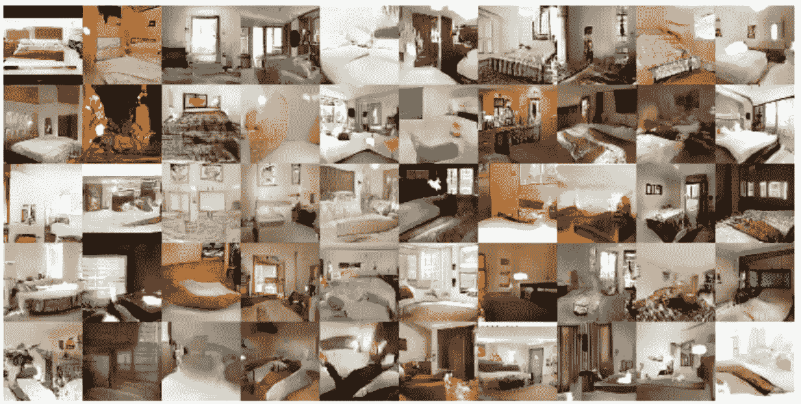

用 DCGAN 生成的卧室。[出处。](https://arxiv.org/abs/1511.06434)

# 7.

[**用深度神经网络和树搜索掌握围棋博弈**](https://www.nature.com/articles/nature16961) **， *Silver 等人*，《自然》2016，被 9621 引用**

**什么？**AlphaGo 介绍，alpha Go 是深度强化学习与蒙特卡罗树搜索算法相结合，在围棋比赛中击败其他程序和职业人类棋手。

**影响:**历史上第一次，一个计算机程序赢了最强的人类选手之一李·塞多尔——这是人工智能的一个重要里程碑，而这在至少未来十年内都被认为是不可能的。

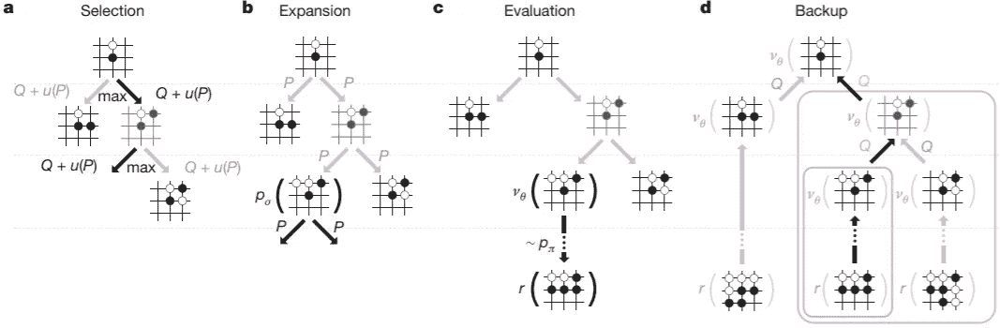

AlphaGo 中的蒙特卡罗树搜索，用于 Go 中的下一步棋选择。[来源。](https://www.nature.com/articles/nature16961)

# 6.

[**人类级控制通过深度强化学习**](https://www.nature.com/articles/nature14236) **， *Mnih 等人*，《自然》2015，被 13615 引用**

**什么？**推出强化学习算法 DQN，在许多 Atari 游戏上实现了人类水平的性能。

**影响:**制造业、机器人和物流背后的算法已经从硬编码规则转向强化学习模型。DQN 是最受欢迎的深度强化学习算法之一，它在各种应用中显示出优越的性能，而无需将手动设计的策略纳入自身。

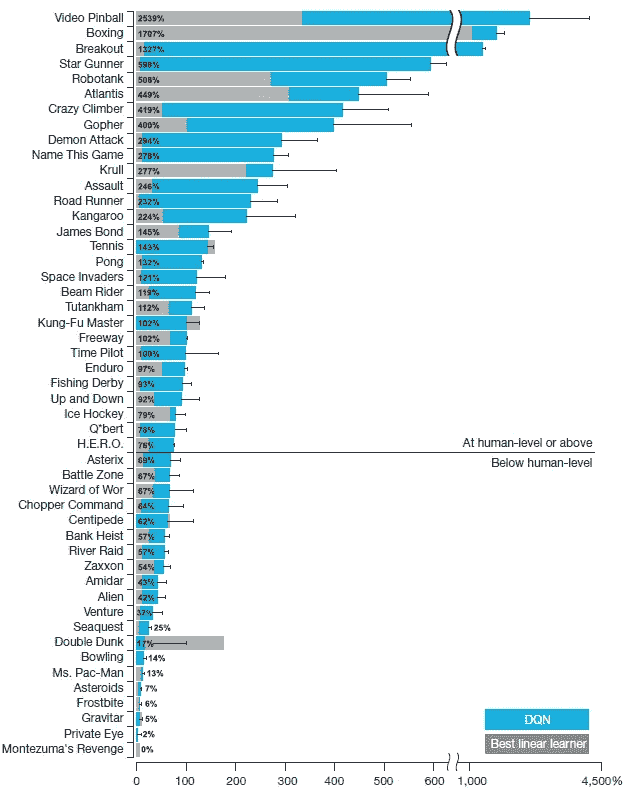

雅达利游戏中 DQN(蓝色)与 SOTA 算法(灰色)和人类玩家(百分比)的比较。[来源。](https://www.nature.com/articles/nature14236)

# 5.

[**联合学习对齐和翻译**](https://arxiv.org/abs/1409.0473) **的神经机器翻译，Bahdanau 等人，ICLR 2015，被 16866** 引用

**什么？**神经网络首次使用注意机制进行机器翻译。注意力是模型只关注源句子中的特定单词而不是整个句子的一种方式。

**影响:**在机器翻译中，RNN 等传统模型试图将源句子的所有信息压缩到一个向量中。认识到一个模型可以有效地将每个单词表示为一个向量，然后关注每个单词，这是神经网络如何构建的一个重大范式转变，不仅在 NLP 中，而且在 ML 的所有其他领域中。

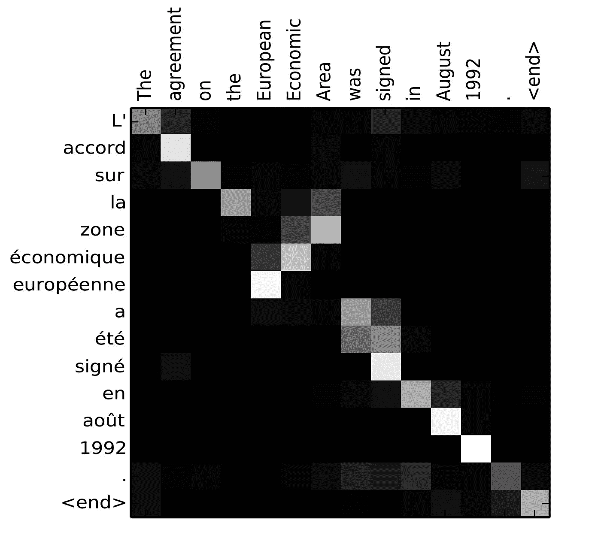

从英语到法语翻译的注意矩阵。较亮的区域表示单词之间的相似性得分较强。[出处。](https://arxiv.org/abs/1409.0473)

# 4.

****，*瓦斯瓦尼等人*，NeurIPS 2017，被 18178 引用****

****什么？**一个有效的神经网络，Transformer，它完全基于注意机制，在机器翻译中取得了优异的性能。**

****影响:**事实上，Transformer 模型中引入的多头注意力是最流行的深度学习块，是另一个流行的语言模型 BERT 的一部分。它取代了 RNNs 和 CNN，成为许多处理文本和图像的应用程序的默认模型。**

**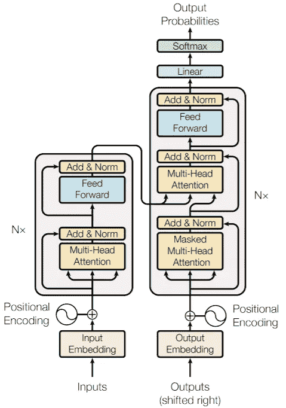**

**用于机器翻译的转换器的编译码结构。[来源。](https://arxiv.org/abs/1706.03762)**

# **3.**

**[**更快的 R-CNN:面向实时目标检测的区域提议网络**](https://arxiv.org/abs/1506.01497) **，*任等*，NeurIPS 2015，被 19915 引用****

****什么？**高效的端到端卷积神经网络用于图像和视频中的物体检测。**

****影响:**更快的 R-CNN 是工业环境中 CV 应用蓬勃发展的原因。它在安全摄像头、无人驾驶汽车和移动应用中的使用极大地影响了我们今天对机器的看法。**

**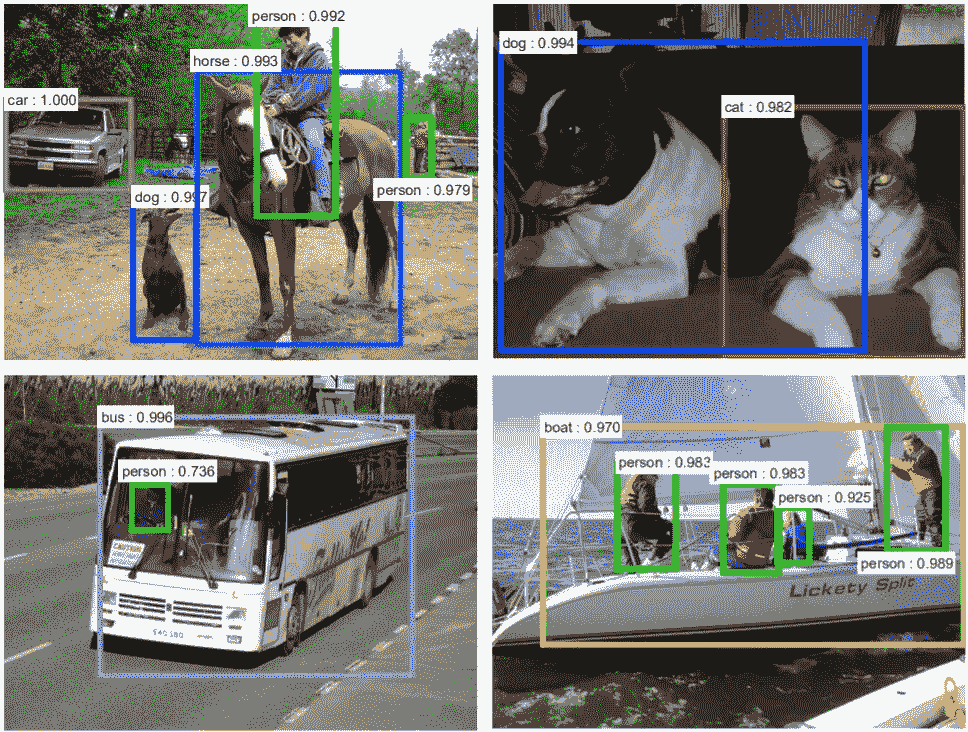**

**更快的 R-CNN 探测到的物体。[来源。](https://arxiv.org/abs/1506.01497)**

# **2.**

**[**批量规格化:通过减少内部协变量移位加速深度网络训练**](https://arxiv.org/abs/1502.03167) **，*约夫和赛格迪*，ICML 2015，被 25297 引用****

****什么？**通过输入特征的标准化，使神经网络训练更快、更稳定的简单方法。**

****影响:**添加到现代神经网络的大多数架构中的最流行的技巧之一。批处理范数的存在是深度神经网络目前获得最先进结果的原因之一。**

**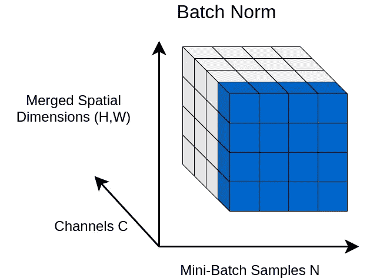**

**图像批量标准的说明。[出处。](https://theaisummer.com/normalization/)**

# **1.**

**[**亚当:随机优化的一种方法**](https://arxiv.org/abs/1412.6980) **，*金玛、巴*，2015，被 67514** 引用**

****什么？**随机梯度下降优化算法的一个流行变体，Adam，提供神经网络的快速收敛。**

****影响:** Adam 已经被采用为现在人们训练的所有那些数百万个神经网络的优化算法的默认方法。**

**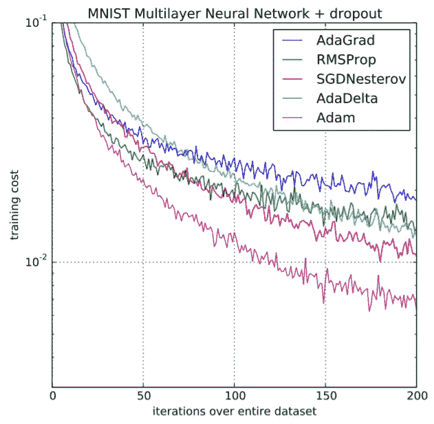**

**深度学习神经网络中 Adam 的快速收敛。[来源。](https://arxiv.org/abs/1412.6980)**

**鸣谢:本文是在叶卡捷琳娜·沃罗别娃、叶夫根尼娅·乌斯季诺娃、埃尔维斯·多赫马托夫、谢尔盖·科列斯尼科夫、瓦伦丁·马雷克的帮助下撰写的。谢谢你！**

***P.S .如果你喜欢这个故事，可以考虑关注我的* [***电报频道***](https://t.me/graphML)*[***推特***](https://twitter.com/SergeyI49013776) *，以及* [***快讯***](https://graphml.substack.com/) *。****