# 每个数据科学家都应该知道的 10 大终端命令

> 原文：<https://towardsdatascience.com/top-10-terminal-commands-every-data-scientist-should-know-2a4089f87b1a?source=collection_archive---------27----------------------->

## 从终端下载和浏览数据—这比您想象的要简单。


Philipp Katzenberger 在 [Unsplash](https://unsplash.com/s/photos/computer?utm_source=unsplash&utm_medium=referral&utm_content=creditCopyText) 上拍摄的照片

IT 界的每个人都应该知道终端的基础知识，数据科学家也不例外。有时，终端是您所拥有的一切，尤其是在将模型和数据管道部署到远程机器时。

今天，我们将讨论一些基本的数据收集、探索和聚合——全部通过 shell 完成。如果你在 Linux 或 Mac 上，你不会有任何问题，但是 Windows 用户应该在继续之前下载一个终端模拟器。

所以，让我们开始吧！

# wget

`wget`实用程序用于从远程服务器下载文件。如果您知道 URL，您可以使用它来下载数据集。在这个[链接](https://raw.githubusercontent.com/jbrownlee/Datasets/master/airline-passengers.csv)上，您将找到 CSV 格式的航空公司乘客数据集，因此您可以使用`wget <url>`命令下载它:

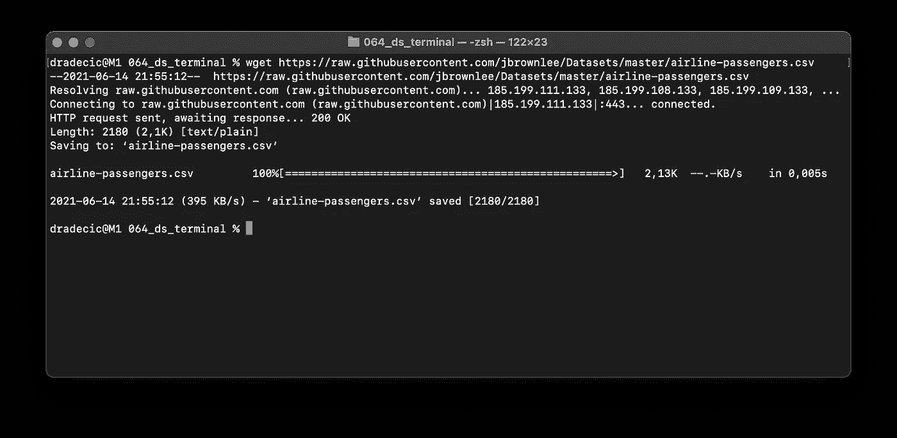

图 1-使用 wget 下载数据集(按作者分类的图像)

如果你在 Mac 上，默认情况下`wget`将不可用，所以通过从终端执行`brew install wget`来安装它。

数据集现在已经下载完毕，让我们继续进行一些基本的探索。

# 头

如果你是 Python Pandas 的用户，你会感觉很熟悉。如果没有，使用`head`命令打印文件的前 N 行。默认情况下将打印十行:

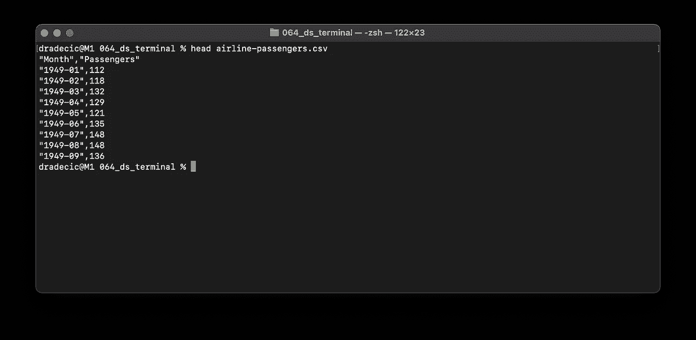

图 2 —使用 head 命令打印前 N 行(图片由作者提供)

如果您想要一个不同的数字，比如说 3，您可以使用`-n`参数。完整的命令应该是:

```
head -n 3 airline-passengers.csv
```

让我们去下一个。

# 尾巴

`tail`命令与`head`非常相似，但是它打印最后 N 行。默认情况下将打印十行:

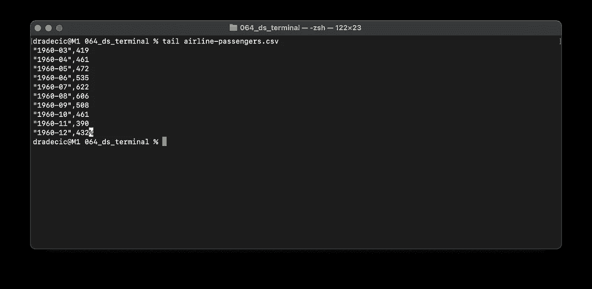

图 3 —使用 tail 命令打印最后 N 行(图片由作者提供)

与`head`一样，您也可以用`-n`参数指定要打印的行数。

我们现在已经了解了基础知识，所以让我们继续一些更有趣的内容。

# 厕所

有时你想知道文件中有多少个数据点。没必要打开手动滚动到底部。一个简单的命令可以为您节省一些时间:

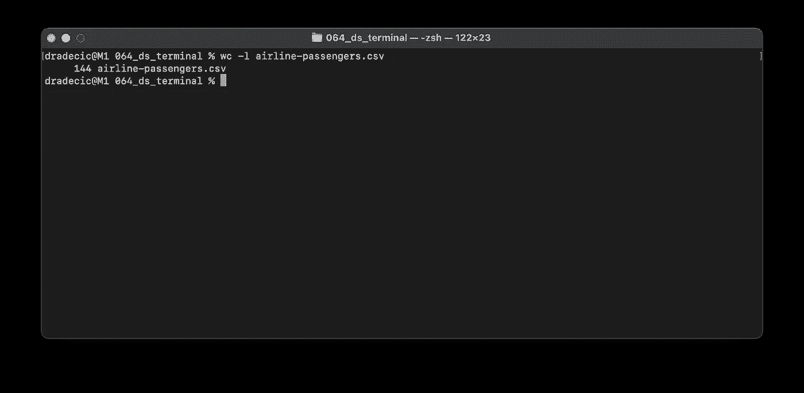

图 4 —用 wc 命令计算行数(图片由作者提供)

最后， *airline-passengers.csv* 文件包含 144 行。

# 可做文件内的字符串查找

该命令用于处理文本，可以匹配字符串和正则表达式。我们将使用它只提取包含字符串“1949”的行。这是一个简单的数据集，所以我们不会有任何问题。默认情况下,`grep`命令将打印结果，但是我们可以将其保存到另一个 CSV 文件中:

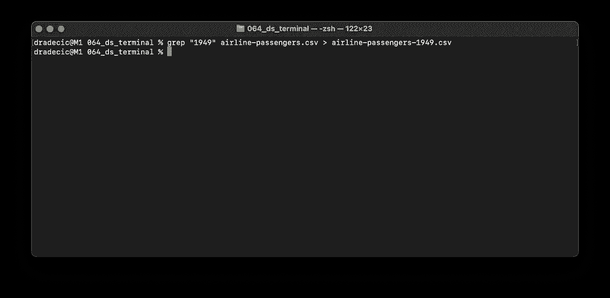

图 5 —使用 grep 命令提取和保存子集(图片由作者提供)

接下来让我们看看文件是否被实际保存了。

# 猫

为了验证前面的操作是否成功，我们可以使用`cat`命令。它用于将整个文件打印到 shell 中。你也可以用它来合并文件等等，但这是另一个话题了。

现在，让我们打印整个文件。数据按月间隔汇总，因此总共应该有 12 行:

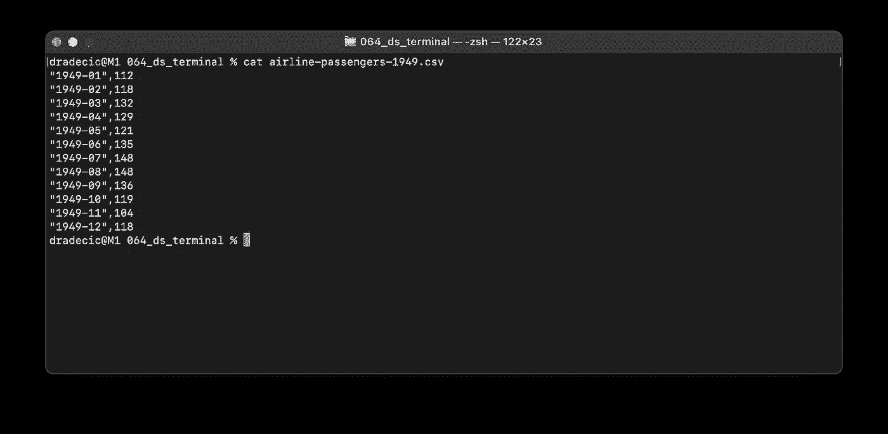

图 6 —使用 cat 命令打印文件内容(图片由作者提供)

像宣传的那样工作！

# 发现

你可以使用`find`命令来搜索文件和文件夹。例如，执行以下命令会将当前目录(由点号指定)中的所有 CSV 文件打印到 shell 中:

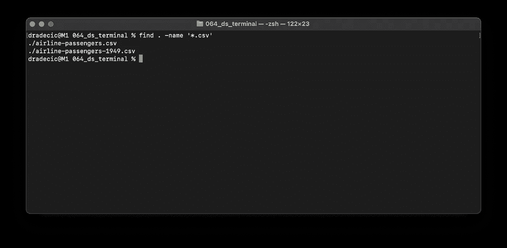

图 7 —使用 find 命令打印所有 CSV 文件(图片由作者提供)

星号(*)表示文件名无关紧要，只要它以“.”结尾。csv”。

# 分类

顾名思义，`sort`命令可以用来按照某种标准对文件内容进行排序。例如，以下命令按照乘客数量以升序对我们的 1949 数据集进行排序:

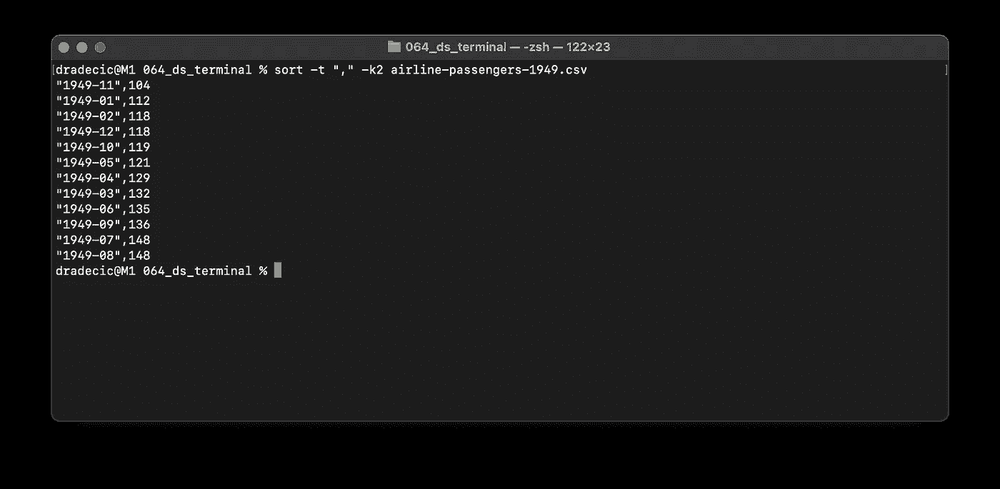

图 8 —按升序对 CSV 文件进行排序(按作者排序)

`-k2`参数指定对第二列进行排序。

如果您想按降序对文件进行排序，您可以指定一个额外的`-r`参数:

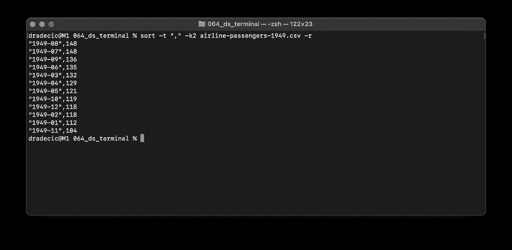

图 9 —按降序对 CSV 文件排序(按作者排序)

# 毫微；纤（10 的负九次方）

虽然从技术上讲不是 shell 命令，但执行它会打开 Nano 编辑器。以下是创建 Python 文件的方法:

```
nano pyfile.py
```

现在，让我们编写一些简单的 Python 代码:

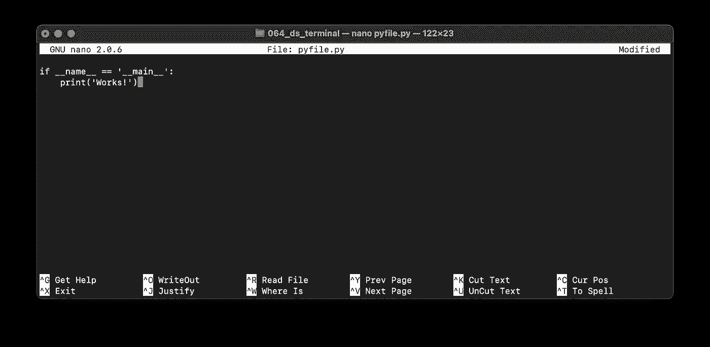

图 10 —用 Nano 编写 Python 代码(图片由作者提供)

您可以在编辑器中编写任何 Python 代码，并进行对于简单的终端命令来说过于复杂的分析。完成后，您可以运行 Python 文件:

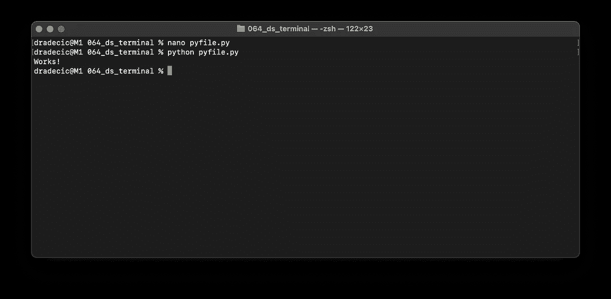

图 11-运行 Python 文件(图片由作者提供)

# 变量

让我们用变量的概念来概括今天的文章。例如，当文件路径变长，或者您需要多次使用它们时，它们会派上用场。

下面是如何声明两个字符串变量并使用`mv`命令将*airline-passengers-1949 . CSV*文件重命名为 *new.csv* :

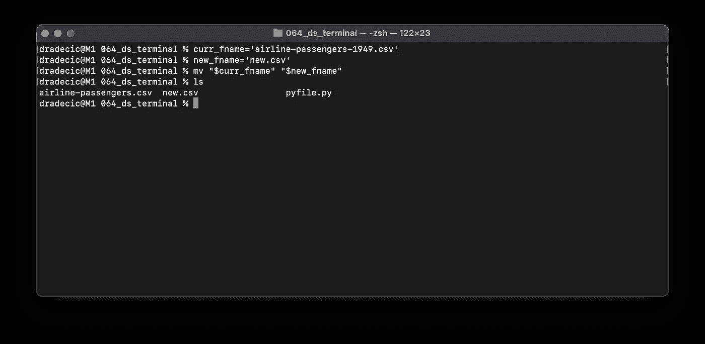

图 12 —使用变量重命名文件(作者图片)

`ls`命令用于列出目录中的文件，正如我们所看到的，重命名操作是成功的。

这就是今天的全部内容——请随意继续阅读下面的最佳选择之一。

*喜欢这篇文章吗？成为* [*中等会员*](https://medium.com/@radecicdario/membership) *继续无限制学习。如果你使用下面的链接，我会收到你的一部分会员费，不需要你额外付费。*

[](https://medium.com/@radecicdario/membership) [## 通过我的推荐链接加入 Medium-Dario rade ci

### 作为一个媒体会员，你的会员费的一部分会给你阅读的作家，你可以完全接触到每一个故事…

medium.com](https://medium.com/@radecicdario/membership) 

# 了解更多信息

*   [2021 年学习数据科学的前 5 本书](/top-5-books-to-learn-data-science-in-2020-f43153851f14)
*   [如何使用 Cron 调度 Python 脚本——您需要的唯一指南](/how-to-schedule-python-scripts-with-cron-the-only-guide-youll-ever-need-deea2df63b4e)
*   [Dask 延迟——如何轻松并行化您的 Python 代码](/dask-delayed-how-to-parallelize-your-python-code-with-ease-19382e159849)
*   [如何使用 Python 创建 PDF 报告—基本指南](/how-to-create-pdf-reports-with-python-the-essential-guide-c08dd3ebf2ee)
*   [即使没有大学文凭也要在 2021 年成为数据科学家](/become-a-data-scientist-in-2021-even-without-a-college-degree-e43fa934e55)

# 保持联系

*   关注我的[媒体](https://medium.com/@radecicdario)以获取更多类似的故事
*   注册我的[简讯](https://mailchi.mp/46a3d2989d9b/bdssubscribe)
*   在 [LinkedIn](https://www.linkedin.com/in/darioradecic/) 上连接