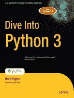

# 学习 Python 编程的 13 大资源

> 原文：<https://towardsdatascience.com/top-13-resources-to-learn-python-programming-46f3b0b74b91?source=collection_archive---------4----------------------->

## 可以免费访问的资源，涵盖从入门到深入教程的所有内容。

照片由[克莱门特·H](https://unsplash.com/@clemhlrdt?utm_source=unsplash&utm_medium=referral&utm_content=creditCopyText)在 [Unsplash](https://unsplash.com/?utm_source=unsplash&utm_medium=referral&utm_content=creditCopyText) 上拍摄

> 编写 Python 代码的乐趣应该在于看到短小、简洁、易读的类，这些类用少量清晰的代码表达了大量的动作——而不是让读者厌烦得要死的大量琐碎代码。
> 
> 吉多·范·罗苏姆

**[**Python**](https://www.python.org/)第四次被关注各种**编程语言的独立软件质量公司 **TIOBE** 评为年度编程语言。**这种流行的原因是**Python 提供的简单性和易用性的完美结合**。**

**此外， **Python 的多功能性和** [**庞大的库集合**](/best-python-libraries-for-machine-learning-and-deep-learning-b0bd40c7e8c) **允许轻松开发驱动许多重要现代领域的应用**，如 Web、 [**人工智能**](https://blog.digitalogy.co/best-examples-of-artificial-intelligence-in-everyday-life/) 、 [**机器学习**](/a-tour-of-machine-learning-algorithms-466b8bf75c0a) 、数据科学、游戏、GUI 等等。**

**这些原因使得 Python 成为许多对学习编程感兴趣的人的首选编程语言。为了帮助你跟上 Python 的潮流，让学习 Python 变得更容易，我们将分享一些最好的网站，它们将涵盖 Python 的所有内容，而不管你的编程经验如何。**

****查看一些关于 Python 的有趣文章—****

** [## 2020 年大一新生热门 Python 面试问答

### 这里列出了大一新生最常被问到的 python 面试问题和答案，涵盖了核心…

blog.digitalogy.co](https://blog.digitalogy.co/python-interview-questions-and-answers-for-freshers/)  [## 你必须知道的 12 项 Python 开发者技能

### Python 开发人员必备的顶级技能

towardsdatascience.com](/top-12-python-developer-skills-you-must-need-to-know-9e2b6c7fc6c)  [## GitHub 上十大热门 Python 项目

### 像这样的 GitHub 项目是人们创造力和才华的完美展示

towardsdatascience.com](/top-10-trending-python-projects-on-github-fb852cd58262) 

# 学习 Python 编程的顶级网站

由于电子学习领域的**推动，互联网现在充斥着**大量学习 Python** 的便利资源，比如 [**视频**](/top-13-youtube-channels-to-learn-python-524442aaab2f) ，在线课程、电子书、网站等等。**

与任何其他网站一样，我们在本文中介绍的 Python 网站可以免费访问，涵盖了从入门到深入教程、练习题等面向 Python 学习者的所有内容。

我们在下面列出了学习 Python 的首选网站。请继续阅读！

# 1.**Python.org**

*   **网址:**[https://www.python.org/](https://www.python.org/)

**Python.org**是所有 Python 事物的圣杯，因为它**拥有 Python 编程语言的官方文档**。但更重要的是，它还提供了大量其他与 Python 相关的东西，比如 Python 下载、信息视频和播客、开发者社区访问、最新新闻、事件以及 Python 在现实世界中的应用。

对于学习者，网站**提供了 Python 各种主题的综合文档、备忘单、外部测验和练习、教程和指南**。绝对的初学者会发现从网站上学习 Python 轻而易举，这要归功于**整齐分类的教程**，这些教程面向以前有或没有任何编程专业知识的学习者。

**对于有 Python 经验的开发人员来说，**他们会发现网站上充满了方便获取的深入的参考资料，**比如指南、书籍和常见问题解答**。包含的帮助部分也使每个人更容易找到东西。

 [## 2020 年必读的 Python 书籍

### 看看吧，你为什么要读它们？

towardsdatascience.com](/python-books-you-must-read-in-2020-a0fc33798bb) 

# 2.学习 Python.org

*   **网址:**[https://www.learnpython.org/](https://www.learnpython.org/)

大多数网站都采用僵硬的方法来涵盖 Python 中的主题，**learnpython.org**则更多地采用互动的方法来完成这项工作。learnpython.org**不仅仅是向读者展示所有关于 Python 的信息，而是更加强调实践学习**。该网站是**你能想到的几乎每一个 Python 主题的交互式 Python 教程**的家园。

**Python 新手**使用网站探索 Python 中的各种主题并测试他们对浏览器的理解是没有任何困难的。此外，学习者还将获得一系列高级教程，如 decorators、serialization、正则表达式、生成器、闭包等，以及一些与数据科学相关的教程。

你可能会惊讶地知道， **Ron Reiter，**learnpython.org 的创造者，同样涵盖了很多面向初学者的编程语言，比如 [Java](https://www.java.com/en/) ，HTML，C， [JavaScript](https://www.javascript.com/) ， [PHP](https://www.php.net/) 等等。

 [## 给 Python 开发者的 10 个很酷的 Python 项目想法

### 您可以使用 Python 构建的有趣想法和项目列表

towardsdatascience.com](/10-cool-python-project-ideas-for-python-developers-7953047e203) 

# 3.面向初学者的 Python

*   **网址:**[https://www.pythonforbeginners.com/](https://www.pythonforbeginners.com/)

**面向初学者的 Python****提供了大量与 Python 相关的内容**供好奇的个人学习编程语言。当谈到教授 Python 的基础知识时，网站**以广泛但对初学者友好的教程的形式为新手提供了所有必要的内容。**

他们的教程涵盖了从设置 Python、变量、函数、文档字符串、循环、列表、操作符、异常处理到许多其他基础主题的所有内容。不仅仅是这些，该网站还提供了一个有见地的阅读部分，以一种易于理解的格式涵盖了这些介绍性的主题。

如果您觉得您已经牢牢掌握了网站上列出的主题，为什么不试试他们的 Python 代码示例部分，并评估您的立场呢？

 [## Python 代码示例-PythonForBeginners.com

### 这个页面包含了我们到目前为止在网站上发布的所有 Python 脚本。使用 pywhois 的例子 pywhois 是一个 Python…

www.pythonforbeginners.com](https://www.pythonforbeginners.com/code-snippets-source-code/python-code-examples) 

# 4.一个字节的 Python

*   **网址:**【https://python.swaroopch.com 

**Swaroop C H 的** **一个字节的 Python** 本质上是他的**通俗易懂且免费的 Python 书籍**的网站改编，也就是针对初学者的**。**他的网站非常直观的侧面板以整洁和结构良好的方式为学习者展示了所有的 Python 入门主题。除了为新手介绍 Python 的基础知识之外，作者还提供了大量关于安装和设置 Python 的内容。

每个主题都有一个简单的介绍，一个示例程序，它的输出，以及它工作背后的详细解释。尽管该网站面向 Python 新手，但有经验的 Python 开发人员也可以使用该网站从新的角度重温基本概念。

 [## 2020 年你必须使用的最好的 Python IDEs 和代码编辑器

### 具有显著特性的顶级 Python IDEs 和代码编辑器

towardsdatascience.com](/best-python-ides-and-code-editors-you-must-use-in-2020-2303a53db24) 

# 5.牛逼的 Python

*   **Github Stars:** 92.4k
*   **Github 乡亲:** 18.1k
*   **Github 链接:**[https://github.com/vinta/awesome-python](https://github.com/vinta/awesome-python)

Python 的多功能性使其成为创建各种强大解决方案的完美编程语言，开发人员可以立即将这些解决方案插入到其他项目中。正是 Python 的这一特性导致了数百个应用程序和库的诞生。当谈到列出这些巨大的资源集合，如库、 **GitHub repos 和软件时，没有人比 GitHub 上的“Awesome”系列做得更好。**

Vinta Chen 的 GitHub repo 包含了 Python 基本组件、库、工具等的详尽列表，比如构建工具、管理面板、数据分析工具、调试工具、图像处理工具、测试工具、RESTful APIs 等等。这个列表很长，我们强烈建议 Python 开发人员将这个 GitHub repo 加入书签，以便为他们的下一个项目快速找到合适的组件。

 [## 学习 Python 的 11 大 Github 库

### 学习 Python 的流行 GitHub 库

towardsdatascience.com](/top-11-github-repositories-to-learn-python-e75e8676757a)  [## 每个 Python 开发者的最佳 Python 库

### 开发人员应该在他们的项目中使用的 Python 库。

towardsdatascience.com](/best-python-libraries-for-every-python-developer-77daab4fa40e) 

# 6.谷歌的 Python 类

*   **网址:**[https://developers.google.com/edu/python](https://developers.google.com/edu/python)

互联网巨头谷歌是 Python 的狂热用户，并在其几项服务中使用了 Python。为了鼓励人们学习 Python，他们的 **Google for Education 平台提供了一个 Python 类**，它涵盖了 Python 中的几个关键主题。这个免费的课程**包括像演讲视频、书面材料和大量练习这样的资源。**

除了对 Python 的简单介绍之外，本课程的主题是在现代应用程序中更常用的主题，这使得它更适合具有一定 Python 编程经验的个人。

更具体地说，这门课涵盖的主题包括初始设置、介绍、字符串、列表、排序、字典和文件、正则表达式以及一些书面和视频形式的实用工具。

**查看顶级谷歌人工智能工具—**

 [## 面向所有人的顶级谷歌人工智能工具

### 使用谷歌人工智能中心将想法变为现实

towardsdatascience.com](/top-google-ai-tools-for-everyone-60346ab7e08) 

# 7.蟒蛇斑

*   **网址:**[https://pythonspot.com](https://pythonspot.com/)

**Python Spot** 是最拥挤的网站之一，无疑是学习 Python 编程语言的最佳网站之一。平台**涵盖了来自 Python 的大量初学者友好的主题。**

此外，Python Spot 网站涵盖了 Python 世界中如此多的内容，以至于您不会觉得有必要从一个网站跳到另一个网站来搜索特定主题的教程。对于初学者，该网站不仅提供了一个包罗万象的编程训练营课程，还提供了 Python 中每个基础主题的教程。

除了基础知识之外，Python Spot 还涵盖了各种各样的教程来帮助您使用数据库、 [**web 开发**](https://blog.digitalogy.co/best-python-frameworks-for-web-development-2020/) 、GUI 开发、HTTP 客户端和服务器网络、图形绘制、游戏开发等等。

 [## 10 家使用 Python 的世界级公司

### Python 正被 IT 界的一些巨头积极使用

towardsdatascience.com](/10-world-class-companies-using-python-26cde24919a8)  [## 面向数据科学的顶级 Python 库

### 面向数据科学的流行 Python 库概述

towardsdatascience.com](/top-python-libraries-for-data-science-c226dc74999b) 

# 8.Python 的搭便车指南

*   **网址:**[https://docs.python-guide.org/](https://docs.python-guide.org/)

《Python 搭便车指南》一书的网站改编本**为理解 Python 中的各种主题提供了一个自以为是的指南。该网站面向 Python 初学者和老手，提供帮助你设置 Python 和开始 Python 编程所需的一切。**

该网站还提供了一些适用于常见应用程序开发场景的**高度推荐的工具，**如网络应用程序、数据抓取、命令行应用程序、GUI 应用程序、数据库、密码学等等。

为了提高 Python 代码的质量，该网站有一个专门的部分，为构建、测试、记录和有效记录您的项目提供有价值的提示。

 [## 面向开发者的 10 大 Python GUI 框架

### 构建交互式 GUI 的最佳 Python GUI 框架

towardsdatascience.com](/top-10-python-gui-frameworks-for-developers-adca32fbe6fc)  [## 应用开发的 8 大 Python 工具

### 每个现代应用开发者都应该知道的工具。

medium.com](https://medium.com/analytics-vidhya/top-8-python-tools-for-app-development-df63bd127cf2) 

# 9.深入研究 Python 3

来源:[潜入 Python 3](http://www.diveintopython3.net/)

*   【http://www.diveintopython3.net/】网站:

**还记得 Python** 的一个字节吗，这是我们几分钟前讨论过的另一个 Python 学习网站？Mark Pilgrim 在他的书《深入 Python 3》中采用了类似的方法，并为学习者提供了网站版本。

如果您对 Python 2 的概念有基本的理解，但是想跳到最新的 Python 3，那么这个资源将是您的最佳选择。该网站在 Python 3 中引入的变化以及如何让自己和程序适应现在标准版本的编程语言方面做得非常好。

但是不要让这给你留下一点都不适合初学者的印象。该网站涵盖了从设置 Python 到让您开始编写第一个程序，以及让您熟悉其他重要的 Python 概念，如数据类型、重构、序列化、类、迭代器等等。

# 10.全栈 Python

*   **网址:**[https://www.fullstackpython.com/](https://www.fullstackpython.com/)

**全栈 Python** 是一个为 Python 学习者准备的**惊人且完全免费的便利资源集合**。与我们列表中的其他几个条目类似，Full Stack Python 也从一本书重新构建成了它的网站格式。

该网站假设学习者对 Python 有基本的了解，这对于完全的新手来说是一个不公平的建议。但是如果你对 Python 基础有很强的理解，我们真心实意地向你推荐这个网站。为什么？因为网站的目标是 [**通过指导你开发你的**第一个全面的 Python 应用程序来测试你的 Python 技能****](/top-12-python-developer-skills-you-must-need-to-know-9e2b6c7fc6c) 。

该网站提供了 Python 中各种主题的教程，这些主题与 web 应用程序开发、应用程序部署、DevOps 等相关。它还介绍了其他几个有用的主题，如开发环境、使用数据库、测试技术、API、数据分析和可视化。

 [## 现实世界中的 16 大 Python 应用

### 看看 Python 在现实世界中的各种应用

towardsdatascience.com](/top-16-python-applications-in-real-world-a0404111ac23)  [## 2020 年 Web 开发的 10 个最佳 Python 框架

### 最近一次更新是在 Claire D .上。这些年来，Python 已经成为…

blog.digitalogy.co](https://blog.digitalogy.co/best-python-frameworks-for-web-development-2020/) 

# 11.真正的 Python

*   **网址:**[https://realpython.com/](https://realpython.com/)

虽然**Python.org**采用了**更专注于主题的方法**来涵盖 Python 相关的主题，但是**真正的 Python 采用了一种稍微更具教育性的方法。**被认为是学习 Python 的最令人惊叹的在线资源之一，它的成功来自于它的**广为人知的信息丰富的播客系列，称为真正的 Python 播客。**

回到网站，您会发现一系列的部分，包括 Python 教程、视频课程、测验、学习路径等等。这里需要注意的一点是，尽管该网站免费提供大部分内容，但也有一个订阅选项，可以向学习者开放大量的资源。

无论您是学习 Python 的学生、中级开发人员还是专业开发人员，Real Python 都为您提供了所有合适的学习途径，可以让您迅速掌握 Python。

 [## 真正的 Python

### 超越基础的 Python 教程和培训视频。🎓🐍获取免费的 Python 技巧和…

www.youtube.com](https://www.youtube.com/channel/UCI0vQvr9aFn27yR6Ej6n5UA) 

# 12.Python 大师

*   **网址:**[https://thepythonguru.com/](https://thepythonguru.com/)

**Python 大师**是另一个 Python 学习网站，旨在**为新一批 Python 开发者简化 Python。**该网站非常深入地涵盖了 Python 的基本主题，每个主题或教程都在前一个主题的基础上进行扩展，以提供更平滑的过渡。

一旦你浏览了网站上的基础主题，然后**提供了一波适合更高级学习者的 Python 主题**，比如生成器、正则表达式、递归函数、虚拟化、字符串格式化等等。

更进一步，Python Guru 网站还包括 Python 内置函数、MySQLdb 数据库访问和 Django web 开发的教程。

# 13.**谈 Python**

*   **网址:**[https://talkpython.fm/](https://talkpython.fm/)

如果你喜欢播客，你会发现 **Talk Python To Me** 网站既有趣又发人深省。这些播客最大的好处是你可以随时随地收听它们。Talk Python 网站**提供了一个由 Michel Kennedy 主持的优秀的每周播客系列，**他在他的 **45 分钟长的播客中采访了 Python 爱好者和创造者。**

该播客涵盖了从 Python 世界的最新动态到其教育内容的所有内容，并且是一个从行业专家那里获得方便的技巧和见解的绝佳场所。目前，该网站拥有近 300 集关于一系列有趣且引人入胜的讨论话题的内容。

尽管该网站因其播客而闻名，但该平台也提供有益的在线视频课程，但请记住，这些课程是有偿的。

 [## 谈论 Python

### “与我谈论 Python”是由迈克尔·肯尼迪主持的每周播客。该节目还涵盖了大量的 Python 主题…

www.youtube.com](https://www.youtube.com/channel/UCKPSmMfDsXTKrCZApukcJ7A)  [## 你应该听的八大 Python 播客

### 几个最好的 Python 播客，可以给你一个基于现实世界问题的更实际的学习体验。

towardsdatascience.com](/top-8-python-podcasts-you-should-be-listening-to-f3bf07974486) 

**奖励资源—**

*   如何像计算机科学家一样思考
*   [官方 Python 教程](https://docs.python.org/3/tutorial/)
*   [艰难地学 Python](https://learnpythonthehardway.org/book/)
*   [用 Python 发明](https://inventwithpython.com/)
*   [学习 Python —初学者完全教程【freeCodeCamp.org】](https://www.youtube.com/watch?v=rfscVS0vtbw)
*   [教程点](https://www.tutorialspoint.com/python/)
*   [SoloLearn](https://www.sololearn.com/Course/Python/)
*   [代码学院](https://www.codecademy.com/learn/learn-python)

# 结论

> 祝您的 Python 编码之旅一切顺利

显而易见，Python 在过去几年里发生了巨大的变化，已经成为在不同领域工作的众多开发人员的首选编程语言。得益于这些改进，Python 在企业中的采用率大幅提高。这种在行业中更广泛的采用直接转化为编程语言更好的未来，以及 Python 开发人员的职业机会。

这对于新手和资深开发人员来说都是一个很好的信号。总结一下，我们在本文中分享了 10 多个 Python 学习网站，这应该会让你更容易找到合适的学习资源，现在我们想听听你对此的想法。

> ***注:*** *为了消除各种各样的问题，我想提醒你一个事实，这篇文章仅代表我想分享的个人观点，你有权不同意它。*

如果你有更多的建议，我很想听听。

# 更多有趣的读物

我希望这篇文章对你有用！以下是一些有趣的读物，希望你也喜欢

 [## 2020 年要学习的 12 大数据科学技能

### 必须用这些数据科学技能提升自己的技能

towardsdatascience.com](/top-12-data-science-skills-to-learn-in-2020-5f635d7d98bf)  [## 2020 年必读的机器学习书籍

### 看看吧，你为什么要读它们？

towardsdatascience.com](/machine-learning-books-you-must-read-in-2020-d6e0620b34d7)  [## 12 个适合初学者和专家的酷数据科学项目创意

### “到目前为止，您已经完成了多少个数据科学项目？”

towardsdatascience.com](/12-cool-data-science-projects-ideas-for-beginners-and-experts-fc75b5498e03)  [## 2020 年必读的数据科学书籍

### 看看吧，你为什么要读它们？

towardsdatascience.com](/data-science-books-you-must-read-in-2020-1f30daace1cb)  [## Python vs. Node。JS:哪个最适合你的项目？

### 使用一组预定义的因素对 Python 和 Node.js 进行详细比较

towardsdatascience.com](/python-vs-node-js-which-one-is-best-for-your-project-e98f2c63f020) 

> ***关于作者***
> 
> ***克莱尔 D*** *。在*[***digital ogy***](https://digitalogy.co/)***—****是一个内容制作者和营销人员。这是一个技术采购和定制匹配市场，根据全球各地的特定需求，将人们与预先筛选的&顶级开发人员和设计人员联系起来。与我连线上* [***中***](https://medium.com/@harish_6956)**[***Linkedin***](https://www.linkedin.com/in/claire-d-costa-a0379419b/)***&***[***推特***](https://twitter.com/ClaireDCosta2) ***。*******