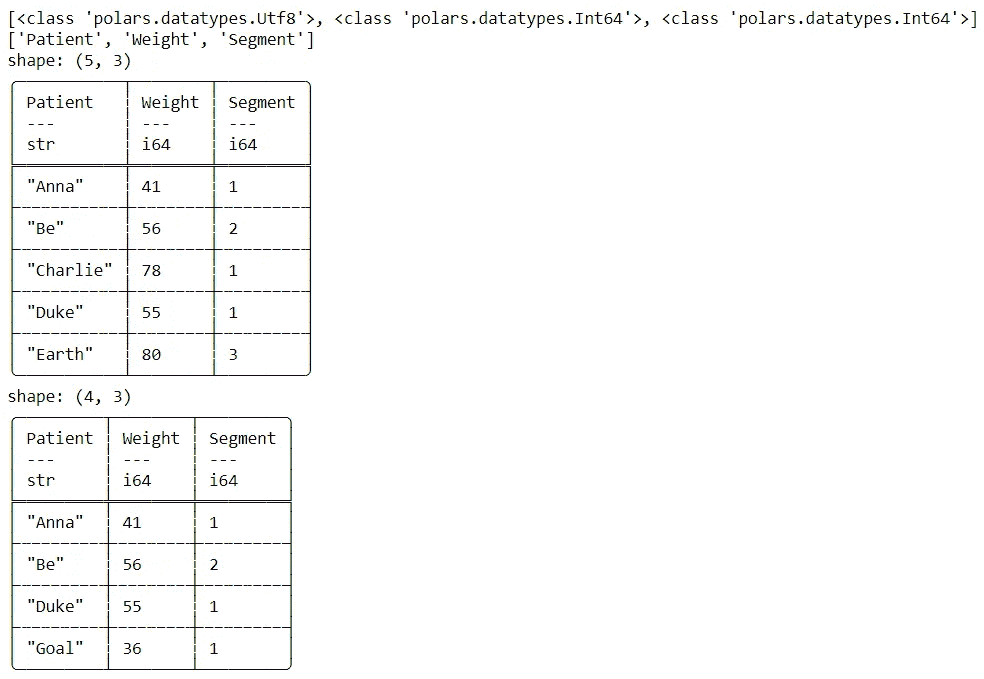
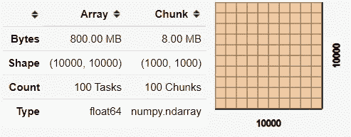

# 熊猫的三大替代 Python 包

> 原文：<https://towardsdatascience.com/top-3-alternative-python-packages-for-pandas-d125627ce349?source=collection_archive---------4----------------------->

## 使用 Python 进行数据分析的备选工作流比较


[活动发起人](https://unsplash.com/@campaign_creators?utm_source=medium&utm_medium=referral)在 [Unsplash](https://unsplash.com?utm_source=medium&utm_medium=referral) 上的照片

> 如果你喜欢我的内容，并想获得更多关于数据或作为数据科学家的日常生活的深入知识，请考虑在这里订阅我的[时事通讯。](https://cornellius.substack.com/welcome)

对于许多现代数据科学家来说，Python 是他们日常工作中使用的编程语言——因此，数据分析将使用最常用的数据包之一来完成，即 **Pandas** 。许多在线课程和讲座会介绍 Pandas 作为使用 Python 进行数据分析的基础。

在我看来，Pandas 仍然是用 Python 进行数据分析的最有用和可行的包。然而，为了便于比较，我想向您介绍几种熊猫套餐。**我不打算说服人们从熊猫换成另一种套餐**，但我只想让人们知道熊猫套餐是有替代品的。

那么，这些熊猫备选套餐是什么呢？让我们开始吧！

# 1.极地

[Polars](https://pola-rs.github.io/polars-book/user-guide/index.html) 是一个数据帧库，通过实现 [Rust](https://www.rust-lang.org/) 编程语言，以[箭头](https://arrow.apache.org/)为基础，设计用于**快速光照时间**处理数据。Polars 的前提是给用户一个比熊猫套餐更快捷的体验。使用 Polars 包的理想情况是当你的数据对于熊猫来说太大，而对于 Spark 来说又太小。

对于熟悉 Pandas 工作流的人来说，Polars 不会有太大的不同——有一些额外的功能，但总体来说它们非常相似。让我们尝试使用 Polars 软件包。首先，我们需要在您的 Python 环境中安装 Polars。

```
pip install polars
```

之后，我将使用 Polars 包创建一个 DataFrame 示例。

```
import polars as pl
df= pl.DataFrame({'Patient':['Anna','Be','Charlie','Duke','Earth','Faux','Goal','Him'],
                  'Weight':[41,56,78,55,80,84,36,91],
                  'Segment':[1,2,1,1,3,2,1,1] })
df
```


作者创建的图像

与 Pandas DataFrame 类似，界面和数据分析工作流程也很熟悉。有一点不同的是数据类型在数据的顶部，并且没有显示索引。让我们尝试使用 Polars 中的一些功能。

```
#Print DataFrame datatype
print(df.dtypes)#Print DataFrame columns
print(df.columns)#Print DataFrame top 5
print(df.head())#Conditional Selection
print(df[df['Weight'] < 70])
```



作者图片

Polars 中有许多与 Pandas 功能相同的可用功能，并且有条件选择的可能性。我并没有说熊猫身上所有的功能在极地也有。比如我想用`iloc`做索引选择的时候。

```
df.iloc[1]
```


作者图片

当我想选择索引时，出现了错误。这是因为熊猫指数的概念不适用于极地。

适用于极坐标的一个特殊概念是**表达式**。在 Polars 中，你可以产生一个连续执行的函数(称为表达式)并用管道连接在一起。让我们用一个例子来理解这个概念。

```
#Parallel Expression df[[ #Expression for executing the stats (sum) and create the column names "sum"
        pl.sum("Weight").alias("sum"),
        pl.min("Weight").alias("min"),
        pl.max("Weight").alias("max"),
        pl.std("Weight").alias("std dev"),
        pl.var("Weight").alias("variance"),
]]
```


作者图片

如果我们借用熊猫的概念，通常我们在上面所做的是类似于熊猫的条件选择。然而，在我们使用 Polars 的情况下，当我们传递表达式时，表达式执行会产生另一个数据集。

使用 Polars 的主要卖点仍然是它们更快的执行时间。那么，与熊猫相比，Polars 的执行时间有多快呢？在这种情况下，让我借用 Polars 文档中的图像示例来进行比较。


内连接 Polars vs. Pandas 执行时间(来源:[https://github . com/pola-RS/Polars/blob/master/examples/10 _ minutes _ to _ pypolars . ipynb](https://github.com/pola-rs/polars/blob/master/examples/10_minutes_to_pypolars.ipynb)

上图是使用三种不同方法进行内部连接时的时间比较:Polars 内部连接、Pandas 内部连接和 Polars 内部连接平行。如您所见，与 Polars 相比，当数据变大时，Pandas 的执行时间会变慢。在较小的数据量中，执行时间可能没有太大的差别，但是当数据量较大时，这一点就变得更清楚了。

# **2。Dask**

[Dask](https://dask.org/) 是 Python 中并行计算的 Python 包。Dask 中有两个主要部分，有:

1.  **任务调度。**类似于[气流](https://airflow.apache.org/)，用于通过自动执行任务来优化计算过程。
2.  **大数据采集**。并行数据框，如 Numpy 数组或 Pandas 数据框对象—专用于并行处理。

**更简单地说**，Dask 提供了一个数据帧或数组对象，就像你在 Pandas 中可以找到的那样，但是它是并行处理的，以获得更快的执行时间，并且它提供了一个任务调度器。

因为这篇文章只涉及 Pandas 的替代方案，所以我们不会测试任务调度功能。相反，我们将关注 Dask 数据框对象。让我们尝试几个简单的 Dask 函数示例——但是首先，我们需要安装 Dask 包(Anaconda 默认有这个包)。

```
#If you want to install dask completely
python -m pip install "dask[complete]"#If you want to install dask core only
python -m pip install dask
```

安装 dask 后，让我们试试 Dask 函数。最初，我们可以启动一个仪表板来监控数据处理。

```
import dask
from dask.distributed import Client, progressclient = Client(processes=False, threads_per_worker=4,
                n_workers=1, memory_limit='2GB')
client
```


作者图片

Dask 在不同的端口中为您提供了一个客户端仪表板，您可以在启动它之后访问它。当您单击仪表板链接时，它将类似于下图。


作者图片

我要说的是，这个仪表板很容易理解，它包括了您当前与 dask 的所有活动。您可以尝试查看 dask dashboard 中所有漂亮的选项卡，但现在让我们继续。现在让我们试着创建一个 dask 数组。(类似 Numpy 拥有的东西)

```
import dask.array as da
x = da.random.random((10000, 10000), chunks=(1000, 1000))
x
```



图片来自作者

当 dask 数组被创建时，你会收到矩阵信息，就像上面一样。这个数组将成为 dask 数据帧的基础。让我们尝试从 dask 创建一个数据集，以获得更详细的示例。

```
df = dask.datasets.timeseries()
df
```


作者图片

Dask 数据框具有与 Pandas 数据框对象相似的结构，但是因为 Dask 数据框是惰性的，所以它不会在 Jupyter 笔记本上打印数据。然而，您可以在 Dask 上执行 Pandas 中存在的许多功能。让我们举几个例子。

```
df.head()
```


作者图片

如果您正在使用`.head`功能，您可以打印前五个数据。如果要做条件选择，还是和熊猫差不多。虽然，它需要一个特殊的函数来执行。让我向您展示一个示例代码。

```
df[df['x'] >0.9]
```


作者图片

正常做的话，会获得 dask 数据帧结构。如果您想要获取熊猫数据帧，您需要使用`.compute`功能。

```
df[df['x'] >0.9].compute()
```


作者图片

这是计算 dask 数据框条件选择时获得的实际数据。**dask 上的一切都是关于并行和快速计算**，所以如果你决定使用 dask，最好熟悉熊猫。dask 的理想情况是当你有一个高计算量的数据集，但是如果你的数据可以用你的计算机内存轻松处理，那么就坚持用 Pandas。你还可以用 dask 做很多事情。我建议你访问他们的网站了解更多。

# 3.Vaex

[Vaex](https://vaex.io/docs/index.html) 是一个 Python 包，用于处理和探索大的表格数据集，接口类似熊猫。Vaex 文档显示，它可以计算*统计数据*，如均值、总和、计数、标准差等。在一个 *N 维网格*到**上，每秒有十亿** (109)个对象/行**。这意味着 Vaex 是 Pandas 的替代方案，也用于改善执行时间。**

**Vaex 的工作流程类似于 Pandas API，这意味着如果你已经熟悉 Pandas，那么使用 Vaex 并不困难。让我们从安装 Vaex 开始这个例子。**

```
pip install vaex
```

**安装完 Vaex 包后，我们可以尝试使用数据集示例来查看 Vaex 数据框。**

```
import vaex
df = vaex.example()
df
```

****

**作者图片**

**与 Pandas 应用程序类似，您可以进行条件选择。**

```
df[df['x'] > 88]
```

****

**作者图片**

**然而，Vaex 文档中写道，“Vaex 的一个核心特性是**在 N 维网格上极其高效的统计计算**。这对大型数据集的可视化非常有用。”让我们尝试使用简单的统计方法。**

```
df.count(), df.max('x'), df.mean('L')
```

****

**作者图片**

**结果显示为一个数组对象，其中包含 value 数据类型的详细信息。Vaex 销售的另一个功能是绘图功能，您可以将统计功能应用于绘图功能。例如，我没有使用通常的计数统计，而是使用“E”列的平均值，其限制为只显示 99.7%的数据。**

```
df.plot1d(df['x'], what='mean(E)', limits='99.7%')
```

****

**作者图片**

**对于更高级的绘图功能，您可以访问 [Vaex 文档](https://vaex.io/docs/tutorial.html#Plotting)。重要的是要知道，Vaex 的卖点是其快速统计计算和大数据可视化探索功能。然而，如果你有一个更小的数据集，你可以坚持用熊猫。**

# **结论**

**作为一名使用 Python 作为分析工具的数据科学家，您肯定会使用 Pandas 包来帮助您的数据探索。但是，有几个 Pandas 替代方案可供您使用，尤其是在处理大数据时，它们是:**

1.  **极地**
2.  **达斯克**
3.  **沃**

**希望有帮助！**

**访问我的[**LinkedIn**](https://www.linkedin.com/in/cornellius-yudha-wijaya/)**或 [**Twitter**](https://twitter.com/CornelliusYW)****

> ****如果您没有订阅为中等会员，请考虑通过[我的推荐](https://cornelliusyudhawijaya.medium.com/membership)订阅。****