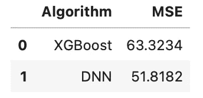
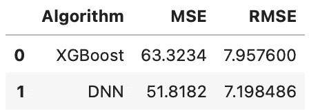
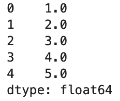
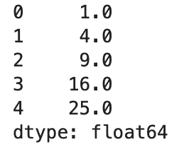
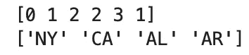
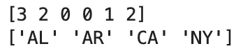

# 你不知道的熊猫的三大功能

> 原文：<https://towardsdatascience.com/top-3-pandas-functions-you-didnt-know-existed-9789863cde25?source=collection_archive---------10----------------------->

## 你不会偶然发现这些——我保证！


照片由[史蒂夫丁](https://unsplash.com/@_tommytexter?utm_source=unsplash&utm_medium=referral&utm_content=creditCopyText)在 [Unsplash](https://unsplash.com/?utm_source=unsplash&utm_medium=referral&utm_content=creditCopyText) 上拍摄

熊猫无需介绍。多年来，它一直是 Python 生态系统中的首选库，并将一直存在下去。库中有数百个可用的函数，即使对于最有经验的用户来说，知道所有这些函数也是不可行的。

今天你将学习三个不太受关注的有价值的函数。几乎在任何数据科学指南中都找不到它们，尽管它们在日常分析工作流中很有帮助。

你需要安装 Numpy 和熊猫来跟随。

# eval()

您可以使用`eval()`函数将 Python 表达式作为字符串进行求值。以下是您应该了解的参数:

*   `expr: str`-要计算的表达式必须仅包含 Python 表达式。
*   `target: object` —赋值的目标对象—数据帧。
*   `inplace: bool` —指示是否应该修改`target`。`False`默认，所以返回一个副本。

让我们看看它在实践中是如何工作的。以下代码片段创建了一个虚拟数据帧，显示虚构的机器学习模型性能:

```
df = pd.DataFrame({
    'Algorithm': ['XGBoost', 'DNN'],
    'MSE': [63.3234, 51.8182]
})
```

它看起来是这样的:



图片 1 — eval() (1)(图片由作者提供)

现在，您将使用`eval()`函数来计算基于 MSE 的 RMSE:

```
pd.eval('RMSE = df.MSE ** 0.5', target=df)
```

以下是新数据帧的外观:



图片 2 — eval() (2)(图片由作者提供)

函数提供了创建新属性或更改现有属性的替代方法。它没有提供任何突破性的功能。

你可以在这里了解更多关于[的功能。](https://pandas.pydata.org/docs/reference/api/pandas.eval.html#pandas.eval)

# 插值()

`interpolate()`函数使用指定的插值方法填充缺失值。以下是您应该了解的参数:

*   `method: str` —插值法。`linear`默认。它可以有许多值，因此检查[文档](https://pandas.pydata.org/docs/reference/api/pandas.Series.interpolate.html#)以找到合适的值。
*   `axis: int or str`-要沿其进行插值的轴。
*   `limit: int` —可选参数，用于指定要填充的连续缺失值的最大数量。
*   `inplace: bool` —指示是否应修改原始数据帧。`False`默认。

让我们看看如何使用这个函数。下面的代码片段创建了一个熊猫序列，其中包含前五个整数，第四个整数缺失。`interpolate()`功能应自动确定`4`是正确的插值值:

```
s1 = pd.Series([1, 2, 3, np.nan, 5])
s1.interpolate()
```

结果如下:



图片 3-interpolate()(1)(图片由作者提供)

但是如果这种关系不是线性的呢？下面是列表值之间的二次关系示例:

```
s2 = pd.Series([1, 4, 9, np.nan, 25])
s2.interpolate(method='polynomial', order=2)
```

结果如下:



图片 4-interpolate()(2)(图片由作者提供)

非常管用！默认情况下，在上面的例子中调用`interpolate()`会用`17.0`填充丢失的值，因为这是周围元素的平均值。这不是你想要的。

你可以在这里了解更多关于[的功能。](https://pandas.pydata.org/docs/reference/api/pandas.Series.interpolate.html#)

# 因式分解()

您可以使用`factorize()`函数将对象编码为枚举类型或分类变量。以下是您应该了解的参数:

*   `values: sequence` —要编码的一维值序列。
*   `sort: bool` —指示是否应对`values`进行分类。`False`默认情况下。
*   `na_sentinel: int` —标记缺失值的值。如果`None`，丢失的值将被删除。

让我们看看它在实践中是如何工作的。以下代码片段分解了美国各州的虚拟列表，但没有进行排序:

```
codes, uniques = pd.factorize(
    values=['NY', 'CA', 'AL', 'AL', 'AR', 'CA']
)print(codes)
print(uniques)
```

结果如下:



图片 5 —因式分解()(1)(图片由作者提供)

`factorize()`函数返回一个元组，因此将结果存储到两个变量中是一个好的做法。

如果排序很重要，您可以指定`sort=True`:

```
codes, uniques = pd.factorize(
    values=['NY', 'CA', 'AL', 'AL', 'AR', 'CA'], 
    sort=True
)print(codes)
print(uniques)
```

结果如下:



图片 6 —因式分解()(2)(图片由作者提供)

Pandas 自动计算出它应该按字母顺序排列这些值。干净利落。

你可以在这里了解更多关于[的功能。](https://pandas.pydata.org/docs/reference/api/pandas.factorize.html#pandas.factorize)

# 最后的想法

似乎没有熊猫不能做的事情。每个版本都添加了越来越多的功能，因此不时查看文档是值得的。谁知道呢，也许你花几个小时手工实现的东西已经内置到库中了。检查一下也无妨。

你有喜欢的鲜为人知的熊猫功能吗？请在下面的评论区告诉我。

喜欢这篇文章吗？成为 [*中等会员*](https://medium.com/@radecicdario/membership) *继续无限制学习。如果你使用下面的链接，我会收到你的一部分会员费，不需要你额外付费。*

<https://medium.com/@radecicdario/membership>  

# 保持联系

*   在[媒体](https://medium.com/@radecicdario)上关注我，了解更多类似的故事
*   注册我的[简讯](https://mailchi.mp/46a3d2989d9b/bdssubscribe)
*   在 [LinkedIn](https://www.linkedin.com/in/darioradecic/) 上连接