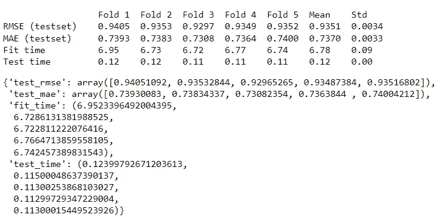
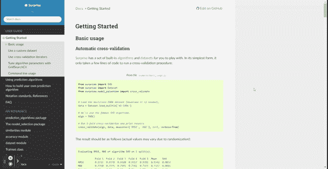
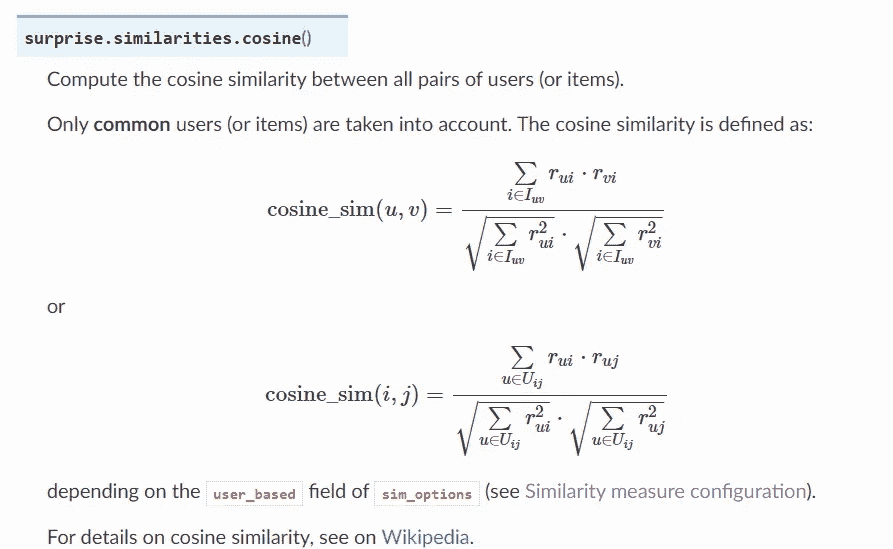
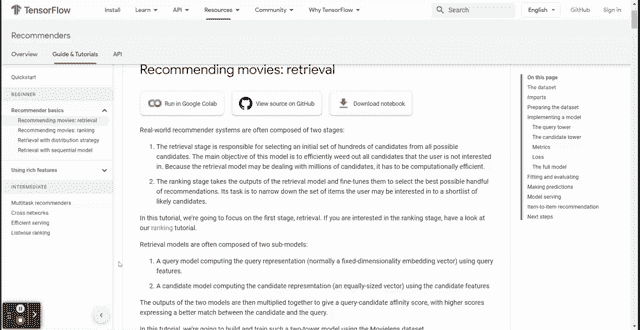
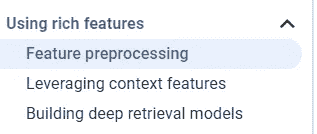
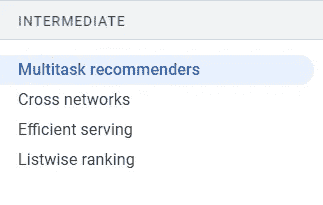

# 学习推荐系统的前 3 个 Python 包

> 原文：<https://towardsdatascience.com/top-3-python-package-to-learn-the-recommendation-system-bb11a916b8ff?source=collection_archive---------1----------------------->

## 从这些包中学习，提升您的推荐系统知识


维多利亚诺·伊斯基耶多在 [Unsplash](https://unsplash.com?utm_source=medium&utm_medium=referral) 上的照片

推荐系统是一个数据科学问题，它根据历史数据预测用户或客户想要什么。推荐系统有两种常见的工作方式——协同过滤和基于内容的过滤。

你对上面的术语感到熟悉吗？也许是，也许不是。无论如何，本文旨在使用这三个顶级 Python 包更好地理解推荐系统。这些包裹是什么？让我们开始吧！

# 1.惊喜

[Surprise](https://github.com/NicolasHug/Surprise) 是一个开源的 Python 包，用于构建基于评分数据的推荐系统。SurPRISE 这个名字是简单的 Python 推荐系统引擎的缩写。该包提供了构建推荐系统所需的所有工具，包括加载数据集、选择预测算法和评估模型。

让我们安装软件包来了解更多关于推荐系统的信息。

```
pip install scikit-surprise
```

安装包之后，我们试着在教程包的基础上搭建一个推荐系统。我们这样做是为了看看这个包是否被正确安装。

```
from surprise import SVD
from surprise import Dataset
from surprise.model_selection import cross_validate# Load the movielens-100k dataset (download it if needed).
data = Dataset.load_builtin('ml-100k')# Use the famous SVD algorithm.
algo = SVD()# Run 5-fold cross-validation and print results.
cross_validate(algo, data, measures=['RMSE', 'MAE'], cv=5, verbose=True)
```



作者图片

如果您可以看到上面的输出，那么您就可以开始了。上面的代码通过评级并使用 SVD 算法来分析数据集；我们创建了推荐系统。我们评估的指标是 RMSE 和 MAE，以 5 折作为评估方法。

如果我们想进一步了解算法和评估的工作原理，我们可以访问[惊喜文档](https://surprise.readthedocs.io/en/stable/index.html)。开发人员表示，他们非常重视解释算法每个细节的文档。这就是为什么我们要为我们的材料学习探索文档。



作者 GIF

如果我们看入门部分，文档中充满了关于为推荐系统开发机器学习预测并对其进行评估的学习材料。

如果我们查看预测算法部分，我们将获得关于使用基线估计和相似性度量的估计的更详细的部分。这部分写得很好，让你理解推荐系统中使用的基本算法。


作者图片

该文档还为您提供了学习材料的绝佳选择；我建议您从以下部分开始，了解更多关于模型和评估的信息:

*   [预测 _ 算法包](https://surprise.readthedocs.io/en/stable/prediction_algorithms_package.html)
*   [车型 _ 选择包](https://surprise.readthedocs.io/en/stable/model_selection.html)
*   [相似性模块](https://surprise.readthedocs.io/en/stable/similarities.html#)
*   [精度模块](https://surprise.readthedocs.io/en/stable/accuracy.html)
*   [数据集模块](https://surprise.readthedocs.io/en/stable/dataset.html)

我喜欢这个文档中所有的计算和公式都写得很详细，这样你就可以理解在引擎盖下发生了什么。例如，余弦相似度的计算在下图中写得很清楚。



作者图片

# 2.TensorFlow 推荐器

TensorFlow 框架包含一个构建推荐系统的库，名为 [TensorFlow 推荐器](https://github.com/tensorflow/recommenders)。与其他包一样，TensorFlow 推荐器包含数据集示例、推荐器算法、模型评估和部署。

要安装这个包，您需要运行下面的代码。

```
pip install tensorflow-recommenders
```

TensorFlow 推荐器将允许我们仅基于 TensorFlow 框架构建一个推荐系统。然而，该文档对初学者来说是完整的，因为它是为初学者和专业人士编写的。让我们看看[文档](https://www.tensorflow.org/recommenders)页面进行学习。



作者 GIF

文档是根据如何加载数据、选择算法和评估算法来组织的。

该文档不仅包含初学者的操作方法，还提供了相关内容的提示，比如特性预处理。



作者图片

如果您想查看更高级的用例，您可以查看中间用例的文档。它显示你的内容，如多任务推荐，跨网络等。



作者图片

如果你想拥有源代码或者为开源做贡献，你可以访问 GitHub 页面。

# 3.再度量

如果没有评估指标，对推荐系统算法的学习将是不完整的。我提到的前一篇文章已经告诉了我们一些基本的推荐评估指标，但是 Python 包关注的是这些指标— [Recmetrics](https://github.com/statisticianinstilettos/recmetrics) 。

要安装这个包，您只需要运行下面的代码。

```
pip install recmetrics
```

该软件包包含推荐系统的许多评估指标，例如:

*   长尾图
*   新闻报道
*   新奇
*   使个性化
*   列表内相似性

还有很多。所有关于这些指标的解释都可以在 GitHub 页面上找到。


作者 GIF

如果你想用一个示例数据集来研究这个包，你可以研究这个包中提供的[示例笔记本](https://github.com/statisticianinstilettos/recmetrics/blob/master/example.ipynb)。

# **结论**

推荐系统是一个数据科学问题，根据历史数据来预测用户或顾客想要什么。学习推荐系统可以更好的用 Python 包来陪伴你的学习。我推荐的软件包是:

1.  惊喜
2.  TensorFlow 推荐
3.  Recmterics

希望有帮助！

在我的[**LinkedIn**](https://www.linkedin.com/in/cornellius-yudha-wijaya/)**或 [**Twitter**](https://twitter.com/CornelliusYW) 上访问我。**

> ***如果您喜欢我的内容，并希望获得更多关于数据或数据科学家日常生活的深入知识，请考虑在此订阅我的* ***简讯。*****

> ***如果您不是中等会员认购，请考虑通过* [*我的推荐*](https://cornelliusyudhawijaya.medium.com/membership) *进行认购。***