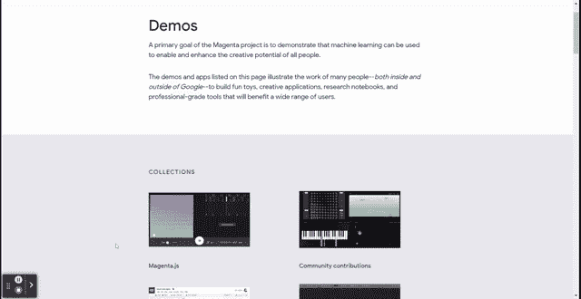
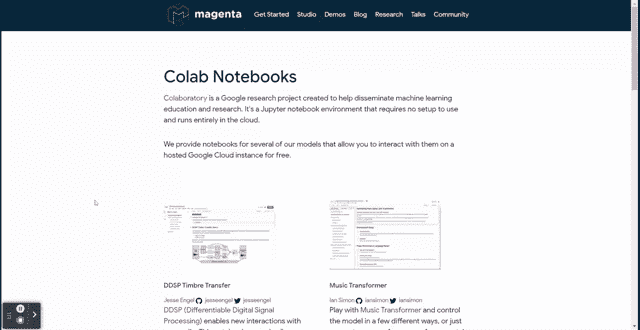
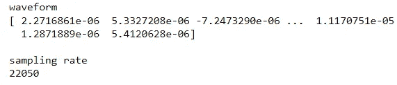
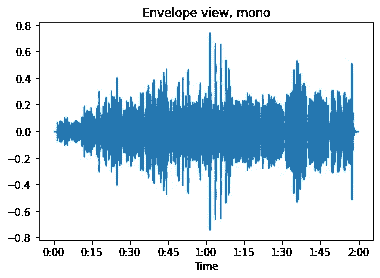
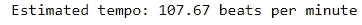
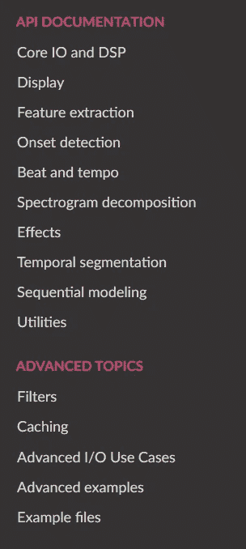
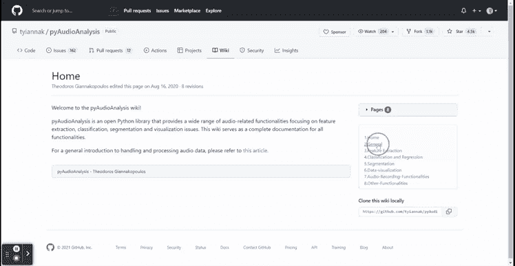

# 学习音频数据科学项目的前 3 个 Python 包

> 原文：<https://towardsdatascience.com/top-3-python-packages-to-learn-audio-data-science-project-cbd11c100fe7?source=collection_archive---------2----------------------->

## 音频数据科学项目是你可以从这些包中学到的东西。


凯利·西克玛在 [Unsplash](https://unsplash.com?utm_source=medium&utm_medium=referral) 上的照片

当我们谈到数据项目时，许多人首先会想到表格数据、文本数据或图像数据作为数据源。然而，数据远不止这些。现代技术使得收集和存储各种数据变得更加容易，包括音频数据。它不像其他项目那样大肆宣传，但音频数据科学项目对许多行业都是有效的。

音频数据科学项目的示例包括通过声音进行情感预测、语音转文本预测和音乐生成。无论您的兴趣是什么，有几个 Python 包可以帮助您了解更多关于音频数据科学项目的信息。本文将概述我的前 3 个音频数据科学项目 Python 包。让我们开始吧。

# 1.品红

[Magenta](https://magenta.tensorflow.org/) 是一个开源的 Python 包，建立在 TensorFlow 之上，用来操纵图像和音乐数据，以生成模型作为输出来训练机器学习模型。

Magenta 没有提供清晰的 API 参考供我们学习；相反，他们给了我们很多研究演示和合作者笔记本，我们可以自己尝试。



洋红色演示(作者提供的 GIF)



洋红色的 Colab 笔记本(作者 GIF)

对于第一次参与音频数据科学项目的人，我建议访问他们的 [Hello World 笔记本](https://colab.research.google.com/notebooks/magenta/hello_magenta/hello_magenta.ipynb)进行音乐创作。我从他们的笔记本中学到了很多，特别是生成机器学习的部分，在那里你可以测试各种音调来产生你的音乐。让我们试试这个代码。

Magenta Hello World 测试(视频由作者提供)

正如我们在上面的视频中看到的，音乐完全是用代码创作的。我们试着用 Magenta 做一个生成式音乐机器学习。我将使用 [MusicVAE](https://g.co/magenta/musicvae) 实现 Magenta 来制作音乐。很好用，只需要改变一些超参数。

```
generated_sequences = music_vae.sample(n=2, length=80, temperature=1.0)for ns in generated_sequences:
    # print(ns) note_seq.plot_sequence(ns)
    note_seq.play_sequence(ns, synth=note_seq.fluidsynth)
```

我们可以改变 n 来表示你想要制作的音乐的数量，音乐的长度，以及温度来表示音乐的随机性。让我使用下面的参数。

```
generated_sequences = music_vae.sample(n=2, length=100, temperature=15)
```

音乐生成(作者提供的视频)

生成的音乐将取决于你开始学习时使用的音频。你可以弹奏各种音乐来创造你的旋律。

# 2.利布罗萨

Librosa 是一个为音乐和音频分析开发的 Python 包。它专门用于捕获要转换成数据块的音频信息。但是，文档和示例有助于理解如何处理音频数据科学项目。让我们尝试安装 python 包并尝试快速入门。下面的代码将安装这个包。

```
pip install librosa
```

安装包后，让我们下载样本音乐。

```
import librosa
filename = librosa.example('nutcracker')
```

我们可以使用 librosa 包来捕获这个样本的音频信息。让我们用 librosa 加载音乐数据。

```
y, sr = librosa.load(filename)
```

当我们使用 librosa 加载一个音频文件时，我们获得了两个数据集；波形数据(存储在 y 中)和采样速率(存储在 sr 中)。我们来详细看看数据。

```
print('waveform')
print(y)
print('\nsampling rate')
print(sr)
```



作者图片

如您所见，波形数据存储为 NumPy 数组数据。如果我们想要可视化波形，我们可以使用 librosa 显示包。

```
import librosa.display
import matplotlib.pyplot as pltfig, ax = plt.subplots(nrows=1, sharex=True)
librosa.display.waveshow(y, sr=sr)
ax.set(title='Envelope view, mono')
ax.label_outer()
```



作者图片

我们可以通过音乐时间看到音频波形是怎样的。这是一个伟大的探索工具。使用 librosa，我们还可以用下面的代码跟踪音频节拍时间。

```
tempo, beat_frames = librosa.beat.beat_track(y=y, sr=sr)
print('Estimated tempo: {:.2f} beats per minute'.format(tempo))
```



作者图片

如果你想得到每一拍的时间，你可以用下面的代码来实现。

```
beat_times = librosa.frames_to_time(beat_frames, sr=sr)
```

beat_times 变量将在 NumPy 数组中存储每个节拍的所有时间戳。

我建议访问他们的 API 文档和高级材料以进一步学习，因为它包含许多学习音频数据科学项目的重要工具。



作者图片

# 3.py 音频分析

[pyaudionanalysis](https://github.com/tyiannak/pyAudioAnalysis)是一个用于音频分析任务的 Python 包。它旨在进行各种分析，例如:

*   提取音频特征
*   用于音频分割训练机器学习模型
*   未知音频的分类
*   基于回归模型的情感识别
*   用于音频数据可视化的降维

还有很多。你可以用这个包做很多事情，特别是如果你是音频数据科学项目的新手。

您需要直接从 GitHub 页面克隆这个文件来安装这个包。

```
git clone https://github.com/tyiannak/pyAudioAnalysis.git
```

之后，您需要安装需求依赖项(您克隆文件的目录)。

```
pip install -r ./requirements.txt
```

然后使用下面的代码开始安装整个包(参考您克隆的目录)。

```
pip install -e .
```

安装包后，我建议访问[维基](https://github.com/tyiannak/pyAudioAnalysis/wiki)，所有使用的例子都写在那里。



作者 GIF

对于初学者来说，该文档很容易阅读，尽管代码部分比较复杂，因为您需要了解如何使用 CLI 来执行代码。然而，出于学习的目的，软件包文档已经足够好了。

# 结论

数据科学项目并不总是关于表格、文本或图像数据。有时你可以使用非常规数据，如音频。在本文中，我概述了我学习音频数据科学项目的前 3 个 Python 包，它们是:

1.  品红
2.  利布罗萨
3.  py 音频分析

希望有帮助！

在我的 [**LinkedIn**](https://www.linkedin.com/in/cornellius-yudha-wijaya/) 或 [**Twitter**](https://twitter.com/CornelliusYW) 上访问我。

> *如果您喜欢我的内容，并希望获得更多关于数据或数据科学家日常生活的深入知识，请考虑在此订阅我的* ***简讯。***

> *如果您没有订阅为中等会员，请考虑通过* [*我的推荐*](https://cornelliusyudhawijaya.medium.com/membership) *订阅。*