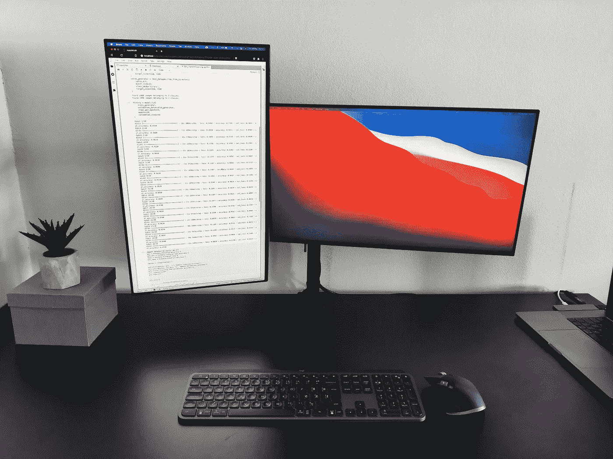

# 我作为数据科学家卖掉我的 M1 Macbook Pro 的三大理由

> 原文：<https://towardsdatascience.com/top-3-reasons-why-i-sold-my-m1-macbook-pro-as-a-data-scientist-abad1226f52a?source=collection_archive---------0----------------------->

## M1·麦克会给你 90%的机会。但是 90%就够了吗？

M1 奇普棒极了。想象一下，一个超快的处理器，一整天的电池续航时间，而且没有散热问题。听起来很棒，至少在纸面上是这样。尽管如此，它不得不去。

作者修改的 [Unsplash](https://unsplash.com/s/photos/macbook-pro?utm_source=unsplash&utm_medium=referral&utm_content=creditCopyText) 上[天翼马](https://unsplash.com/@tma?utm_source=unsplash&utm_medium=referral&utm_content=creditCopyText)的照片

如果你想要一个**的单句摘要**——一些数据科学库要么不可能要么几乎不可能本地运行，连接两个外部显示器是一个噩梦，最后，eGPUs 不被支持。

这正是本文的结构，所以请随意浏览您最感兴趣的部分:

*   应用程序和库兼容性
*   外部显示器支持
*   eGPU 支持

# 应用程序和库兼容性

我不太喜欢 Anaconda Python 发行版。总的来说，这是一个好主意，但是我更喜欢 Python 3 的干净安装和动态的依赖管理。不过，Anaconda 似乎是 M1 芯片的首选。

M1 上默认的 Python 3 是 3.9.x，你必须先把它降级到 3.8.x 才能让一些库工作。没什么大不了的，但肯定是额外的一步。即使在降级之后，我在原生安装库时看到的唯一一致的东西是终端中的一串红线。

*想安装 TensorFlow？很好，但是请事先安装一个特定版本的 Numpy 和其他五个软件包。不用说，但是如果您没有指定一些额外的参数(或者如果您没有在虚拟环境中安装它们)，这些版本会在安装其他包时被覆盖。如果你想让 TensorFlow 一直可用，那就有点麻烦了。*

Anaconda 运行良好，但测试时 M1 芯片还没有正式发布。这意味着整个发行版通过一个名为 **Rosetta 2** 的模拟器运行，这个模拟器做得非常好。尽管如此，它不是原生支持。

对于我的日常工作，我需要与云数据库进行大量的交流，主要是 Oracle。用 Python 做到这一点的唯一明智的方法是通过 Oracle Instant Client，它没有移植到新的芯片上。

这只是不工作或不按预期工作的一个简短列表。我敢肯定，任何其他技术专业人员都可以在列表中添加问题。

# 外部显示器支持

如果您使用单个外部显示器，请随意跳过这一部分。

13 英寸对于舒适的 8 小时以上工作会议来说是不够的。当然，*在家工作*意味着在某些日子里*在床上工作*，但是你更多时候需要额外的屏幕空间。

我正在使用两台戴尔 U2419H 显示器。其中一个处于正常水平位置，而另一个垂直旋转，如下图所示:

图片 1–2 台 Dell U2419H 显示器(图片由作者提供)

想怎么说就怎么说，但是在垂直显示器上写代码不是你能轻易放下的事情。看看下面的图片，你会立刻明白其中的要点:

图 2 —代码和代码编辑器的垂直空间(图片由作者提供)

简而言之——垂直空间对于任何涉及代码的事情都是一个巨大的生产力助推器。只有一台显示器并旋转它不是最好的选择。对我来说，拥有两台相对便宜且色彩准确的显示器是一个不错的选择。

遗憾的是，Macbook Pro 和 Macbook Air 中的 M1 芯片仅支持单显示器。有一些方法可以解决这个问题，比如购买带有 DisplayLink 的扩展坞，但我上次检查时，亚马逊上没有推荐的那些。

# eGPU 支持

我完全可以牺牲一个专用的 Nvidia GPU 来获得一个超便携和外观时尚的笔记本电脑。不过，选择通过 thunderbolt 连接 GPU 一直是基于英特尔的 MAC 电脑的一个选项。不便宜，但它就在那里。

M1 芯片以一种不好的方式改变了这一切。它根本不支持 eGPU，你也无能为力。这意味着你可以忘记偶尔的游戏。我知道没有人会为了玩游戏而购买苹果电脑，但拥有选择权不会有坏处。

M1 芯片确实带有一个神经引擎，如果你对此感兴趣，它应该对基本的深度学习任务有所帮助。但它仍然是一台笔记本电脑，所以不要指望一些疯狂的性能。为此，您必须切换到 Collab 或云 GPU。

如果你正在进行深度学习，这最后一点不应该成为一个交易破坏者，因为移动 GPU 只能让你到此为止。

# 结论

总之——M1 苹果电脑会让你达到 90%的目标，但如果你需要一些超具体的东西，它们不是最佳选择。跟着炒作走很容易，但一旦它过去，挫败感就会出现。至少对我来说是这样。

正如很多人会说的——千万不要买第一代苹果产品。我同意。

你对 M1 芯片有什么体验？我渴望听到任何 IT 职业的正反两面意见。

喜欢这篇文章吗？成为 [*中等会员*](https://medium.com/@radecicdario/membership) *继续无限制学习。如果你使用下面的链接，我会收到你的一部分会员费，不需要你额外付费。*

<https://medium.com/@radecicdario/membership>  

# 了解更多信息

*   [每位数据科学家必读的 3 本编程书籍](/3-programming-books-every-data-scientist-must-read-db1d3a1a284c)
*   [脊线图:用 Python 可视化数据分布的最佳方式](/ridgeline-plots-the-perfect-way-to-visualize-data-distributions-with-python-de99a5493052)
*   [Python 字典:你需要知道的一切](/python-dictionaries-everything-you-need-to-know-9c2159e5ea8a)
*   [如何用 Python 发送漂亮的电子邮件——基本指南](/how-to-send-beautiful-emails-with-python-the-essential-guide-a01d00c80cd0)
*   新的 M1 macbook 对数据科学有好处吗？让我们来了解一下

# 保持联系

*   在[媒体](https://medium.com/@radecicdario)上关注我，了解更多类似的故事
*   注册我的[简讯](https://mailchi.mp/46a3d2989d9b/bdssubscribe)
*   在 [LinkedIn](https://www.linkedin.com/in/darioradecic/) 上连接
*   查看我的[网站](https://www.betterdatascience.com/)

*原载于 2021 年 3 月 26 日*[*https://betterdatascience.com*](https://betterdatascience.com/why-i-sold-m1-mac/)*。*