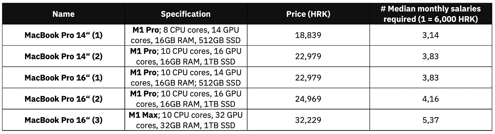
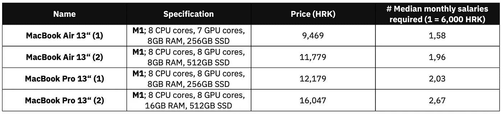

# 作为一名数据科学家，我不购买新款 M1 Pro/Max MacBook 的三大理由

> 原文：<https://towardsdatascience.com/top-3-reasons-why-im-not-buying-the-new-m1-pro-max-macbook-as-a-data-scientist-3249e39ff30?source=collection_archive---------1----------------------->

## 相反，我在等待 M2——这就是你也应该等待的原因。

纳丁·沙巴纳在 [Unsplash](https://unsplash.com/s/photos/stop?utm_source=unsplash&utm_medium=referral&utm_content=creditCopyText) 上拍摄的照片

***免责声明*** *:我从一个数据科学家的角度写了这篇文章。我不喜欢 8K 视频渲染，也不喜欢 Logic Pro 中的海量音轨。我有一台 2020 年的 M1 MacBook Pro，大部分繁重的工作都是在远程 GPU 机器上完成的，所以在阅读本文时要记住这一点。*

我等苹果硅 MacBooks 新系列等了这么久。我有一台 M1 MacBook Pro，我喜欢它的一切——它速度快得惊人，重量轻，完全静音，有出色的屏幕和键盘，不会过热，电池续航时间长达一整天。简而言之，在地狱结冰之前，我是不可能回到 Windows 的。

在观看了苹果 10 月 18 日的活动后，我有两件事要说——新的 M1 Pro/Max 芯片是开创性的，作为一名数据科学家，我绝对不会购买它们。我有三个充分的理由。

不想看书？请观看我的视频:

# 1.普通的 M1 MacBook Air/Pro 已经足够好了

当然，我很想把每一个数据科学和深度学习基准都扔给新机器，并且连续第二年拥有一个永无止境的令人瞠目结舌的时刻。

但是忽略增加的内核和 RAM，M1 Pro/Max 仍然和普通 M1 一样，不支持更多的数据科学工具和库。安装 TensorFlow 你还是会纠结。一旦安装，它将运行得更快。这没什么大不了的，因为反正没人用超便携笔记本电脑进行严肃的深度学习。

我真正关心的是电池寿命。苹果声称电池寿命为 17/21 小时，这取决于你是选择 14 英寸还是 16 英寸的型号。这种说法只对基本型号有效，电池寿命可能会随着你对机器的规格越来越差。另一方面，普通的 M1 MacBook Pro 已经拥有出色的电池续航时间。一次充电我可以轻松获得 1.5-2 个工作日，前提是我不做任何疯狂的事情。

先说设计。当然，新型号有更薄的边框、更好的屏幕和更好的键盘——但老实说，这不是我想要的重新设计。与 2016 年的重新设计相比，今年的车型只是看起来 meh。

作为一名数据科学家，我不太关心笔记本电脑的设计，因为它 80%的时间都是关闭的，并插入外部显示器。我使用单 4K 显示器，但如果你需要更多，那么一个普通的 M1 不适合你。

房间里还有一头巨大的大象需要讨论。

# 2.MacBook M1 Pro/Max 实在是太贵了

我讨厌绝对地讨论金钱。1000 美元对一个美国人来说不算多，但这只是克罗地亚月平均净收入的一部分。美国人谈论这些新机器有多贵，但我认为他们得到了好处。

美国月平均工资为 3978 美元(如果我说错了，请纠正我)，你可以用一份薪水买几乎任何新的 MacBook。然而，并不是每个人都有生活在美国的特权。以下是在克罗地亚购买新款 MacBook 系列需要多少工资:

图 1 —克罗地亚新 Mac 系列的相对价格(HRK =克罗地亚库纳，货币)(图片由作者提供)

是的，你没看错。在克罗地亚，你需要 3.14 到 5.37 英镑的月净收入才能买一台新的 MacBook。我还没有介绍定制配置，因此全力以赴使用 64 GB 内存和 8 TB 存储会让您头晕目眩。钱包空空如也，但这是必然的。

数据科学家的收入远高于平均工资中位数，但这仍然是一大笔钱。看在上帝的份上，你可以买辆像样的二手车。

如果你想知道常规的 M1 阵容相比之下要花多少钱，我可以帮你搞定。下表总结了商店中提供的 2020 年 M1 MacBook Air 和 Pro 型号(无自定义配置):

图 2 —克罗地亚普通 M1 Macbook 系列的相对价格(HRK =克罗地亚库纳，货币)(图片由作者提供)

当然，还是很贵，但没那么贵了。你可以用不到 14 英寸的价格买到最贵的 M1 MacBook Pro，它有 16 GB 的内存和 512 GB 的固态硬盘存储空间，剩下的钱可以用来支付每月的生活费用。

*在你们国家，MacBook M1/M1 Pro/M1 Max 系列的平均工资是多少？*

# 3.我无法从增加的马力中获益

在这里或那里节省几分钟是有益的，当然，但对我所做的事情不是强制性的。我的 M1 MacBook Pro 从第一天起就没有出现过任何问题——而且它只有 8 GB 的内存。我用锐龙 7 和 16 GB 的内存让 Windows 机器发疯。就马力而言，这不是一个公平的比较，但它们的价格大致相同。

我认为使用 Windows/Linux 机器的唯一好处是有更多可用的 Python 库和 CUDA 支持，前提是你有 NVIDIA GPU。我不知道 TensorFlow 在新的 MacBook 系列上的运行速度有多快，但我认为它绝对会令人惊叹。

简而言之，作为一名数据科学家，我想要的是一台轻薄便携的机器，能够做任何你扔给它的事情(在合理的范围内)，具有惊人的屏幕和电池寿命。2020 年的 M1 MacBook Pro，甚至 Air，都完全符合这个描述。

我知道这些新机器是为专业人士设计的，或者至少是苹果认为的专业用户。如果你像我一样，使用 GPU 在远程机器上进行大量深度学习，并使用笔记本电脑连接到那台机器，那么你不属于专业类别。这完全没问题。

我现在的设置在一年前被认为是开创性的，那么今天它能有多糟糕呢？

# 我在等 M2，原因如下

不要误会我的意思——我喜欢迷你 LED 屏幕技术、120Hz 刷新率、增加的端口、多显示器输出，以及新 MacBook 系列所提供的一切。但对我来说，这还不足以改变现状。没有办法证明这个价格是合理的，因为我已经有了一台性能非常好的机器。如果我有任何基于英特尔的 MacBook，那将是一个完全不同的故事。

那么，未来会带来什么？

没人知道，但这是我的预测。明年的 M2 MacBook 将取代目前常规的 M1 MacBook Air 和 Pro 机型。一年前这些机器的大卖点是 1000 美元/1300 美元的起价，我认为苹果不会改变太多，如果有的话。

我认为 M2 将带来 M1 Pro/Max 提供的大部分+重新设计的小部分成本。我可能完全错了，但只有时间会证明一切。

*作为数据专业人士，你对新 MacBook 阵容有什么想法？您订购了吗？如果订购了，您是从哪台机器升级的？作为一名数据科学家，你能从额外的马力中获益吗？请在下面的评论区告诉我。*

*喜欢这篇文章吗？成为* [*中等会员*](https://medium.com/@radecicdario/membership) *继续无限制学习。如果你使用下面的链接，我会收到你的一部分会员费，不需要你额外付费。*

<https://medium.com/@radecicdario/membership>  

# 保持联系

*   注册我的[简讯](https://mailchi.mp/46a3d2989d9b/bdssubscribe)
*   订阅 [YouTube](https://www.youtube.com/c/BetterDataScience)
*   在 [LinkedIn](https://www.linkedin.com/in/darioradecic/) 上连接