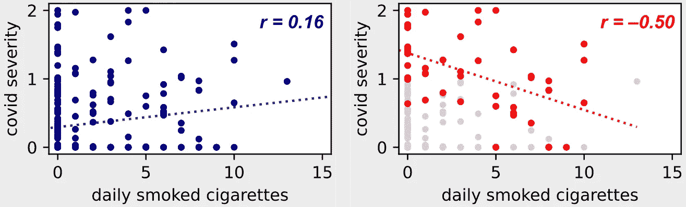
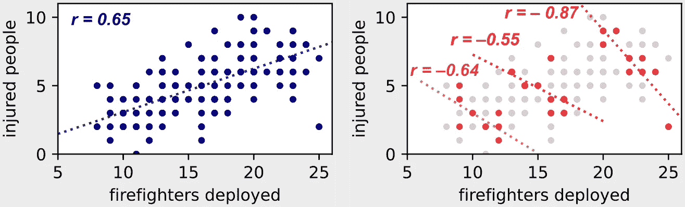
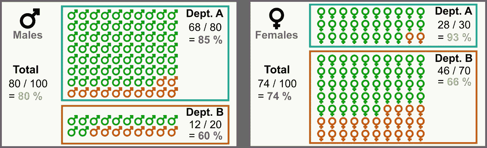

# 数据科学中的三大统计悖论

> 原文：<https://towardsdatascience.com/top-3-statistical-paradoxes-in-data-science-e2dc37535d99?source=collection_archive---------2----------------------->

## [入门](https://towardsdatascience.com/tagged/getting-started)

## 观察偏差和亚组差异产生统计悖论。

悖论与我们的期望相矛盾。在 [Unsplash](https://unsplash.com/photos/ltifWJbvhXM?utm_source=unsplash&utm_medium=referral&utm_content=creditCopyText) 上由 [Greg & Lois Nunes](https://unsplash.com/@greg_nunes?utm_source=unsplash&utm_medium=referral&utm_content=creditCopyText) 拍摄的照片。

在任何数据科学应用中，观察偏差和亚组差异很容易产生**统计悖论**。因此，忽视这些因素会完全破坏我们的分析结论。

观察到诸如**子组** **趋势在汇总数据**中被完全还原的惊人现象确实并不罕见。在这篇文章中，我们看看在数据科学中遇到的 3 种最常见的统计悖论。

# **1。**伯克森悖论

第一个引人注目的例子是观察到的新冠肺炎严重程度与吸烟之间的**负关联**(例如，参见[文泽尔 2020](https://ec.europa.eu/jrc/en/publication/smoking-and-covid-19-review-studies-suggesting-protective-effect-smoking-against-covid-19) 的欧盟委员会审查)。吸烟是众所周知的呼吸系统疾病的危险因素，那么我们如何解释这个矛盾呢？

最近发表在《自然》杂志上的 Griffith 2020 的工作表明，这可能是**对撞机偏差**的一个例子，也称为[伯克森悖论和](https://en.wikipedia.org/wiki/Berkson%27s_paradox)。为了理解这个悖论，让我们考虑下面的图形模型，其中我们包括第三个随机变量:“住院”。

**伯克森悖论:**“住院”对于“吸烟”和“新冠肺炎严重程度”都是一个对撞机变量。(图片由作者提供)

这第三个变量“住院”是前两个的<https://en.wikipedia.org/wiki/Collider_(statistics>)**对撞机。这意味着吸烟和患有严重的新冠肺炎都会增加生病住院的几率。当我们**在对撞机**上设定条件时，也就是说，当我们只观察住院病人的数据而不是考虑整个人群时，伯克森悖论就出现了。**

**让我们考虑下面的数据集示例。在左图中，我们有来自整个人群的观察结果，而在右图中，我们只考虑住院患者的子集(即，我们以碰撞变量为条件)。**

****

**伯克森悖论:如果我们以对撞机“住院”为条件，我们会观察到吸烟和新冠肺炎的关系发生逆转！(图片由作者提供)**

**在左图中，我们可以观察到新冠肺炎严重程度与吸烟之间的**正相关**，正如我们所料，因为我们知道吸烟是呼吸系统疾病的一个风险因素。**

**但是在右图中——我们只考虑住院患者——我们看到了相反的趋势！要理解这一点，请考虑以下几点。**

1.  **患有严重的新冠肺炎会增加住院的机会。特别是，如果严重程度> 1，则需要住院治疗。**
2.  **每天吸几支烟是多种疾病(心脏病、癌症、糖尿病)的主要风险因素，这些疾病会增加因某种原因住院的机会。**
3.  **因此，如果一个**医院的病人**有**较低的新冠肺炎** **严重程度**，他们有**较高的机会吸烟**！事实上，他们必须患有不同于新冠肺炎的某种疾病(如心脏病、癌症、糖尿病)才能住院，而这种疾病很可能是由他们吸烟引起的。**

**这个例子与 [Berkson 1946](https://www.jstor.org/stable/3002000?casa_token=EBVDrF0sqOQAAAAA%3ABvQ5XgFAxop9ZGhFWkgp2cm_Ck0I1jXy27dh8iK6UUaADuPFYJM7lndD9ti_XTTlA2qPawpK4ylyb-jc9F7rNB0bG5iqL6Z4ekwWRWwDDjN4TUEdMw&seq=1#metadata_info_tab_contents) 的原始工作非常相似，其中作者注意到住院患者的**胆囊炎**和**糖尿病**之间呈负相关，尽管糖尿病是胆囊炎的一个危险因素。**

# ****2。潜在变量****

**一个 [**潜变量**](https://en.wikipedia.org/wiki/Latent_variable) 的存在也可能在两个变量之间产生一种明显的反向相关性。虽然伯克森悖论的出现是因为对碰撞变量的调节(因此应该避免)，但这另一种悖论可以通过对潜在变量的调节来解决。**

**例如，让我们考虑一下被派去灭火的消防队员的人数和在火灾中受伤的人数之间的关系。我们预计更多的消防员将会改善结果(在某种程度上——参见[布鲁克斯定律](https://en.wikipedia.org/wiki/Brooks%27s_law))，然而在汇总数据中观察到正相关:**部署的消防员越多，受伤人数就越多**！**

**为了理解这个悖论，让我们考虑下面的图形模型。关键是再次考虑第三个随机变量:“火灾严重程度”。**

****

****潜在变量悖论:**“火灾严重程度”是“部署消防员人数”和“受伤人数”的潜在变量。(图片由作者提供)**

**这第三个潜在变量与其他两个正相关。的确，越多的**严重火灾越容易造成更多的伤害**，同时它们**需要更多的消防员**去扑灭。**

**让我们考虑下面的数据集示例。在左图中，我们汇总了各种火灾的观察结果，而在右图中，我们仅考虑了与三种固定火灾严重程度相对应的观察结果(即，我们根据潜在变量来调整观察结果)。**

****

****潜在变量:**如果我们以潜在变量“火灾严重程度”为条件，我们观察到部署的消防员数量和受伤人数之间的关系出现逆转！(图片由作者提供)**

**在右图中，我们**对火灾严重程度**进行了条件观察，我们可以看到我们预期的负相关。**

*   **对于给定严重程度的火灾，我们确实可以观察到部署的消防员越多，受伤的人就越少。**
*   **如果我们观察更严重的火灾**，我们会观察到**相同的趋势**，尽管部署的消防员数量和受伤人数都更高。****

# **3.辛普森悖论**

**[**辛普森悖论**](https://en.m.wikipedia.org/wiki/Simpson%27s_paradox) 是在子群体中一致观察到的趋势，但如果子群体合并，趋势就会反转时出现的令人惊讶的现象。这通常与数据子组中的**类不平衡有关。****

**这个悖论的一个臭名昭著的例子来自比克尔 1975 年的报告，在那里，加州大学 weer 的录取率被分析以寻找性别歧视的证据，两个明显矛盾的事实被揭露出来。**

*   **一方面，在**各个部门，他观察到**女性申请者比男性申请者的录取率高**。****
*   ****另一方面，**汇总** **数字**显示**女性申请者的录取率低于男性申请者**。****

****为了了解这是如何实现的，让我们考虑下面的数据集，它包含两个部门:部门 A 和部门 b。****

*   ****在 100 名男性申请人中:80 人申请 A 部，68 人被录取(85%)，20 人申请 B 部，12 人被录取(60%)。****
*   ****在 100 名女性申请人中:30 人申请 A 部，28 人被接受(93%)，70 人申请 B 部，46 人被接受(66%)。****

********

******辛普森悖论:**女性申请者更容易被各个部门录取，但整体女性录取率不如男性！(图片由作者提供)****

****这个悖论由下面的不等式表示。****

********

******辛普森悖论:**表面矛盾背后的不平等。(图片由作者提供)****

****我们现在可以理解我们看似矛盾的观察的起源了。重点是这两个部门(A 部门:80-30，B 部门:20-70)的申请人性别都存在明显的**阶层失衡**。事实上，****大部分女生申请了竞争更激烈的 B 系**(录取率较低)，而****大部分男生申请了竞争不激烈的 A 系**(录取率较高)。这导致了我们矛盾的观察结果。********

# ******结论******

******潜变量**、**对撞机变量**、**类不平衡**在很多数据科学应用中很容易产生**统计悖论**。因此，特别关注这些关键点对于正确得出趋势和分析结果至关重要。****