# 帮助您开展数据科学活动的三大可视化 Python 包

> 原文：<https://towardsdatascience.com/top-3-visualization-python-packages-to-help-your-data-science-activities-168e22178e53?source=collection_archive---------10----------------------->

## 使用这些包来帮助您的数据科学工作


[Firmbee.com](https://unsplash.com/@firmbee?utm_source=medium&utm_medium=referral)在 [Unsplash](https://unsplash.com?utm_source=medium&utm_medium=referral) 上拍照

数据可视化是将数据汇总成图形表示以帮助人们理解数据的过程。想象一下没有数据可视化的数据探索或验证？很难，对吧？。此外，数据可视化可能揭示我们在统计摘要中找不到的额外信息。

数据可视化也有助于数据科学家的工作，例如，理解我们的数据、特征选择和验证我们的机器学习模型。为了进一步帮助您的工作，我想概述我的三个顶级可视化 python 包，以帮助您的数据科学活动。让我们开始吧。

# 1.AutoViz

[AutoViz](https://github.com/AutoViML/AutoViz) 是 [AutoViML](https://github.com/AutoViML) 包库下的一个开源可视化包，旨在自动化许多数据科学家的工作。许多项目快速而直接，但无疑是有帮助的，包括 AutoViz。

**AutoViz 是一个单行代码可视化包，可以自动生成数据可视化**。让我们尝试这个包来展示为什么 AutoViz 可以帮助您的工作。首先，我们需要安装 AutoViz。

```
pip install autoviz
```

安装完软件包后，让我们使用一个样本数据集。在本文中，我将使用来自 [Kaggle](https://www.kaggle.com/new-york-city/nyc-property-sales) 的纽约房地产销售数据集。

```
df = pd.read_csv('nyc-rolling-sales.csv')
```

使用 AutoViz，我们只需要从包中导入一个类函数，并执行一行代码来自动生成可视化。

```
#Importing the class function
from autoviz.AutoViz_Class import AutoViz_Class
AV = AutoViz_Class()#Automatically produce dataset
AV.AutoViz("",dfte = df )
```

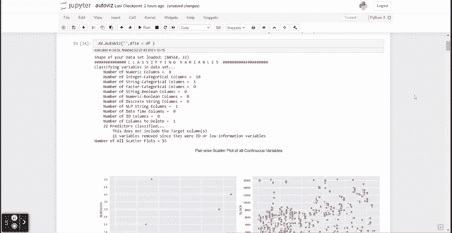

作者 GIF

从上面的 GIF 中我们可以看到，AutoViz 包基于我们的数据集自动生成了许多可视化效果。可视化简单；然而，执行时间很快，并且该图有助于特征选择的初始分析。让我们详细看看 AutoViz 生产了什么。

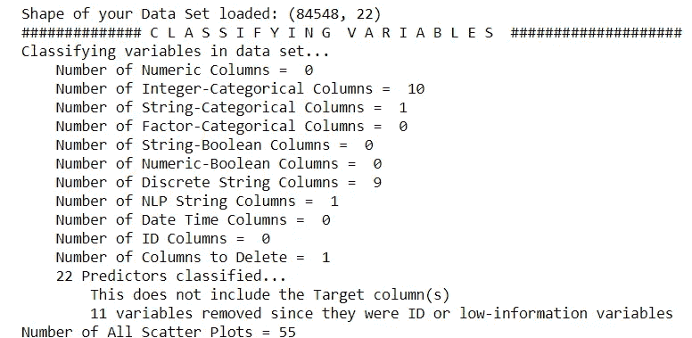

作者图片

AutoViz 的第一步是将要素分类为特定的数据类型，并使用这些信息来决定使用哪种可视化来表示数据。从这里，让我们来看看一些生产的情节快照。

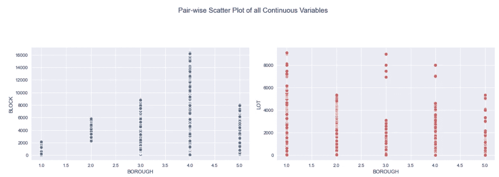

来自 AutoViz 的成对散点图(图片由作者提供)

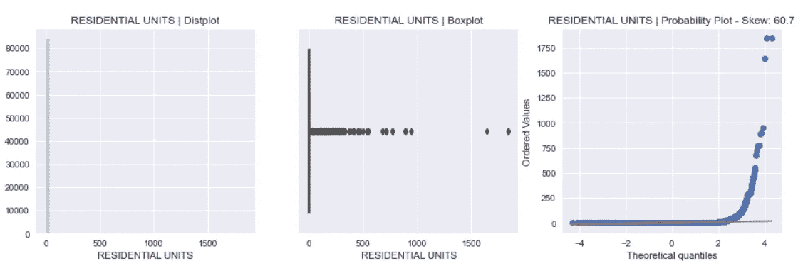

分布图来自 AutoViz(图片由作者提供)

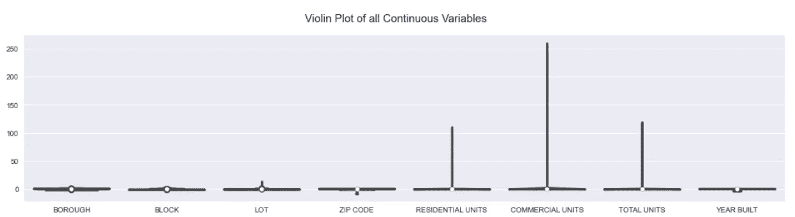

违反 AutoViz 的情节(图片由作者提供)

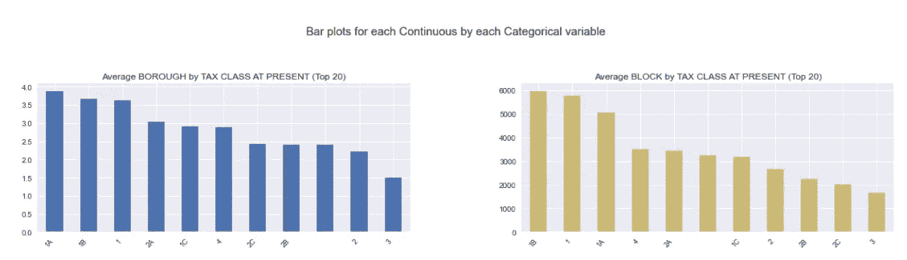

来自 AutoViz 的方框图(图片由作者提供)

这些是 AutoViz 制作的示例图。许多其他软件包自动可视化数据，但 AutoViz 有一些我觉得其他人没有的优势。**可视化产生的速度有多快，结果的重量有多轻**。这就是为什么我建议 AutoViz 自动可视化您的数据，特别是如果您需要对您的数据进行初步评估。

如果你想看看其他的自动可视化软件包，可以看看我下面的其他文章。

[](/data-frame-eda-packages-comparison-pandas-profiling-sweetviz-and-pandasgui-bbab4841943b) [## 数据框 EDA 软件包比较:Pandas Profiling、Sweetviz 和 PandasGUI

### 哪些熊猫数据框 EDA 包适合你？

towardsdatascience.com](/data-frame-eda-packages-comparison-pandas-profiling-sweetviz-and-pandasgui-bbab4841943b) [](/quick-recommendation-based-data-exploration-with-lux-f4d0ccb68133) [## 使用 Lux 进行基于快速推荐的数据探索

### 通过基于一行建议的数据探索，轻松探索您的数据

towardsdatascience.com](/quick-recommendation-based-data-exploration-with-lux-f4d0ccb68133) 

# 2.缺少编号

**数据探索不仅限于数据集中存在的数据，还包括数据集中缺失的数据**。有这样的情况，丢失的数据是由于一个意外或纯粹的机会发生的，但这通常是不正确的。缺失的数据可能会揭示出我们以前从来不知道的洞察力。如果想了解缺失数据的分类，可以看下面的文章。

[](https://medium.datadriveninvestor.com/3-missing-data-types-and-the-suggestion-to-handle-it-75eb10bfdf3b) [## 3 种缺失的数据类型及处理建议

### 知道关于丢失的数据应该知道什么

medium.datadriveninvestor.com](https://medium.datadriveninvestor.com/3-missing-data-types-and-the-suggestion-to-handle-it-75eb10bfdf3b) 

**推出**[**missing no**](https://github.com/ResidentMario/missingno)**，一款专门为可视化您的丢失数据而开发的软件包**。这个包提供了一个易于使用的有见地的一行代码来解释缺失数据，并显示了缺失数据之间的关系。让我们尝试一下这个包，以便更好地理解。

首先，我们需要安装 missingno 包。

```
pip install missingno
```

对于这个例子，我将使用 Kaggle 的 M[is sing migrators 项目](https://www.kaggle.com/snocco/missing-migrants-project)数据集。

```
df = pd.read_csv('MissingMigrants-Global-2019-12-31_correct.csv')
df.info()
```

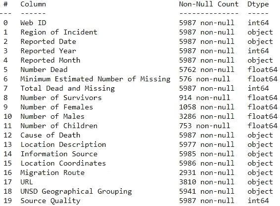

图片来自作者

数据集包含大量缺失数据，每列的缺失量不同。为什么会发生这种情况？这里是否有缺失的数据模式？让我们用 missingno 来找出答案。首先，让我们将缺失的数据可视化。

```
missingno.bar(df, figsize=(10,5), fontsize=12, sort="ascending")
```

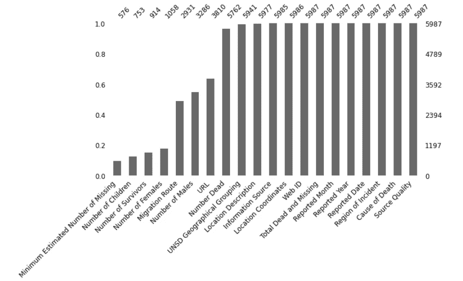

缺失数据条形图(图片由作者提供)

上面的函数生成一个条形图来显示每一列中的数据数量。正如我们所看到的，“最小估计失踪人数”的数据最多，其次是“儿童人数”、“幸存者人数”，等等。如果要计算日志中缺失数据的数量，我们可以使用下面的代码。

```
missingno.bar(df, log=True,figsize=(10,5), color="tab:green", fontsize=12,sort="ascending")
```

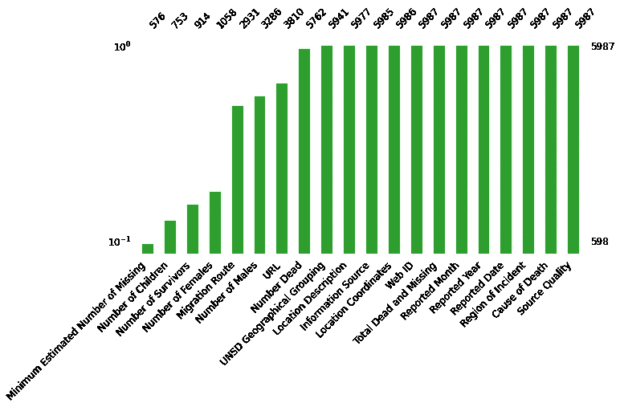

日志缺失数据编号(图片由作者提供)

对数可以帮助您了解每一列中缺失数据的百分比。我们可以看到,‘最小估计缺失数’一栏只占目前全部数据的不到 10%,其余都是缺失的。

缺失的数据可能有一种模式，无论是因为另一列的存在、及时的方式，还是纯粹的偶然。为了可视化这个缺失数据模式，让我们尝试使用矩阵图来可视化数据集中缺失数据的位置。

```
missingno.matrix(df,figsize=(10,5), fontsize=12)
```

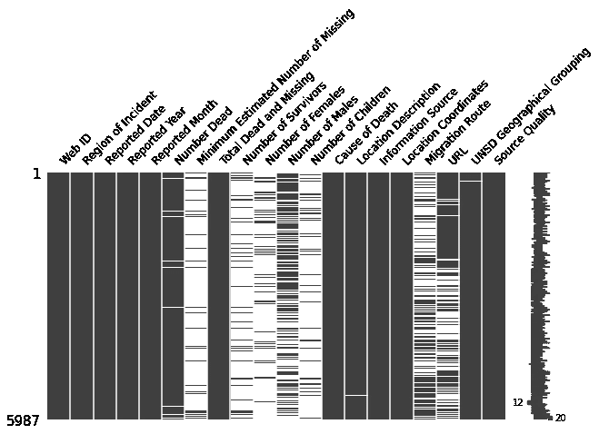

缺失数据矩阵(图片由作者提供)

为了给出一个背景，我们的移民失踪项目数据集按时间(从 2014 年到 2019 年)从最近到最早排序。最上面的数据位置是最近的(2019)，最下面的数据位置是最早的(2014)。

如果我们看上面的图表,“URL”缺失数据似乎更多地出现在更早的时间，类似于“男性数量”。它不同于最近越来越多地丢失数据的“迁移路线”列。上面的图表可以让我们更好地了解我们的数据集中发生了什么。

使用 missingno，我们可以可视化**零相关性**(范围-1 到 1)来测量要素之间的缺失数据关系。让我们试一试。

```
missingno.heatmap(df, figsize=(10,5), fontsize=12)
```

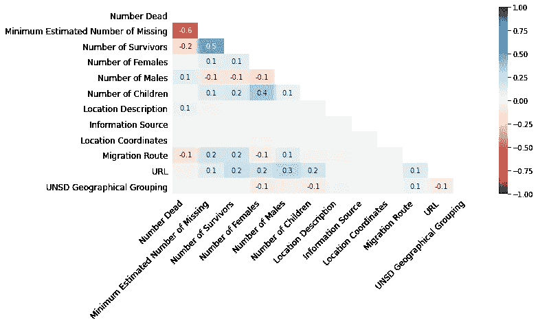

无效相关热图(图片由作者提供)

零相关性为我们提供了丢失数据的列之间的关系。分数越接近-1，意味着一列的数据存在，另一列的数据将会丢失。相反，当它接近 1 时，当其他列数据存在时，该数据也存在。0 表示特征之间没有相关性。

为了更深入地理解特征之间的缺失数据关系，我们可以使用 missingno 来构建基于[分层聚类算法](http://docs.scipy.org/doc/scipy/reference/cluster.hierarchy.html)和零相关性的树状图。

```
missingno.dendrogram(df, figsize=(10,5), fontsize=12)
```

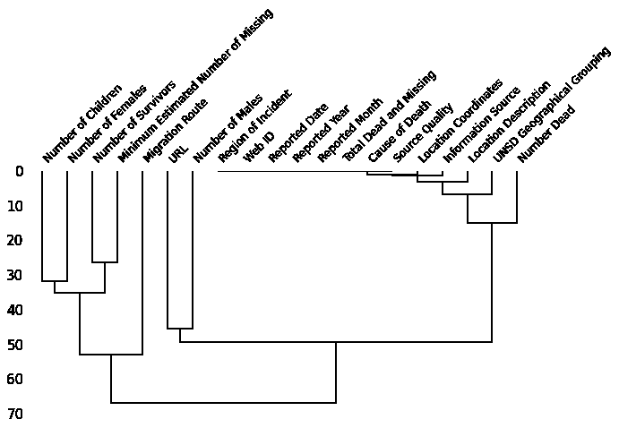

缺失数据树状图(图片由作者提供)

为了解释上面的树状图，我们将从自上而下的角度来看。显示以最近距离链接在一起的要素或聚类，以预测彼此缺失的数据或更好地呈现数据。例如，要素“幸存者人数”和“最小估计失踪人数”比其他要素更早聚类在一起，这意味着它们比其他要素更好地预测彼此。

以零距离链接在一起的聚类要素意味着它们可以完全预测彼此(一个缺失，另一个存在，或者两者都总是缺失/存在)。不在零处分裂的叶聚类意味着它们可以预测彼此，但是可能是不完美的(越接近零，它们越能预测彼此缺失的数据/存在的数据)。

# 3.黄砖

当你探索了数据，发现了有见地的模式，就该开发机器学习模型了。为了帮助您的机器学习开发和评估，我们有一个名为 [Yellowbrick](https://www.scikit-yb.org/en/latest/index.html) 的 python 包来可视化机器学习模型过程。

Yellowbrick 是一个开源包，可以可视化并作为构建在 Scikit-Learn 之上的诊断工具。Yellowbrick 的开发是为了使用从 Scikit-Learn API 扩展而来的各种可视化 API 来帮助模型选择过程。

在开发我们的机器学习模型时，让我们尝试一些 Yellowbricks 的可视化 API。在这个例子中，我将使用来自 Kaggle 的[客户分析数据集](https://www.kaggle.com/imakash3011/customer-personality-analysis)。首先，让我们尝试创建一个分类器模型，并使用 Yellowbricks 来可视化分类报告。

```
from yellowbrick.classifier import ClassificationReport
from sklearn.linear_model import LogisticRegression
from sklearn.model_selection import train_test_split#Reading the data and dropping some data
df = pd.read_csv('marketing_campaign.csv', sep = '\t')
df = df.drop(['ID', 'Dt_Customer', 'Education', 'Marital_Status'], axis = 1).dropna().reset_index(drop = True)X_train, X_test, y_train, y_test = train_test_split(df.drop('Response', axis = 1), df['Response'])model = LogisticRegression()
visualizer = ClassificationReport(model)visualizer.fit(X_train, y_train)
visualizer.score(X_test, y_test)
visualizer.show()
```

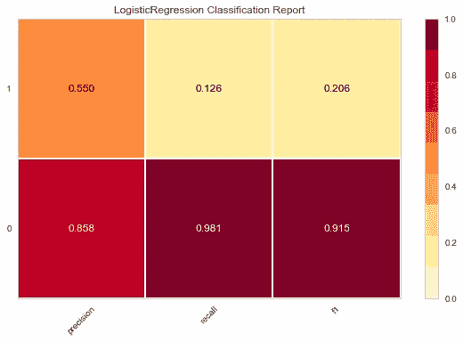

逻辑回归分类报告自

我们从 Scikit-Learn 开发了逻辑回归模型，并从上面的函数可视化了分类报告指标。我们可以看到，与类 0 相比，我们的模型在类 1 中的得分较低。

为了评估我们的预测模型，让我们看看 ROC-AUC 指标的可视化。

```
from yellowbrick.classifier import ROCAUCvisualizer = ROCAUC(model)
visualizer.fit(X_train, y_train)
visualizer.score(X_test, y_test)
visualizer.show()
```

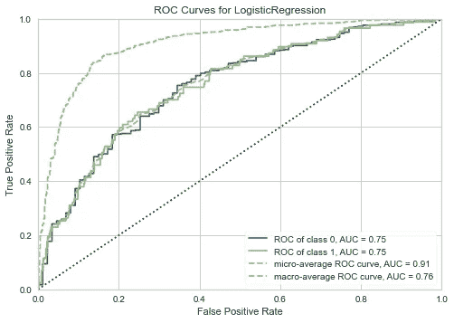

Yellowbrick 的 ROC-AUC 曲线(图片由作者提供)

ROC-AUC 似乎还不错。然而，我们已经有了以前的度量结果，它表明预测偏向于一个类。如果我们稍微研究一下数据，也许会更好。我们来查一下阶级不平衡；上述情况经常发生是因为不平衡的问题。

```
from yellowbrick.target import class_balanceclass_balance(df['Response'])
```

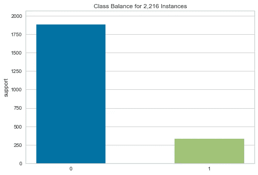

来自 Yellowbricks 的班级平衡(图片由作者提供)

有一个不平衡的问题，即 0 类人数超过 1 类。让我们也来看看特征相关性；这可能有助于预测。

```
from yellowbrick.features import Rank2Dvisualizer = Rank2D(algorithm="pearson")
visualizer.fit_transform(df)
visualizer.show()
```

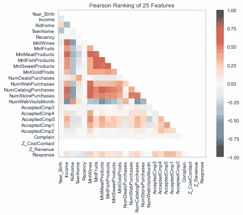

来自 Yellowbricks 的皮尔逊相关性(图片由作者提供)

从上图中我们可以看出，目标(“响应”)与独立特征之间没有很强的皮尔逊相关性。也许我们可以尝试根据机器学习模型删除一些不重要的功能？让我们使用递归特征消除(RFE)进行特征选择。值得注意的是，RFE 是一种使用机器学习模型系数或分数的特征选择方法，通过移除最弱的特征，直到达到指定数量的特征。

```
from yellowbrick.model_selection import RFECVvisualizer = RFECV(model)visualizer.fit(df.drop('Response', axis = 1), df['Response'])      
visualizer.show()
```

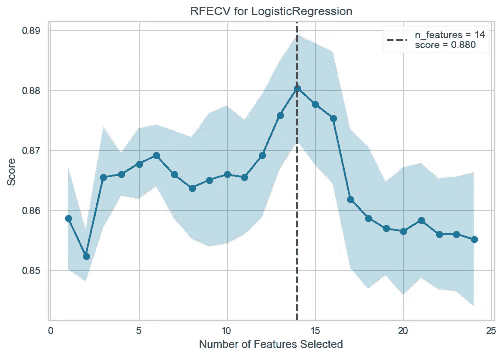

《黄砖》中的 RFE(图片由作者提供)

看起来我们应该使用的最佳特征数是 14 个。让我们看看从 RFE 方法中选择了哪些特征。

```
df.drop('Response', axis = 1).columns[visualizer.support_]
```


作者图片

看起来这些功能主要与购买、收入和客户的家属有关。我们可以尝试的最后一项技术是基于分类模型可视化交叉验证分数。

```
from sklearn.model_selection import StratifiedKFold
from yellowbrick.model_selection import CVScores
cv = StratifiedKFold(n_splits=9)visualizer = CVScores(model, cv=cv, scoring='f1_weighted')
visualizer.fit(df.drop('Response', axis = 1), df['Response'])       
visualizer.show()
```

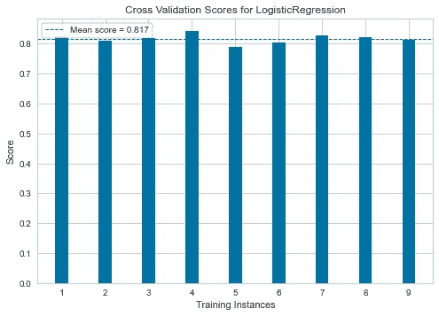

从 Yellowbricks 评分的交叉验证(图片由作者提供)

平均而言，我们的 F1 模型在 9 次迭代后的得分为 0.817。然而，你知道它受到不平衡等级的影响。

总的来说，Yellowbrick 中仍然有许多 API，您可以尝试帮助选择您的机器学习模型。如果你对这些功能感兴趣，请参考他们的文档[这里](https://www.scikit-yb.org/en/latest/api/index.html)。

# 结论

可视化是一个有助于数据科学工作的过程。如果没有数据可视化，我们的工作会变得更加困难。在本文中，我概述了三个可视化 Python 包，它们将有助于您的数据科学工作；它们是:

1.  AutoViz
2.  缺少编号
3.  黄砖

希望有帮助！

> *如果您喜欢我的内容，并希望获得更多关于数据或数据科学家日常生活的深入知识，请考虑在此订阅我的* [*简讯。*](https://cornellius.substack.com/welcome)

> *如果您没有订阅为中等会员，请考虑通过* [*我的推荐*](https://cornelliusyudhawijaya.medium.com/membership) *订阅。*

访问我的[**LinkedIn**](https://www.linkedin.com/in/cornellius-yudha-wijaya/)**或 [**Twitter**](https://twitter.com/CornelliusYW) 。**