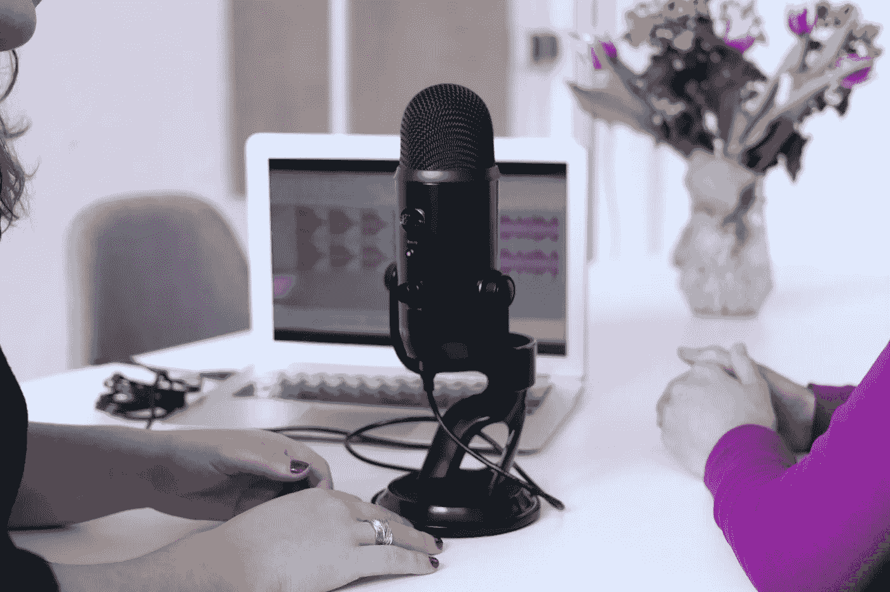

# 您应该关注的 4 大数据科学播客

> 原文：<https://towardsdatascience.com/top-4-data-science-podcasts-you-should-follow-1b170d4a6967?source=collection_archive---------37----------------------->

## 作为一名数据科学家，敬请关注

[女同胞](https://unsplash.com/@cowomen?utm_source=unsplash&utm_medium=referral&utm_content=creditCopyText)在 [Unsplash](https://unsplash.com/s/photos/podcast?utm_source=unsplash&utm_medium=referral&utm_content=creditCopyText) 上拍照

如果你想有一个成功的职业生涯，跟上数据科学的最新进展是至关重要的。有不同的方法让自己保持最新，无论是参加会议，在 Twitter 上关注数据科学领袖，阅读博客和研究论文，还是在 YouTube 上关注数据科学频道。帮助我坚持下去的一个方法是听数据科学播客。当我在健身房、徒步旅行或在车里时，我发现自己在收听。在这篇文章中，我将列出我听得最多的 4 个播客，我强烈建议你亲自去看看。在我开始之前，我想提醒你看看我上周的文章，我在文章中谈到了我关注的 5 个 YouTubers，它们帮助我打入了这个行业。查看下面的链接:

</5-youtubers-that-helped-me-break-into-data-science-3bff12fc6b7f>  

# 1.)走向数据科学

“走向数据科学”播客是我的首要任务。我真的很喜欢这个节目的主持人杰瑞米·哈里斯。他的嘉宾都很优秀，你真的能从剧集中学到很多。我非常喜欢 Jeremie 的一个事实是，他在节目中间解释了一些很多人不熟悉的术语或概念，这样你就可以更容易地跟上讨论。除此之外，你还可以在 YouTube 上观看剧集。Jeremie 是 SharpestMinds 的联合创始人，他绝对让我迷上了播客。我最喜欢的剧集是他讨论人工智能伦理的地方。点击下面的链接，你可以在 YouTube 上看到最新的一集，自己去看看吧。

除此之外，我还提供了苹果播客链接，所以你可以看看所有不同剧集的主题。

<https://podcasts.apple.com/us/podcast/towards-data-science/id1470952338>  

# 2.)IBM 让数据变得简单

第二，在我的列表中有一个名为 IBM 制作简单数据的播客。主持人 Al Martin 目前是 IBM 专家实验室开发服务、云和认知软件的全球副总裁。在此之前，他是 IBM 的数据和人工智能开发副总裁。Al 在他的节目中讨论了关于大数据和人工智能的最新想法，他非常博学。我真的很喜欢艾尔，因为他真的会深入挖掘，从他向客人提出的问题中获得正确的信息。如果你感兴趣，请查看下面的链接，了解更多关于播客的信息。

<https://podcasts.apple.com/us/podcast/making-data-simple/id605818735>  

# 3.)数据怀疑论者

另一个播客，我强烈建议你们去看看，叫做数据怀疑论。这是一个每周一次的播客，涵盖了数据科学，统计学，机器学习和人工智能的各种主题。这个节目的主持人是 Kyle Polich，他非常博学。他在提出正确的问题方面做得很好，在简单解释概念方面也做得很好。我也喜欢他节目中讨论的各种话题。如果你有兴趣了解他的播客，请点击下面的链接。

<https://dataskeptic.com/>  

# 4.)TWIML AI 播客

TWIML AI 播客始于 2016 年，目前已是该领域的重要参与者之一。主持人山姆·查林顿(Sam Charrington)是机器学习和人工智能的商业和消费者应用专家。除此之外，他还专注于将人工智能产品推向市场。这也是一个每周播客，大部分剧集都是关于机器学习和人工智能的。这个播客已经有很长时间了，已经发布了 500+集。除此之外，它有一个很大的社区，所以我绝对推荐你去看看。像《走向数据科学》播客一样，你也可以选择在 YouTube 上观看剧集。

<https://twimlai.com/>  

# 最后的话:

当我开始听数据科学播客时，我只知道走向数据科学播客。感谢我的同事，我被介绍到许多不同的节目，我不得不说，我上面列出的 4 个绝对是我学到最多的。主持人起了很大的作用，他们每个人都以自己的方式表现得很好，让人们享受不时切换节目的乐趣。我尽量每周至少收听一次。这真的帮助我跟上了这个领域的最新发展，你肯定学到了很多。正如我在本文开始时提到的，有各种各样的方法让自己保持更新。听上面提到的播客绝对是你不会错的一种方式。

如果你喜欢这篇文章，如果你能在任何社交媒体平台上分享它，我将非常感激。如果你听了我没有列出的任何其他数据科学播客，请随意在评论区写下它们。我喜欢被介绍给不同的播客。直到下一个 time️ ✌️

<https://www.navidma.com/> 