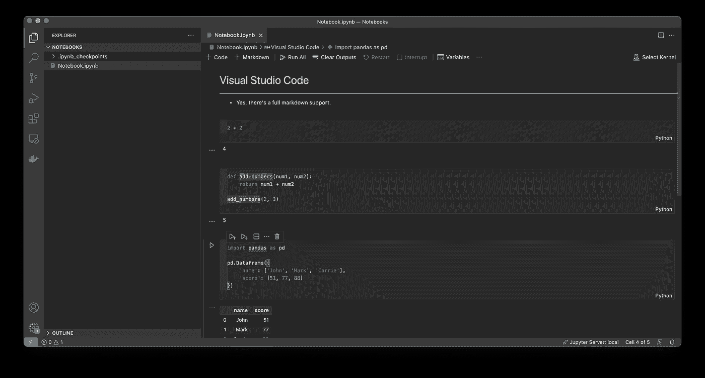

# 2021 年及以后的 4 大 Python 和数据科学 ide

> 原文：<https://towardsdatascience.com/top-4-python-and-data-science-ides-for-2021-and-beyond-3bbcb7b9bc44?source=collection_archive---------6----------------------->

## 功能与简单性—以下是日常数据科学工作流的首选

照片由 [XXSS 发回](https://www.pexels.com/@xexusdesigner?utm_content=attributionCopyText&utm_medium=referral&utm_source=pexels)来自 [Pexels](https://www.pexels.com/photo/two-computer-flat-screen-monitors-turned-on-777001/?utm_content=attributionCopyText&utm_medium=referral&utm_source=pexels)

数据科学 IDEs 的世界可能会让人不知所措。你可以从简单到极致的纯文本编辑器到功能丰富到让你眼花缭乱的 ide。[如果你愿意为一个编码软件付费，分析瘫痪](https://en.wikipedia.org/wiki/Analysis_paralysis)会变得更糟。

你想要简单又实用的东西。你想要一些专业和功能丰富的东西，但不要让人不知所措。有印象吗？这可能不是一次性的决定。

简而言之，没有放之四海而皆准的解决方案。这是个人喜好。我有我的，但在比较这四个时，我会尽量保持公正。

# JupyterLab

是的——这是数据科学家中最受欢迎的 IDE。Jupyter 笔记本使交互性成为可能，Jupyter 实验室将用户体验提升到了一个新的水平。这是一个极简的 IDE，它提供了开箱即用的基本功能，并为更高级的使用提供了选项和技巧。

图片 1 — JupyterLab(图片由作者提供)

JupyterLab 使创建包含代码和解释的丰富的笔记本变得容易。我不知道你是怎么想的，但是我不太喜欢厚重而不可读的代码块。Jupyter 允许你写 Markdown 来解释你的思考过程。这意味着你可以添加图片、网址和任何你能想到的东西。

如果降价对你来说还不够，你猜怎么着？也可以写 HTML 和 CSS。这些允许你像一个网站一样设计笔记本——有明显的限制。

IDE 非常强大，你可以为其他编程语言安装内核——比如 [Java](https://github.com/scijava/scijava-jupyter-kernel) 、 [C++](https://github.com/jupyter-xeus/xeus-cling) 或者 [Scala](https://almond.sh) 。您还可以安装大量的扩展来设计风格或添加功能。

***优点*** *:免费，易于安装，大量可安装插件，极简界面，具有云协作选项。*

***缺点*** *:可怕的编码辅助，tab-autocomplete 慢，编辑* `*.py*` *文件简直是噩梦。*

# Visual Studio 代码

你想要最好的免费多面手吗？选择这一个。Visual Studio 代码非常通用。

*想写笔记本？*检查。
*编辑 Python 文件？*咄。
*配置 Docker 容器？当然可以。
*连接远程服务器？*当然。
*用 Git 进行版本控制？为您提供保障。**

图片 2 — Visual Studio 代码(图片由作者提供)

它基本上是一个由微软开发的文本编辑器，但它比你的普通文本编辑器做得更多。你可以为任何东西安装插件。编码帮助非常有效。总的来说，这是一个容易推荐的产品。

你仍然可以用 JupyterLab 做任何你能做的事情，再加上其他事情。这些包括编辑 Python(或任何编程语言)文件，使用内置终端来管理环境和运行文件，用大量主题中的一个来设计编辑器，等等。

打开和编辑`.ipynb`文件的能力是新的，在开始时并不是最好的。幸运的是，这种情况已经改变了。

这个你不会错的。最棒的是，它完全免费。

***优点*** *:免费、轻量级、易于管理整个数据科学项目生命周期、高度可定制。*

***缺点*** *:有时候会觉得有点迟滞。*

# 皮查姆

拥有一个像 VSCode 这样的防弹解决方案是非常好的，但是有时您需要一个专门的解决方案。PyCharm 是专门为 Python 构建的 IDE。正如你所想象的，这意味着它是功能最丰富的。

图片 3 — PyCharm Professional(图片由作者提供)

PyCharm 给你更专业的体验。这不容易描述，但是使用几分钟后你就会明白我在说什么了。编码帮助是极好的，调试器工作起来很有魅力，环境管理非常简单。

也就是说，一个主要的缺点是免费版本缺乏功能。最大的缺失功能是编辑`.ipynb`文件，这是数据科学工作流程中必不可少的。该功能仅在专业版中可用，每年将花费您大约 90 美元。

我认为这是 Python 开发人员的最佳选择，而不是数据科学家。我主要在将代码从笔记本转移到 Python 文件时使用它。

***优点*** *:感觉专业，惊人的编码辅助，轻松管理 Python 版本和环境。*

***缺点*** *:免费版缺乏对* `*.ipynb*` *文件的支持。编辑 HTML 和 CSS 文件也是一个难题，所以如果你经常使用 Flask，请记住这一点。*

# 数据佩尔

这个是新来的。这是专门为数据科学家开发的 IDE。截至 2021 年 9 月，它仍处于预览版本，但你可以在这里注册。

图片 4 — DataSpell(图片由作者提供)

它与 PyCharm 由同一家公司开发，因此 JetBrains 粉丝会觉得和看起来很熟悉。IDE 包含了基本的数据科学特性，比如笔记本、Markdown、交互式 shell 和 SQL 支持。

你可以在这里阅读我的完整概述:

</tired-of-jupyterlab-try-dataspell-a-new-amazing-ide-for-data-science-fb7cbc1280d4>  

笔记本电脑的体验非常棒，但是它比 PyCharm 更有优势。它可能不会提供免费版本。你现在可以在预览模式下使用它，但是谁知道一旦正式发布会发生什么。

***优点*** *:超级专用于数据科学，笔记本集成非常出色，可以轻松连接到任何数据库。*

***缺点*** *:可能不会免费提供——没有像 PyCharm 那样的社区版本。*

你最喜欢的数据科学 IDE 是什么？请在下面的评论中告诉我。

*喜欢这篇文章吗？成为* [*中等会员*](https://medium.com/@radecicdario/membership) *继续无限制学习。如果你使用下面的链接，我会收到你的一部分会员费，不需要你额外付费。*

<https://medium.com/@radecicdario/membership>  

# 保持联系

*   在[媒体](https://medium.com/@radecicdario)上关注我，了解更多类似的故事
*   注册我的[简讯](https://mailchi.mp/46a3d2989d9b/bdssubscribe)
*   在 [LinkedIn](https://www.linkedin.com/in/darioradecic/) 上连接