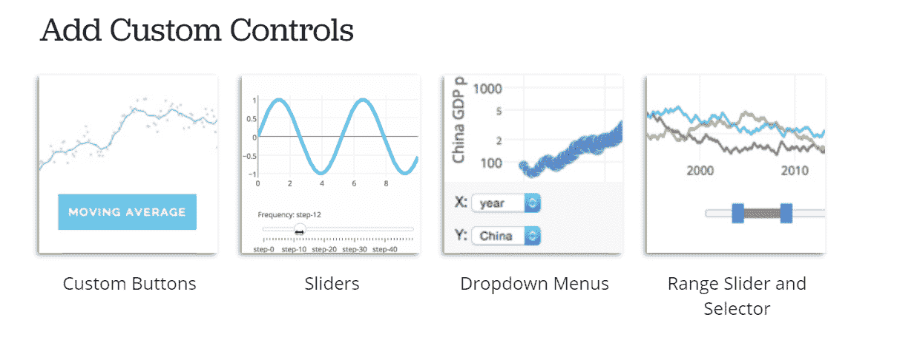
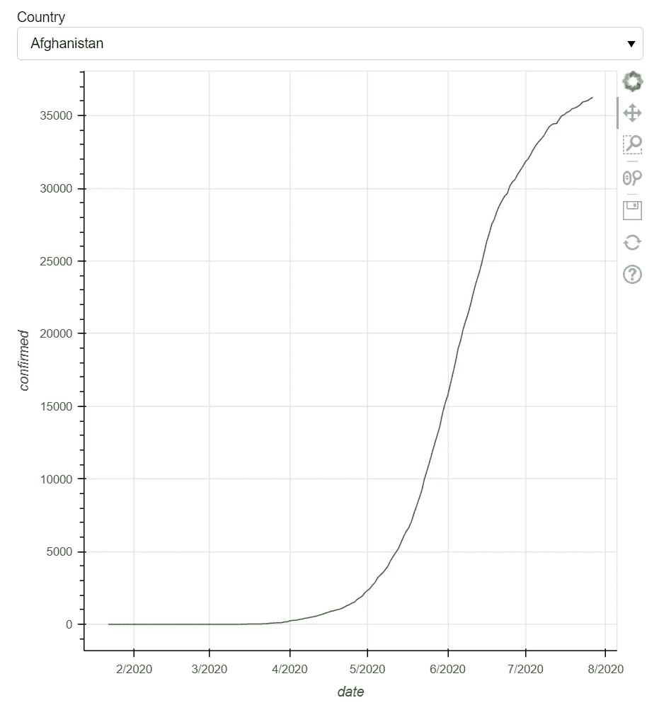
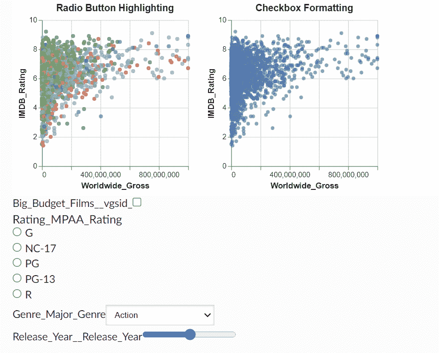
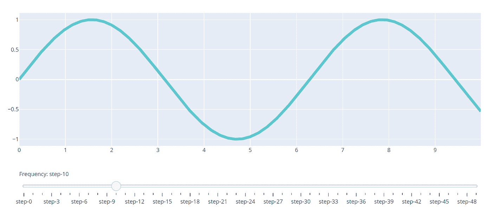
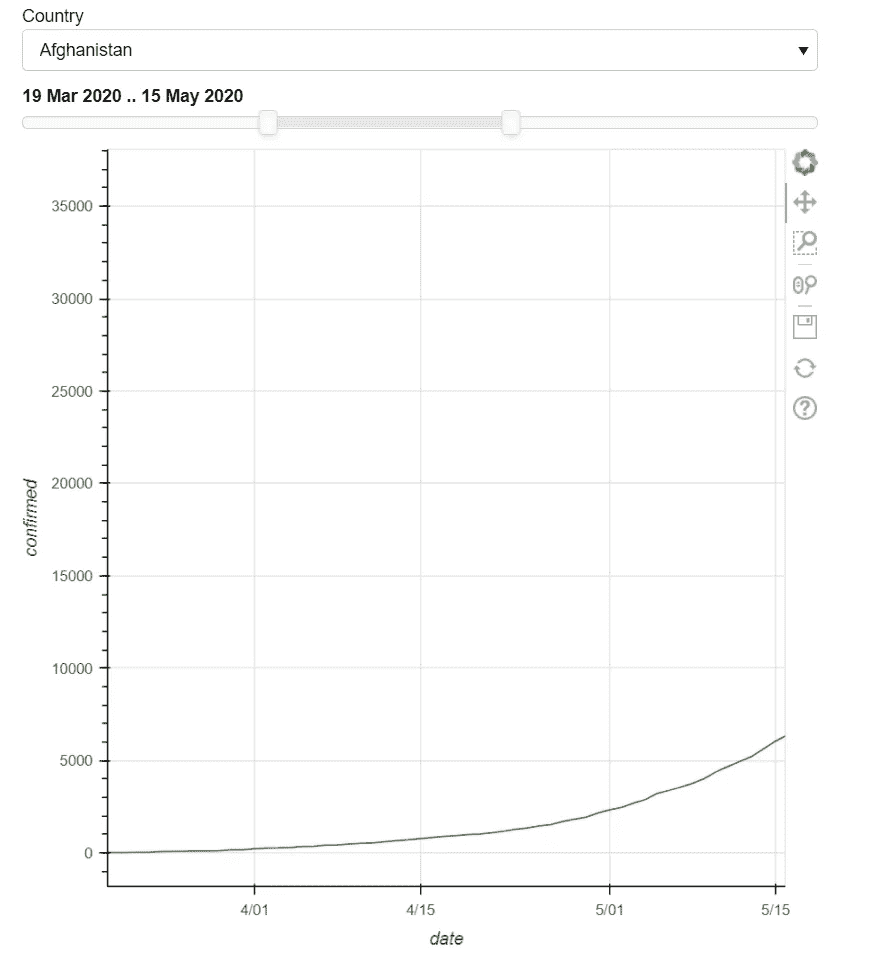

# 构建交互式时间序列图的 4 大 Python 库

> 原文：<https://towardsdatascience.com/top-4-python-libraries-to-build-interactive-timeseries-plots-f2214cc9b1ea?source=collection_archive---------2----------------------->

## 在本教程中，我们将使用 Plotly，Bokeh，Altair 和 Matplotlib 构建交互式时间序列图，并比较哪一个最好。


斯蒂芬·菲利普斯-Hostreviews.co.uk 在 [Unsplash](https://unsplash.com?utm_source=medium&utm_medium=referral) 上的照片

# 介绍

分析数据时遇到的最普遍的数据类型之一是时间序列。从识别趋势到理解“因果”行为，时间序列分析是理解用户行为、购买模式等等最流行的方法之一。

在 Python 中，我们通常从使用 Matplotlib 或 Seaborn 绘制简单的直线曲线开始，如果您只处理一个随时间变化的分类变量，这两种工具是完美的。但是通常你需要一起显示多个分类变量，例如市场数据的股票列表，或者销售数据的地区/位置。

在这种情况下，您可以在同一个图中显示所有系列，也可以为每个系列创建单独的图。然而，这些选项很难理解，而且会占用很多空间。

这就是 Plotly、Bokeh 和 Altair 等高级可视化库发挥作用的地方，因为它们允许您使用下拉菜单、滑块、按钮等功能创建交互式绘图和仪表板。，帮助您的用户探索复杂的数据。

在本文中，我们将探索时间序列可视化的两个交互元素

*   **下拉菜单**让你在同一个情节的不同系列之间切换
*   **日期范围滑块**允许您观察特定时间段之间的趋势

> 以下示例中使用的所有代码均可在[这里](https://github.com/shoumikgoswami/Interactive-plots)找到。

*免责声明:本文是与 Datapane 合作撰写的，我是 datapane 团队的一名社区布道者。*

# 向线图添加下拉菜单

如果数据中有很多类别，例如股票或国家，并且您想在同一个图或图形中使用折线图来观察趋势，下拉菜单非常方便。这样可以避免在一个循环中创建多个图。

所有三个库，即 Plotly，Bokeh 和 Altair 允许你添加一个下拉菜单到图中，但每个都有其优点和缺点。

作为奖励，我还将向您展示使用 Matplotlib 或 Seaborn 实现这一点的方法，它们不支持开箱即用的交互式组件。

# 使用 Plotly 的下拉菜单

Plotly 提供了一系列被称为[自定义控件](https://plotly.com/python/#controls)的交互选项。这些控件最好的地方在于，它们可以完全用 pythonic 代码添加到绘图中。



来源:Plotly 文件(【https://plotly.com/python/#controls】T2)

出于本教程的目的，我们将使用 Covid 19 数据集，它可以在这里[访问](https://www.kaggle.com/imdevskp/corona-virus-report)。

我们将创建一个图表来显示 Covid 19 在全球的分布情况，并添加一个下拉列表来更改同一图表中的国家。

```
buttons = []
i = 0fig3 = go.Figure()country_list = list(df['country'].unique())for country in country_list:
    fig3.add_trace(
        go.Scatter(
            x = df['date'][df['country']==country],
            y = df['confirmed'][df['country']==country],
            name = country, visible = (i==0)
        )
    )

for country in country_list:
    args = [False] * len(country_list)
    args[i] = True

    *#create a button object for the country we are on*
    button = dict(label = country,
                  method = "update",
                  args=[{"visible": args}])

    *#add the button to our list of buttons*
    buttons.append(button)

    *#i is an iterable used to tell our "args" list which value to set to True*
    i+=1

fig3.update_layout(updatemenus=[dict(active=0,
                                    type="dropdown",
                                    buttons=buttons,
                                    x = 0,
                                    y = 1.1,
                                    xanchor = 'left',
                                    yanchor = 'bottom'),
                              ])fig3.update_layout(
    autosize=False,
    width=1000,
    height=800,)
```

您将有一个漂亮的下拉菜单添加到时间序列图中。

来源:[https://data pane . com/u/shou mik/reports/0kz 9 za 7/drop-with-plotly/](https://datapane.com/u/shoumik/reports/0kz9Za7/dropdown-with-plotly/)

# 使用散景的下拉菜单


来源:Bokeh 文档([https://docs . Bokeh . org/en/latest/docs/user _ guide/interaction/widgets . html](https://docs.bokeh.org/en/latest/docs/user_guide/interaction/widgets.html))

散景有称为部件的组件，可用于将几个交互式组件添加到您的绘图中。小部件主要用于创建 Bokeh 服务器上的仪表板组件。你可以在这里阅读更多关于 widgets [的内容。](https://docs.bokeh.org/en/latest/docs/user_guide/interaction/widgets.html)

请记住，为了创建独立 HTML 文件的小部件，或者甚至在使用 Jupyter notebook 时，您将需要使用 **CustomJS** 回调。这需要一点 JavaScript 知识来让下拉菜单正常工作。如果你想用纯 pythonic 的方式来做，你必须使用 Bokeh 服务器来让小部件工作。

我们将使用散景下拉来复制与上面相同的用例。

```
cols1=df.loc[:, ['country','date', 'confirmed']]
cols2 = cols1[cols1['country'] == 'Afghanistan' ]Overall = ColumnDataSource(data=cols1)
Curr=ColumnDataSource(data=cols2)*#plot and the menu is linked with each other by this callback function*callback = CustomJS(args=dict(source=Overall, sc=Curr), code="""
var f = cb_obj.value
sc.data['date']=[]
sc.data['confirmed']=[]
for(var i = 0; i <= source.get_length(); i++){
	if (source.data['country'][i] == f){
		sc.data['date'].push(source.data['date'][i])
		sc.data['confirmed'].push(source.data['confirmed'][i])
	 }
}   

sc.change.emit();
""")menu = Select(options=country_list,value='Afghanistan', title = 'Country')  *# drop down menu*bokeh_p=figure(x_axis_label ='date', y_axis_label = 'confirmed', y_axis_type="linear",x_axis_type="datetime") *#creating figure object*bokeh_p.line(x='date', y='confirmed', color='green', source=Curr) 
*# plotting the data using glyph circle*menu.js_on_change('value', callback) *# calling the function on change of selection*layout=column(menu, bokeh_p) *# creating the layout*
show(layout)
```

这是剧情的样子-



来源:作者创作

# 使用 Altair 的下拉菜单



来源:Altair 文档([https://Altair-viz . github . io/gallery/multiple _ interactions . html](https://altair-viz.github.io/gallery/multiple_interactions.html))

在用纯 pythonic 方式构建可视化方面，Altair 类似于 Plotly。虽然 Altair 提供了许多交互式组件，但要以用户友好的布局来排列这些组件有点困难。你可以在这里阅读更多关于 Altair [交互组件的信息。](https://altair-viz.github.io/gallery/multiple_interactions.html)

我们现在将使用 Altair 创建相同的绘图，并向绘图添加一个下拉菜单。

```
input_dropdown = alt.binding_select(options=country_list)
selection = alt.selection_single(fields=['country'], bind=input_dropdown, name='Country')alt_plot = alt.Chart(df).mark_line().encode(
    x='date',
    y='confirmed',
    tooltip='confirmed'
).add_selection(
    selection
).transform_filter(
    selection
)alt_plot
```

这是剧情的样子-

来源:[https://data pane . com/u/shou mik/reports/dkjVxgk/drop down-with-Altair/](https://datapane.com/u/shoumik/reports/dkjVxgk/dropdown-with-altair/)

# 使用 Matplotlib 和 Datapane 的下拉菜单

如果您想使用像 Matplotlib 或 Seaborn 这样的非交互式库，您可以使用 Datapane 添加交互性，data pane 是一个用于创建和托管数据报告的库。Datapane 提供了一些高级布局模块，如 **dp。选择**，让你模仿交互过滤能力，像这样:

```
plot_list = []plt.figure(figsize=(10, 5), dpi=300)for country in country_list:
    plot = dp.Plot(df[df['country']==country].plot.scatter(x='date', y='confirmed'), label=country)
    plot_list.append(plot)report = dp.Report(
    dp.Text('''## Dropdown using Datapane'''),
    dp.Select(blocks = plot_list)
)report.preview()
```

这就是它看起来的样子-

来源:[https://data pane . com/u/shou mik/reports/r 70 pzg 7/drop down-with-data pane/](https://datapane.com/u/shoumik/reports/R70pzg7/dropdown-with-datapane/)

请注意，您目前不能使用 Datapane 将日期范围滑块添加到您的图中。如果你是 Datapane 的新手，你可以在这里阅读更多关于不同块的内容。

# 向折线图添加日期范围滑块



来源:Plotly 文档

在处理时间序列图时，另一个非常方便的交互组件是日期范围滑块或通用滑块。

由于大多数时间序列图都在 X 轴上有一个日期范围，因此滑块允许您动态更改时间段，并只查看图的一部分，以了解该特定时间段的趋势。

# 使用 Plotly 的日期范围滑块

Plotly 有一个通用的滑块组件，可以用来改变对应于任何轴的数据。虽然它没有针对时间序列数据的特定滑块，但通用滑块可用于创建日期范围滑块。

你可以在这里阅读更多关于滑块[的内容。](https://plotly.com/python/sliders/)

为了创建一个滑块，我们将使用之前用下拉菜单创建的相同的 timeseries 绘图，并在绘图下面添加一个滑块组件。

```
buttons = []
i = 0fig3 = go.Figure()country_list = list(df['country'].unique())for country in country_list:
    fig3.add_trace(
        go.Scatter(
            x = df['date'][df['country']==country],
            y = df['confirmed'][df['country']==country],
            name = country, visible = (i==0)
        )
    )

for country in country_list:
    args = [False] * len(country_list)
    args[i] = True

    *#create a button object for the country we are on*
    button = dict(label = country,
                  method = "update",
                  args=[{"visible": args}])

    *#add the button to our list of buttons*
    buttons.append(button)

    *#i is an iterable used to tell our "args" list which value to set to True*
    i+=1

fig3.update_layout(updatemenus=[dict(active=0,
                                    type="dropdown",
                                    buttons=buttons,
                                    x = 0,
                                    y = 1.1,
                                    xanchor = 'left',
                                    yanchor = 'bottom'),
                              ])fig3.update_layout(
    autosize=False,
    width=1000,
    height=800,)
```

这会给你这样的东西-

来源:[https://data pane . com/u/shou mik/reports/43 gpbv 7/drop-and-slider-with-plotly/](https://datapane.com/u/shoumik/reports/43gPbv7/dropdown-and-slider-with-plotly/)

# 使用散景的日期范围滑块

与 Dropdown 小部件类似，Bokeh 也有一个日期范围滑块小部件，专门用于处理时间序列数据。这个小部件不同于一般的范围滑块小部件。为了让这个小部件工作，需要一个 CustomJS 回调。

```
cols1=df.loc[:, ['country','date', 'confirmed']]
cols2 = cols1[cols1['country'] == 'Afghanistan' ]Overall = ColumnDataSource(data=cols1)
Curr=ColumnDataSource(data=cols2)*#plot and the menu is linked with each other by this callback function*
callback = CustomJS(args=dict(source=Overall, sc=Curr), code="""
var f = cb_obj.value
sc.data['date']=[]
sc.data['confirmed']=[]
for(var i = 0; i <= source.get_length(); i++){
	if (source.data['country'][i] == f){
		sc.data['date'].push(source.data['date'][i])
		sc.data['confirmed'].push(source.data['confirmed'][i])
	 }
}   

sc.change.emit();
""")menu = Select(options=country_list,value='Afghanistan', title = 'Country')  *# drop down menu*
bokeh_p=figure(x_axis_label ='date', y_axis_label = 'confirmed', y_axis_type="linear",x_axis_type="datetime") *#creating figure object* 
bokeh_p.line(x='date', y='confirmed', color='green', source=Curr) *# plotting the data using glyph circle*
menu.js_on_change('value', callback) *# calling the function on change of selection*date_range_slider = DateRangeSlider(value=(min(df['date']), max(df['date'])),
                                    start=min(df['date']), end=max(df['date']))date_range_slider.js_link("value", bokeh_p.x_range, "start", attr_selector=0)
date_range_slider.js_link("value", bokeh_p.x_range, "end", attr_selector=1)layout = column(menu, date_range_slider, bokeh_p)
show(layout) *# displaying the layout*
```

这就是它看起来的样子-



来源:作者创作

# 使用 Altair 的日期范围滑块

与 Plotly 类似，Altair 可以将通用滑块用作日期范围滑块。但是，请记住，Vega 以毫秒为单位考虑时间序列数据，很难在滑块中显示日期信息。如果你有每年的数据，它可以工作，但是如果数据被分解成几天和几个月，就很难工作了。

```
input_dropdown = alt.binding_select(options=country_list)
selection = alt.selection_single(fields=['country'], bind=input_dropdown, name='Country')def **timestamp**(t):
  return pd.to_datetime(t).timestamp() * 1000slider = alt.binding_range(
    step=30 * 24 * 60 * 60 * 1000, *# 30 days in milliseconds*
    min=timestamp(min(df['date'])),
    max=timestamp(max(df['date'])))select_date = alt.selection_single(
    fields=['date'],
    bind=slider,
    init={'date': timestamp(min(df['date']))},
    name='slider')alt_plot = alt.Chart(df).mark_line().encode(
    x='date',
    y='confirmed',
    tooltip='confirmed'
).add_selection(
    selection
).transform_filter(
    selection
).add_selection(select_date).transform_filter(
    "(year(datum.date) == year(slider.date[0])) && "
    "(month(datum.date) == month(slider.date[0]))"
)alt_plot
```

这就是它看起来的样子-

来源:[https://data pane . com/u/shou mik/reports/VkGyaV3/drop-and-slider-with-Altair/](https://datapane.com/u/shoumik/reports/VkGyaV3/dropdown-and-slider-with-altair/)

# 裁决

现在已经使用了所有三个库，我们可以对它们进行比较，并分享我们对哪一个是创建交互式可视化的最佳 python 库的看法。

## Plotly

**优点-**

*   易于使用，并与 Python 无缝协作。
*   布局可以根据要求设计，以确保菜单出现在绘图的正确区域。
*   易于查看和嵌入 Plotly 情节。

**缺点-**

*   不提供许多交互式组件。
*   有一个陡峭的学习曲线来使交互组件工作。

## 散景

**优点-**

*   用散景创建的情节和交互部件看起来很有美感。
*   因为散景更倾向于创建仪表板，所以使用多个组件创建布局更容易。
*   一些交互式部件可以添加到绘图中。

**缺点-**

*   为了让小部件工作，您需要了解一点 JavaScript，以便能够创建 **CustomJS** 回调。
*   在创建这些 JavaScript 回调函数时，缺乏适当的文档和示例代码。
*   除非您使用散景服务器，否则很难嵌入这些图。

## 阿尔泰尔

**优点-**

*   与 Plotly 相比，Altair 提供了更多的交互式组件选项。
*   使用纯 Python 很容易构建交互式组件。
*   需要更少的代码行来使交互组件工作。

**缺点-**

*   使用 Altair 很难设计和创建视觉上吸引人的布局。
*   处理时间序列数据并不简单，因为 Vega 不支持现成的时间序列数据，需要进行一些转换才能使其工作。

# 结论

总的来说，如果您正在开始使用 Python 进行交互式绘图，那么使用有限的交互式组件创建简单的绘图时， **Plotly 可能是一个不错的选择。**

但是**如果你想在你的剧情中加入一些互动元素，那么 Altair 是你应该真正尝试的东西。最好的部分是你可以用 Python 代码添加几个交互组件。**

如果你想构建非常复杂的交互式仪表盘，你可以使用散景。但是请记住，您将需要一些 JavaScript 知识来使它们工作。

如果您想坚持使用 Matplotlib 和 Seaborn 之类的非交互式可视化库，并且仍然想要某种形式的交互性，比如只有一个下拉菜单，那么 Datapane 可能是一个不错的选择。

我希望本教程和示例代码对您有所帮助。
请在下面的评论中分享你的想法或反馈。