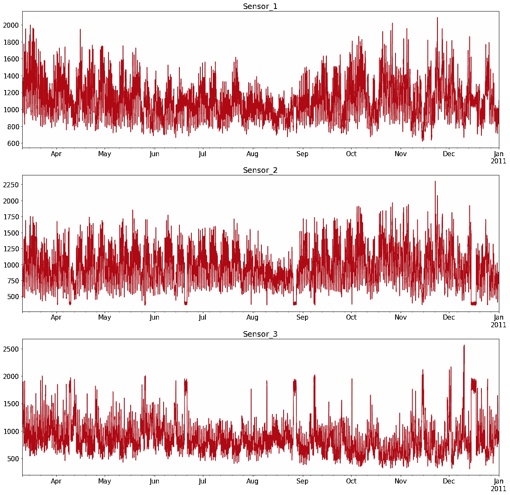
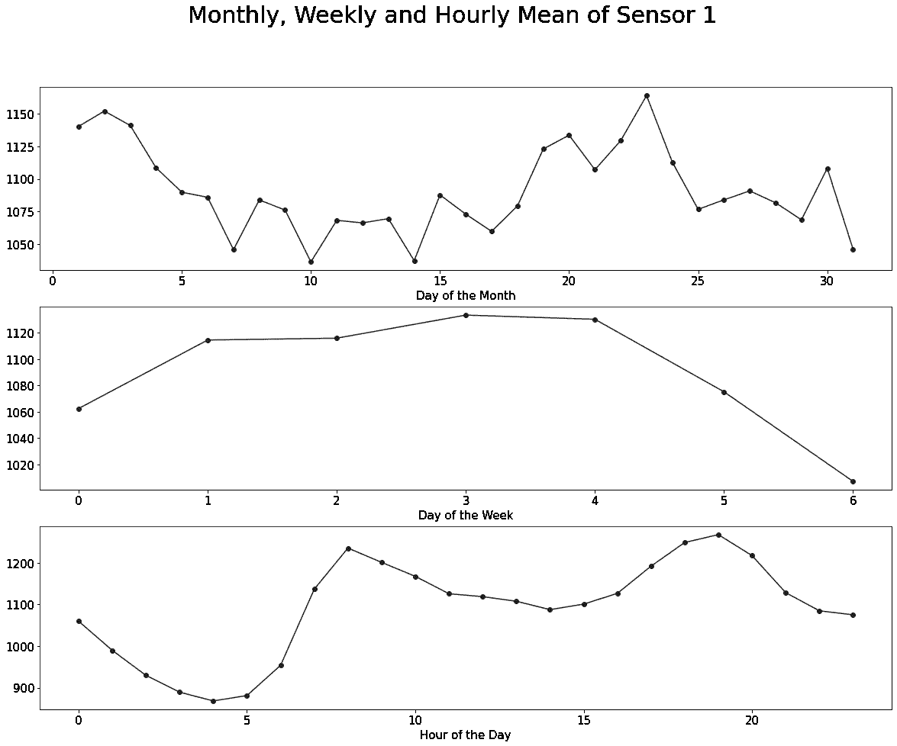
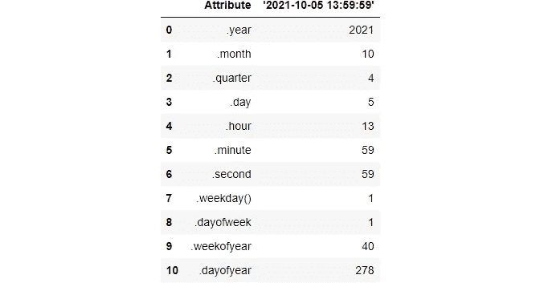
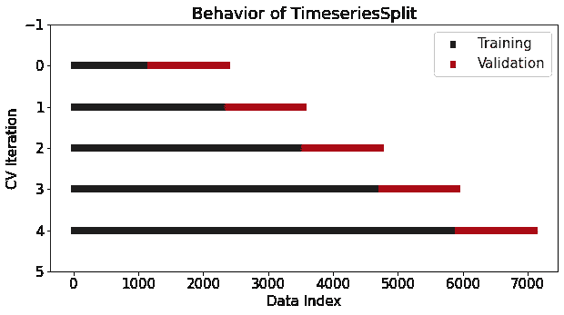
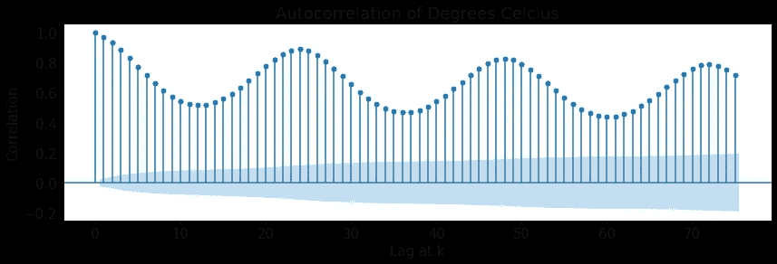
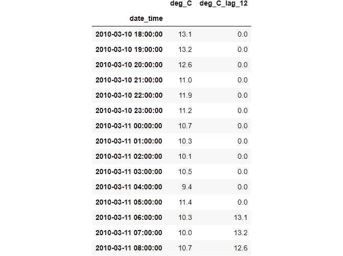

# 来自 Kaggle 的 4 大时序特征工程经验

> 原文：<https://towardsdatascience.com/top-4-time-series-feature-engineering-lessons-from-kaggle-ca2d4c9cbbe7?source=collection_archive---------3----------------------->

## 了解库尔孩子们在做什么

**照片由** [**Pixaline**](https://pixabay.com/users/pixaline-1569622/?utm_source=link-attribution&utm_medium=referral&utm_campaign=image&utm_content=1661767) **上** [**Pixabay。**](https://pixabay.com/?utm_source=link-attribution&utm_medium=referral&utm_campaign=image&utm_content=1661767) **除特别注明外，所有图片均为作者所有。**

# 介绍

在 Kaggle 上，每个人都知道要赢得表格比赛，你需要超越其他工程师。几乎任何人都可以执行出色的 EDA，开发验证策略并调整超参数，以充分发挥模型的性能。

通往顶层的关键永远是特性工程，而不是在教程、书籍或课程中教授的东西。这完全是关于创造力、经验和领域知识。

随着时间成分的加入，特征工程在时间序列预测挑战中变得更加重要。参加本月(7 月) [TPS 游乐场比赛](https://www.kaggle.com/c/tabular-playground-series-jul-2021)的顶尖选手再次证明了这一点。

这个月有太多关于 FE 的精彩例子了。特别是，仅使用可用数据创建的气象特定要素值得特别关注。

出于这些原因，我决定写这篇文章来收集创建健壮的时序特征工程工作流的最佳实践和方法。

<https://ibexorigin.medium.com/membership>  

获得由强大的 AI-Alpha 信号选择和总结的最佳和最新的 ML 和 AI 论文:

<https://alphasignal.ai/?referrer=Bex>  

# 1.特征工程与 EDA 携手并进

> 有效的特征工程归结于对数据集的深入理解。

为了获得创建新特性的初步想法，您需要对现有的列执行 EDA。在时间序列中，您可以提取的最基本的特征是基于日期的。

例如，您可以提取月份号、一个月中的某一天、一周中的某一天、一天中的某一部分(小时、上午或下午)等。

这个基于日期的特性列表很长，您最初的 EDA 应该有助于缩小值得探索的特性的范围。例如，让我们看看 TPS 七月数据集的传感器记录:

从这些图中看不出多少东西。

让我们进一步细化，从时间戳中提取日期、星期和小时属性:

我们将绘制第一个传感器的新特性，并合计得出每个传感器的平均值:

这些图告诉我们，传感器 1 的值在月中、周末确实会直线下降，并且在每天的高峰时间会显著增加。特别地，第二和第三子曲线暗示传感器 1 可以测量基于移动车辆的体积而变化的物质的量。

一般来说，您想要创建的任何基于时间的要素都应该通过绘制它们来进行仔细分析，并查看它们是否发现了在创建这些要素之前不可见的新模式。

换句话说，你生成的每个特征都应该在某种程度上有助于模型的预测能力。许多教程和课程建议您创建可以从时间戳中提取的每一个可能的特征，如下所示:

如果创建以上任何一项没有意义，或者至少在绘制时揭示了基本模式，它们只会增加模型的复杂性和数据集的维度，而不是有用的。

例如，添加一年中的星期、一年中的月份和年数是没有用的，因为 TPS 数据只记录了一年。这些特征将是噪声，因为它们不足以让模型进行概括。

您也不应该限制自己只使用默认的 pandas 函数来生成特性。

例如，参与者创造的一些非常规的基于时间的特征确实有助于得分。其中包括对周末(is_weekend)或办公时间(8-19 点)录制的每个样本进行编码。

# 2.有一个验证策略来检查新功能的有效性

几乎总是，你需要一个更健壮的方法，而不仅仅是图来评估新特性的有效性。

对于表格数据，这通常是简单的 k 倍交叉验证。专门针对时序数据的是 Sklearn 的`TimeSeriesSplit`交叉验证器。它的设计使得在每一次折叠中，您只需要根据过去的值训练一个模型，并根据未来的数据点进行测试。

在创建任何新特性之前，您需要实现这个本地验证并建立一个基础性能。例如，在初始特征上训练和评分类似随机森林的基线模型，并设置基准:

然后，当您添加一两个特性时，运行这个验证管道，看看分数是否提高了。例如，让我们看看我们创建的前 3 个功能是否能提高分数:

即使分数略有提高，你也可以保留新的特性，因为一旦你添加了许多其他相关的特性，分数的提高就会累积并变得显著。

# 3.基于自相关创建滞后要素

时间序列数据具有季节性、趋势和周期等核心成分。

例如，冰淇淋销售通常具有年度季节性——你可以根据今年的销售情况合理地预测下一个夏天的销售情况。类似地，温度或空气质量测量也有每日或每年的季节性。

将这些信息编码为特征可以帮助模型在数据中发现新的学习模式。由于所有的时间序列都有不同的周期或季节性，剩下的唯一问题是，“你需要回顾多少个时期，才能得到对未来数据点的稳健估计？”

如果你一直在阅读我的[最新帖子](https://ibexorigin.medium.com/list/time-series-forecast-from-scratch-c72ccf7a9229)，你已经知道自相关图回答了这个问题。例如，让我们绘制 TPS 数据中温度的自相关图:

> 从这篇[帖子](/advanced-time-series-analysis-in-python-decomposition-autocorrelation-115aa64f475e?source=your_stories_page-------------------------------------)中了解更多关于自相关和 ACF 图的信息。

如您所见，ACF 图显示了当前温度与其 12 小时或 24 小时滞后版本之间的强自相关性(记录了一天中每小时的 TPS 数据)。

这意味着您可以将温度的滞后 12 或滞后 24 添加到数据集:

这些特征被称为滞后特征，因为我们将数据点转移到未来。

通过对所有变量重复此过程，您可以提取许多相关的新要素-通过自相关找出季节性，并将此信息编码为新要素。

# 4.创建特定于领域的功能

**照片由** [**马库斯·温克尔**](https://www.pexels.com/@markus-winkler-1430818?utm_content=attributionCopyText&utm_medium=referral&utm_source=pexels) **上** [**像素**](https://www.pexels.com/photo/green-and-white-braille-typewriter-4160089/?utm_content=attributionCopyText&utm_medium=referral&utm_source=pexels)

真正区分有经验的数据专家和没有经验的数据专家的是领域知识。

今天，每个人都可以自学技术技能。相比之下，强大的领域知识只有在单一行业工作很长一段时间才能获得。

然而，每场 Kaggle 比赛都涉及完全不同行业的数据集，ka ggler 在没有领域知识的情况下仍能获得令人印象深刻的结果。那么，秘诀是什么呢？

答案很简单——你需要愿意付出额外的努力。您应该对每个功能进行额外的研究，并找出数据集描述中未提供的特定于领域的信息。

例如，7 月份 TPS 的参与者使用温度、绝对湿度和相对湿度变量提出了 3 个特定于气象学的特征。这些是:

*   **露点**:空气必须冷却到水蒸气饱和的温度。简单来说，就是空气中的水蒸气凝结成液态水的温度。露点越高，空气中的水分就越多。
*   **分压**:混合气体中一种气体所施加的压力大小。
*   **饱和水蒸气**:绝对湿度和相对湿度的关系。

> 我不会用计算来打扰你，但是你可以查看[这个线程](https://www.kaggle.com/c/tabular-playground-series-jul-2021/discussion/252643)来了解更多。

这些类型的功能可能是在竞争中赢得解决方案的关键，或者提高最终得分，以跨越您需要的一些重要门槛。

特定于领域的要素将与现实世界中的目标有直接关系，但这些关系在放入数据集中时可能会丢失。

作为主要素工程师，您的工作是重新发现这些关系，并使数据集的信息更加丰富，以供模型利用。

# 摘要

通过阅读这篇文章，你发现了我从顶级 Kagglers 那里学到的强大的时间序列特征工程技术。

正如数据科学的大部分内容一样，您已经了解到正确的 EDA 是成功的特性工程的第一步。您还学习了使用基于时间序列的交叉验证的本地验证策略来评估每个新特性的效率。

此外，您可以利用时间序列的独特属性(如季节性)来生成滞后特征。最重要的是，向您介绍了特定于领域的特性生成。

感谢您的阅读！

> 你可以从[这个介质列表](https://ibexorigin.medium.com/list/time-series-forecast-from-scratch-c72ccf7a9229)中阅读这个时间序列预测系列的所有文章。

## 您可能也会感兴趣…

*   [如何消除时间序列预测中的非平稳性](/how-to-remove-non-stationarity-in-time-series-forecasting-563c05c4bfc7?source=your_stories_page-------------------------------------)
*   [如何检测时间序列预测中的随机游走和白噪声](/how-to-detect-random-walk-and-white-noise-in-time-series-forecasting-bdb5bbd4ef81?source=your_stories_page-------------------------------------)
*   [6 针对时间序列数据的强大特征工程技术](https://www.analyticsvidhya.com/blog/2019/12/6-powerful-feature-engineering-techniques-time-series/)