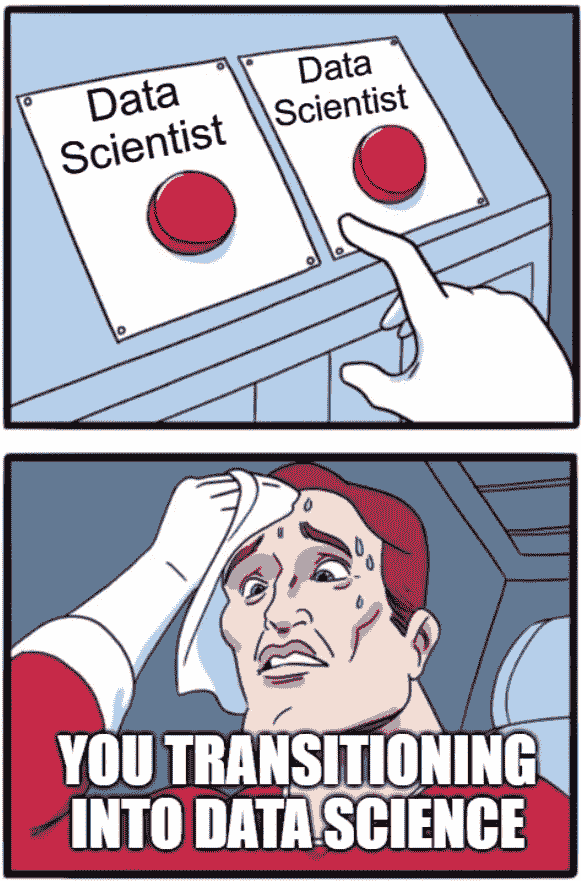
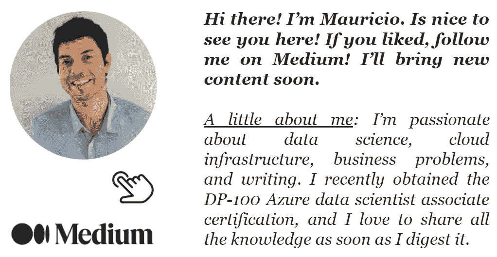

# 2021 年前 5 大数据科学工作角色

> 原文：<https://towardsdatascience.com/top-5-data-science-job-roles-for-2021-c487fd4ed1c6?source=collection_archive---------22----------------------->

## 意见

## 数据科学家不是一个…

Yoal Desurmont 在 [Unsplash](https://unsplash.com?utm_source=medium&utm_medium=referral) 上拍摄的照片

云计算的兴起加速了人工智能的采用。期望产生了，公司认为雇用数据科学家并给他们一堆数据，就足以解决公司内部的所有问题。但是，像每个开始字段一样，在正确处理值之前需要时间。对于数据科学团队来说，这没什么不同。

对我们来说，幸运的是，情况正在迅速变化。关于“数据科学”的真正含义，每年都有更多的知识和经验。此外，数据科学社区分享了一种令人难以置信的协作精神，这在该行业经历的快速发展中至关重要。

> 根据 Linkedin 的最新报告，数据科学和人工智能在 2021 年最受欢迎的[工作](https://www.searchenginejournal.com/linkedin-top-15-in-demand-jobs-in-2021/392479/#close)中分别排名第 14 和第 15 位。

这种专业知识正在迅速地将任务转化为角色，使得每个团队成员都应该知道的必要技能更加具体。世界终于理解了，就像在任何其他结构良好的领域一样，数据科学团队需要不同类型的专家来交付伟大的成果(尽管我见过一些一体化的超级英雄，但这样的伟大不应该总是被期待)。

成功构建数据科学项目所需的各种能力将数据科学家的角色转变为一个充满有价值背景的团队。在这个动态的环境中，新的职位不断涌现，是时候解释这些职位是什么以及为什么需要它们了。

# 分析翻译器

将业务问题构建到真正的数据科学项目中并不是一件容易的事情。它需要一些技术知识，但也需要一定的业务理解，这是一个你不会在每个角落都找到的组合。组织通常犯的一个错误是将每个数据问题都视为机器学习问题，这对团队的士气来说非常糟糕。可以更顺利解决的问题，如定义业务规则，只是浪费数据科学团队的时间和精力。

一个好的分析翻译者可以根据机器学习计划的业务影响及其数据科学相关性，充分确定这些计划的优先级。与来自企业或管理项目的人建立关系也在意料之中。后者可以减轻数据经理的工作量，让他们有更多的时间为团队提供指导。

## **如何成为一个？**

在沟通技巧上多下功夫，这很关键，因为你将一只脚踩在业务上，另一只脚踩在数据科学团队上:翻译是一项双向任务。像 SQL、Python 或 R 这样的技术技能也非常值得推荐。它们是必需的，因为你将面临大量的探索性分析，记住目标是决定问题是否值得。此外，了解一些机器学习的基础知识，如监督学习和非监督学习，将有助于理解问题是否适用于传统的机器学习技术。

# 数据工程师

除了是我的最爱之一，完全有必要揭开一个普遍假设的神秘面纱。当人们定义数据工程师时，你最有可能得到的定义是这样的:“他们支持数据科学家和数据分析师”。但那其实是误导，他们不是数据科学家的助手。他们实际做的是顺利解决很多别人难以解决的数据任务。

它们变得相关，因为不太可能找到可以直接查询来解决机器学习问题的数据库。通常，有不止一个数据源，它们需要被连接和争论以创建最终的“主表”。数据工程师创建高效的数据管道，解决复杂的数据接收，实现快速数据传输，进行云数据集成，以及解决数据管道问题，这些只是他们的部分职责。

## **如何成为一个？**

一定要精通 Python，SQL，Spark。如果可以的话，更进一步:不要只是做一些数据争论，试着用那些框架优化一些数据管道。云知识也将非常受欢迎，因为大多数云提供商都有自己特定的 ETL 工具。相信我，熟悉他们会提升你的表现。最后，一些基于 DAG 的编排工具可能会改变您的游戏规则。气流是实现这一目的的最佳工具之一，所以要确保你能跟着它一起飞。

# 机器学习工程师

关于机器学习工程师的第一个想法是，他们应该有很重的数据科学和软件工程背景。尽管如此，这两个背景还不足以成为这个角色的合适人选。一件事是了解机器学习模型背后的理论，并能够编写世界上最干净的代码，但另一件完全不同的事情是有效地生产分析解决方案。

一个好的机器学习工程师掌握模型部署，确保度量监控，解决管道集成，在高层次上可视化项目，并确保部署环境的可扩展性和灵活性。这些特征非常具体，你应该明白，成为一名机器学习工程师绝对不仅仅需要连接 API 和训练模型。

## **如何成为一个人？**

有三个主要领域你应该练习:数据科学、基础设施和软件开发。在数据科学方面，只需了解基础知识:如统计学、机器学习和 ML 框架。对于基础设施，您应该了解如何部署模型，以及如何将它们用于业务目的。此外，您可以学习如何在任何云提供商上操作模型，因为一旦得到一个，其他的将遵循相同的原则。对于软件开发来说，学习如何编写干净和可维护的代码，理解分布式系统和一些容器化可能会有用。

# 数据架构师

你可以认为数据架构师是数据工程师的下一步。但是这种说法伴随着一些警告，因为从开发数据管道到设计数据系统是完全不同的。数据架构师的角色是一个更全面的角色，因为它需要大量的技术知识，但也需要能够解决非常抽象的问题。

数据架构师定义如何创建新的数据集合、确保数据质量、消除数据冗余，以及为商业智能和分析工作流精心设计最佳架构。更多的高级架构师可以参与公司的云战略。影响和责任会变得巨大。

## 如何成为一个？

数据架构模式应该是你清单上的第一件事。每天都有新的范例(比如 data [lakehouses](https://databricks.com/research/lakehouse-a-new-generation-of-open-platforms-that-unify-data-warehousing-and-advanced-analytics?utm_source=bambu&utm_medium=social&utm_campaign=advocacy&blaid=1096585) )，所以保持你的学习路径是必要的努力。云设计也很重要，一个很好的学习方法就是取得证书。有很多架构师认证，但最相关的来自前三大云提供商。还需要对数据库有深入的了解，所以要准备好配置不同的数据结构。

# 软件工程师

与相反的情况相比，没有与公司系统无缝集成的机器学习模型的成功概率要小得多。这就是软件工程师出手相救的地方。如果拥有一些软件工程和数据科学背景对机器学习工程师来说还不够，这里我们可以说它非常适合。

理解机器学习模型提供的输入和输出对于软件工程师来说是一笔巨大的财富。能够将内部系统和模型之间的一切放在上下文中，将确保适当的集成。没有什么比结构良好和健壮的软件开发更能为公司提供长期价值了。

## 如何成为一个？

对软件工程师有很多要求，但我将只关注他们的数据科学特性。如果你已经是一名软件工程师，向数据科学团队要一个项目！他们会为拥有你而感到幸福。如果你已经知道一些 Javascript 或 Java，那么选择 Python 是完全有意义的。大多数情况下，机器学习工程师会为你提供一个 REST API，所以独立于语言，学习数据结构的基础知识更重要。

# 数据科学家呢？

为什么不包括数据科学家的角色？因为对于大多数人来说，第一选择是作为数据科学家开始他们的数据职业生涯已经有一段时间了。尽管这没什么错，但在匆忙做出如此重要的决定之前，你必须明白，并不是只有一个角色。

图片作者。

也许你有很棒的项目管理和沟通技巧，但没有丰富的机器学习经验。在这种情况下，过渡到分析翻译可能是最适合你的。或者，你是一个伟大的数据库专家，为什么不投身于数据工程呢？。

# 最后的想法

我希望大家记住的最后一条信息是，数据科学家只是众多数据角色中的一个。你应该检查一下是否有其他的角色更适合你的技能和背景。如果在看了他们每一个人之后，你决定走数据科学家的道路，那么恭喜你！你的技能一定会变得非常有价值！。

# 参考

[1] N. Haunke，J. Levine，P. McInerney，分析译者:[新的必备角色](https://www.mckinsey.com/business-functions/mckinsey-analytics/our-insights/analytics-translator) (2018)，麦肯锡。

[2] M. Southern，[LinkedIn:2021 年 15 大热门职位(2021)](https://www.searchenginejournal.com/linkedin-top-15-in-demand-jobs-in-2021/392479/#close) ，Searchenginejournal。

[3]m·阿姆布鲁斯特，A·高德西，r·辛，m·扎哈里亚，莱克豪斯:[统一数据仓库和高级分析的新一代开放平台](https://databricks.com/research/lakehouse-a-new-generation-of-open-platforms-that-unify-data-warehousing-and-advanced-analytics?utm_source=bambu&utm_medium=social&utm_campaign=advocacy&blaid=1096585) (2020)，Databricks。

# 再见

我真的希望这个博客能让你感兴趣。如果你喜欢就跟着我！很快会有更多内容！。

我也在 [Linkedin](http://www.linkedin.com/in/maletelier) 和 [Twitter](https://twitter.com/maletelier) 上。我很乐意与你交谈！如果你想多读一点，看看我最近的一些帖子:

 [## NumPy 中从头开始的 ROC 曲线和 AUC(可视化！)

### 因为你只有在建造它的时候才会学到它。

towardsdatascience.com](/roc-curve-and-auc-from-scratch-in-numpy-visualized-2612bb9459ab)  [## 决策树:你应该已经学会了

### 循序渐进的指南

towardsdatascience.com](/decision-trees-as-you-should-have-learned-them-99862469493e)