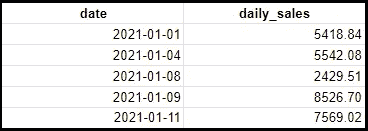
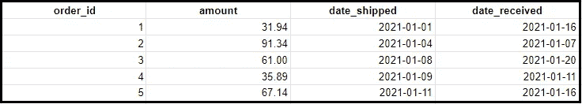

# 数据科学面试中你应该知道的 SQL 中的五大日期函数

> 原文：<https://towardsdatascience.com/top-5-date-functions-in-sql-that-you-should-know-for-data-science-interviews-d56dd9378785?source=collection_archive---------9----------------------->

## 关注数据科学家最重要的概念


照片由[垂怜经·金](https://unsplash.com/@kyrie3?utm_source=unsplash&utm_medium=referral&utm_content=creditCopyText)在 [Unsplash](https://unsplash.com/s/photos/calendar?utm_source=unsplash&utm_medium=referral&utm_content=creditCopyText) 上拍摄

一个优秀的 SQL 程序员应该能够以他们喜欢的任何方式操作数据——其中很大一部分是能够操作日期。日期非常重要，因为企业喜欢比较和评估不同时期的经营业绩。因此，能够操纵日期对于顶层业务操作和业务报告是至关重要的。

在本文中，我们将深入探讨 SQL 中 5 个最重要和最有用的日期函数，以及一些可以使用它们的实际商业案例。

# 1.日期 _TRUNC()

## 语法:

```
DATE_TRUNC(date_expression, date_part)
```

## 它是做什么的？

DATE_TRUNC()将日期缩短到指定的日期部分。

在下面的示例中，由于我们指定了 date_part = MONTH，date_trunc()将截断日期以获得该月的第一天:

```
DATE_TRUNC('2021-06-28', MONTH) = '2021-06-01'
```

再举一个例子，如果我们指定 date_part = YEAR，那么我们将得到指定日期的一年的第一天:

```
DATE_TRUNC('2021-06-28', YEAR) = '2021-01-01'
```

## 什么时候有用？

*   当您希望定期(如每周、每月或每年)汇总数字时，DATE_TRUNC 非常有用
*   在进行[群组分析](https://blog.getcensus.com/a-complete-guide-to-revenue-cohort-analysis/)时，DATE_TRUNC 是必需的，在群组分析中，你通常按月对用户进行分组

## 示例

示例 1:假设您想从下表中获取每周销售额:



表格:销售额

```
with sales_data as (
    SELECT DATE_TRUNC(date, WEEK) as week_date,
           daily_sales
    FROM sales
)SELECT week_date,
       SUM(daily_sales) as weekly_sales
FROM sales_data
GROUP BY week_date
```

# 2.日期差异()

## 语法:

```
DATE_DIFF(date_expression_1, date_expression_2, date_part)
```

## 它是做什么的？

DATE_DIFF()比较两个日期，并返回两个日期之间日期部分的差异。

例如，如果 date_part = DAY，则 DATE_DIFF()返回两个日期之间的天数。如果 date_part = MONTH，则 DATE_DIFF()返回两个日期之间的月数。

```
DATE_DIFF('2021-01-02', '2021-01-01', DAY) = 1
```

## 什么时候有用？

*   当您想要比较两个日期时，DATE_DIFF()非常有用，例如，包的发货时间和包的交付时间，或者用户注册的时间和他们取消注册的时间。
*   如果您想要过滤发生在 X 个周期之前的日期(例如，5 天前、2 周前、上个月)，DATE_DIFF()在 WHERE 子句中也很有用。

## 示例

示例 1:假设您想要获取包裹运输和递送之间的时间:



表格:订单

```
SELECT order_id
     , DATE_DIFF(date_received, date_shipped, DAY) as shipping_time
FROM orders
```

示例 2:使用上面的同一个表，假设您想要获得发货时间少于 10 天的所有订单:

```
SELECT order_id
     , amount
FROM orders
WHERE DATE_DIFF(date_received, date_shipped, DAY) < 10
```

# 3.DATE_ADD() / DATE_SUB()

## 语法:

```
DATE_ADD(date_expression, INTERVAL int64 date_part)DATE_SUB(date_expression, INTERVAL int64 date_part)
```

## 它是做什么的？

DATE_ADD()将指定数量的日期部分添加到日期中。相反，DATE_SUB 将日期减去指定数量的日期部分。

```
DATE_ADD('2021-01-01', INTERVAL 3 DAY) = '2021-01-04'DATE_SUB('2021-01-04', INTERVAL 3 DAY) = '2021-01-01'DATE_ADD('2021-01-01', INTERVAL 1 MONTH) = '2021-02-01'
```

## 什么时候有用？

*   DATE_ADD()和 DATE_SUB()可以像 DATE_DIFF()一样在 WHERE 子句中使用，以过滤发生在 X 个时段之前或未来 X 个时段的日期

## 示例:

示例 1:假设您想要获得发货时间少于 10 天的所有订单:


表格:订单

```
SELECT order_id
     , amount
FROM orders
WHERE DATE_ADD(date_shipped, INTERVAL 10 DAY) > date_received
```

# 4.提取()

## 语法:

```
EXTRACT(part FROM date_expression)
```

## 它是做什么的？

EXTRACT()返回对应于指定日期部分的值。

```
EXTRACT(DAY FROM '2021-01-03') = 3EXTRACT(MONTH FROM '2021-01-03') = 1EXTRACT(YEAR FROM '2021-01-03') = 2021
```

## 什么时候有用？

*   使用 EXTRACT()是获取感兴趣的日期的特定组成部分的简单方法
*   例如，如果您的公司通过周数进行报告，您可以使用 EXTRACT()来获取给定记录的给定日期的周数
*   EXTRACT()允许您从日期中获取月份或年份，这可以用作机器学习模型的特征

# 5.当前日期()

## 语法:

```
CURRENT_DATE([time_zone])
```

## 它是做什么的？

CURRENT_DATE()返回在指定时区执行查询的当前日期。请注意，timezone 参数是可选的，不需要指定。

## 什么时候有用？

*   与硬编码的日期相比，使用 CURRENT_DATE()是一种更简单的引用今天日期的方法，如果是一个安排在 Airflow 上的查询或者是一个您经常使用的查询，这种方法尤其有用

## 示例:

示例 1:假设您想要获取上周发货的所有订单:


表格:订单

```
SELECT order_id
     , amount
FROM orders
WHERE DATE_DIFF(CURRENT_DATE(), date_shipped, DAY) < 7
```

示例 2:假设您想要获取任何一年中与今天日期同月发货的所有订单:

```
SELECT order_id
     , amount
FROM orders
WHERE EXTRACT(MONTH FROM date_shipped) = EXTRACT(MONTH FROM CURRENT_DATE())
```

# 感谢阅读！

现在，您已经了解了 SQL 中五大日期函数的工作原理，是时候测试您的知识了。我将提供两种资源:

1.  Leetcode 是一个网站，有数百个你可以解决的编码问题。一个叫做“温度上升”的问题是一个挑战你处理日期能力的好问题。
2.  w3resource 是另一个很棒的资源——[在这个链接](https://www.w3resource.com/mysql-exercises/date-time-exercises/)中，有 21 个问题集中在 datetime 上。

一如既往，我祝你学习一切顺利！

**不确定接下来该读什么？我为你挑选了另一篇文章:**

</top-five-sql-window-functions-you-should-know-for-data-science-interviews-b8b334af437>  

**又一个！**

</10-statistical-concepts-you-should-know-for-data-science-interviews-373f417e7d11>  

# 特伦斯·申

*   ***如果你喜欢这个，*** [***跟我上中等***](https://medium.com/@terenceshin) ***更多***
*   ***有兴趣合作吗？让我们连线上***[***LinkedIn***](https://www.linkedin.com/in/terenceshin/)