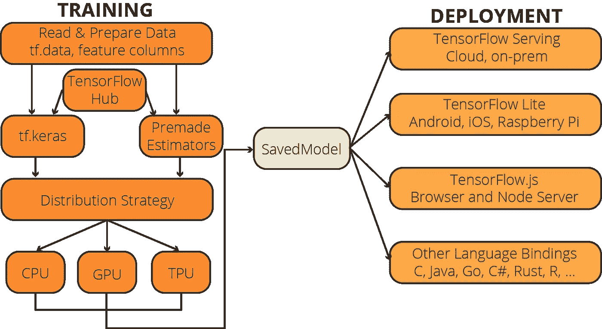
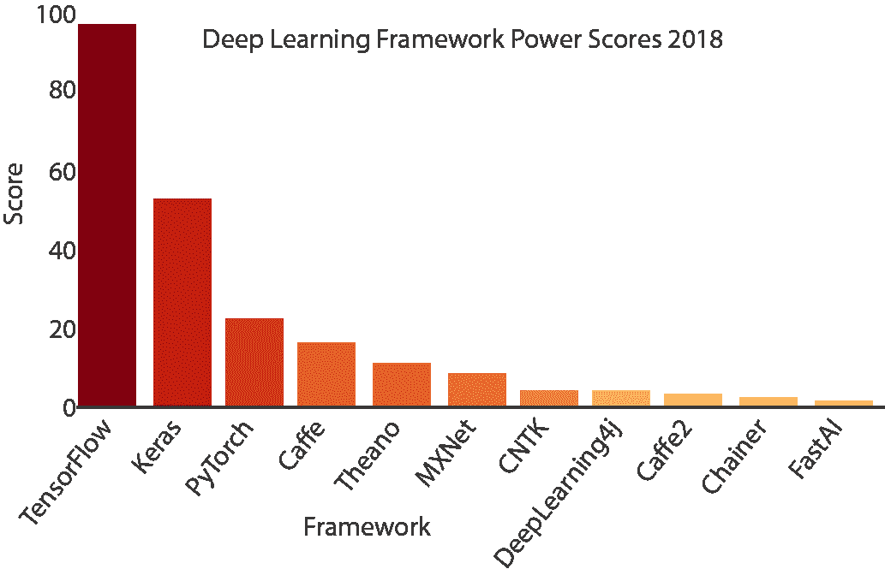

# 2021 年值得关注的 5 大深度学习框架以及为什么选择 TensorFlow

> 原文：<https://towardsdatascience.com/top-5-deep-learning-frameworks-to-watch-in-2021-and-why-tensorflow-98d8d6667351?source=collection_archive---------5----------------------->

## 机器学习编程基础

## 2021 年值得关注的重要深度学习库，以及为什么 TensorFlow 应该是您的选择

克里斯托夫·高尔在 [Unsplash](https://unsplash.com?utm_source=medium&utm_medium=referral) 上拍摄的照片

深度学习领域非常令人兴奋。从强化学习应用到图像分类和声音生成，有大量的应用领域。当我们从事这些令人兴奋的项目时，我们往往希望将编写模型算法等繁琐的工作“外包”给深度学习框架。

有几个深度学习框架是由大型技术、大学和研究人员设计和支持的。但是，维护深度学习框架并不是一件容易的事情。有许多被否决的深度学习框架，尽管它们得到了微软等大型科技公司的支持。因此，找到一个仍在积极开发中的深度学习框架对于你的项目的未来至关重要。在本帖中，我们将了解 2021 年最新的深度学习框架，并了解你为什么要选择 TensorFlow。

# 什么是张量流？

TensorFlow 是一个开源的机器学习平台，特别关注神经网络，由谷歌大脑团队开发。尽管最初用于内部目的，但谷歌在 2015 年 11 月发布了 Apache License 2.0 下的库，这使其成为一个开源库。虽然 TensorFlow 的用例并不局限于机器学习应用，但是机器学习才是我们看到 TensorFlow 实力的领域。

具有稳定和官方 TensorFlow APIs 的两种编程语言是 Python 和 C。此外，C++、Java、JavaScript、Go 和 Swift 是开发人员可能会发现有限到广泛 TensorFlow 兼容性的其他编程语言。最后，还有 C#、Haskell、Julia、MATLAB、R、Scala、Rust、OCaml、Crystal 的第三方 TensorFlow APIs。

特别是在 TensorFlow 2.0 中，Google 显著提高了 TensorFlow APIs 的用户友好性。此外，TensorFlow 团队宣布，他们不打算引入任何其他重大变化。因此，你在 TensorFlow 2.0 中获得的技能将在很长一段时间内保持相关性。

# 为什么应该使用 TensorFlow？

有二十多个由科技巨头、科技基金会和学术机构开发的深度学习库可供公众使用。虽然每个框架在深度学习的特定子学科中都有其优势，但在 TensorFlow 中使用 Keras API 是最合理的选择。选择 TensorFlow 而不是其他深度学习框架的主要原因是它的受欢迎程度。另一方面，这种说法并不意味着其他框架比 TensorFlow 更好——尽管没有 tensor flow 受欢迎。特别是随着 2.0 版本的推出，TensorFlow 通过解决深度学习社区提出的问题加强了自己的力量。今天 TensorFlow 可能被视为最受欢迎的深度学习框架，它非常强大&易于使用，并且有出色的社区支持。图 X 显示了 TensorFlow 应用程序的工作流。

图十. TensorFlow 工作流程图(作者提供的图片)

安装和导入 TensorFlow 相当容易:

但是，我们也来谈谈其他深度学习框架:

# 其他深度学习框架和基本比较

从 80 年代开始，研究人员、大学和企业开始了几项计划来构建强大的深度学习库和框架。以下是这些工具的列表:

表十.按时间顺序排列的深度学习框架(来源:[维基百科](https://en.wikipedia.org/wiki/Comparison_of_deep-learning_software)等)

虽然深度学习框架的总数超过二十个，但其中许多框架目前都不是由其设计者维护的。所以，我们只能谈极少数积极可靠的深度学习框架。在本帖中，我们将讨论除 TensorFlow 之外的四个深度学习框架，它们是:

*   [张量流](http://tensorflow.org)
*   [Keras](http://keras.io)
*   [PyTorch](http://pytorch.org)
*   [阿帕奇 MXNet](https://mxnet.apache.org/)
*   [微软认知工具包](https://docs.microsoft.com/en-us/cognitive-toolkit/)

> 让我们简单介绍一下:

# 克拉斯

[Keras](http://keras.io) 是一个用 Python 编写的开源神经网络库，可以运行在 [TensorFlow](http://tensorflow.org) 、[微软认知工具包](https://docs.microsoft.com/en-us/cognitive-toolkit/)、 [Theano](https://github.com/Theano/Theano) 、 [R](https://www.r-project.org/about.html) 和 [PlaidML](https://github.com/plaidml/plaidml) 之上。谷歌工程师 Fran ois Chollet 设计了 Keras 来实现神经网络的快速实验。它非常用户友好，模块化，可扩展。Keras 还以简单、灵活和强大而自豪。由于这些特性，Keras 被新人视为首选的深度学习库。

Keras 应该被视为 TensorFlow 的一个补充选项，而不是一个竞争对手的库，因为它依赖于现有的深度学习框架。2017 年，谷歌的 TensorFlow 团队同意在其核心库中支持 Keras。在 TensorFlow 2.0 中，Keras API 变得更加精简和集成，这使得创建神经网络更加容易。

要安装和导入 Keras:

Keras 官网: [*www.keras.io*](http://www.keras.io)

# PyTorch

PyTorch 是一个开源神经网络库，主要由[脸书的人工智能研究实验室(FAIR)](https://ai.facebook.com/research/) 开发和维护，最初于 2016 年 10 月发布。FAIR 在 Torch 库的基础上构建了 PyTorch，这是另一个开源机器学习库，一个科学计算框架和一个基于 Lua 编程语言的脚本语言，最初由 Ronan Collobert、Samy Bengio 和 Johnny Mariéthoz 设计。

由于 PyTorch 是由脸书开发的，并提供了一个易于使用的界面，它的流行程度在最近几年有所增加，特别是在学术界。PyTorch 是 TensorFlow 的主要竞争对手。在 TensorFlow 2.0 之前，尽管其 API 的易用性存在问题，但由于其社区支持、生产性能和附加用例解决方案，TensorFlow 一直保持着流行。此外，TensorFlow 2.0 的最新改进引入了对 TensorFlow 1.x 缺点的补救措施。因此，尽管 PyTorch 越来越受欢迎，TensorFlow 很可能会保持其地位。

要安装和导入 PyTorch:

PyTorch 官网:[*www.pytorch.org*](http://www.pytorch.org)

# 阿帕奇 MXNet

MXNet 是由 [Apache 基金会](https://www.apache.org/)推出的开源深度学习框架。这是一个灵活、可扩展、快速的深度学习框架。它支持多种编程语言(包括 C++、Python、Java、Julia、MATLAB、JavaScript、Go、R、Scala、Perl 和 Wolfram 语言)。

MXNet 由亚马逊、英特尔、百度、微软、Wolfram Research、卡内基梅隆大学、麻省理工学院、华盛顿大学使用和支持。尽管一些受尊敬的机构和技术公司支持 MXNet 项目，但是 MXNet 的社区支持是有限的。因此，与 TensorFlow、Keras 和 PyTorch 相比，它仍然不太受欢迎。

要安装和导入 Apache MXNet:

MXNet 官网:[*mxnet.apache.org*](https://mxnet.apache.org/)

# 微软认知工具包

微软在 2016 年 1 月发布了 CNTK 作为其开源的深度学习框架。CNTK 也称为微软认知工具包，支持 Python、C++、C#和 Java 等流行编程语言。微软在其流行的应用程序和产品(如 Skype、Xbox 和 Cortana)中使用了 CNTK，特别是在语音、手写和图像识别方面。然而，截至 2019 年 1 月，微软停止发布微软认知工具包的新更新。因此，CNTK 被认为是不推荐使用的。

安装和导入 CNTK ( *很不幸要复杂得多，下面的版本是针对 Google Colab 笔记本的*):

微软认知工具包官网: [*www.cntk.ai*](http://www.cntk.ai)

# 最终评估

截至 2020 年，可以肯定地说，TensorFlow 和 PyTorch 之间正在进行真正的竞争。尽管 PyTorch 做得非常出色，但出于以下几个原因，我仍然会将赌注压在 TensorFlow 上:

*   TensorFlow 更成熟
*   TensorFlow 支持更多编程语言
*   TensorFlow 在就业市场上仍然更受欢迎
*   TensorFlow 的社区支持是不可思议的
*   TensorFlow 提供了许多支持技术
*   TensorFlow 2.0 非常好用

另一方面，Keras 并不是 TensorFlow 的真正对手，更像是一个补充框架，我强烈建议您利用 Keras 资源及其 API。

# 深度学习框架能力排名

现在看来有点过时了，但是在 2018 年，Jeff Hale 为市面上的深度学习框架开发了一个漂亮的 power 排名。他权衡了在网上工作列表、相关文章和博客帖子以及 GitHub 上发现的提及。他的结果也支持上述评估:

</deep-learning-framework-power-scores-2018-23607ddf297a>  

基于他的深度学习框架的加权平均分数，我们可以画出这样的幂分数条形图:

图十.深度学习框架 Power Scores 2018 作者[杰夫·黑尔](/deep-learning-framework-power-scores-2018-23607ddf297a)(图由作者提供)

# 订阅邮件列表获取完整代码

如果你想获得我在 Google Colab 上的其他教程文章的代码，并能提前获得我的最新内容，考虑[订阅:✉️的邮件列表](http://eepurl.com/hd6Xfv)

> [*subscribe Now*](http://eepurl.com/hd6Xfv)

如果你对深度学习感兴趣，也可以看看我的人工智能内容指南:

<https://oyalcin.medium.com/a-guide-to-my-content-on-artificial-intelligence-c70c9b4a3b17>  

既然您正在阅读这篇文章，我相信我们有着相似的兴趣，并且现在/将来会从事相似的行业。那么我们就通过[*Linkedin*](https://linkedin.com/in/orhangaziyalcin/)*来连线吧！请不要犹豫发送联系请求！*[*Orhan g . Yal n—Linkedin*](https://linkedin.com/in/orhangaziyalcin/)