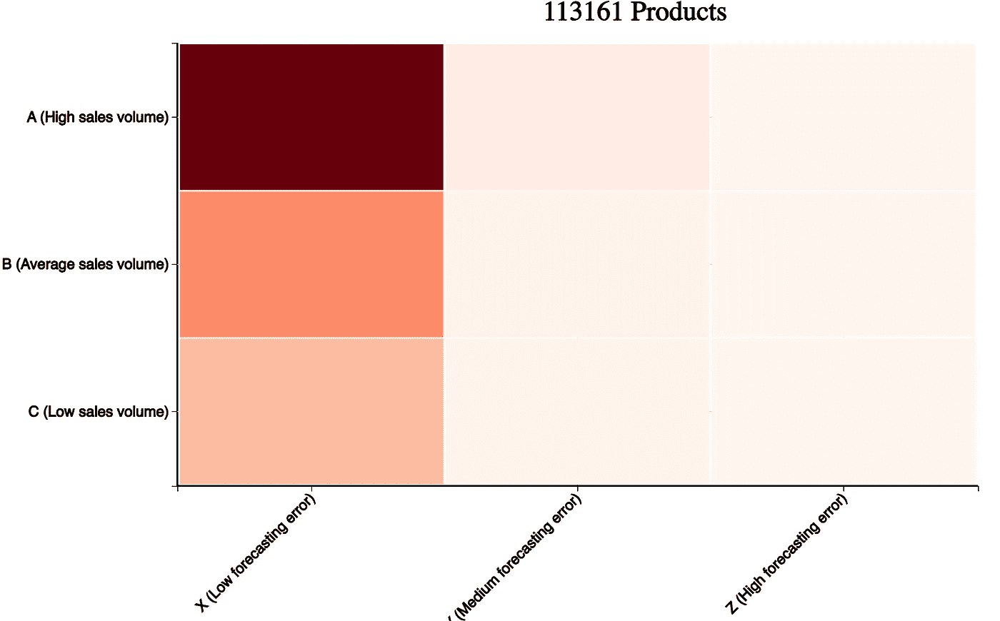
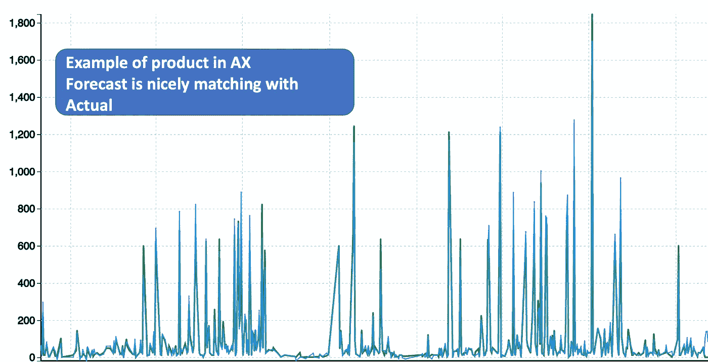
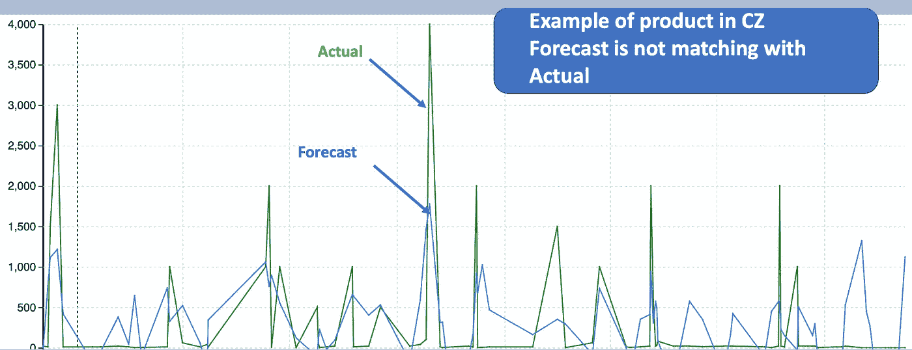
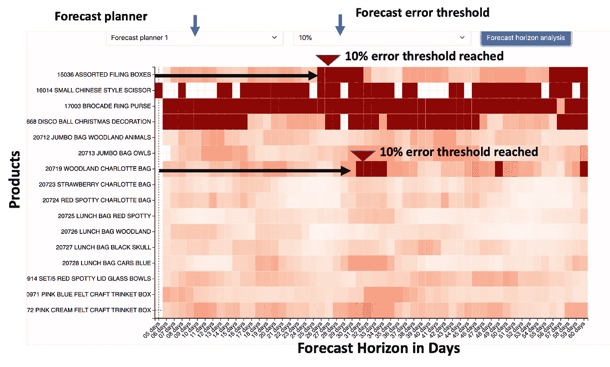
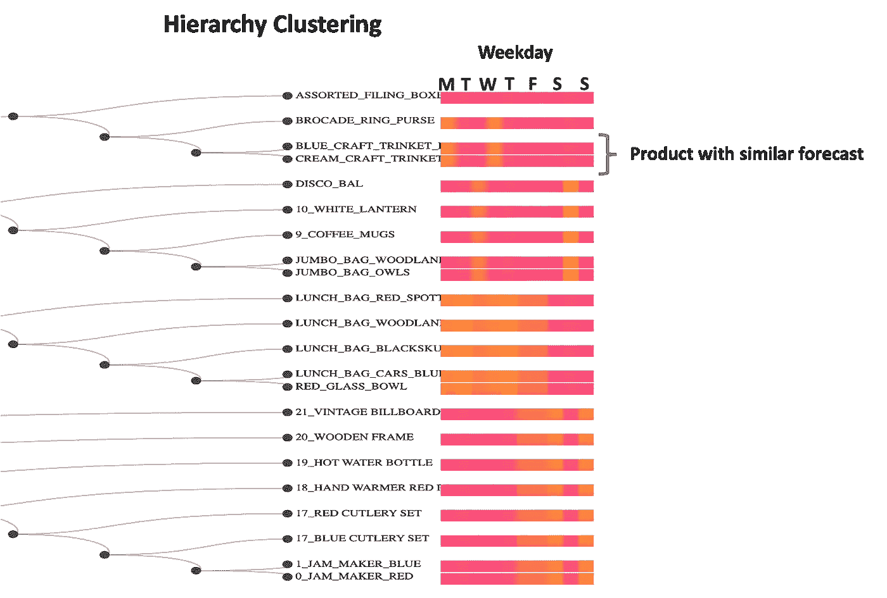
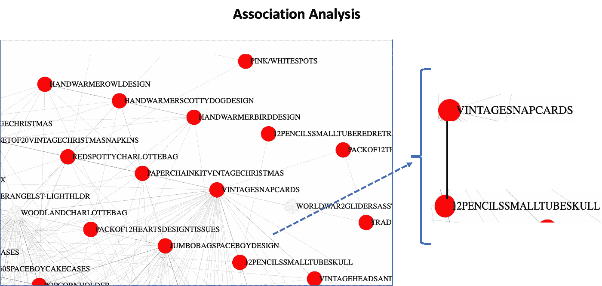
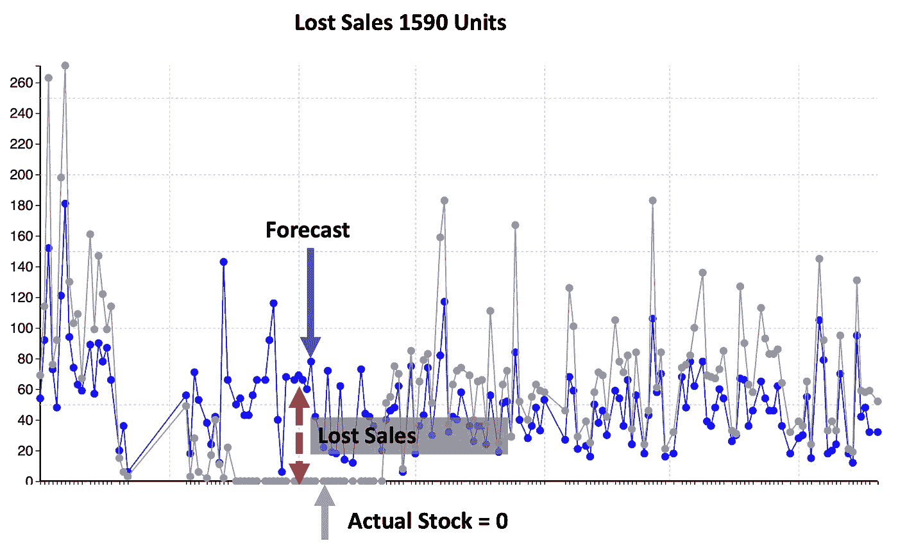

# 前 5 名零售预测分析

> 原文：<https://towardsdatascience.com/top-5-forecast-analysis-cb42975bffa5?source=collection_archive---------22----------------------->

## 分析零售预测并从中获得最大收益的最佳方法

帕特里克·托马索在 [Unsplash](https://unsplash.com/s/photos/retail?utm_source=unsplash&utm_medium=referral&utm_content=creditCopyText) 上的照片

零售预测非常具有战略性，因为它代表了数百万美元的采购预算，以及满足客户需求的承诺。在本文中，您将看到分析预测数据并从中获得最大收益的最佳方法。这篇文章不是关于预测算法。这是关于一旦你做了预测，你如何分析它们。

以下是本文涵盖的五大预测分析。

*   ABC-XYZ 分析
*   预测误差范围
*   替代分析
*   预测相关性
*   销售损失

# ABC-XYZ 分析

为了理解这个分析，让我们以一个零售商为例，他销售从玩具到配件的各种产品。该零售商拥有超过 100K 的产品，这意味着超过 100K 的预测，因为它需要对每种产品进行预测。

有这么多的预测，人们很容易迷失在庞大的数据中。这就是 ABC-XYZ 分析有助于提供全球视角的地方。这是 ABC-XYZ 分析的样子。

ABC-XYZ 分析(图片由作者提供)

这里 A、B、C 表示产品的销售量。XYZ 表示预测误差。颜色表示产品的数量。颜色越深，意味着产品数量越多。总共有 113，000 种产品。其中 57%的产品属于高产量和低误差类别(AX)。下面是 AX 类别产品的预测与实际对比的一个示例。

AX 中的产品示例(图片由作者提供)

该折线图展示了过去两年该产品的实际日销售额。正如你所看到的，这是一个繁忙且快速移动的产品，几乎每天都有销售。看着可视化，你可能会认为只有一行。但实际上，有两个——实际和预测。由于预测误差很小，两条线是重叠的。因此，这款产品是快速移动且预测误差非常低的产品的一个很好的例子。

现在让我们以另一种产品为例，它被归类为滞销和高预测误差(CZ)。绿线显示实际值，蓝线是回溯测试预测线。你可以看到这是一个滞销产品。预测与实际不符，这意味着预测误差很大。因此，这是一个很好的产品滞销和高预测误差(CZ)的例子。

CZ 产品示例(图片由作者提供)

因此，ABC-XYZ 可视化有助于理解全球观点。左边的产品越多越好。虽然预测从来不是 100%准确，但应该努力改进所有处于 AY 和 AZ 的产品的数据和预测算法，因为这些产品具有高销售额，但也具有高误差。

# **预测误差范围分析**

预测误差范围有助于理解预测时间框架的可行性。这是预测计划者的必备分析。这种分析是为负责产品需求管理的预测计划员进行的。下面显示了预测计划者的分析，他希望预测误差的最大阈值为 10%。

预测误差范围分析(图片由作者提供)

在 Y 轴上，您可以看到计划员负责的产品列表。在 X 轴上，您可以看到从 5 天到 60 天的预测范围。颜色表示预测误差。例如，让我们拿第一个产品什锦档案盒来说。当该产品达到 10%的阈值时，颜色变成暗红色。因此，对于该产品，我们在 26 天的时间范围内达到 10%的误差阈值。这意味着我们可以提前 26 天预测该产品。

同样，对于这款产品 Woodland charlotte bag，我们在 32 天的预测期内达到了 10%的预测误差阈值。因此，这意味着我们可以提前最多 32 天预测该产品。

看一下这个图像，你可以说，对于三种产品，我们不能正确预测，因为 10%的阈值很早就达到了。然而，对于大多数产品，我们可以提前 60 天进行预测，而不会超过 10%的误差阈值。

因此，预测展望期分析是预测计划者控制其产品预测的一个好方法。

# **替补分析**

预测替代分析有助于发现哪些是替代产品。这对于任何产品替换都很有用，无需对预测进行重大更改。让我们首先从数据科学的角度来看这是如何做到的。

预测算法提供近期内每天的产品预测。您可以使用这些信息来构建产品集群。此处显示了使用层次结构聚类的产品聚类结果。

层次聚类以查找具有相似预测的产品(按作者分类的图片)

你会看到不同的产品，每种产品都有一个颜色条。颜色条代表近期的产品预测。产品蓝 _ 工艺 _ 饰品 _ 盒子和奶油 _ 工艺 _ 饰品 _ 盒子有类似的颜色条。这意味着这两种产品具有相似的预测。正是因为这个原因，这两个产品都聚集在一个节点下。

群在替代计划中非常有用。尽管有最好的预测，事情还是可能出错。例如，如果你对蓝色工艺饰品盒有任何疑问，你可以用奶油工艺饰品盒来代替。不管是什么颜色，大多数顾客都会买一个饰品盒。因此，它使替代产品，而不是失去销售。

# 预测相关性

在前面的部分中，我们看到我们可以用一种产品替代另一种产品。但是，在很多情况下，产品的销售是相互依赖的。这意味着人们倾向于一起购买产品。这意味着，如果一个产品出现任何问题，也会冲击其他产品的销售。

有一种数据科学算法可以帮助找到相关性，这种算法叫做关联分析。

用于查找预测相关性的关联分析(作者图片)

每个产品显示为一个圆圈，产品之间的线显示依赖关系。例如，我们看到老式卡片和铅笔之间有联系。因此，如果老式贺卡的销售受到影响，很可能也会影响铅笔的销售。这些依赖关系信息有助于在产品级别上微调预测。

# 销售损失

销售损失是指由于缺乏库存而无法实现的销售。为了计算销售损失，我们可以预测一种产品和该产品的实际库存(包括其替代品)。该预测是回溯预测，因此我们可以将其与实际值进行比较。如果实际库存少于预测，那么它代表销售损失。这是午餐袋销售损失分析的可视化结果。

销售损失分析(图片由作者提供)

蓝线是预测，灰线是午餐袋和所有替代品的库存。你可以看到，在某个时间段，股票变成了零。因此，这是一种销售损失的情况，预测和库存之间的差异就是销售损失。我们可以计算销售损失，结果是 1590 个午餐袋因缺货而无法售出。

希望你喜欢这篇文章。

# 额外资源

# 网站(全球资讯网的主机站)

你可以访问我的网站进行零编码分析。[https://experiencedatascience.com](https://experiencedatascience.com/)

每当我发布一个新的故事，请订阅保持通知。

<https://pranay-dave9.medium.com/subscribe>  

你也可以通过我的推荐链接加入 Medium

<https://pranay-dave9.medium.com/membership>  

## Youtube 频道

这是我的 YouTube 频道
[https://www.youtube.com/c/DataScienceDemonstrated](https://www.youtube.com/c/DataScienceDemonstrated)的链接