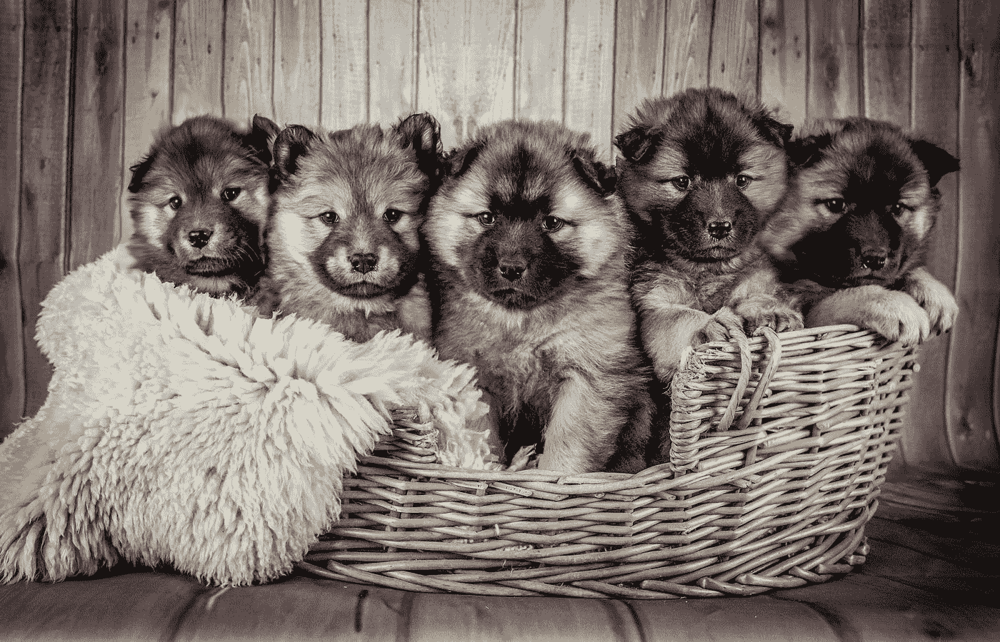

# 2021 年你应该知道的五大 GPT 三代接班人

> 原文：<https://towardsdatascience.com/top-5-gpt-3-successors-you-should-know-in-2021-42ffe94cbbf?source=collection_archive---------8----------------------->

## 人工智能

## AI 进步很快，这里有你需要知道的最新机型。

朱迪·纽迈耶在 [Unsplash](https://unsplash.com?utm_source=medium&utm_medium=referral) 上的照片

如果我们与今年人工智能向我们展示的相比，GPT-3 已经很老了。自 2017 年《变形金刚》问世以来，它在从语言到视觉的各种任务中都取得了巨大成功。GPT-3 去年彻底改变了世界，从那时起，多个突破性的模型已经出现。各个国家和公司都沉浸在建造越来越好的模型的竞赛中。

前提是更大的模型、更大的数据集和更强的计算能力构成了人工智能主导的三位一体。即使这个范例有重要的批评者，它的成功是不可否认的。

在本文中，我将回顾 2021 年以来最重要的 5 种基于变压器的模型。我将从 GPT 3 号开始这个列表，因为它意义重大，然后按时间顺序继续——最后一个是两周前发表的！

# GPT 3 号——人工智能摇滚明星

OpenAI 于 2020 年 5 月在一篇题为 [*的论文中提出了 GPT-3，语言模型是很少出手的学习者*](https://arxiv.org/abs/2005.14165) 。2020 年 7 月，该公司发布了一个供开发人员使用的测试版 API，该模型一夜之间成为人工智能明星。

GPT-3 是第三代语言型号系列的第三个版本。它的主要特点是**多任务和元学习** **能力**。在 570GB 的互联网文本数据上以无监督的方式进行训练，它能够通过看到几个例子(少数镜头)来学习它没有训练过的任务。它也可以从零和一次设置中学习，但性能通常会更差。

GPT 3 号展示了疯狂的语言生成能力。它可以对话(模仿活着或死去的历史人物)，写诗、歌、小说和散文。**它可以** **写代码**，乐谱，乳胶格式的方程式。它显示了适度的推理、逻辑和常识水平。它可以思考未来、生命的意义和自身。

除此之外，GPT-3 在标准化基准测试中表现出色，在一些测试中达到了 SOTA。它在生成性任务上表现最为突出，比如写新闻文章。对于这项任务，它达到了人类的水平，**让试图将它的文章与人造文章分开的法官感到困惑。**

这是我为*写的一篇关于 GPT 3 号的完整概述，面向数据科学:*

</gpt-3-a-complete-overview-190232eb25fd> [## GPT-3 —全面概述

towardsdatascience.com](/gpt-3-a-complete-overview-190232eb25fd) 

# 开关变压器——万亿参数先锋

2021 年 1 月谷歌发表了论文 [*Switch Transformers:缩放至万亿参数模型，具有简单有效的稀疏性*](https://arxiv.org/abs/2101.03961) *。*他们提出了开关变压器**，**一种新的神经网络，其目标是**在不增加计算成本的情况下促进更大模型的创建。**

区别于以前模型的特征是专家混合算法的简化。混合专家(MoE)由一个系统组成，通过该系统，进入模型的表征(输入的基本部分)被发送到神经网络(专家)的不同部分进行处理。因此，为了处理给定的令牌，只有模型的一个子部分是活动的；我们有一个稀疏模型。这降低了计算成本，使它们能够达到万亿参数的水平。

在最初的 MoE 中，每个代币都被送到至少两个专家那里进行比较。有了 Switch Transformer，Google 简化了路由过程，因此每个令牌只发送给一个专家。**这进一步降低了计算和通信成本。**谷歌表明，大型开关变压器将优于大型密集模型(如 GPT-3，尽管他们没有比较两者)。这是减少大型预训练模型碳足迹的一个巨大里程碑，这些模型在语言方面是最先进的，现在也是视觉任务。

# 富有创造力的艺术家

OpenAI 于 2021 年 2 月在一篇名为 [*零镜头文本到图像生成*](https://arxiv.org/pdf/2102.12092.pdf) *的论文中提出了 DALL E。*该系统以西班牙画家萨瓦尔多·达利和皮克斯可爱的机器人瓦力命名，是 GPT-3(120 亿个参数)的缩小版，专门训练文本-图像对。用 OpenAI 的研究人员的话说:“通过语言操纵视觉概念现在触手可及。”

达尔·E 利用“语言的组合结构”探索了图像生成的可能性它将书面句子的意思与它可能具有的潜在视觉表现结合起来。不过，像 GPT-3 一样，它高度依赖于句子的措辞，以避免在图像中出错。它的力量依赖于它的零射击能力；它可以执行未经训练的生成任务，而不需要例子。

在其他功能中，它可以根据书面提示从头开始生成图像，重新生成图像的隐藏部分，控制对象的属性，或将它们集成到单个图像中。更令人印象深刻的是，DALL E 还可以**在高抽象层次上组合概念**(当被告知“一只竖琴制成的蜗牛”时，它通常会将蜗牛画成以竖琴为壳)，并进行图像到图像的转换(当被告知“顶部的一只猫与底部的草图完全相同”时，它会画出一只与原始图片相似的猫)。

**达勒展示了一种艺术的雏形。从对书面语言的松散解释描述中，它创造了一种视觉现实。我们可能比以往任何时候都更接近一个人工智能版本的“一图胜千言”。**

下面是 OpenAI 的一篇博文，展示了 DALL E 的能力:

<https://openai.com/blog/dall-e/>  

# LaMDA——下一代聊天机器人

谷歌在 2021 年 5 月的年度 I/O 会议上展示了 LaMDA。LaMDA 有望凭借其惊人的对话技巧**革新聊天机器人技术**。现在还没有论文或者 API，只能等出点结果了。

LaMDA 代表**La**language**M**odel，代表**D**ialogue**A**applications，是 Meena 的继任者，Meena 是谷歌在 2020 年推出的另一个人工智能。LaMDA 接受了对话训练，并进行优化以最大限度地减少困惑，这是一种衡量模型在预测下一个令牌时有多自信的方法。困惑与人类对对话技巧的评价高度相关。

LaMDA 作为一个明智、具体、有趣且符合事实的聊天机器人而脱颖而出。与之前的产品相比，它可以在开放式的对话中做出有意义的回应。这可以使他们变得具体，避免像“我不知道”这样总是有效的回答它可以做出“有见地和意想不到的”回应，让对话保持有趣。当涉及到事实知识时，它会给出正确的答案。

这是我为*写的一篇关于 LaMDA 的完整评论，关于数据科学:*

</googles-lamda-the-next-generation-of-chatbots-62294be58426> [## 谷歌的 LaMDA:下一代聊天机器人

towardsdatascience.com](/googles-lamda-the-next-generation-of-chatbots-62294be58426) 

# 妈妈——搜索引擎的大脑

谷歌与 LaMDA 一起推出了 MUM，这是一个旨在改革搜索引擎的系统，其方式与几年前 BERT 的方式类似，但更具影响力。与 LaMDA 一样，除了谷歌的演示和博客帖子外，没有进一步的信息，所以我们必须等待更多信息。

妈妈代表多任务型 **U 型**n 型 **M 型**型。它是一个多任务和多模态语言模型，比它的前身 BERT 强大 1000 倍。它已经接受了 75 种语言和许多任务的训练，这使它对世界有了更好的了解。然而，它的多模式能力使 MUM 比以前的型号更强大。它可以处理文本+图像信息和任务，这使它具有 GPT-3 和 LaMDA 都没有的多功能性。

妈妈能够处理复杂的搜索查询，如“你已经徒步过亚当斯山。现在你想明年秋天去富士山远足，你想知道要做哪些不同的准备。”有了今天的搜索引擎，一个精确而明智的答案将需要大量的搜索和信息汇编。妈妈可以帮你做，给你一个有针对性的答案。更令人惊讶的是，因为它是多模态的，“最终，你可能会拍下你的登山靴，然后问，”我可以用它们去富士山吗？"

这是我为*写的关于妈妈的一篇完整的评论:*

</will-googles-mum-kill-seo-d283927f0fde> [## 谷歌妈妈会扼杀 SEO 吗？

towardsdatascience.com](/will-googles-mum-kill-seo-d283927f0fde) 

# 武道 2.0——最大的神经网络

6 月 1 日，BAAI 年会推出了悟道 2.0——翻译过来就是*悟*。这个令人惊叹的人工智能拥有一年前属于 GPT-3 的最大神经网络的头衔。武道 2.0 拥有惊人的 1.75 万亿参数，10x GPT-3。

武道 2.0 是在 4.9TB 的高质量文本和图像数据上训练出来的。相比之下，GPT-3 是在 570GB 的文本数据上训练的，几乎少了 10 倍。武道 2.0 顺应多模态趋势，能够执行文字+图像任务。为了训练它，研究人员发明了 FastMoE，这是谷歌 MoE 的继任者，它“使用简单，灵活，高性能，支持大规模并行训练。”我们可能会在未来的模型中看到其他版本的 MoE。

它的多模态特性允许 Wu Dao 2.0 管理大量的任务。它能够处理和生成文本，识别和生成图像，以及混合任务，如为图像添加字幕和根据文本描述创建图像。它还可以预测蛋白质的 3D 结构，像 [DeepMind 的 AlphaFold](https://venturebeat.com/2020/11/30/deepmind-claims-its-ai-can-predict-how-proteins-will-fold-with-state-of-the-art-accuracy/) 。它甚至创造了一个可以不断学习的虚拟学生。她会写诗，会画画，将来还会学编码。

悟道 2.0 在一些标准语言和视觉基准上达到了 SOTA 水平，如 LAMBADA、SuperGLUE、MS COCO 或 Multi 30K，超过了 GPT-3、DALL E、CLIP 和 CL。这些惊人的成就使悟道 2.0 成为当今最强大、最全能的人工智能。然而，另一个更大的人工智能出现在地平线上只是时间问题。睁大眼睛！

这里是我为*写的一篇关于悟道 2.0 的完整评论:*

</gpt-3-scared-you-meet-wu-dao-2-0-a-monster-of-1-75-trillion-parameters-832cd83db484>  ***获取更多关于 AI、哲学、认知科学的内容！***