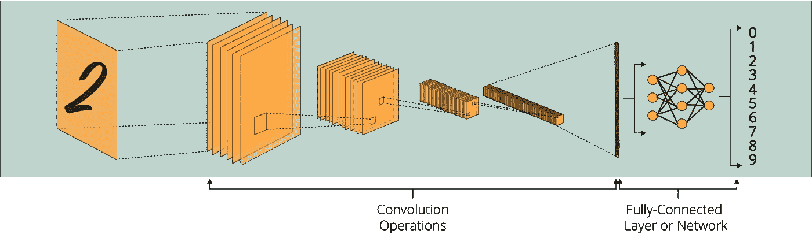
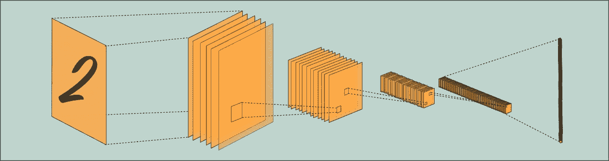
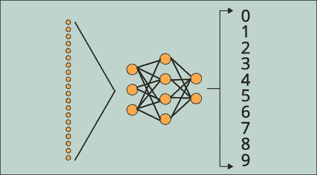
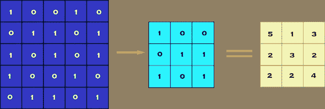
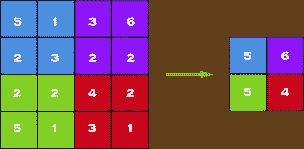
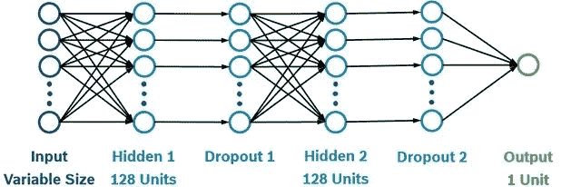
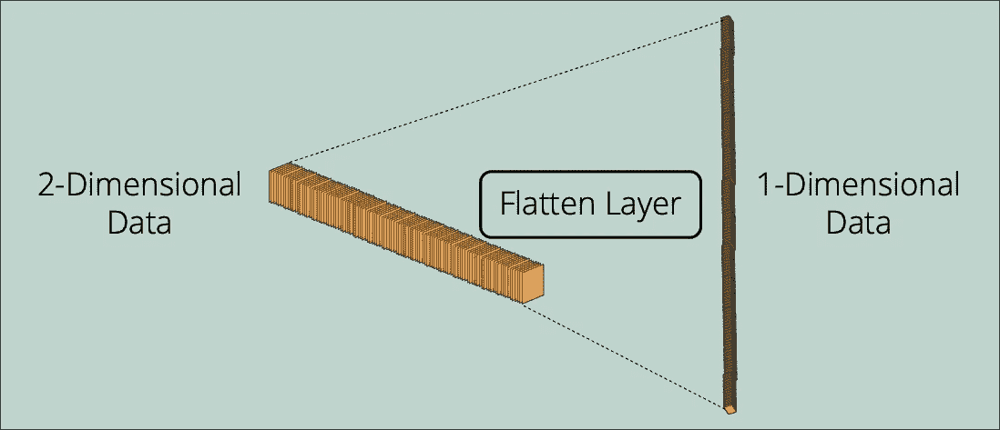
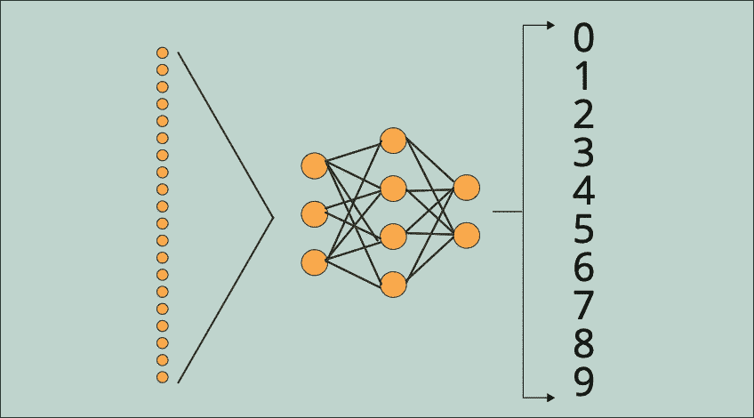

# 在任何卷积神经网络中，你总能碰到的前 5 层

> 原文：<https://towardsdatascience.com/top-5-layers-you-can-always-come-across-in-any-convolutional-neural-network-c03acdc52bd7?source=collection_archive---------32----------------------->

## 人工智能精要

## 卷积神经网络体系结构和最常见层的简介

图一。戴维·特拉维斯在 [Unsplash](https://unsplash.com?utm_source=medium&utm_medium=referral) 上拍摄的照片

C 选择性神经网络是一系列人工神经网络架构，专门为计算机视觉和图像处理任务而设计。它是一个多层神经网络，用于分析视觉输入并执行图像分割、分类、去噪(使用自动编码器)、生成(使用 GANs)和对象检测等任务。另一方面，近年来，除了视觉相关的 AI 任务，我们开始看到 [CNN 在自然语言处理(NLP)等其他 AI 领域的实现](/convolutional-neural-network-in-natural-language-processing-96d67f91275c)。

图二。用于图像分类的示例卷积神经网络(图片由作者提供)

# CNN 架构

正如我们在[上一篇](/the-brief-history-of-convolutional-neural-networks-45afa1046f7f)文章中提到的，CNN 架构是基于视觉皮层的功能和组织而设计的。CNN 架构简单地模仿了人脑中神经元的连接模式。尽管 CNN 有几个层次，但它实际上有两个主要组成部分:

*   由几个特定层(卷积、汇集、丢弃等)组成的卷积网络，能够分割和检测图像的特征；

图 3。卷积网络，视觉操作发生的部件(作者图)

*   完全连接的层或网络，其接受卷积网络的输出以预测图像的最佳输出；

图 4。完全连接的层，预测发生的组件(作者提供的图)

完全连接的层或网络与最基本的人工神经网络架构相同，是一种多层感知。另一方面，卷积网络是 CNN 架构所特有的。让我们在层级别上更深入地了解一下这些组件。

# CNN 中的层

我们可以给卷积神经网络添加许多不同的层类型。CNN 可以包括不常见的层，例如上采样或转置卷积层。然而，在常规 CNN 中，我们通常会遇到五个特定层:

## 卷积层

**卷积层**是 CNN 架构中最具标志性的层。通过使用卷积层，我们可以创建一个特征图，通过应用一个过滤器扫描整个图像，每次扫描几个像素，来预测每个特征的分类概率。卷积是通过对输入图像数据应用滤波器来完成的，这会减小其大小。

使用卷积的优点之一是降低计算复杂度。由于一个像素通常更多地与相邻和邻近的像素相关联，所以在卷积之后，我们仍然保持图像的不同部分之间的关系。当我们使用步长为 1x1(每步移动 1 个像素)的 3x3 滤波器对 5x5 图像进行卷积时，最终会得到 3x3 的输出。这个过程相当于计算复杂度降低了 64%。

图 5 x 5 像素图像与 3 x 3 像素过滤器的卷积(步距= 1 x 1 像素)

## 汇集层

我们在 CNN 中遇到的另一个标志性的层类型是**池层**。标准做法是在卷积层之后插入一个池层。通过减少制图表达的空间大小来减少参数数量，池化图层有助于进一步降低计算复杂度。换句话说，我们聚合像素值以降低复杂性，这不会对模型性能产生不利影响。这种聚集可以基于选择像素值的最大值、平均值或总和。最常用的聚合方法是最大池法，举例如下:

图 6。2 x 2 的最大池(作者提供的数字)

如你所见，我们首先将它们分成 2×2 的正方形，并选择正方形内的最大像素值。通过使用 MaxPooling，我们将大小从原来的 4x4 减小到 2x2。

## 脱落层

**丢弃层**不是卷积神经网络架构中的强制层。然而，由于过拟合的频繁发生，我们经常会在卷积神经网络中遇到一个或多个脱落层。特别是，在相对较小的数据集上训练的大型神经网络可能会过度拟合训练数据，这可能会在现实世界的应用程序中导致糟糕的性能。

图 7。示例脱层(不在 CNN 中)(图由 [Igor Filitschenski](https://www.researchgate.net/profile/Igor-Gilitschenski) 在[论文](https://www.researchgate.net/publication/311920717_A_data-driven_approach_for_pedestrian_intention_estimation)中提供)

虽然有几种正则化方法来处理过拟合，但对于卷积神经网络来说，最可行的方法是丢弃。丢弃过程实现起来非常简单:在训练期间，一些层输出被随机忽略或者“*被丢弃*”该过程具有使训练过程变得嘈杂的效果，并且它迫使层内的节点承担更多(如果没有被丢弃)或更少(如果被丢弃)的输入责任。得益于丢弃层，卷积神经网络可以学习以更灵活的方式适应优化模型权重，从而防止过度拟合。

## 展平图层

正如我们前面指出的，每个卷积神经网络都由一个卷积网络和一个全连接层组成。展平层充当这两个组件之间的桥梁。由于图像数据至少是二维格式，卷积网络的输出也至少是二维的。另一方面，由于我们的全连接层等同于多层感知(简单的神经网络类型)，它期望接收一维输入。这就是展平层发挥作用的地方。平面化层唯一目的是将二维数组转换成一维数组。

图 8。扁平化层(作者图)

## 完全连接的层或网络

全连接层是卷积神经网络的最后一部分。它可以是单一的密集层，也可以是复杂的多层感知器。该层的输入来自展平层。因此，展平层可以看作是这个组件的输入层。分配给全连接层的任务是对卷积网络生成的输入应用权重，并生成预测的最终概率(例如，确定输入图像的对象类别)。

图 9。完全连接的层/网络(图由作者提供)

# 最终注释

将这五个常见的层和我们在本文中没有提到的其他一些不太常见的层结合起来，我们甚至可以创建一个非常先进的卷积神经网络。但是主要功能保持不变:当初始组件(由特定层组成的卷积网络)检测特征并将它们作为有价值的信息传递给完全连接的层时，完全连接的层通过调整其权重来学习根据这些特征进行预测。

如果你有兴趣将你的职业生涯推向深度学习，请查看我的人工智能内容指南。

 [## 我的人工智能内容指南

### 帮助您轻松浏览我的内容的指南。

oyalcin.medium.com](https://oyalcin.medium.com/a-guide-to-my-content-on-artificial-intelligence-c70c9b4a3b17) 

更具体地说，如果您正在寻找使用 TensorFlow 构建自己的卷积神经网络，并使用 MNIST 数据集对手写数字进行分类，请查看下面的文章:

 [## 使用 MNIST 数据集在 10 分钟内完成图像分类

towardsdatascience.com](/image-classification-in-10-minutes-with-mnist-dataset-54c35b77a38d) 

# 订阅邮件列表获取我的最新内容

如果你喜欢我迄今为止分享的内容，可以考虑订阅[**简讯**](http://eepurl.com/hd6Xfv) **！✉️**

> [*现在就订阅*](http://eepurl.com/hd6Xfv)

对于我的订阅者，我也分享我的私人 Google Colab 笔记本，其中包含我发表的每篇文章的完整代码。

如果你正在阅读这篇文章，我确信我们有着相似的兴趣，并且正在/将要从事相似的行业。那么我们就通过[*Linkedin*](https://linkedin.com/in/orhangaziyalcin/)*来连线吧！请不要犹豫发送联系请求！*[*Orhan g . yaln—Linkedin*](https://linkedin.com/in/orhangaziyalcin/)