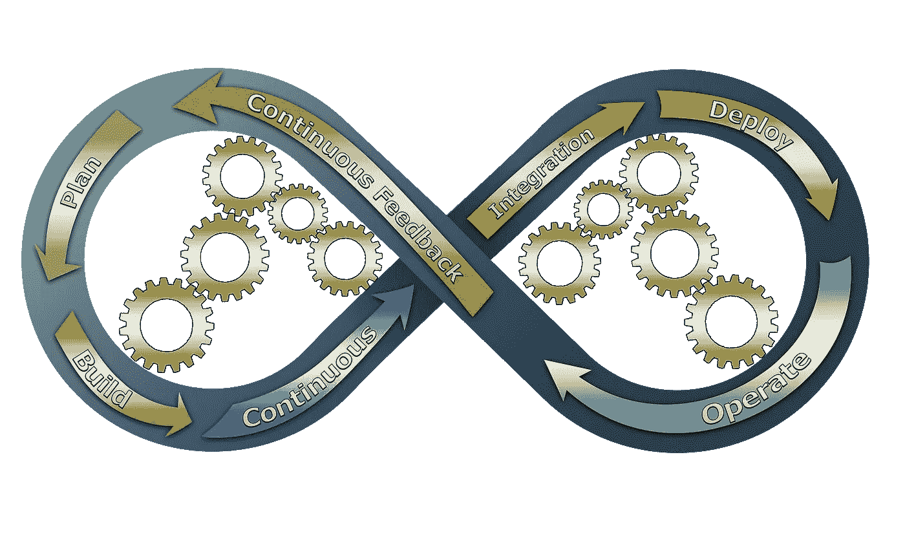

# 企业数据科学家面临的五大问题

> 原文：<https://towardsdatascience.com/top-5-problems-enterprise-data-scientists-face-64e49b725e07?source=collection_archive---------35----------------------->

## [行业笔记](https://towardsdatascience.com/tagged/notes-from-industry)

## 以及克服它们的策略…

皮沙贝

从笔记本电脑上学习数据科学提出了一些挑战，这些挑战是理解数据科学工具如何工作的基础。然而，从笔记本电脑转移到企业，带来了学习数据科学家从未真正接触过的几个新挑战。当我在第一份数据科学工作中遇到一个常见的数据科学问题时，我肯定经历过这种情况:“请为我们的客户群开发微细分，以便我们可以更精确地向他们营销。”我的计划很明确——对数据进行一些特征工程，对这些特征进行一些数据简化，然后聚集成一个解决方案。不幸的是，当我开始为如何访问数据而绞尽脑汁时，问题马上就出现了。

当然，我让同事们分享了一些代码片段，这些代码片段包含数据所在数据库的连接参数。一切都很好，但是，这些相同的代码片段并没有解决我的问题，因为它们首先假设我可以访问数据。因此，我面临着企业数据科学家处理的最普遍的问题之一，安全性，甚至在我有机会展示我的企业数据科学肌肉之前。

在本文中，我将研究企业数据科学家面临的 5 大挑战，并提供一些克服这些挑战的技巧。

皮沙贝

# 挑战#1:理解安全的角色

正如我在上面的轶事中提到的，大多数数据科学家没有接触过企业安全协议。更糟糕的是，安全性通常是分层实现的，这意味着要访问数据通常需要通过许多关卡和关卡，尤其是当这些数据位于不同的服务器上时。

请记住，企业安全的目标包括 1。保护静态和传输中的数据，2。建立身份和访问管理(IAM)控制，3。灾难恢复，4。关于脆弱性和社会工程的教育。监控服务器端点的奇怪流量([了解更多细节](https://www.bmc.com/blogs/enterprise-security/#))。

数据科学家最大的担忧是什么？我是。数据科学家最常面临的是 IAM 控件，这些控件在试图访问数据以履行职责时很难遍历。这里有一个简单的例子来说明这在企业环境中是如何操作的。每位员工都有一个唯一的用户身份(ID)。这些 id 然后被分配给不同的角色。最基本的是，角色允许用户做某些事情，比如读、写和/或更新数据库。个人还被放在不同的组中，这些组允许将对多个数据源的访问权限安全地分组给一组具有相似工作职能的个人。

**处理安全问题的技巧:**克服这一挑战的最佳方式是与您的安全团队会面。没有人会这样做，大多数人会因为你主动学习他们的安全协议是如何工作的而感到非常兴奋。最相关的是通过了解已经到位的系统(例如，角色和组以及识别它们的方法)来了解如何请求访问。此外，与安全部门会面将开始建立信任，并进一步提供作为开发人员如何负责任地学习访问数据的适当渠道的背景。当人们信任你的时候，他们会更愿意让你接触到一些东西😊

皮沙贝

# 挑战#2:选择*；了解大数据

对于学习数据科学技术来说，笔记本电脑的计算资源和较小的固定数据集非常有用，但新雇佣的企业数据科学家无法很好地处理企业规模的海量数据。因此，我看到年轻数据科学家面临的另一个常见挑战是如何将庞大的数据集适当地采样成更小、更易于管理的子集，以便进行更有效的实验和发现。

**处理大数据的技巧:**即使是大公司，在可用于执行数据科学任务的计算资源方面也是有限的，理解这一点很重要。因此，我们需要战略性地划分数据子集，以确定允许进行实验的较小集合。对大型数据集进行子集划分的一些常见变量包括日期范围、业务线或客户细分等。通过在较小的数据集上训练模型来测试模型的可行性，看看在较大的数据上执行是否值得。例如，如果您发现您在分类模型上的准确率只有 60%,但业务要求接近 90%,那么简单地利用更多数据不太可能让您达到这一水平，因此需要另一种方法。

皮沙贝

# 挑战#3:使用版本控制

尽管随着越来越多的数据科学学生接触到 GitHub 等服务以访问他们教育中的编码示例，趋势正在发生变化，但仍有相当数量的初露头角的数据科学家不完全理解我们如何或为什么在企业环境中使用 Git 等版本控制系统。关于 Git 对数据科学的更详细的处理，请参见这里的，但简而言之，Git 在与其他开发人员合作时非常强大，并提供了一种共享代码和对代码进行高效且可追踪的更新的方式。

**处理版本控制的技巧:**最快的技巧是学习如何使用 GitHub。在学习 GitHub 时，我最大的挑战是理解我的本地存储库(位于您的笔记本电脑上或您自己的个人开发环境中的存储库)和远程存储库之间的区别，远程存储库代表特定解决方案的最新和最棒的代码集。除非我们执行特定的 Git 操作来更新远程数据库(例如 git commit ),否则本地所做的任何更改都不会出现在远程数据库中。显然，还有很多东西需要学习，但是你越早开始在 GitHub 上存储你自己的代码，你就越早开始理解 Git 是如何工作的。

皮沙贝

# 挑战#4:了解如何扩展

基于大多数学习数据科学家面临的计算限制，随之而来的是企业对如何为生产扩展数据科学解决方案的担忧。比方说，我们对 200，000 个客户训练一个模型，它可以识别任何一个客户取消订阅的可能性。现在，该企业希望在所有 1200 万订户上运行您的模型，每次数据每小时刷新一次。当看到这个场景时，你的额头开始冒汗，要知道这是一个重大的企业问题，有几种不同的解决方案。此外，了解可用的解决方案有助于为您的开发工作提供大量信息，这也是在您的数据科学职业生涯早期考虑这一挑战的重要原因。

**处理规模的技巧:**有许多不同的可扩展数据科学框架，每一个都适合略有不同的用例，有些重叠。我考虑规模的方式是考虑您的生产解决方案是否需要是事务性的，在这种情况下，您对单个客户的数据进行实时评分，因为它可用于模型，而在批处理中，您一次对数百万个客户进行评分(就像我在本节前面介绍的场景)。事务数据科学产品对于创建智能应用程序非常有用，因为这些应用程序拥有用户，所以它们需要对用户体验做出响应。这意味着事务性数据科学产品需要轻量级和快速。或者，批量数据科学产品不需要很快产生结果，但是我们也不希望它们需要连续几天才能完成。这种区分有点过于简单，因为有许多用例介于两者之间，但是每个用例的框架都是不同的，并且可以在这些实例中进行组合。

为了克服这一挑战，请理解事务数据科学通常涉及可以使用 Kubernetes、云中的弹性容器服务或云功能等服务进行水平扩展的容器(运行在轻量级机器上，随着需求的增加可以添加更多机器)。批量数据科学需要框架来管理和协调跨多个核心(垂直)和多个机器(水平)的大型数据集的分割。处理这些超大型数据集的框架包括 Spark、Dask 和 Ray。后面这些框架特别适合数据科学家学习，因为它们还允许分布式模型训练，并且可以打包在容器中，以进一步提高对事务数据进行操作的复杂模型的可伸缩性。

皮沙贝

# 挑战#5:向业务利益相关者传达数据科学

我经常看到的年轻数据科学家面临的最后一个挑战是与业务利益相关者打交道。作为数据科学家，我们谈论概率、特异性、精确度和 ROC 曲线，而业务利益相关者考虑的是关键性能指标(KPI)、业务规则和财务影响。换句话说，数据科学的语言和使用我们的产品来通知他们的业务决策的业务利益相关者的语言之间存在脱节。

**克服这一挑战的技巧:**克服这一挑战的最好方法是了解你的企业的关键绩效指标。请确保您正在努力协调您的数据科学工作与这些业务 KPI 的关系。从业务决策的角度交付数据科学成果，并讲述该业务决策结果的业务故事。模拟使用您的产品如何导致 KPI 发生变化，比不使用您的产品时更好。

**额外提示:**如果我能提供最后一条建议，那就是衡量标准是激励性的，移动衡量标准更是激励性的。因此，通过可视化展示业务指标如何与您的数据科学工作相关联，可以确保您的业务消费者专注于您的价值，而不是试图不显得愚蠢，因为他们不知道您的模型在做什么。

比如参与学习更多关于数据科学的知识？[加入我这里](https://www.facebook.com/groups/thinkdatascience)