# 五大 Python 数据可视化库

> 原文：<https://towardsdatascience.com/top-5-python-data-visualization-libraries-744733636a68?source=collection_archive---------24----------------------->

## 每个都有例子。


费德里卡·坎帕纳罗在 [Unsplash](https://unsplash.com/s/photos/art?utm_source=unsplash&utm_medium=referral&utm_content=creditCopyText) 上的照片

数据可视化是数据科学的重要组成部分。可视化为数据提供了有价值的洞察力。在许多情况下，它们比简单的数字更有效。

数据可视化有助于探索和理解数据中的底层结构以及变量之间的关系。我们还利用它们向利益相关者通报我们的发现并交付成果。

在本文中，我们将介绍排名前五的 Python 数据可视化库。我们将创建相同的可视化效果，以便了解它们之间的异同。

我们将使用 Kaggle 上的墨尔本房产[数据集](https://www.kaggle.com/dansbecker/melbourne-housing-snapshot)来创建地块。第一步是将数据集读入熊猫数据帧。

```
import numpy as np
import pandas as pddf = pd.read_csv(
  "/content/melb_data.csv",
  usecols = ['Price','Landsize','Type'],
  nrows = 1000
)df = df[df.Landsize < 1000]df.head()
```

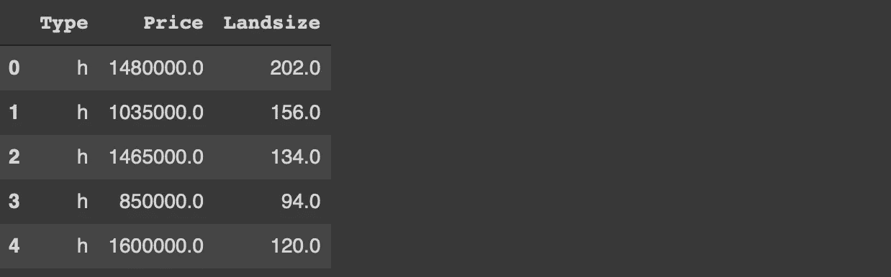

(图片由作者提供)

我们仅通过读取墨尔本住房数据集的 3 列和前 1000 个观察值(即行)创建了数据框架。然后，我们过滤掉了与土地面积相关的异常值。

# Matplotlib

Matplotlib 由三个主要层组成，分别称为后端、艺术家和脚本。

我们主要处理脚本层。就是 **matplotlib.pyplot** 接口。脚本层自动化了将所有东西放在一起的过程。因此，它比其他层更容易使用。

第一个例子是散点图。主要用于可视化两个连续变量之间的关系。它们概述了变量之间的相关性。

我们可以用价格和距离列创建一个散点图。

```
import matplotlib.pyplot as pltplt.figure(figsize=(10,6))
plt.scatter(x=df.Price, y=df.Landsize)
plt.xlabel("Price", fontsize=13)
plt.ylabel("Landsize", fontsize=13)
```

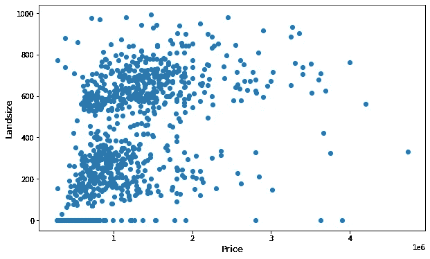

(图片由作者提供)

我们观察到价格和土地面积之间有轻微的正相关关系。

另一种常用的可视化类型是直方图。它将连续变量的值范围划分为离散的箱，并计算每个箱中数据点(即行)的数量。因此，我们得到了分布的概况。

让我们创建一个 price 列的直方图。

```
plt.figure(figsize=(10,6))
plt.hist(x=df.Price)
plt.xlabel("Price", fontsize=13)
```

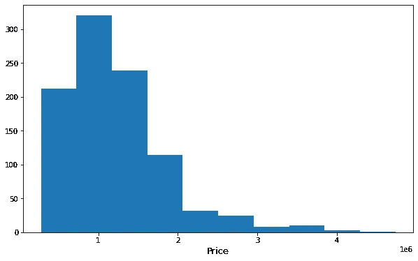

(图片由作者提供)

# 海生的

Seaborn 是一个基于 Matplotlib 构建的统计数据可视化库。与 Matplotlib 相比，Seaborn 是一个高级库。它的语法更简单，但是在某些情况下，您对定制可视化的控制更少。

```
import seaborn as snssns.relplot(data=df, x='Price', y='Landsize', kind='scatter',
            height=5, aspect=1.6)
```

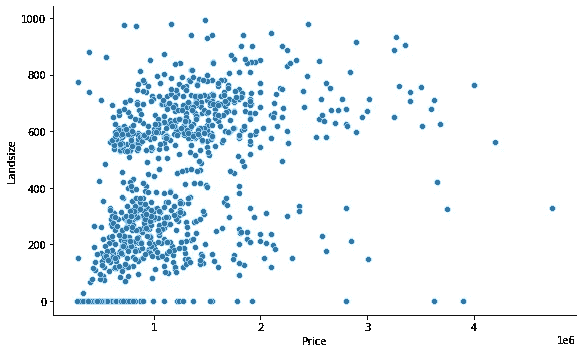

(图片由作者提供)

高度和纵横比参数用于自定义绘图的大小。

以下代码将创建 price 列的直方图。

```
sns.displot(data=df, x='Price', kind='hist', height=5, aspect=1.6)
```

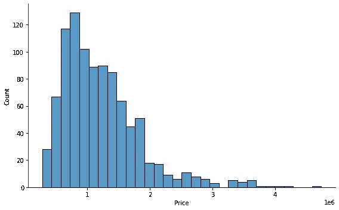

(图片由作者提供)

# 阿尔泰尔

Altair 是一个用于 Python 的声明式统计可视化库。Altair 在数据转换方面非常灵活。在创建可视化时，我们可以应用许多不同种类的转换。它使得库对于探索性数据分析更加有效。

以下是我们如何用 Altair 创建散点图。

```
alt.Chart(df).mark_circle().encode(
  x='Price', y='Landsize'
).properties(height=300, width=500)
```

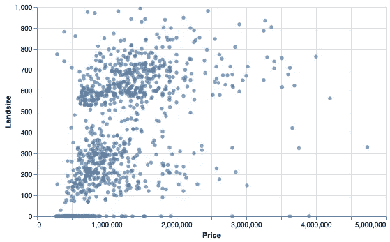

(图片由作者提供)

语法从我们用来传递数据的顶级图表对象开始。下一部分定义了绘图的类型。encode 函数指定要绘制的列。最后，属性功能用于在各个方面定制情节。

创建直方图的语法结构是相同的。我们只是改变了定义绘图类型的函数。有两种方法可以指定要绘制的列。第一种方法是将列名作为字符串传递给 x 或 y 参数。第二个是使用 X 和 Y 编码。在转换或使用附加功能的情况下，编码是首选。

```
alt.Chart(df).mark_bar().encode(
  alt.X('Price', bin=True), y='count()'
).properties(height=300, width=500)
```

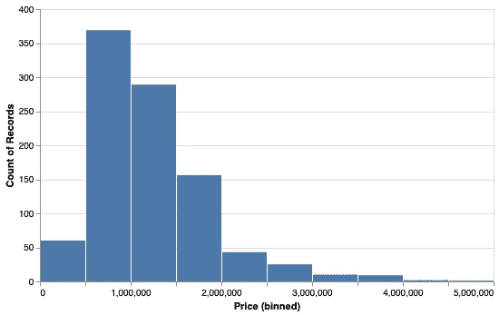

(图片由作者提供)

# Plotly

Plotly Python (plotly.py)是一个基于 plotly javascript (plotly.js)构建的开源绘图库。Plotly 提供了一个高级 API ( **plotly express** )和一个低级 API ( **graph objects** )来创建可视化。

Plotly express 使语法更加简单。另一方面，graph 对象的语法稍微复杂一些，但是我们可以更好地控制我们所创建的内容。

我们将使用 plotly express 接口来创建散点图和直方图。

```
import plotly.express as pxpx.scatter(df, x='Price', y='Landsize', height=500, width=700)
```

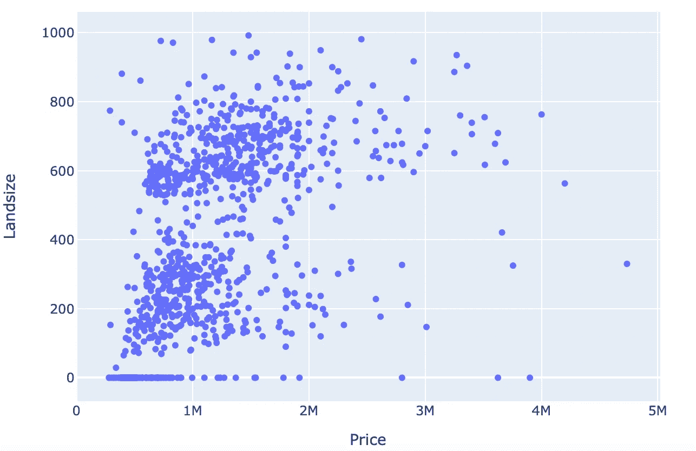

(图片由作者提供)

```
px.histogram(df, x='Price', height=500, width=700)
```

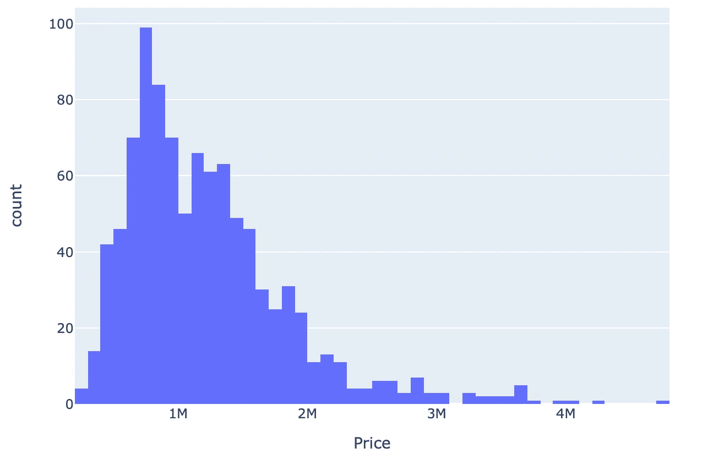

(图片由作者提供)

# 散景

Bokeh 是一个用于现代网络浏览器的交互式可视化库。因此，除了生成基本的绘图，散景也可以用来创建仪表板和数据应用程序。

在创建散点图和直方图之前，让我们导入所需的依赖关系。

```
from bokeh.io import output_notebook, show
from bokeh.plotting import figureoutput_notebook()
```

下面是我们如何用散景创建一个基本的散点图。

```
p = figure(plot_height=400, plot_width=600)
p.circle(df.Price, df.Landsize)
show(p)
```

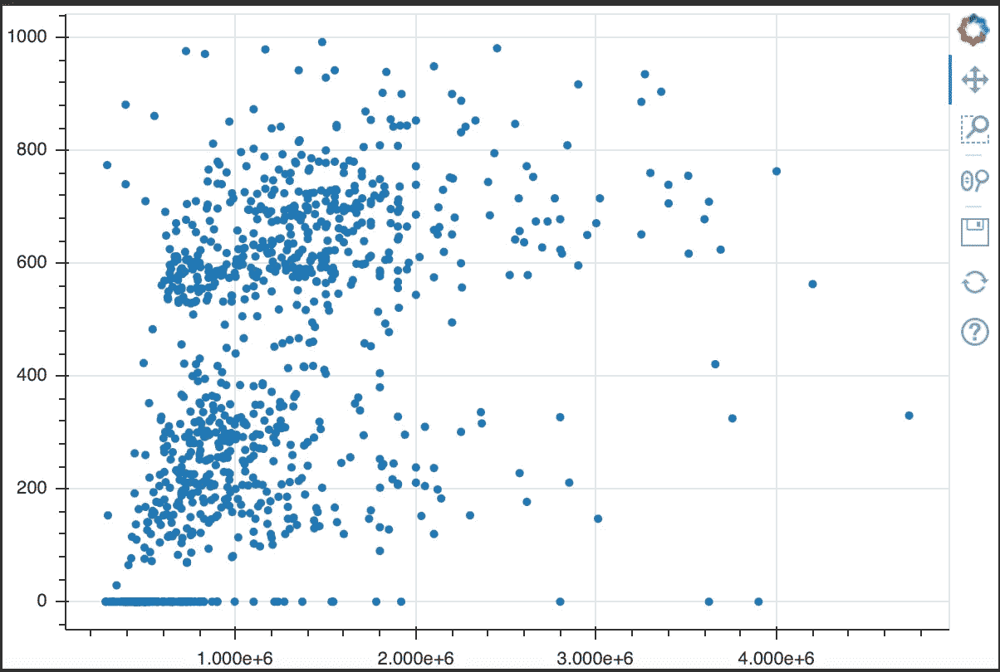

(图片由作者提供)

我们需要 NumPy 的一点帮助来创建直方图。我们使用 NumPy 的直方图函数来计算价格列的直方图。然后，转换后的数据将被传递给散景的 quad 函数。

```
hist, edges = np.histogram(df.Price, bins = 10)p = figure(plot_height=400, plot_width=600)
p.quad(top=hist, bottom=0, left=edges[:-1], right=edges[1:])
show(p)
```

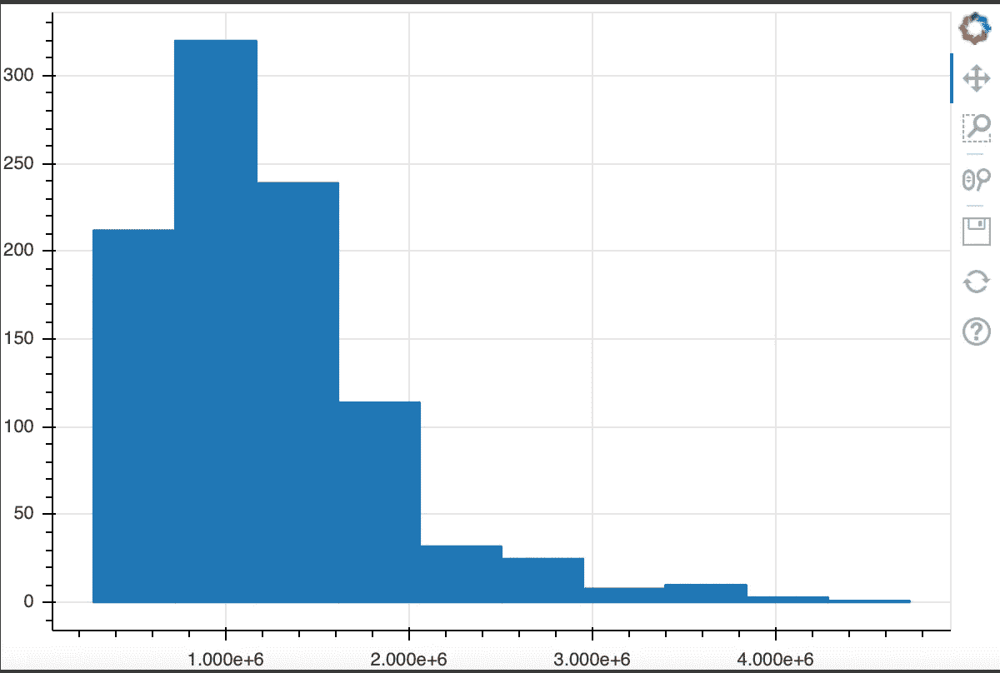

(图片由作者提供)

# 结论

我们已经介绍了 Python 的 5 个不同的数据可视化库。我们已经创建了非常基本的情节，以获得它们之间的差异和相似性的概述。

所有这些工具都能够创建更复杂的可视化效果，并对其进行定制。我真的不能说一个优于另一个，但我有一些偏好。例如，与 Matplotlib 相比，我更喜欢 Seaborn，因为它的语法更简单。我还喜欢 Altair 先进的数据转换和过滤功能。

感谢您的阅读。如果您有任何反馈，请告诉我。