# 可解释人工智能的五大技巧

> 原文：<https://towardsdatascience.com/top-5-techniques-for-explainable-ai-34349990cc83?source=collection_archive---------5----------------------->

## 不是 1，不是 2，而是 5 种可解释人工智能的技术

照片由[在](https://unsplash.com/@dizzyd718?utm_source=unsplash&utm_medium=referral&utm_content=creditCopyText) [Unsplash](https://unsplash.com/s/photos/artificial-intelligence?utm_source=unsplash&utm_medium=referral&utm_content=creditCopyText) 上绘制的迪兹·格拉汉姆

想象一下，你是一名医学专业人士，你正在使用人工智能进行中风预测。人工智能已经为你的一个病人预测了中风。当你将这些告诉你的病人时，他会感到恐慌。有两个明显的问题，他会问。

*   首先，你能解释一下为什么中风会被预测到吗？
*   第二，怎么做才能避免？

为了回答这些问题，你需要可解释的人工智能。这种情况适用于各种领域，如医疗保健、信用风险、产品推荐等。

所以在本文中，我们将通过中风预测的例子来理解可解释的人工智能。我将使用这些技术演示可解释的人工智能

*   用数据可视化解释
*   用逻辑回归机器学习模型解释
*   用决策树机器学习模型解释
*   用神经网络机器学习模型解释
*   和 SHAP 一起解释

这不是一个详尽的列表，因为还有许多其他技术。不过以上都是常用的。

# 病人情况

让我们从了解预测中风的患者的情况开始。患者为男性，67 岁。他有心脏病病史，平均血糖水平为 228，体重指数为 37。人工智能预测这个病人将会中风。

现在，作为一名医学专业人士，你必须准备好解释这个预测，让我们从不同的技术开始，这将帮助你做到这一点。

# 用数据可视化解释

这里我们不会使用任何复杂的方法，而是简单的数据可视化技术。这个想法很简单。

*   首先，以用于训练人工智能的数据为例。训练数据将包括患有中风的患者和没有中风的患者。
*   使用可视化技术，分析中风患者和非中风患者之间的区别。这将有助于你了解导致中风的因素。
*   然后你可以把它与病人的情况进行比较。这将有助于你理解为什么病人有危险。

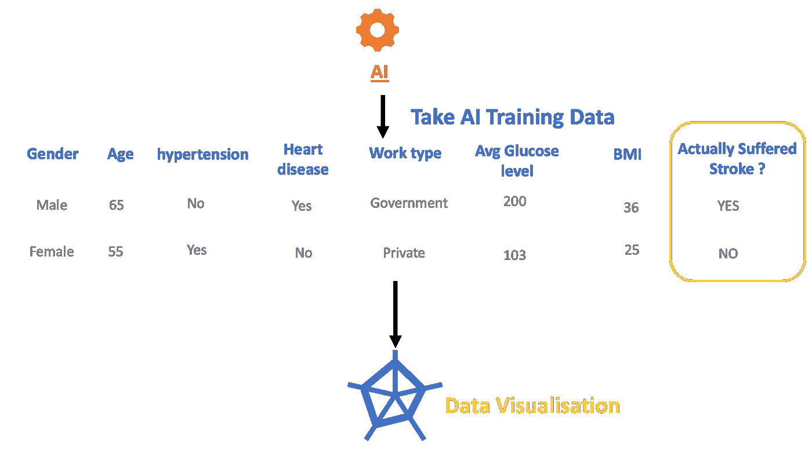

用视觉化的方法解释(图片由作者提供)

分析两个不同群体的最好方法之一是使用雷达图。下面显示的是用于训练人工智能进行中风预测的数据的雷达图。蓝色区域对应的是未患中风的患者。橙色区域对应患有中风的患者。这两个区域的差异让我们深入了解中风的原因。

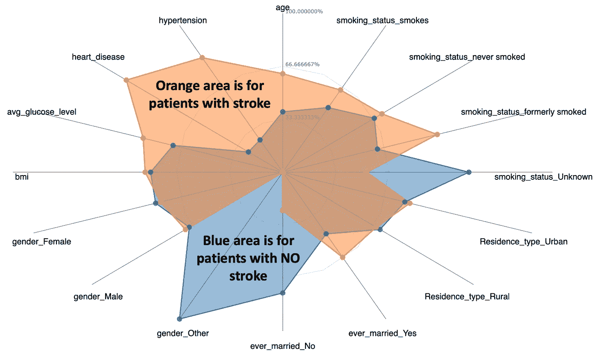

用于训练人工智能的数据的雷达图(图片由作者提供)

我们观察到患有中风的患者血糖水平高、患有心脏病、高血压、年龄相对较大且以前吸烟。这让我们很好的理解了中风的原因。

现在我们可以将这与我们的病人情况进行比较。我们看到病人满足了大多数导致中风的条件。这可以帮助我们解释为什么病人有危险。

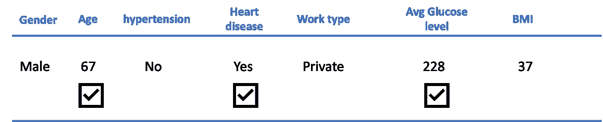

患者的情况与导致中风的因素相比(图片由作者提供)

> 虽然这是一种非常简单有效的技术，但我们不知道哪些导致中风的因素比其他因素更重要。

现在让我们研究第二种技术，它将帮助我们解决这个问题。

# **用机器学习模型解释**

预测中风的人工智能是基于机器学习模型的。你可以用这些模型来解释中风预测。有各种各样的机器学习模型，我将演示以下三个模型。

*   逻辑回归
*   决策图表
*   神经网络

让我们从逻辑回归模型开始

## 逻辑回归模型

这里显示了逻辑回归模型的结果。在 Y 轴上，你有不同的因素，而在 X 轴上，你可以看到这些因素对于中风的重要性。

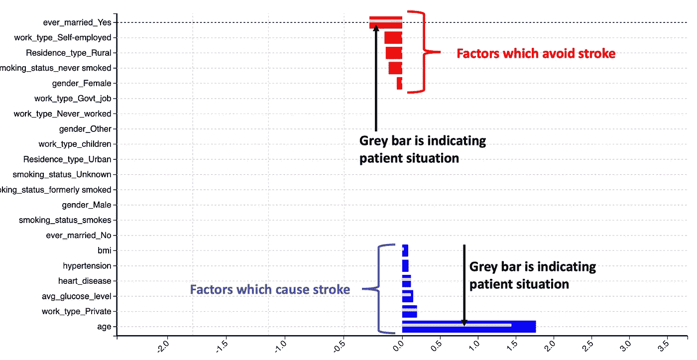

使用逻辑回归解释(图片由作者提供)

蓝色柱表示导致中风的因素，红色柱表示有助于避免中风的因素。例如，年龄、为私营公司工作、高血糖、心脏病和高血压都可能导致中风。已婚、个体经营、生活在农村地区可以降低患中风的概率。

患者的情况显示为灰色条。我们认为，患者年龄、个人工作、血糖水平和心脏状况是解释他有中风风险的因素。他的身体质量指数(体重指数)很低，不是潜在中风的原因。

与早期的雷达绘图技术相比，这种方法更加精确。我们现在能够精确确定哪些是导致潜在中风的首要因素。

逻辑回归模型是解释任何预测的绝佳方式，因为它有助于我们识别哪些因素比其他因素更重要。例如，这里我们知道患者的血糖水平比患者的体重指数更重要。

然而，到底是什么样的葡萄糖水平导致了患者潜在的中风？让我们用决策树模型来回答这个问题。

## 决策树模型

这里显示的是决策树模型的结果。这个模型有不同的决策节点，显示为黑点。这些决策节点指示字段和阈值。最后一个节点是患者是否会中风。患者的决策路径以绿色显示。

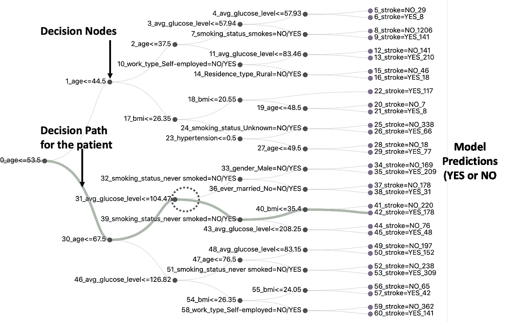

使用决策树的说明(图片由作者提供)

通过决策树模型，我们知道了导致中风的因素以及阈值。例如，我们看到患者的决策路径经过标记为平均葡萄糖水平和阈值 104.47 的节点。所以，我们现在知道，超过 104.47 的葡萄糖水平将会导致我们的患者潜在的中风。

这比之前显示的逻辑回归模型更精确。这也有助于建议患者的葡萄糖水平，并采取必要的措施将其降低到 104.47 以下

> 因此，我们不仅解释了潜在中风的原因，还建议患者采取措施降低风险。

## 神经网络模型

现在让我们转向神经网络机器学习模型。下图是一个用于中风预测的神经网络。它由输入神经元、中间神经元和输出预测组成。每个神经元向其他神经元发送一个正信号和一个负信号。灰线表示正信号，红线表示负信号。

绿色圆圈表示在对患者进行预测的过程中激活的神经元。

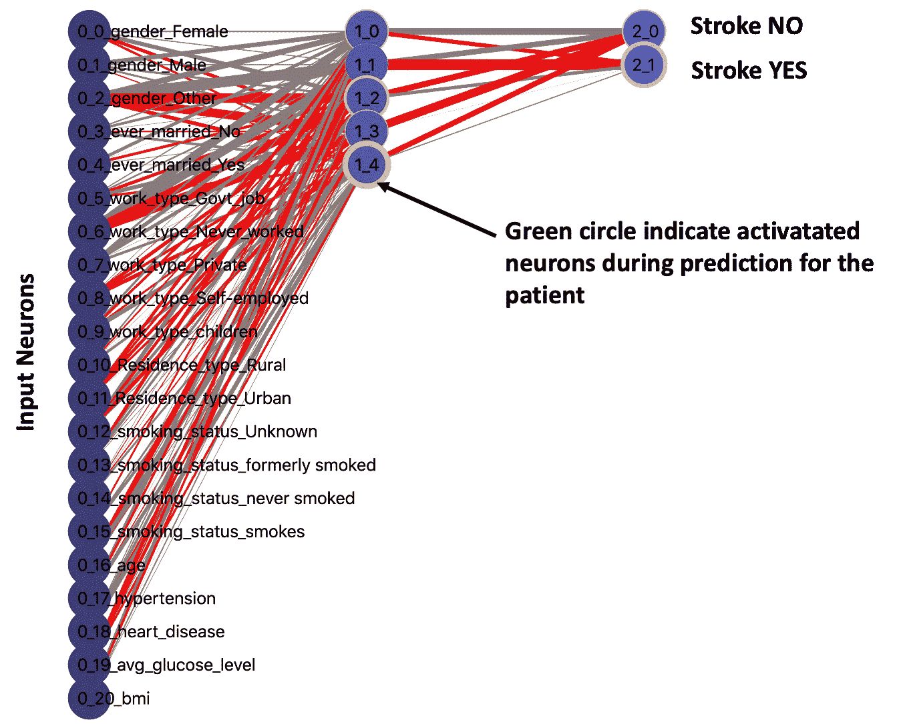

你可以看到神经元 1_4 被强烈激活，这里用一个粗绿圈表示。这个节点正在向非中风神经元发送负信号。这意味着患者中风的可能性很高。

现在让我们“窥视”神经元 1_4 的内部，看看这个神经元“内部”是什么。神经元的“内部”显示为雷达图。雷达图基于输入神经元和从它们接收的信号。蓝色表示来自输入神经元的正信号，红色表示来自输入神经元的负信号。

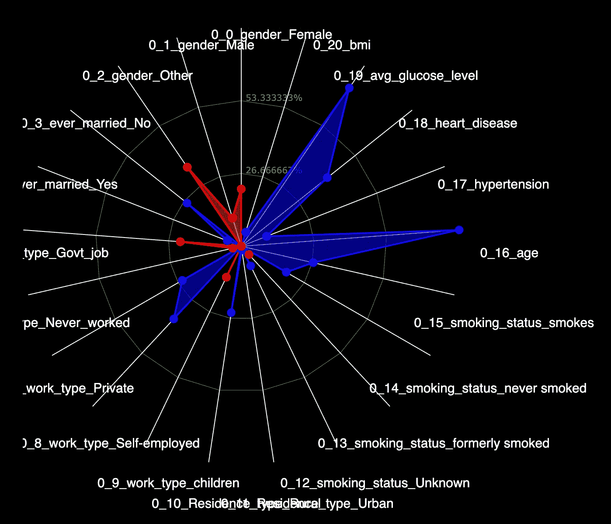

神经元内部 1_4(图片由作者提供)

我们看到来自输入神经元的葡萄糖水平、心脏病和年龄的非常高的信号。这意味着对于患者来说，血糖水平、心脏病和年龄是导致中风预测的条件。这些解释类似于我们使用早期模型所获得的结果。

# SHAP

现在，以上三个模型给出了相似的解释，然而，解释模型的方式却大不相同。因此，SHAP 出现了，它代表着沙普利附加解释。它能够解释任何模型。

> 无论使用何种机器学习模型，SHAP 都有助于用单一的方法来理解预测

我们中风预测的 SHAP 如下所示。无论使用何种机器学习模型，可视化都是相同的。

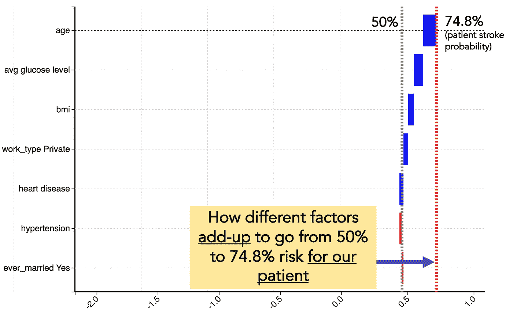

用于患者中风预测的 SHAP

你会看到两条垂直的虚线。左边的灰色虚线对应于数据中任何患者发生中风的预期概率。我们看到这大约是 50%。这是因为在用于机器学习的数据中，大约 50%的患者患有中风，50%的患者没有中风。右边的红色虚线对应我们的病人。这条线是 74.8%，因为我们的病人有 74.8%的中风概率。横条代表不同的因素，以及它们如何将患者中风的可能性从 50%增加到 74.8%。

SHAP 这个名字也来自于这种分析的性质，这种分析显示了不同的因素如何叠加起来导致预测的结果。下面显示的是每个因素对中风预测的贡献。

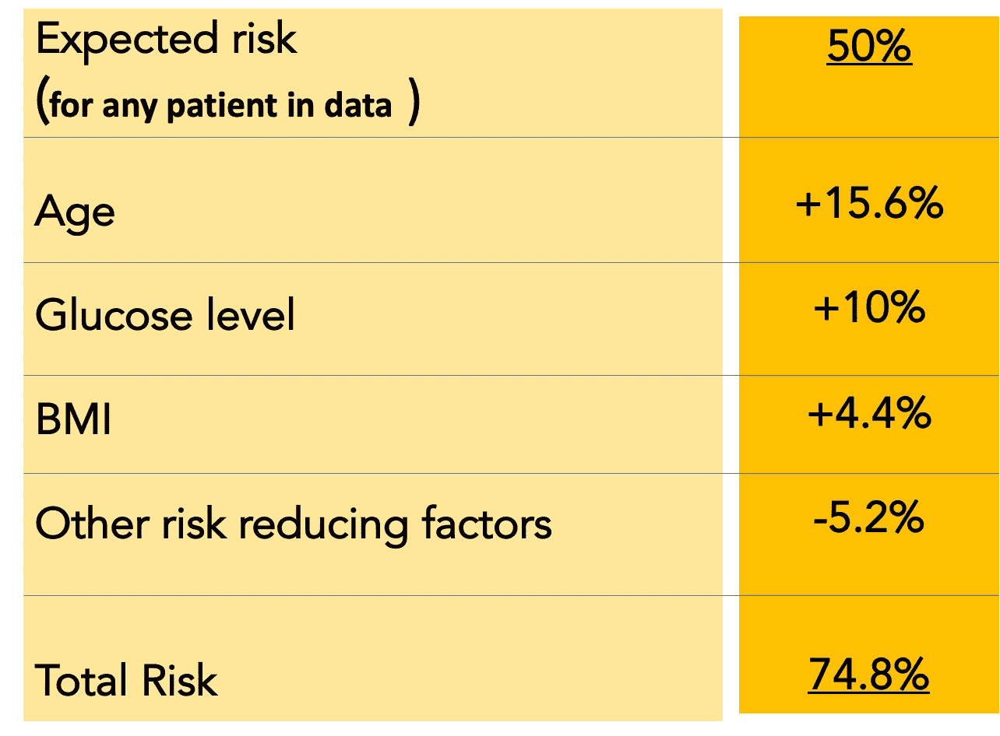

每个因素对中风预测的贡献(图片由作者提供)

我们看到年龄对中风概率的贡献为 15%，血糖水平对中风概率的贡献为 10%，身体质量指数(体重指数)对中风概率的贡献为 4.4%。

现在，因为我们知道每个因素对中风概率的贡献，我们也可以使用这种分析对病人提出任何建议。年龄不能改变，但如果平均葡萄糖水平和体重指数可以降低，那么中风的风险可以从 74.8%下降到 60%。

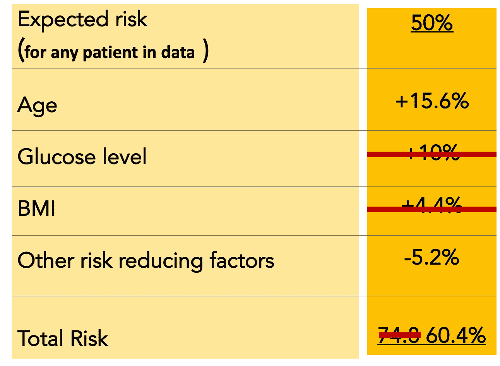

有助于降低中风风险的因素(作者图片)

因此，我们能够解释这些预测，以及关于可以做些什么来降低风险以及降低多少的建议。

# 摘要

下面是本文中描述的技术的总结

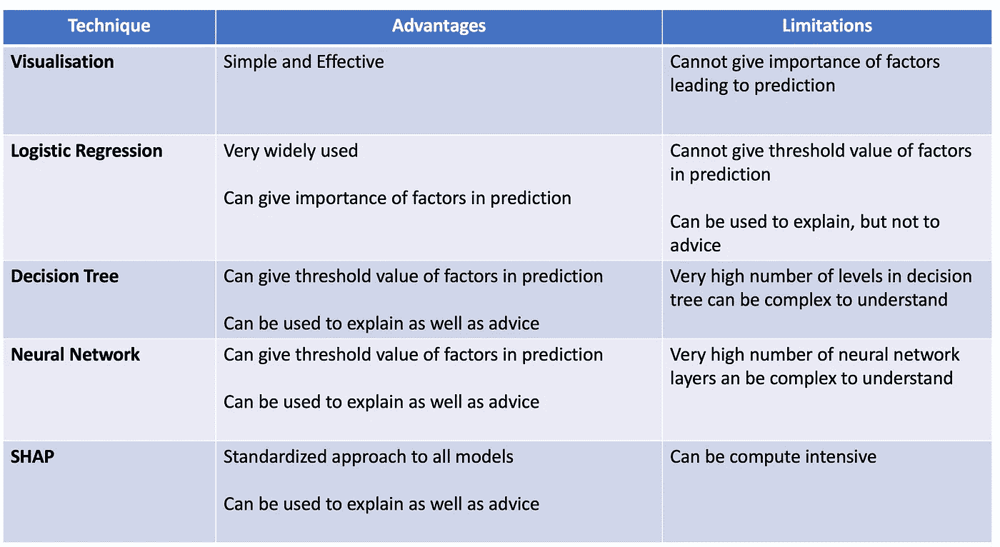

技术总结(图片由作者提供)

正如你所看到的，所有这些可解释的人工智能技术都不是“有多好”，而是强制性的。使用这些技术将帮助你更好地与受人工智能决策影响的人沟通。在某些情况下，如中风预测的例子所示，理解这些技术可以帮助改善或挽救生命。

# 额外资源

# 网站(全球资讯网的主机站)

你可以访问我的网站进行零编码分析。[https://experiencedatascience.com](https://experiencedatascience.com/)

请**订阅**每当我发布一个新的故事时，请及时通知我。

<https://pranay-dave9.medium.com/subscribe>  

你也可以通过我的推荐链接加入 Medium。

<https://pranay-dave9.medium.com/membership>  

https://www.youtube.com/c/DataScienceDemonstrated 的 YouTube 频道
这里是我的 Youtube 频道
[的链接](https://www.youtube.com/c/DataScienceDemonstrated)