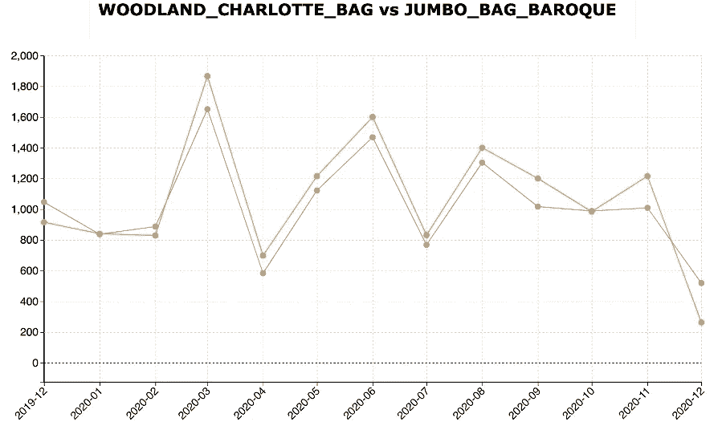

# 前 5 名时间序列分析

> 原文：<https://towardsdatascience.com/top-5-time-series-analytics-71a46fbda379?source=collection_archive---------7----------------------->

## 了解时序数据的主要用例及技术

布莱斯·巴克在 [Unsplash](https://unsplash.com/s/photos/time-sexy?utm_source=unsplash&utm_medium=referral&utm_content=creditCopyText) 上拍摄的照片

时间存在于我们周围的大部分数据中。从零售产品销售数据到金融股票价格，再到物联网传感器数据，都有时间的概念。因此，掌握时间序列分析将使你掌握数据科学世界

我将在此展示的 5 大分析是

*   季节性检测发现零售产品销售高峰
*   动态时间扭曲查找具有相似销售模式的产品
*   自相关识别上升趋势的金融股
*   变点检测，以更好地了解股票价格趋势的变化
*   快速傅立叶变换进行工作量规划

# 季节性检测

在本例中，我将使用零售产品销售数据来演示季节性检测。季节性意味着某些特定月份的销售额比其他月份高

数据由产品、日期和销售量组成

零售销售数据(图片由作者提供)

让我们以名为兔子夜灯的产品为例。这张图表显示了这种产品每月的销售情况

产品兔子夜灯的销售数据(图片由作者提供)

数据是 2019 年和 2020 年的。现在，我们看到这款产品在 2019 年 11 月达到销售峰值，然后这一峰值将在 2020 年 11 月重复出现。这意味着兔子夜灯的销售数据存在季节性

这种手动查看销售图表并确定季节性的方式很好，但是当您有数千种产品时，您需要一种自动化的方式来确定季节性。这就是季节性检测算法可以发挥作用的地方。

以下是应用于多种产品的季节性检测算法的结果

多种产品的季节性检测(图片由作者提供)

在 X 轴**、**上，你有销售高峰重演的时间。Y 轴给出了峰值的指示。所以我们的产品兔子夜灯在右上角。季节性检测估计销售高峰每 12 到 13 个月重复一次，这意味着一年中只有一个销售高峰

现在让我们看看其他一些产品，比如上面**的可视化中的二战滑翔机。**该产品每 6 个月有一个销售高峰。这意味着一年内会有两次销售高峰。

这是产品二战滑翔机 ASSTD 设计的销售趋势

产品 WW2 滑翔机的销售数据(图片由作者提供)

我们看到该产品在 2019 年 4 月和 2019 年 10 月达到销售高峰，销售高峰将在 2020 年 4 月和 10 月再次出现

因此，正如你所看到的，季节性检测是一种非常强大的方法，可以自动检测多个销售高峰，而无需查看每种产品的单独销售图表。它还有助于错误地计划产品的库存水平

# 动态时间扭曲(DTW)

该算法的名称可能听起来像一台时间机器，但我们将使用它来查找零售数据中具有相似销售模式的产品。

数据由产品、月份和当月销售额组成。此处显示的样本数据

零售数据示例(图片由作者提供)

这是应用于零售数据的动态时间扭曲的结果。每个点代表两种产品。**如果圆点在更左边，意味着两种产品有相似的销售模式。**与两个极端点相关的产品如下所示

DTW 多产品(图片由作者提供)

根据算法，产品 WOODLAND_CHARLOTTE_BAG 和 JUMBO_BAG_BAROQUE 具有相似的销售模式。如果我们移到右边，我们可以看到销售模式完全不同的产品。在这种情况下，我们有蛋糕盒和兔子夜灯，它们有完全不同的销售模式

现在让我们先看看伍德兰 _ 夏洛特 _ 包和珍宝 _ 包 _ 巴洛克的销售情况。这是伍德兰 _ 夏洛特 _ 包和珍宝 _ 包 _ 巴洛克的销售。

相似模式产品的销售(图片由作者提供)

这两种产品有相似的销售模式。这两种产品都在 3 月、6 月和 8 月达到峰值。然后销售减少。

现在，即使两种产品的销售数量不准确，DTW 算法也能够正确识别这两种具有相似销售模式的产品

现在让我们来看看蛋糕盒和兔子夜灯的销售情况，这两种产品已被算法识别为销售模式完全不同的产品。这里用灰色显示的兔子夜灯一年只有一次销售高峰，但是用橙色显示的蛋糕盒却有多次销售高峰

销售模式不相似的产品(图片由作者提供)

正如你所看到的，DTW 非常聪明，并且名副其实

# 自相关

在这一节中，我们将讨论自相关，让我们从一个概念性的例子开始。假设我们有一只股票，它的股价图看起来像这样。

股票图表(图片由作者提供)

现在你可以看到，第 9 天的价格上涨了，第 8 天的价格下降了。这意味着第 9 天和前一天之间存在**负相关。现在如果你也能看到第 9 天的价格上涨了，第 7 天的价格也上涨了。这意味着在第 9 天和第 2 天**之间存在**正相关**

现在让我们转向金融交易。在这个例子中，我们将从 CAC 40——法国股票市场——获取股票。这是应用于法国股票市场的一些股票的自相关结果。

自相关多股符号(图片由作者提供)

现在让我们取位于最顶端的深蓝色的点。它们对应于股票 ABIO。

任一期与前一期的相关值为 0.99。相关值接近 1 意味着存在正相关。这意味着如果某一天的价格上涨，前几天的价格也会上涨。这表明 ABIO 的价格总体上一直在上涨。一般来说，较高的股票在视觉上，意味着他们是上升趋势的股票

现在，在这种可视化中，底部越多，意味着股票不同时期之间的相关性越小。举个例子，如果你拿阿蒙来说。PA，它位于可视化的底部。相关值在 0.30 秒左右。这意味着股票价格在不同时期之间没有太大的相关性。这表明这只股票没有明显的趋势

现在让我们看看 ABIO 的价格趋势。这是 ABIO 的价格趋势。正如你所看到的，这是一只上升趋势的股票

ABIO 的股票图表。PA(图片由作者提供)

这里是阿蒙的价格。PA，正如你所看到的，这支股票已经上涨，然后下跌，再上涨。没有明确的趋势

AMUN 的股票图表。PA(图片由作者提供)

# 变化点检测

变点检测有助于**检测时序数据**的趋势变化。在这里你将展示我们如何用它来分析股票市场趋势的变化。

在这个例子中，我们将从 CAC 40——法国股票市场——获取股票。以下是股票代码 AMUN 在 2020 年 2 月至 2021 年 3 月之间的价格。我们可以看到这只股票先下跌，然后上涨，再下跌。使用变化点检测算法，您可以准确地绘制出趋势变化发生的位置

变化点检测(图片由作者提供)

该算法已经检测到 4 个变化点，并用这些垂直线表示。有了这些垂直线，我们可以很容易地确定每个趋势的时间周期。

我们可以看到改变点的时间。我们在 3 月有一个转变点，然后在 6 月左右有一个转变点，然后在 11 月左右有一个转变点。这意味着趋势的持续时间在 3 到 4 个月左右。随着最后一个转折点在 2020 年 11 月左右，我们应该预计未来一个月的趋势变化

# 快速傅立叶变换

快速傅立叶变换是世界上应用最广泛的算法之一。通过工作负载规划的一个用例来了解这一点。我们将以美国蒙哥马利县的 911 电话呼叫数据为例。该数据包含日期、时间和收到的电话数量。这是时间序列数据，因为呼叫次数取决于时间

这是样本数据

911 示例数据(图片由作者提供)

如果你画一条曲线，它会像这样。

911 数据的时间图(图片由作者提供)

在 X 轴上，我们用一小时来表示每天的时间。Y 轴表示收到的电话数量**。**现在，对于任何工作负载规划，我们都需要知道预期的峰值工作负载是什么时候，以便我们能够规划足够的资源

现在只看上面的图表，很难理解它，因为它不是很平滑，而且有很多变化

现在让我们谈谈应用快速傅立叶魔法。**快速傅立叶变换有助于在时序数据**中发现重复且平滑的信号。这是 FFT 的结果，显示了算法发现的重复信号。

FFT 信号(图片由作者提供)

重复信号在早上 6 点到 7 点开始，在 18 点到 19 点左右达到最大值，然后下降，然后在第二天早上 6 点到 7 点再次开始。

与原始数据相比，这个信号要平滑得多，我们可以使用它来制定工作负载计划。根据这个信号，我们应该有大约 5 到 7 人的最小数量，然后我们增加我们的容量，以达到 17 小时到 20 小时之间的最大容量。然后我们可以减少接听电话的人数，然后我们在早上 5 点到 7 点之间重新开始工作

因此，正如您所看到的，FFT 对于将噪声数据转换为易于解释和采取行动的平滑信号非常有用

这是一些顶级技术的概述，你可以在一些非常强大的应用和用例中使用时间序列数据

# 额外资源

# 网站(全球资讯网的主机站)

你可以访问我的网站进行零编码分析。【https://experiencedatascience.com 

请**订阅**每当我发布一个新的故事时，请随时关注。

<https://pranay-dave9.medium.com/subscribe>  

你也可以通过我的推荐链接加入 Medium。

<https://pranay-dave9.medium.com/membership>  

**Youtube 频道**
这里是我的 Youtube 频道
[https://www.youtube.com/c/DataScienceDemonstrated](https://www.youtube.com/c/DataScienceDemonstrated)的链接