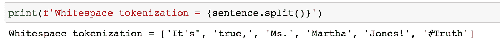

# 每个 NLP 数据科学家都应该知道的前 5 个单词分词器

> 原文：<https://towardsdatascience.com/top-5-word-tokenizers-that-every-nlp-data-scientist-should-know-45cc31f8e8b9?source=collection_archive---------11----------------------->

## 使用 NLTK 包在 NLP 中进行单词标记

作者图片

# 什么是标记化？

标记化是将文本分割成称为标记的小块的过程。这些小片段可以是句子、单词或子单词。例如，句子“我赢了”可以标记为两个单词——标记“我”和“赢了”。

> 根据语言学，记号的正式定义是“一个语言单位在演讲或写作中的个别出现，相对于它作为实例的语言单位的类型或类别。”

传统的标记化方法包括空格、标点或正则表达式标记化。像伯特和 GPT 这样的新语言模型促进了高级标记化方法的发展，如字节对编码、单词块和句子块。

# 为什么标记化有用？

**标记化允许机器阅读文本。**自然语言处理领域的传统和深度学习方法都严重依赖于标记化。在大多数自然语言处理应用程序中，这通常是一个预处理步骤。例如，为了计算文本中的单词数，使用分词器将文本拆分。在深度学习和传统方法中，标记化用于特征工程。例如，输入文本在输入到 BERT 的神经网络体系结构之前，使用单词片段子单词标记化进行处理。

# 什么是单词分词器？

**单词分词器是一类将文本拆分成单词的分词器。**这些记号化器可以用来创建文本的单词包表示，它可以用于下游任务，如构建 word2vec 或 TF-IDF 模型。

# NLTK 中的单词分词器

(本练习的 Jupyter 笔记本[可在此处](https://github.com/arushiprakash/MachineLearning/blob/main/NLTK%20Tokenizers.ipynb)获得)

NLTK 是自然语言处理应用程序的常用包。nltk.tokenize 模块为记号赋予器提供了几个选项。在本文中，我们将研究单词标记化的五个选项。

在我们继续之前，让我们从包中导入相关的函数

# 空白标记化

这是最简单也是最常用的记号化形式。每当发现空白字符时，它就分割文本。

这是有利的，因为这是一种快速且容易理解的记号化方法。然而，由于其简单性，它没有考虑特殊情况。在这个例子中，“Jones”比“Jones！”更有用。

# 基于标点符号的标记化

基于标点符号的标记化比基于空白符号的标记化稍微高级一些，因为它可以拆分空白符号和标点符号，并且还可以保留标点符号。

基于标点符号的记号化克服了上述问题，并提供了一个有意义的“琼斯”记号。然而，在类似" Ms . "的情况下，保留标点符号以区分" Ms . "和" Ms"/"MS"/"mS "可能是有用的，因为它们在不同的上下文中可能表示不同的意思。

# 默认/treebankwodtokenizer

NLTK 中的默认标记化方法包括使用 Penn Treebank 中定义的正则表达式进行[标记化(基于英文文本)。它假设文本已经被分成句子。](https://www.nltk.org/api/nltk.tokenize.html#nltk.tokenize.treebank.TreebankWordTokenizer)

这是一种非常有用的标记化形式，因为它结合了几个语言学规则来将句子分割成最佳的标记。

# TweetTokenizer

像 Twitter tweets 这样的特殊文本具有独特的结构，上面提到的通用标记器在应用于这些数据集时无法产生可行的标记。NLTK 为 tweets 提供了一个[特殊记号赋予器](https://www.nltk.org/_modules/nltk/tokenize/casual.html#TweetTokenizer)来帮助解决这个问题。这是一个基于规则的标记器，可以删除 HTML 代码，删除有问题的字符，删除 Twitter 句柄，并通过减少重复字母的出现来规范化文本长度。

# 姆韦托肯纳

多词表达式标记器是 NLTK 提供的基于规则的“附加”标记器。一旦文本被选择的标记化器标记化，一些标记可以被重新分组为多单词表达式。

例如，姓名 Martha Jones 被组合成一个标记，而不是分成两个标记。这个记号赋予器非常灵活，因为它不知道用于生成记号的基础记号赋予器。

# 结论

标记化是自然语言处理的一个组成部分。这是教会机器如何达到的第一步，随着该领域向深度学习发展，这一步仍然很重要。有三种类型的标记化——句子、单词和子单词。

在本文中，我们深入探讨了单词标记化的五个选项。下表总结了调查结果:

