# 黑仔人工智能应用需要掌握的 6 大深度学习模型

> 原文：<https://towardsdatascience.com/top-6-deep-learning-models-you-should-master-for-killer-ai-applications-13c7dfa68a3?source=collection_archive---------15----------------------->

## 深度学习案例研究

## 用 6 个强大的神经网络架构解决有监督的、无监督的和生成的人工智能问题(有案例研究的例子)


图一。查尔斯·德鲁维奥在 [Unsplash](https://unsplash.com?utm_source=medium&utm_medium=referral) 上拍摄的照片

随着可用处理能力、存储空间和大数据的增加，深度学习领域越来越受欢迎。人工智能工程师不再使用传统的机器学习模型，而是逐渐转向深度学习模型。在有丰富数据的地方，深度学习模型几乎总是优于传统的机器学习模型。这种关系可以想象如下:

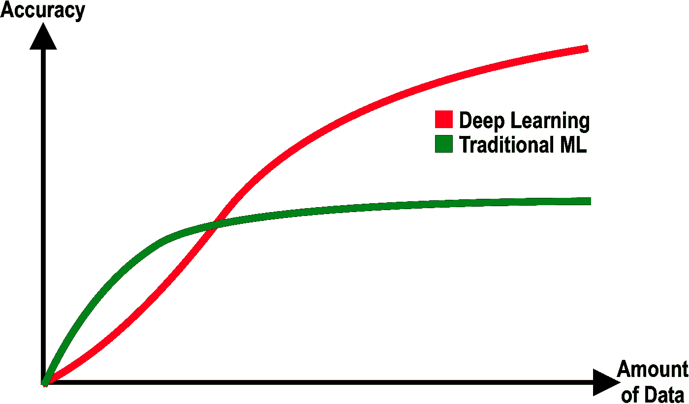

图二。准确性与数据量的关系图(作者提供的数据)

因此，随着我们每年收集更多的数据，使用深度学习模型是有意义的。此外，深度学习领域也在快速发展。许多研究人员投入了大量精力来开发针对特定问题的伟大的深度学习模型。尽管有数百种可供选择的深度学习模型，但它们可以根据主要类别进行分组。这些类别(以下称为型号)可列举如下:

表 1。流行的深度学习模型列表(按作者排序)(工作进行中)

尽管数字超过 20–30，但一些模型被证明对现实生活中的问题更有效。在本文中，我们将重点介绍这些模型，即:

1 —前馈神经网络模型或 MLP

2 —卷积神经网络模型

3 —递归神经网络模型

4 —变压器型号

5 —自动编码器

6 —生成性对抗网络模型

> 让我们逐一介绍这些型号:

```
FYI: The below terms are often used interchangeably:
- Deep Learning Models
- Artificial Neural Networks
- Neural Network Architectures
- Neural Network Models
So, don't get confused along the way :)
```

# 前馈神经网络(FfNN)或多层感知器(MLP)

前馈神经网络(FfNN) ( *有时也称为规则神经网络或规则网*)是一种人工神经网络，其中各层之间的连接不形成循环。这是使前馈神经网络不同于递归神经网络的主要特征。前馈神经网络(或多层感知)是第一个也是最简单类型的人工神经网络架构。

在这个网络中，信息只从输入层向前移动，通过隐藏层，到达输出层。FfNN 中没有循环或回路。

我们今天遇到的前馈神经网络是原始简单多层感知器(MLP)的改进版本。这些术语经常互换使用。在现代 FfNN 中，我们通常使用比阶跃函数(0 或 1)更复杂的激活函数，如 ReLU、Sigmoid、TanH 和 Softmax。现代深度神经网络通常利用一种梯度下降方法进行优化。下图显示了现代前馈神经网络的一个示例:

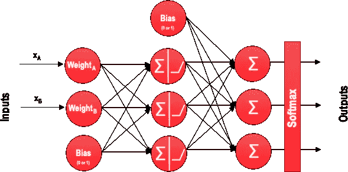

图 3。一个现代前馈神经网络的例子(图片由作者提供)

## 但是多层感知器这个名字是怎么来的呢？

[感知器](https://en.wikipedia.org/wiki/Perceptron)是一种用于监督学习的二元分类算法，由一层[线性阈值单元(LTU)](https://en.wikipedia.org/wiki/Artificial_neuron) 组成。在感知器中，ltu 使用相同的事件输出作为输入。感知器算法可以调整权重，以校正经过训练的神经网络的行为。此外，可以添加偏置项来提高网络的精度性能。

当只有一层感知器时，称为单层感知器。有一个输出层和一个接收输入的输入层。当隐藏层被添加到单层感知器时，我们最终得到一个多层感知器(MLP)。我们为日常问题建立的前馈神经网络是 MLP 的复杂版本。

## 为什么前馈神经网络对初学者友好

前馈神经网络是开始学习深度学习模型的优秀架构。尽管它们有缺点，前馈神经网络可以用来构建语音识别、图像识别和机器翻译软件。但是，他们在数据分析问题上是最强大的。这是前馈神经网络的另一种可视化:

## 数字添加

这里有一个前馈神经网络案例研究，您可以用它来提高您的 FfNN 技能:

[](/kaggles-titanic-competition-in-10-minutes-part-iii-a492a1a1604f) [## 10 分钟后卡格尔的泰坦尼克号比赛|第三部分

### 在 Kaggle 的泰坦尼克号比赛|机器中使用自然语言处理(NLP)、深度学习和 GridSearchCV

towardsdatascience.com](/kaggles-titanic-competition-in-10-minutes-part-iii-a492a1a1604f) 

# 卷积神经网络

最强大的监督深度学习模型之一是卷积神经网络(CNN)。CNN 的最终结构实际上非常类似于前馈神经网络(FfNNs)，其中有具有权重和偏差的神经元。除此之外，就像在 FfNNs 中一样，[在 CNN](https://cs231n.github.io/convolutional-networks/)中有一个损失函数(如 crossentropy 或 softmax)和一个优化器(如 adam optimizer)。此外，尽管在 CNN 中，也有卷积层、汇集层和平坦层。CNN 主要用于计算机视觉任务，如图像分类，尽管您可能会发现其他应用领域，如自然语言处理和时间序列预测。

## 卷积神经网络中的层

我们能够在卷积神经网络中使用许多不同的层。但是，卷积、池化和全连接层是最重要的。因此，我将在实现它们之前快速介绍这些层。

**卷积层—** 卷积层是我们从数据集图像中提取特征的第一层。由于像素只与相邻和接近的像素相关，卷积允许我们保留图像不同部分之间的关系。卷积基本上是用较小的像素过滤器过滤图像，以减小图像的大小，而不丢失像素之间的关系。当我们使用步长为 1x1(每步移动 1 个像素)的 3x3 滤波器对 5x5 图像应用卷积时，我们将获得 3x3 输出(复杂度降低 64%)。

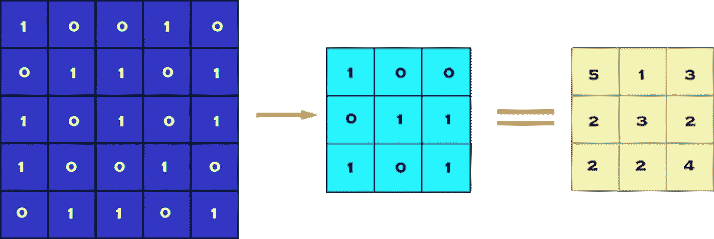

图 4。一个卷积运算的例子(5×5 的图像，3×3 的滤波器，1×1 的步长)(图由作者提供)

**池层—** 在构建 CNN 时，通常在每个卷积层后插入池层，以减小表示的空间大小，从而减少参数数量，从而降低计算复杂度。此外，合并层也有助于解决过度拟合问题。基本上，我们通过选择这些像素内的最大值、平均值或和值来选择池大小以减少参数的数量。最大池化是最常见的池化技术之一，可演示如下:

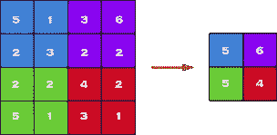

图 5。最大池化操作示例(4 x 4 图像，2 x 2 池化)(图由作者提供)

**一组完全连接的层—** 一个完全连接的网络是我们的 FfNN，其中每个参数相互链接，以确定每个参数的真实关系和对标签的影响。

包含卷积图层、池化图层和一组全连接图层的最终网络如下所示:

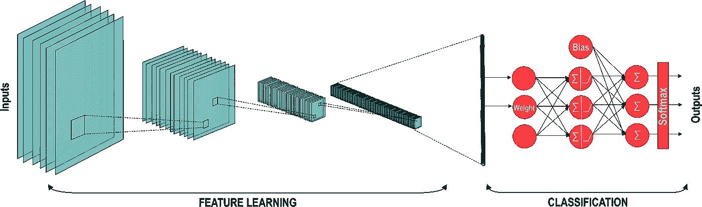

图 6。为图像分类设计的卷积神经网络示例(图片由作者提供)

这里有一个卷积神经网络案例研究，你可以用它来提高你的 CNN 技能:

[](/image-classification-in-10-minutes-with-mnist-dataset-54c35b77a38d) [## 使用 MNIST 数据集在 10 分钟内完成图像分类

towardsdatascience.com](/image-classification-in-10-minutes-with-mnist-dataset-54c35b77a38d) 

# 递归神经网络

递归神经网络(RNN)是一类人工神经网络，其中神经元之间的连接形成时间序列。能够捕获动态时间信息(时间记忆)的 rnn。递归神经网络源自前馈神经网络，但是它们提供了更多。

RNN 通过将以前的信息保存在内存中来使用它们，这些信息以“状态”的形式保存在 RNN 神经元中。有几种类型的 RNN，如香草 RNN，GRU 和 LSTM。

# RNN 类型

RNNs 有许多不同的变体。我们经常遇到的三种 RNN 类型是

*   香草(简单)RNN；
*   长短期记忆(LSTM)网络；和
*   门控循环单元(GRU)网络。

您可以在图 7 中找到这些备选 RNN 单元的可视化效果:

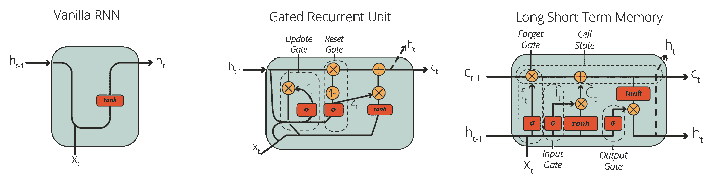

图 7。递归神经网络的三大流行变体:香草 RNN、GRU、LSTM

尤其是 LSTM 和 GRU 节点被如此广泛地使用，你经常在一些博客帖子中看到它们作为单独的深度学习模型类型。

这里有一个递归神经网络案例研究，你可以用它来提高你的 CNN 技能:

[](/using-recurrent-neural-networks-to-predict-bitcoin-btc-prices-c4ff70f9f3e4) [## 使用递归神经网络预测比特币(BTC)价格

### 如果你能以某种方式预测明天的比特币(BTC)价格，这不是很棒吗？加密货币市场有…

towardsdatascience.com](/using-recurrent-neural-networks-to-predict-bitcoin-btc-prices-c4ff70f9f3e4) 

# 变压器网络

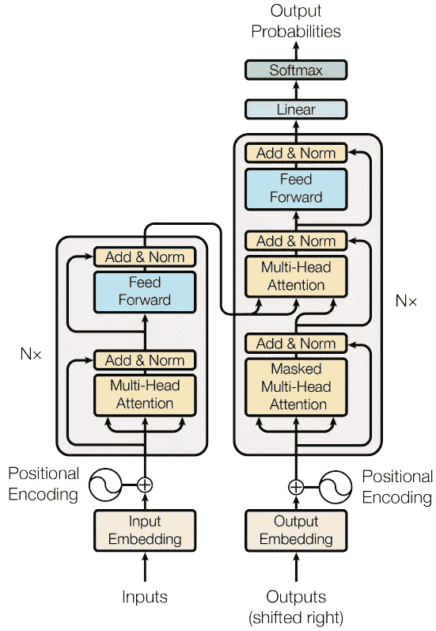

图 8。变压器模型架构(图由 [Vaswani 等人](https://arxiv.org/pdf/1706.03762.pdf)

**变压器网络**是 2017 年推出的深度学习模型。Transformer 网络主要用于自然语言处理(NLP)任务[。](https://en.wikipedia.org/wiki/Natural_language_processing)

变压器是为了应对 RNNs 的计算复杂性和缓慢性而设计的。转换器可以处理顺序数据任务，如机器翻译、时间序列预测或文本摘要。

Transformers 的主要优势在于，与 rnn 不同，它们不需要按顺序处理顺序数据。如果输入数据是时间序列中的销售数字，则转换器不需要处理较晚日期之前的较早日期。因此，[转换器允许比 RNNs 更多的并行化，因此减少了训练时间](https://arxiv.org/abs/1706.03762)。

由于它们在训练速度方面更有效，变压器已经成为 NLP 研究人员的选择，并取代了 RNN 的替代品。例如，流行的预训练 NLP 模型，如[伯特](/sentiment-analysis-in-10-minutes-with-bert-and-hugging-face-294e8a04b671)和 [GPT-3](https://en.wikipedia.org/wiki/GPT-3) 是转换模型，您可以使用迁移学习来完成 NLP 任务。

这里有一个变形金刚网络案例研究，你可以用它来提高你的变形金刚技能:

[](/sentiment-analysis-in-10-minutes-with-bert-and-hugging-face-294e8a04b671) [## 伯特和拥抱脸 10 分钟情感分析

### 学习预训练的自然语言处理模型的基础，伯特，并建立一个使用 IMDB 电影评论的情感分类器…

towardsdatascience.com](/sentiment-analysis-in-10-minutes-with-bert-and-hugging-face-294e8a04b671) 

# 自动编码器

## 什么是自动编码器？

自动编码器是由两个子网络组成的神经网络架构，即编码器和解码器网络，它们通过潜在空间相互联系。自动编码器最初是由人工智能界最受尊敬的科学家之一 Geoffrey Hinton 和 PDP 小组在 20 世纪 80 年代开发的。Hinton 和 PDP 小组旨在解决“没有老师的反向传播”问题，也就是无监督学习，使用输入作为老师。换句话说，他们将要素数据用作要素数据和标签数据。

> 让我们仔细看看自动编码器是如何工作的！

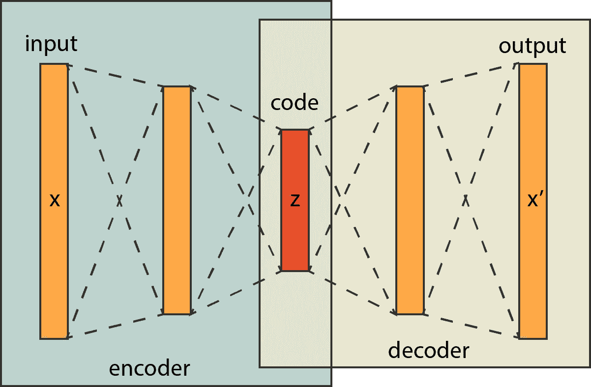

图 9。具有编码器和解码器网络的自动编码器网络

## 自动编码器架构

自动编码器由一个编码器网络和一个解码器网络组成，编码器网络获取特征数据并对其进行编码以适应潜在空间。解码器使用该编码数据(*，即代码*，并将其转换回特征数据。在编码器中，模型学习如何有效地编码数据，以便解码器可以将其转换回原始数据。因此，自动编码器训练的基本部分是生成优化的潜在空间。

现在，我们知道，在大多数情况下，潜在空间中的神经元数量比输入和输出层要少得多，但也不一定是这样。有不同类型的自动编码器，如欠完整、过完整、稀疏、去噪、收缩和变化自动编码器。

## 自动编码器中的图层

当构建自动编码器时，标准做法是设计一个编码器，并创建该网络的反向版本作为该自动编码器的解码器。因此，只要编码器和解码器网络之间存在反向关系，您就可以自由地向这些子网添加任何层。例如，如果您正在处理图像数据，您肯定会需要卷积和池层。另一方面，如果您正在处理序列数据，您可能需要 LSTM、GRU 或 RNN 单位。这里重要的一点是，你可以自由地建造任何你想要的东西。以下是构建自动编码器网络的常用方法:

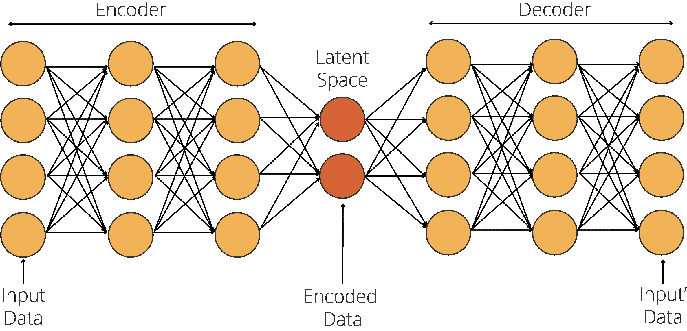

图 10。欠完整自动编码器中的潜在空间通常比其他层窄

这里有一个 Autoencoder 网络案例研究，您可以用它来提高您的 Autoencoder 技能:

[](/image-noise-reduction-in-10-minutes-with-convolutional-autoencoders-d16219d2956a) [## 使用卷积自动编码器在 10 分钟内降低图像噪声

### 在时尚 MNIST 的帮助下，使用深度卷积自动编码器清洁(或去噪)有噪声的图像

towardsdatascience.com](/image-noise-reduction-in-10-minutes-with-convolutional-autoencoders-d16219d2956a) 

# 生成对抗网络

生成对抗网络提供了革命性的生成解决方案，可用于各种领域，如蛋白质建模和艺术生成。GANs 的发明发生得相当意外。著名的人工智能研究人员*，当时是蒙特利尔大学的博士研究员*，[伊恩·古德费勒](https://en.wikipedia.org/wiki/Ian_Goodfellow)，当他和他的朋友——在一个朋友的告别派对上——讨论其他生成算法的缺陷时，偶然想到了这个想法。聚会结束后，他满怀希望地回家，并实现了他心中的想法。令人惊讶的是，[在第一次审判](https://www.youtube.com/watch?v=pWAc9B2zJS4)中一切都如他所愿，他成功地创建了生成性对抗网络(简而言之，GANs)。根据脸书人工智能研究主任、纽约大学教授 Yann Lecun 的说法，GANs 是“过去 10 年机器学习中最有趣的想法”。

GANs 的大致结构如下所示:

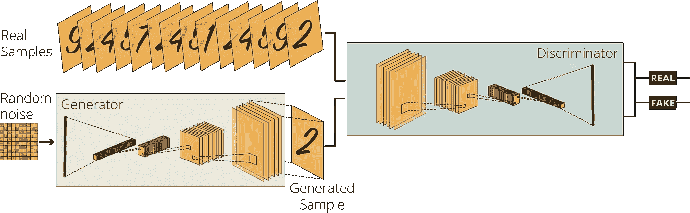

图 11。一个为图像生成而设计的生成性对抗网络的例子(图片由作者提供)

在一个普通的 GAN 结构中有两个相互竞争的代理:一个**生成器**和一个**鉴别器**。它们可以使用不同的网络来设计(例如，卷积神经网络( [CNNs](/image-classification-in-10-minutes-with-mnist-dataset-54c35b77a38d) )、递归神经网络( [RNNs](/using-recurrent-neural-networks-to-predict-bitcoin-btc-prices-c4ff70f9f3e4) )，或者只是前馈神经网络( [FfNN](/kaggles-titanic-competition-in-10-minutes-part-iii-a492a1a1604f) 或正则网络))。基于 CNN 的 GAN 可以如下所示:

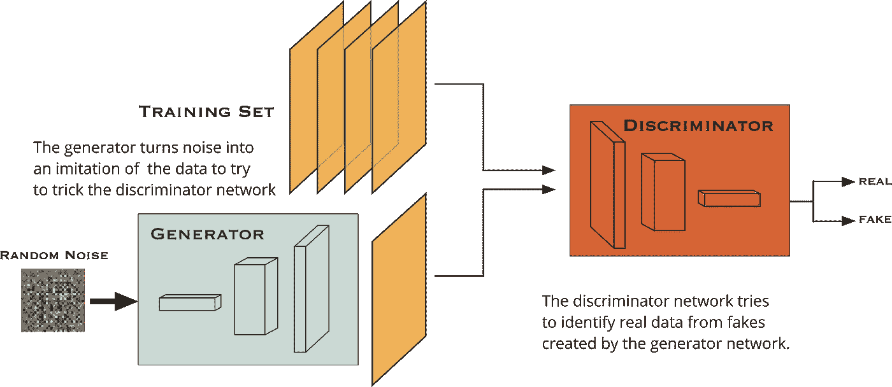

图 12。为图像生成而设计的生成性对抗网络的另一个例子(图片由作者提供)

## 我们的 GAN 模型是如何运作的？

例如，对于一个图像生成任务，我们要求生成器生成图像，而不给它任何额外的数据。同时，我们从数据集获取真实图像到鉴别器，并要求它判断生成器生成的图像是否是真实的。首先，发生器输出的噪声会立即被鉴别器标记为假的。在从鉴别器获得足够的反馈后，生成器最终学会欺骗鉴别器。因此，我们获得了一个优秀的生成模型，可以给我们非常现实的输出。

这里有一个生成性对抗性网络案例研究，你可以用它来提高你的 GAN 技能:

[](/image-generation-in-10-minutes-with-generative-adversarial-networks-c2afc56bfa3b) [## 利用生成性对抗网络在 10 分钟内生成图像

### 使用无监督深度学习生成手写数字与深度卷积甘斯使用张量流和…

towardsdatascience.com](/image-generation-in-10-minutes-with-generative-adversarial-networks-c2afc56bfa3b) 

# 最后的话

这篇文章涵盖了 6 个流行的深度学习模型，你可以用它们来构建伟大的人工智能应用。通过使用相应的案例研究，您可以为以下项目构建人工智能应用程序:

*   使用 FfNN 的预测分析；
*   使用 CNN 的图像分类:
*   使用 RNN 的时间序列价格预测:
*   使用变压器的情感分析；
*   使用自动编码器降低噪音:和
*   利用 GAN 产生图像。

所以，开始工作，在成为一名伟大的深度学习专家的路上打磨你的技能吧！

# 订阅邮件列表获取完整代码

如果你想获得我在 Google Colab 上的其他教程文章的代码，并尽早获得我的最新内容，可以考虑订阅:✉️的邮件列表

> [*现在订阅*](http://eepurl.com/hd6Xfv)

如果你对深度学习感兴趣，也可以看看我的人工智能内容指南:

[](https://oyalcin.medium.com/a-guide-to-my-content-on-artificial-intelligence-c70c9b4a3b17) [## 我的人工智能内容指南

### 帮助您轻松浏览我的内容的指南。

oyalcin.medium.com](https://oyalcin.medium.com/a-guide-to-my-content-on-artificial-intelligence-c70c9b4a3b17) 

既然您正在阅读这篇文章，我相信我们有着相似的兴趣，并且现在/将来会从事相似的行业。那么我们就通过[*Linkedin*](https://linkedin.com/in/orhangaziyalcin/)*来连线吧！请不要犹豫发送联系请求！*[*Orhan g . Yal n—Linkedin*](https://linkedin.com/in/orhangaziyalcin/)