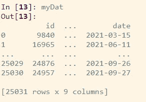

# 数据科学家的 6 大 Python 技巧

> 原文：<https://towardsdatascience.com/top-6-python-tips-for-data-scientists-4f4a25e44d15?source=collection_archive---------14----------------------->

## 来自我日常分析项目的实用技巧和诀窍

编码现在是，并将继续是数据科学的重要组成部分！据说数据科学家接近 70%的时间都花在了编码上，我也不例外。在本文中，我将分享 6 个最有用和实用的 Python 片段，它们是我在日常工作中解决实际分析问题时收集的。

现在，让我们开始吧！

1.  **使用 exec()动态执行**


动态执行([图像源](https://www.freepik.com/free-vector/javascript-frameworks-concept-illustration_11905945.htm#page=1&query=code&position=18&from_view=search))

*场景*:你从一个同事那里继承了一个 Python 项目，并且立即注意到那些脚本都有 5000 多行代码。相同的代码块被多次复制和粘贴！那么，有没有更有效的方法来实现代码的可重用性呢？

让我们来探索一下 Python 中的 `**exec()**` 函数。简单地说，它接受一个字符串或目标代码，并执行它，如下例所示，

```
a = 4 and b = 5
a+b = 9
```

更加得心应手？我们可以使用`**exec(open().read())**` 在 Python 解释器中调用和执行文件。举个例子，

有了这个强大的一行程序，数据科学家可以保存将作为独立文件重用的程序，并在需要时在主程序中执行它们。再也不用复制和粘贴代码了！

作为 Python 中一个很酷的功能， `**exec()**` 有一个需要避免的缺陷——它不返回任何值，

```
a = 4 and b = 5
a+b = 9
** Is the return from exec() is None? True **
```

我们可以看到，`**exec()**`函数的输出是**None**；因此，它不能用来存储任何值，这相当于 r 中的`[**sounce()**](https://www.rdocumentation.org/packages/base/versions/3.6.2/topics/source)`函数

**** * *加入我们的 YouTube 社区🎦*** [***【数据说话带吉】***](https://www.youtube.com/channel/UCbGx9Om38Ywlqi0x8RljNdw) ***😄***

**2。使用{os}和{shutil}的操作系统命令**

场景:从我们之前的技巧继续，现在你想在执行之前检查脚本。不要一路双击鼠标来打开文件？没问题，你可以直接用 Python 轻松实现这个，不打断你的思路。

在这里，`**os.startfile()**`功能允许用户打开任何类型的文件，包括 MS 文档、电子表格、R 和 SQL 脚本。

同样，我们也可以使用`**os.remove(“myFullFileName.ANYFORMAT”)**`删除文件

或者使用`**shutil.rmtree(“folderToBeRemoved”)**`删除整个目录。其中{shutil}是一个 Python 模块，提供了许多高级文件操作，尤其是文件复制和删除操作。

因此，如果你没有使用过除了`**os.getcwd()**`或`**os.chdir()**`之外的{ [os](https://docs.python.org/3/library/os.html) ，或者如果{ [shutil](https://docs.python.org/3/library/shutil.html) }听起来很陌生，那么是时候检查一下他们的文档了。您肯定会找到有用的命令或文件系统方法，使您的编码更容易。这里列出了一些我最喜欢的，

*   `**os.listdir()**`或`**os.listdir(“someDirectory”)**` —分别列出当前工作目录或任意用户指定目录下的所有文件；
*   `**os.path.join()**` —自动创建一个包含参数元素的路径，以备后用，例如`**os.path.join(‘D’, ‘Medium’, ‘New Folder’)**`将返回

```
 ‘D\\Medium\\New Folder’
```

*   `**os.makedirs()**` —创建目录；
*   `**shutil.copy2(“sourcePath”, “destinationPath”)**`或`**shutil.move(“sourcePath”, “destinationPath”)**` —分别复制或剪切一个文件。

**3。一行程序:嵌套列表理解以摆脱 for 循环**

*场景*:我们遇到的这个“简单”的任务是将几个列表合并成一个大的长列表，

当然，我们可以为循环编写五个嵌套的**来将每个子列表添加到最终的输出列表中。但是更聪明的做法是以最简洁的方式理解嵌套列表，**

**4。计时器被包装成装饰器**


计时器作为装饰器([图像源](https://www.freepik.com/free-vector/time-management-concept_14449321.htm#page=1&query=timer&position=7&from_view=keyword))

*场景*:虽然 Python 被公认为最有效的编程语言之一，但数据科学家仍然需要检查我们程序的运行时。

如果我们只是为想要监控的每个函数实现一个基本的 Python 定时器，这并不是最难的事情。然而，如果我们把它编码成一个装饰器，我们会使我们的定时器更容易被版本控制和重用！

这里是如何，

在这个片段中，

*   计时器被包装在一个`**timerWrapper**` 函数中，该函数被用作在 main 函数之前调用的装饰器；
*   示例的主要功能是返回一个连接到 URL 的请求，这是我以前的博客之一[。](/6-sql-tricks-every-data-scientist-should-know-f84be499aea5)

运行这段代码可以得到经过的时间，

```
Current function: getArtile
 Run Time: 1.6542516000008618Out[101]: <Response [200]>
```

现在，为了给另一个函数计时，我们需要做的就是把`***@timeWrapper***`放在函数前面，

```
getMultiplication(3)
10
10000000000
10000000000000000000000000000000000000000000000000000000000000000000000000000000000000000000000000000
Current function: getMultiplication
 Run Time: 0.00014700000065204222
```

**5。利用** `**options**` **系统定制您的显示器**

*场景*:作为数据科学家，我们每天用{pandas}和{numpy}分析数据。当我第一次学习 Python 编码时，在将我的数据读入 IDE 后，我很沮丧地看到了这一点，



显然，数据显示在行方向和列方向都被截断了，下面的代码可以修复这个问题，

这里，我们明确地设置了在控制台中显示/打印的最大列数、行数和列宽。{pandas}中有很多可定制的[选项和设置](https://pandas.pydata.org/docs/user_guide/options.html)，类似的操作在 [{numpy}](https://numpy.org/doc/stable/reference/generated/numpy.set_printoptions.html) 中也有，针对数组和矩阵，

**6。重现你的机器学习模型结果？设定种子！**

*场景*:由于机器学习建模过程的随机性，我们都遇到过机器学习的不确定性。这种随机性导致我们很难在不同的运行中重现相同的结果。因此，很难确定性能指标的改进是成功的模型调整的结果，还是仅仅是不同的随机训练/测试样本。

幸运的是，只要你做得正确，通过**在整个模型管道中设置随机种子**，就可以实现再现性！你见过多少次堆栈溢出时弹出“尽管定义了随机种子，但得到了不同的结果”这样的问题？嗯，如何恰当地设置种子应该在文档的第一页，但我花了一些时间来挖掘它。

我发现在{numpy}、{sklearn}、{tensorflow}或{torch}中，并不是每个种子的定义都一样。因此，最好的做法是使用一个明确的函数，为所有的框架设置所有的种子。举个例子，

将这种战术性的`**reset_random_seed()**`功能添加到你工作流程的所有必要步骤中，比如训练-测试分割、模型编译/训练和解释，将会使你达到完全的可再现性。对你的实验更详细的了解将会完成后半部分！

希望你已经学到了一些新的功能，或者重新发现了一些你以前可能忽略的功能。如果您受到启发，想在自己的代码中使用其中的一个或几个，那就太棒了！如果你知道 Python 的其他隐藏的瑰宝，请在下面留下评论。😃

***想要更多的数据科学和编程技巧？使用*** [***我的链接***](https://yilistats.medium.com/membership) ***注册 Medium，获得我所有内容的完全访问权限。***

***还订阅我新创建的 YouTube 频道*** [***【数据谈吉】***](https://www.youtube.com/channel/UCbGx9Om38Ywlqi0x8RljNdw)

## *进一步阅读*

*</3-common-sql-errors-to-spot-an-inexperienced-data-scientist-310b3e98842f>  <https://levelup.gitconnected.com/6-hilarious-programmers-data-scientists-jokes-to-kick-start-2021-187f86dd6a4c> *