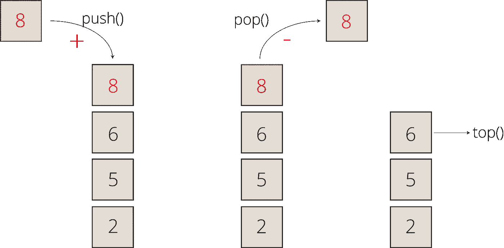
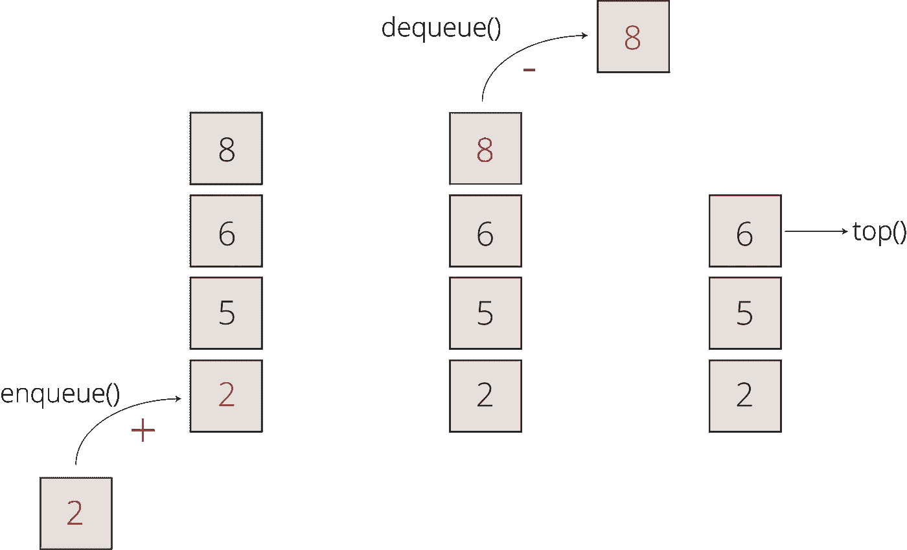
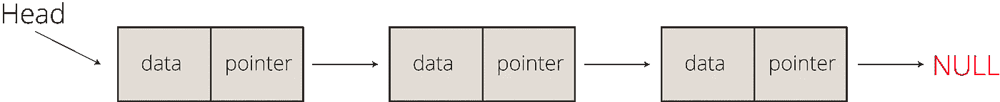
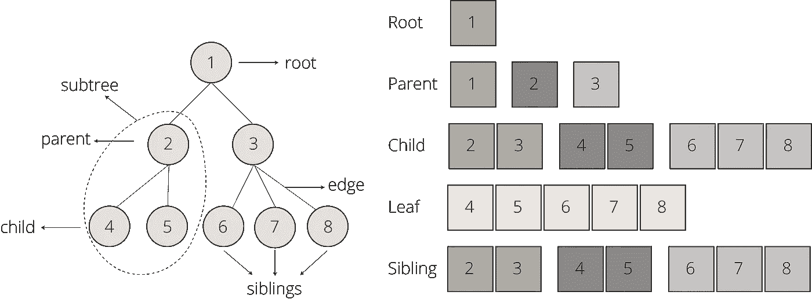
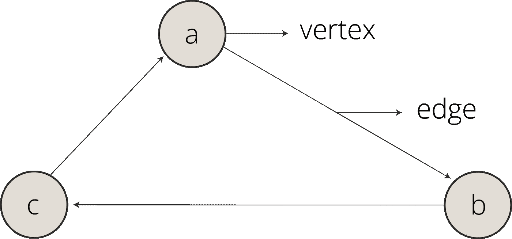
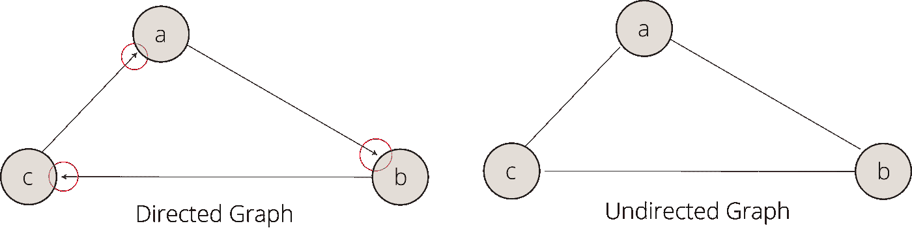
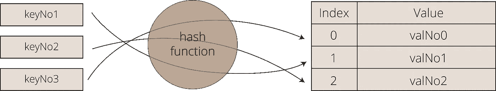

# 下一次面试时你应该知道的 7 大数据结构

> 原文：<https://towardsdatascience.com/top-7-data-structures-you-should-really-know-for-your-next-job-interview-228a4f58b841?source=collection_archive---------7----------------------->

## 数据结构—第 1 部分

## 掌握这些数据结构，为你的下一份数据科学工作打下基础

图一。[绿色变色龙](https://unsplash.com/@craftedbygc?utm_source=medium&utm_medium=referral)在 [Unsplash](https://unsplash.com?utm_source=medium&utm_medium=referral) 上的照片

数据结构是用于构建程序的基本构造。每种数据结构都有自己组织数据的方式，这在特定的用例中可能很有效。数据结构有其特殊的结构，为数据组织、管理、存储、访问和修改任务提供了可供选择的解决方案。

不管你是在建立一个机器学习模型还是一个移动应用程序；在处理项目时，您必须依赖数据结构。因此，你未来的雇主也会希望确保你很好地掌握了数据结构。

在本帖中，我们将涵盖你在下一次工作面试中必须知道的七种基本数据结构。

# 1.数组

数组是最简单和最广泛使用的数据结构。它们被构造为按特定顺序排列的元素的集合。数组通常具有固定的大小，它们保存相同数据类型的项。您可以从字符串、整数、对象甚至数组的集合中创建数组。因为数组是有索引的，所以你可以随机访问任何数组元素。

*图二。数组可视化示例(作者提供的图片)*

**数组类型:**您可能遇到的两种最常见的数组类型是

*   一维数组
*   多维数组

**数组的基本操作:**您可以对数组进行的最常见的基本操作有`insert`、`get`、`delete`和`size`操作。

*   `**Insert**` **:** 在给定的索引处插入一个新元素
*   `**Get**` **:** 返回给定索引处的元素
*   `**Delete**` **:** 删除给定索引处的元素
*   `**Size**` **:** 返回数组中元素的总数

还可以对数组进行遍历、搜索和更新操作。

**数组的实现:**

*   数组通常被用作更复杂的数据结构的构建块，如`arrays`、`lists`、`heaps`、`matrices`。
*   在数据科学中，数组用于高效的数据操作。我们经常提供`NumPy`的数组对象给机器学习模型进行训练。

# 2.大量

栈是基于 LIFO ( ***后进先出*** )的数据结构。在基于 LIFO 的数据结构中，放在最后的数据首先被访问。现实生活中的一个堆栈示例可以是一堆垂直放置的岩石，如图 2 所示。

图 3。由 [Samrat Khadka](https://unsplash.com/@samrat_khadka?utm_source=medium&utm_medium=referral) 在 [Unsplash](https://unsplash.com?utm_source=medium&utm_medium=referral) 上拍摄的照片

**栈上的基本操作:**栈上最常见的基本操作有`push`、`top`、`pop`、`isEmpty`和`isFull`操作。

*   `**Push**` **:** 在顶部插入新元素；
*   `**Top**`:返回顶部的元素，但不从堆栈中移除；
*   `**Pop**`:从堆栈中移除一个元素后，返回其顶部；和
*   `**isEmpty**` **:** 检查堆栈是否有元素。
*   `**isFull**`:检查堆栈是否已满。

这是堆栈结构的可视化:

*图 4。书库可视化示例(作者提供的图片)*

**关于书库的常见面试问题**

*   使用堆栈(例如，反向波兰符号(RPN)或抽象语法树(AST))评估后缀表达式；
*   对堆栈中的值进行排序；和
*   检查表达式中的平衡括号。

# 3.行列

队列在结构上非常类似于堆栈。唯一的区别是队列是基于后进先出法的。在队列中，我们可以在末尾添加一个新元素，也可以从前面删除一个元素。现实生活中队列的一个例子可能是在杂货店排队等候的人群，如图 4 所示。

图 5。 [Adrien Delforge](https://unsplash.com/@adriendlf?utm_source=medium&utm_medium=referral) 在 [Unsplash](https://unsplash.com?utm_source=medium&utm_medium=referral) 上拍摄的照片

**队列基本操作:**您可以对队列进行的最常见的基本操作有`enqueue`、`dequeue`、`top`和`isEmpty`操作。

*   `**Enqueue**` **:** 在队列末尾插入一个新元素；
*   `**Dequeue**`:从队列前面移除元素；
*   `**Top**`:返回队列的第一个元素；和
*   `**isEmpty**` **:** 检查队列是否为空。

以下是队列结构的可视化:

*图 6。队列可视化示例(作者提供图片)*

**队列和常见面试问题的实现**

*   使用堆栈实现队列；
*   检索给定队列的前 n 个元素；和
*   [生成从 1 到 n 的二进制数](https://www.geeksforgeeks.org/interesting-method-generate-binary-numbers-1-n/)。

# 4.链接列表

链表的结构是元素的线性集合(*即节点*)。每个节点包含两个信息:

*   `Data`:元素的值
*   `Pointer`:链表中下一个节点的指针。

由于链表是顺序结构，随机访问元素是不可能的。

图 7。照片由 [JJ 英](https://unsplash.com/@jjying?utm_source=medium&utm_medium=referral)在 [Unsplash](https://unsplash.com?utm_source=medium&utm_medium=referral) 拍摄

**链表的类型:**我们遇到了两种主要类型的链表，

*   **单链表:**我们只能使用下一个节点之前的节点来访问它。
*   **双向链表:**我们可以正向和反向访问数据。

下面是一个链表结构的可视化:

*图 8。单链表可视化示例(作者图)*

**链表的基本操作:**链表最常见的基本操作有`insertAtEnd`、`insertAtHead`、`DeleteAtHead`、`Delete`、`isEmpty`操作。

*   `**InsertAtEnd**` **:** 在链表的末尾插入新元素
*   `**InsertAtHead**` **:** 在链表的头部插入新元素
*   `**DeleteAtHead**` **:** 删除链表的第一个元素
*   `**Delete**` **:** 从链表中删除给定的元素
*   `**isEmpty**` **:** 检查链表是否为空。

**链表面试常见问题:**

*   一次找到单链表**的中间元素**；
*   无递归反转单个**链表**；和
*   移除未排序的**链表**中的重复节点。

# 5.树

树是由节点和边组成的分层数据结构。节点代表值，而边连接它们。树中节点之间的关系是单向或双向的，而不是循环的。树被广泛用于构建决策树和集成方法。

图 9。 [Jazmin Quaynor](https://unsplash.com/@jazminantoinette?utm_source=medium&utm_medium=referral) 在 [Unsplash](https://unsplash.com?utm_source=medium&utm_medium=referral) 上的照片

虽然像二叉树和二分搜索法树这样的树类型是最常用的变体，但是不同树实现的总数达到数百种，其中它们可以被分组为:

*   `Basic Tree Structures`
*   `Multi-Way Trees`
*   `Space-Partitioning trees`
*   `Application-Specific trees`

*图 10。单链表可视化示例(作者图)*

**常见的树面试问题:**

*   [检查两个给定的二叉树是否相同](https://www.techiedelight.com/check-if-two-binary-trees-are-identical-not-iterative-recursive/)；
*   [计算一棵二叉树的高度](https://www.techiedelight.com/calculate-height-binary-tree-iterative-recursive/)；和
*   [从前序和后序序列构建完整的二叉树](https://www.techiedelight.com/construct-full-binary-tree-from-preorder-postorder-sequence/)。

# 6.图表

图由一组有限的节点(即顶点)和一组无序或有序的顶点对组成，这些顶点一起形成一个网络。这些对也被称为边(即，链接、线或箭头)。边可以包含权重或成本信息，以表示从 a 移动到 b 的成本。

*图 11。图形可视化示例(作者提供的图形)*

**图的类型:**图主要有两种类型:(I)有向图和(ii)无向图。

*   `Directed Graphs`:如果一个图的所有边都有方向信息，如图 8 所示，那么我们称之为有向图；
*   如果所有的边都没有方向信息，那么我们称之为无向图

*图 12。有向图与无向图(作者提供的图)*

**图形的基本操作:**您可以对图形进行的最常见的基本操作有`adjacent`、`neighbors`、`add_vertex`、`remove_vertex`、`add_edge`、`remove_edge`和`get`操作。

*   `adjacent`:检查从顶点 *a* 到顶点 *b* 是否有边；
*   `neighbors`:列出所有顶点 *b* ，使得从顶点 *a* 到顶点 *b* 有一条边；
*   `add_vertex`:增加顶点*一个*；
*   `remove_vertex`:删除顶点*a*；
*   `add_edge`:将顶点 *a* 的边加到顶点 *b* 上；
*   `remove_edge`:去除顶点 *a* 到顶点 *b* 的边，
*   `get`:返回与顶点*和*或边相关的值。

**常见问图面试问题:**

*   [在有向图中找到给定顶点之间的路径](https://www.techiedelight.com/find-path-between-vertices-directed-graph/)；
*   [检查给定的图是否强连通](https://www.techiedelight.com/check-given-graph-strongly-connected-not/)；和
*   [检查无向图是否包含循环](https://www.techiedelight.com/check-undirected-graph-contains-cycle-not/)。

# 7.哈希表

哈希表是关联数据结构，它以具有唯一索引值的数组格式存储数据。在哈希表中，只要我们知道索引值，访问随机元素是非常高效和快速的。此外，无论哈希表的大小如何，在哈希表中插入、删除和搜索数据也非常快。哈希表使用哈希函数来生成有效的索引值，这为它们提供了效率方面的进一步优势。

## 散列法

哈希是一种将键值转换为数组索引范围的方法。散列的原因是为了降低密钥对的复杂性并创建有效的索引列表。

*图 13。哈希表可视化示例(作者提供的图片)*

散列数据结构的性能取决于(i) `Hash Function`、( ii) `Size of the Hash Table`和(iii) `Collision Handling Method`。用于散列和冲突处理的组合方法之一是[将模操作符与线性探测](https://www.tutorialspoint.com/data_structures_algorithms/hash_data_structure.htm)相结合，以便在确保唯一索引值的同时可以在更大程度上降低复杂性。

## 常见的面试问题:

*   在数组中寻找对称对；
*   追踪旅程的完整路径；
*   查找一个数组是否是另一个数组的子集；和
*   检查给定的数组是否不相交。

# 最后的想法

在这篇文章中，我们讨论了七种基本的数据结构类型。请注意，有数百种数据结构变体。在这篇文章中，我们讨论了通用结构。你可以在这个[链接](https://www.techiedelight.com/list-of-problems/)中找到大约 150 个数据结构面试问题。此外，您可能会发现使用这个[链接](https://www.bigocheatsheet.com/)的数据结构的 Big-O 复杂性备忘单。

既然你正在阅读这篇文章，我相信我们有着相似的兴趣，并且现在/将来会从事相似的行业。那么我们就通过 [*Linkedin*](https://linkedin.com/in/orhangaziyalcin/) *来连线吧！请不要犹豫发送联系请求！*[*Orhan g . Yal gan—Linkedin*](https://linkedin.com/in/orhangaziyalcin/)*。*如果你喜欢我迄今为止分享的内容，可以考虑订阅[**简讯**](http://eepurl.com/hd6Xfv) **！✉️**