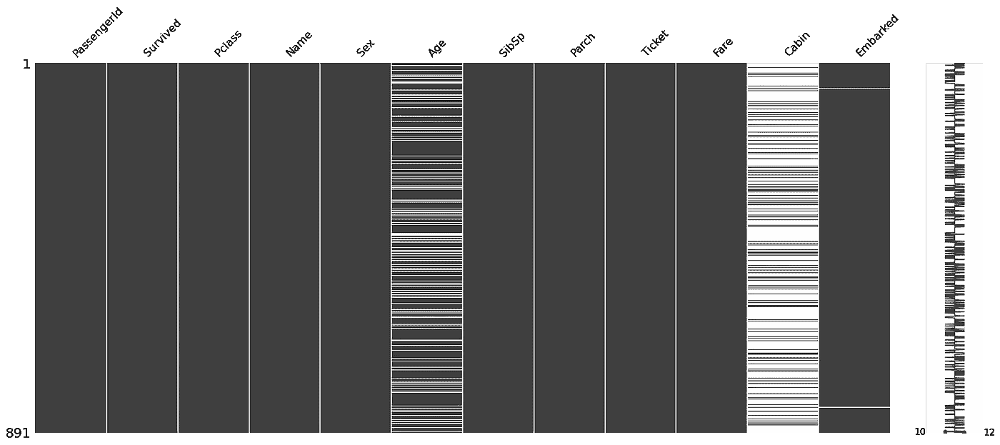

# 机器学习中的 7 大特征选择技术

> 原文：<https://towardsdatascience.com/top-7-feature-selection-techniques-in-machine-learning-94e08730cd09?source=collection_archive---------12----------------------->

## 选择最佳功能的流行策略


图片由 [Pixabay](https://pixabay.com/?utm_source=link-attribution&amp;utm_medium=referral&amp;utm_campaign=image&amp;utm_content=3679741) 的[穆罕默德·哈桑](https://pixabay.com/users/mohamed_hassan-5229782/?utm_source=link-attribution&amp;utm_medium=referral&amp;utm_campaign=image&amp;utm_content=3679741)拍摄，使用 [Pixlr](https://pixlr.com/x/) 编辑

数据科学中的标准原则是，更多的训练数据会产生更好的机器学习模型。对于实例的数量来说是这样，但对于特征的数量来说不是这样。真实世界的数据集包含大量冗余要素，这可能会影响模型的性能。

数据科学家需要在他/她为建模选择的特征方面有所选择。数据集包含许多要素，有些有用，有些没用。选择所有可能的特征组合，然后继续选择最佳特征集，是一种多项式解决方案，需要多项式时间复杂度。在本文中，我们将讨论 7 种选择最佳特征来训练健壮的机器学习模型的方法。

# 1.领域知识:

数据科学家或分析师应该拥有关于问题陈述的领域知识，以及任何数据科学案例研究的功能集。拥有关于特性的领域知识或直觉将有助于数据科学家进行特性工程并选择最佳特性。

例如，对于一个汽车价格预测问题，一些特征如制造年份、奇特的牌照号码是决定汽车价格的关键因素。

# 2.缺少值:



(图片由作者提供)，缺失值的可视化:白线表示缺失值的存在

由于数据损坏或记录失败，现实世界的数据集通常包含缺失值。有各种技术可以估算缺失值，但是估算缺失值可能与真实数据不匹配。因此，在具有大量缺失值的特征上训练的模型可能不是非常重要。

想法是丢弃缺失值大于确定阈值的列或要素。上面的图片是为[泰坦尼克号数据](https://www.kaggle.com/c/titanic)生成的，显示“cabin”有很多缺失值，可以删除。

# 3.与目标类标签的相关性:


(图片由作者提供)，相关矩阵的热图

目标分类标注和要素之间的相关性决定了每个要素相对于目标分类标注的相关程度。有各种相关技术，例如 Pearson、Spearman、Kendall 等来寻找两个特征之间的相关性。

`**df.corr()**`返回与人物特征之间的相关系数。从上面的[泰坦尼克号数据](https://www.kaggle.com/c/titanic)的关联热图来看，`**‘sex’**`、`**‘Pclass’**`、`**‘fare’**`等特征与目标类别标签`**‘Survived’**`的关联度高，因此是重要特征。而诸如`**‘PassengerId’**`、`**‘SibSp’**`的特征与目标类标签不相关，并且可能不作为建模的重要特征。因此，这些功能可以删除。

# 4.特征之间的相关性:

要素之间的相关性会导致共线性，这可能会影响模型的性能。如果一个特征与其他特征具有高相关系数，则称它们相关，因此一个特征的变化也会导致其他相关特征的变化。

从上述[泰坦尼克号数据](https://www.kaggle.com/c/titanic)的相关热图来看，“Pclass”和“Fare”之间的皮尔逊相关系数，因此一个变量的变化会对另一个变量产生负面影响。

> 阅读下面提到的文章，深入了解皮尔逊和斯皮尔曼相关系数。

</pearson-and-spearman-rank-correlation-coefficient-explained-60811e61185a>  

# 5.主成分分析(PCA):

PCA 是一种降维技术，用于从数据集中提取特征。PCA 通过使用矩阵分解将数据集的维度降低到较低的维度。它将数据集完全投影到一个较低的维度，保持方差。

当数据集的维数很高时，主成分分析可以用来减少特征，而分析去除冗余特征是一项繁琐的任务。PCA 可以将具有许多特征的数据集缩减为具有期望数量的特征的数据集，当然会损失一些方差。


(图片由作者提供)，解释的方差百分比与维度数量的关系图

> 上面的 PCA 图是在来自 UCI 机器学习库的[电离层数据集的数据集上训练的。](https://archive.ics.uci.edu/ml/datasets/Ionosphere)

```
***Total number of dimensions:*** **34**Observation from the above plot,
**90%** ***of variance is preserved for* 15 *dimensions.***
**80%** ***of variance is preserved for* 9 *dimensions.***
```

因此，将维度减少到 15，保留 90%的方差，并选择最佳特征。

> 阅读下面提到的文章，深入了解 PCA 算法:

</dimensionality-reduction-can-pca-improve-the-performance-of-a-classification-model-d4e34194c544>  

# 6.正向功能选择:


([来源](https://www.analyticsvidhya.com/wp-content/uploads/2016/11/Embedded_1.png)

前向或后向特征选择技术用于为机器学习模型寻找最佳性能特征的子集。对于给定的数据集，如果有 n 个特征，则基于先前结果的推断来选择特征。正向特征选择技术如下:

1.  使用 n 个特征中的每一个来训练模型，并评估性能。
2.  最终确定具有最佳性能的特征或特征集。
3.  重复步骤 1 和 2，直到获得所需数量的特征。

前向特征选择是一种包装器技术，用于选择特征的最佳子集。向后特征选择技术正好与向前特征选择相反，在向前特征选择中，最初选择所有特征，并且在每个步骤中移除最冗余的特征。

# 7.功能重要性:


([来源](https://s3.amazonaws.com/kukuruku-co/uploads/images/00/00/01/2014/08/21/58bc790dd7.png))

特征重要性是模型认为重要的特征的列表。它给出了每个特征的重要性分数，描述了该特征对于预测的重要性。特征重要性是许多机器学习模型的 Scikit-Learn 实现中的内置功能。

这些特征重要性分数可用于识别特征的最佳子集，然后继续用该特征子集训练健壮的模型。

# 结论:

特征选择是模型开发流程中的一个重要元素，因为它删除了可能影响模型性能的冗余特征。在本文中，我们讨论了从数据集中选择最佳特征子集的 7 种技术或技巧。人们可以在您的数据科学模型中使用这些方法来选择最佳的特征子集，并训练一个健壮的模型。

除了上面提到的，还有各种其他方法来移除冗余特征，例如，移除具有低方差的特征，卡方检验。

# 参考资料:

[1] [使用主成分分析法进行降维](/dimensionality-reduction-can-pca-improve-the-performance-of-a-classification-model-d4e34194c544)(2020 年 8 月 20 日)

[2]特征重要性与树的森林:[https://sci kit-learn . org/stable/auto _ examples/ensemble/plot _ forest _ importances . html](https://scikit-learn.org/stable/auto_examples/ensemble/plot_forest_importances.html)

> 感谢您的阅读