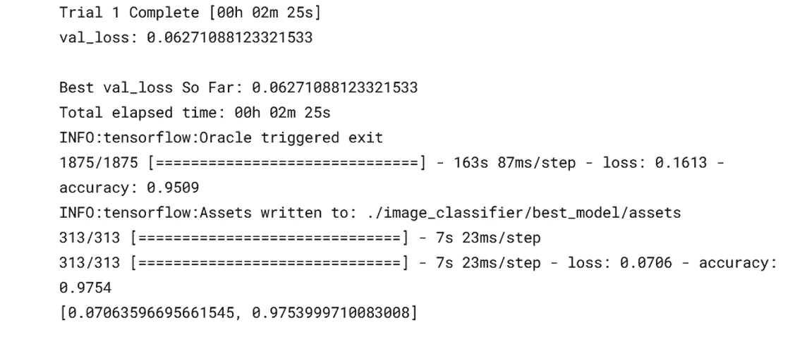
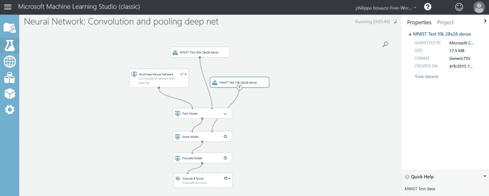
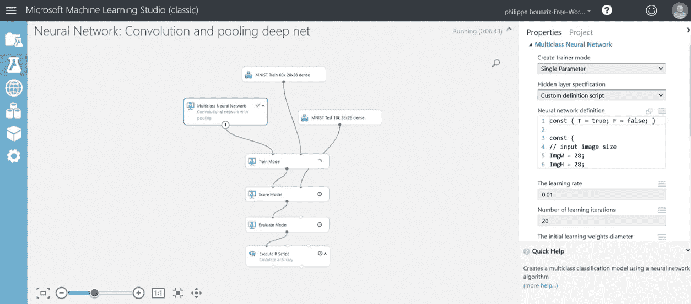
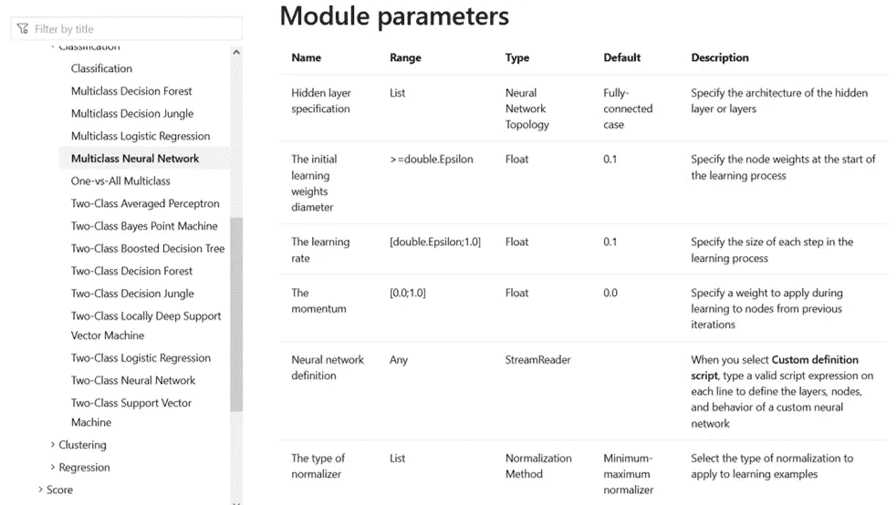
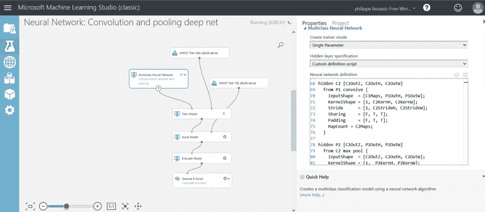
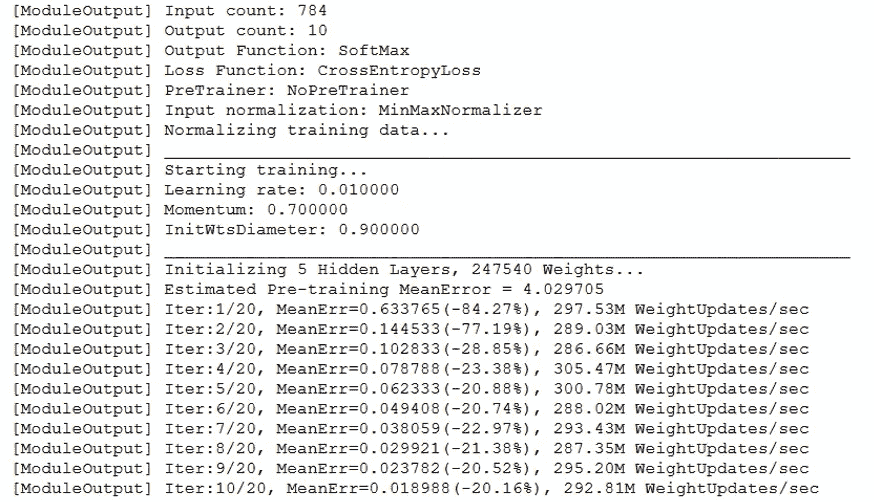
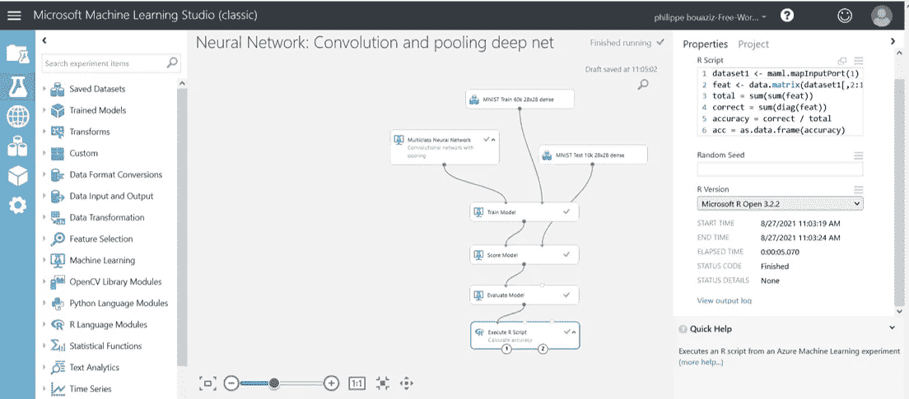
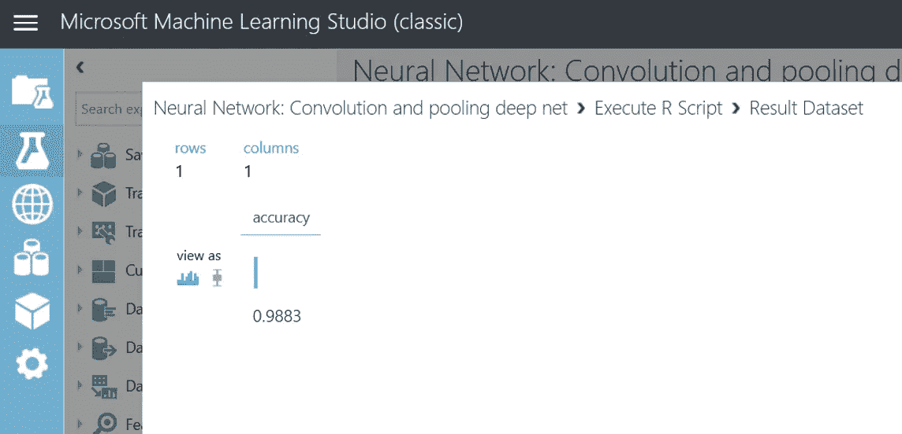

# 顶级 AutoML 开源工具，实现深度学习应用的自动化

> 原文：<https://towardsdatascience.com/top-automl-open-source-tools-to-automate-your-deep-learning-applications-7e66ef5df96c?source=collection_archive---------29----------------------->

## 这两个计算机视觉工具会让你大吃一惊


照片由[Philippe _ yeonathan bouaziz](https://unsplash.com/@philboaz?utm_source=unsplash&utm_medium=referral&utm_content=creditCopyText)在 [Unsplash](https://unsplash.com/@philboaz?utm_source=unsplash&utm_medium=referral&utm_content=creditCopyText) 上拍摄

*文章合著者* ***s*** *作者:* @bonnefoypy 和@ emeric . chaize Olexya 的 CEO 们。

在任何数据科学项目中，构建最佳模型都是探索性数据分析和特征选择之后的关键步骤。在深度学习中，这个过程包括一层一层地构建适合数据的复杂神经网络(感知器、香草、卷积、递归)。

在大多数情况下，数据需要从图像、声音、视频、文本和数字处理成矩阵格式。用几行代码找到获得最佳模型和预测的创新方法是一个巨大的优势，特别是在对计算机视觉应用的图像进行分类时。图像数据集深度学习的自动化模型选择方法一般有 **Autokeras** 和 **Azure studio** 。

要成为独角兽数据科学家，掌握最新的自动化神经网络方法是一项必备技能。在本文中，我们将回顾两个最佳 Kaggle 获奖者的自动神经网络选择工具，它们可以以一种简单快速的方式实现。

1.  **Autokeras**

AutoKeras 是一个基于 Keras 的 AutoML 系统，由德州农工大学的数据实验室开发。这个框架可以建立一个具有复杂元素(嵌入、特征增强等)的模型..)自动预处理数据(文本、图像、数字、分类数据)并找到最佳神经架构(层数、辍学层百分比、优化器等)。

让我们尝试使用 MNIST 数据集，它由 60k 个从 0 到 9 的手写数字组成。

第一步是导入库:

```
***# Import libraries***!pip install autokerasimport numpy as npimport TensorFlow as tffrom tensorflow.keras.datasets import mnistimport autokeras as ak
```

第二步是加载数据:

```
***# Load the data*** (x_train, y_train), (x_test, y_test) = mnist.load_data()print(x_train.shape)  *# (60000, 28, 28)*print(y_train.shape)  *# (60000,)*print(y_train[:3])  *# array([7, 2, 1], dtype=uint8)*
```

**输出**

从[https://storage . Google APIs . com/tensor flow/TF-keras-datasets/mnist . npz](https://jovian.ai/outlink?url=https%3A%2F%2Fstorage.googleapis.com%2Ftensorflow%2Ftf-keras-datasets%2Fmnist.npz)11493376/11490434[= = = = = = = = = = = = = = = = = = = = = = = = = = = = = = = = = = =-0s 0us/step(60000，28，28) (60000，)

第三步是初始化图像分类器，max_trials 参数指示所用模型的流水线数量，对于更复杂的数据集，max_trials 参数需要等于 1。

```
***# Initialize the image classifier***clf = ak.ImageClassifier(overwrite=True, max_trials=1)***# Input the training data***clf.fit(x_train, y_train, epochs=10)***# Make prediction with the best model on the test dataset***predicted_y = clf.predict(x_test)print(predicted_y)***# Evaluate the model on the test dataset***print(clf.evaluate(x_test, y_test))
```

AutoKeras 提供了一种简单的方法来使用卷积神经网络的元素，如卷积层、最大池和扁平化。而不需要定义神经网络的内部结构。让我们进行验证步骤:

```
***# With 85% training dataset and 15% validation dataset*** clf.fit(x_train, y_train,validation_split=0.15,epochs=10)
```

一些高级配置可以使用 automodel 的 ImageBlock 参数进行配置。该选项提供了块类型选项(resnet，vp16，..)、归一化和数据扩充参数。

```
***# Initialize AutoKeras input and output nodes***input_node = ak.ImageInput()output_node = ak.ImageBlock()***# Your neural network options, here we try Resnet***block_type="resnet",***# You can Normalize the dataset***normalize=True,***# You can add data augmentation***augment=False)(input_node)***# Build your output layer with the numbers of classes (in this example, 10 numbers 0-9)***output_node = ak.ClassificationHead()(output_node)***# Compile the input and output layers*** clf = ak.AutoModel(inputs=input_node, outputs=output_node, overwrite=True, max_trials=1)***# Train the model on the training dataset***clf.fit(x_train, y_train, epochs=10)
```

**输出**


您还可以将 tf.dataset 与 TPU 结合使用，以更快地获得结果:

```
***# Build your tensors from the train and test datasets*** train_set = tf.data.Dataset.from_tensor_slices(((x_train,), (y_train,)))test_set = tf.data.Dataset.from_tensor_slices(((x_test,), (y_test,)))***# Create your autokeras image classifier*** clf = ak.ImageClassifier(overwrite=True, max_trials=1)***# Train the model on the training dataset***clf.fit(train_set, epochs=1)***# Predict with the model with the test dataset***predicted_y = clf.predict(test_set)***# Evaluate the model with the test dataset*** print(clf.evaluate(test_set))
```



在测试数据集上的分类准确率为 97.5%。

**2。蔚蓝工作室**

微软的这款免费工具(无需注册信用卡)可以是一种模块化方法，使用带有完整数据导入选项的个性化数据工程管道，以简单快捷的方式自动创建功能。让我们来看同一个例子，MNIST 数据集由 0-9 的手写数字组成。

第一步是上传和创建 Mnsit 训练和测试数据集模块:



Azure 机器学习工作室的计算机视觉工作流(图片由作者提供)

第二步是选择多类神经网络:



带有 Azure 机器学习工作室的多类神经网络(图片由作者提供)

使用每个参数的指定范围，可以很容易地完全调整该神经网络:



Azure 机器学习工作室的神经网络最佳参数(图片由作者提供)

更多关于 Azure 神经网络的细节，参数[点击这里](https://docs.microsoft.com/en-us/azure/machine-learning/studio-module-reference/multiclass-neural-network)。神经网络模块可以与您自己定制 Python 或 R 脚本一起使用:



使用 Azure Machine Learning studio 编写自己的脚本的计算机视觉(图片由作者提供)

下一步，用从训练数据集自动分离的训练和验证数据集来训练神经网络:



使用 Azure Machine Learning studio 自动训练定制神经网络(图片由作者提供)

最后，使用分类准确性对模型进行评分，并使用测试数据集进行评估，如下所示:



使用 Azure 机器学习工作室选择正确的评分方法(R-script )(图片由作者提供)

在测试数据集上的分类准确率为 98.8%。



测试数据集上的分类准确性(图片由作者提供)

关于 Azure studio(经典版)深度学习能力的更多细节[点击这里](https://docs.microsoft.com/en-us/azure/machine-learning/studio-module-reference/multiclass-neural-network)。

这一简要概述提醒了使用 autoML 工具为图像分类选择正确的神经网络架构的重要性。这篇文章涵盖了快速简单的图像分类工具，并分享了有用的文档。

**总结**

请参考此链接，查看完整的 8 个 autoML 工具，并一步一步查看 python 代码:

[](https://www.datasciencemusthaveskills.com/home) [## datasciencemustawskills-Home

### 让最好的机器学习模型为生产做好准备的最佳技巧和诀窍。

www.datasciencemusthaveskills.com](https://www.datasciencemusthaveskills.com/home) 

**希望你喜欢，继续探索！**


照片由[Philippe _ yeonathan bouaziz](https://unsplash.com/@philboaz?utm_source=unsplash&utm_medium=referral&utm_content=creditCopyText)在 [Unsplash](https://unsplash.com/@philboaz?utm_source=unsplash&utm_medium=referral&utm_content=creditCopyText) 拍摄