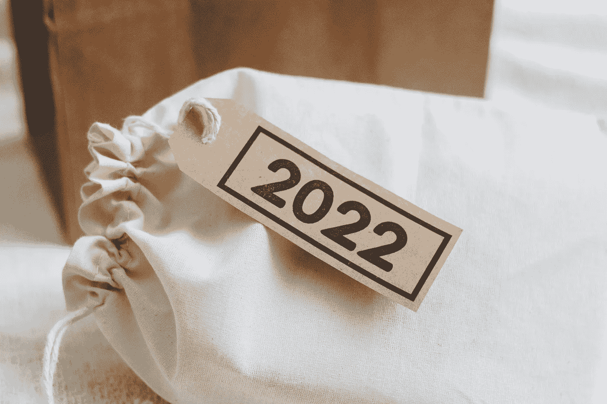
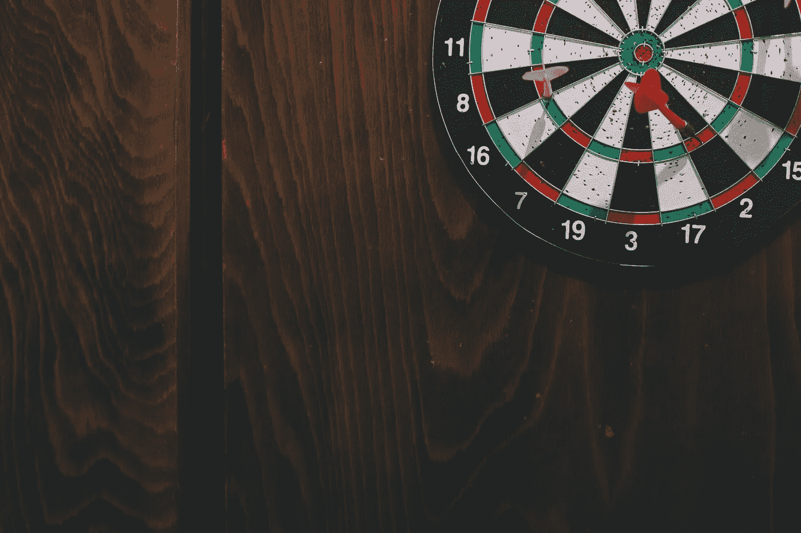

# 我在 2021 年了解到的顶级数据科学误解

> 原文：<https://towardsdatascience.com/top-data-science-misconceptions-i-learned-in-2021-e4529f07f368?source=collection_archive---------31----------------------->

## 意见

## …可以在 2022 年为您提供帮助



伊莎贝尔·克朗恩伯格在[Unsplash](https://unsplash.com/s/photos/2022?utm_source=unsplash&utm_medium=referral&utm_content=creditCopyText)【1】上的照片。

# 目录

1.  介绍
2.  AB 测试只是关于重要性
3.  只关注模型误差和准确性
4.  您不会使用 SQL
5.  摘要
6.  参考

# 介绍

数据科学家对公司和角色本身都有很多期望。有些我们期望的事情会变成对职位本身的误解，这会导致压力和困惑。在这篇文章中，我们将看看我亲身经历过的你可能也会经历的五个错误观念，以及你应该期待什么；面向从初级到高级的任何数据科学家。话虽如此，让我们更深入地探究 2021 年的五个错误观念，你可以在 2022 年的数据科学职业生涯中借鉴它们。

# AB 测试只是关于重要性


由[马库斯·温克勒](https://unsplash.com/@markuswinkler?utm_source=unsplash&utm_medium=referral&utm_content=creditCopyText)在[Unsplash](https://unsplash.com/photos/8-X2_qeTdlQ?utm_source=unsplash&utm_medium=referral&utm_content=creditCopyText)【2】上拍摄。

数据科学家可能会沉迷于统计数据而忽略了公司的目标。AB 测试是数据科学家可能使用的领域之一。虽然理解和执行适当的统计数据通常是工作的一部分，也是意料之中的，但是，例如，过于关注 p 值本身可能会使您偏离总体目标。

> **不要做的事情:**

*   当将测试组与对照组进行比较时，仅查看显著性/p 值

> **怎么办:**

*   当将一个测试组与一个控制组进行比较时，要注意 p 值、样本量和测试的持续时间。这可能是你达到显著性(*或不达到*)的情况，但随着时间的推移，它不会保持稳定。

当您评估的不仅仅是 p 值时，您可以确保您的测试得到了充分的处理，并且经得起时间的考验。除了测试特性之外，您还需要关注度量标准是否对测试有意义。例如，如果您正在整合一个新产品，您会希望查看可以显示业务成功增加的指标，例如:

*   收入
*   保留
*   约会

您还需要确保不会因数据科学模型的产品变更而损害业务或给业务带来负面影响。

# 只关注模型误差和准确性



尼古拉斯·霍恩在 [Unsplash](https://unsplash.com/s/photos/darts?utm_source=unsplash&utm_medium=referral&utm_content=creditCopyText) 上拍摄的照片。

与上述观点类似，这种误解总结为，仅仅因为您有一个准确的模型，并不意味着您有一个有用的模型。

> **不该做的事情:**

*   A.该模型对好用户和坏用户的分类准确率为 94%

(*识别用户是好是坏最不可能有用，因为你不能从中执行可操作的过程，并且它没有被很好地定义*

*   B.该模型对于公共汽车到达时间具有 4 分钟的平均误差

(*MAE 可能较低，但如果它倾向于向一个方向摇摆，那么对于不想在公交车站站更久而希望早点到达车站的顾客来说，它就没那么有用了*

> **怎么办:**

*   A.该模型对购买更多产品的客户与不购买产品或很少购买产品的客户进行分类的准确率为 94%

(*通过这种方式，您可以识别花钱多的人的特征，并可以看到这些特征是否可以应用于花钱不多的用户，例如，如果人们倾向于点击 iPhone 通知而不是 Android 通知，那么用户界面体验可能会有所不同，这需要加以解决*

*   B.该模型具有 4 分钟的 MAE，但是现在该度量被优化为更多的值位于更早的一侧而不是更晚的一侧

(*通过这种方式，模型总体上是一样准确的，但是它对真实世界中的用例有更多的帮助*)

如您所见，除了准确性或误差之外，您还需要确定指标的方向，以及您所预测的是否可用于改进。

# 您不会使用 SQL


卡斯帕·卡米尔·鲁宾在[Unsplash](https://unsplash.com/s/photos/database?utm_source=unsplash&utm_medium=referral&utm_content=creditCopyText)【4】上的照片。

因为数据科学方面的教育项目更多地关注数据科学本身以及机器学习，所以 SQL 经常会被忽略或根本不教。为了成为一名更全面的数据科学家，您需要学习 SQL，这样您就不必在职业生涯中当场学习。

> 什么不该做:

*   预计所有的 SQL 都将为您完成，或者您用于模型的数据已经创建

(*您很可能需要使用 SQL 查询您的公司数据库，以获取您的培训数据*

> **怎么办:**

*   在学习数据科学的同时理解 SQL，并学习不止一门课程

(*你可能还想学习 SQL 来查询你的模型结果，因为通常情况下，你的预测存储在一个可查询的表中*

对于数据科学，有些工作不需要执行 SQL，但通常情况下，你会这样做，当你试图学习机器学习算法时，这并不是重点。随着时间的推移学习它，这样你就不必急于求成，尤其是在你的第一个数据科学职位上。

# 摘要

如您所见，对数据科学职业有一些误解。这一年，我在角色本身中学到了这些，而不是在进入角色之前学习。当然，还有很多，但是我希望这篇文章已经给了一些人机会来修正或改进您对数据科学的误解。

> 总而言之，以下是一些常见的数据科学误解，您也可以从中学习:

```
* AB Testing is Only About Significance* Only Looking at Model Error & Accuracy* You Won’t Use SQL
```

我希望你觉得我的文章既有趣又有用。如果您同意或不同意这些误解，请随时在下面发表评论。为什么或为什么不？你认为我们还可以包括哪些更重要的误解？这些当然可以进一步澄清，但我希望我能够阐明一些我个人经历过的更独特的误解。感谢您的阅读！

***我与这些公司都没有关系。***

*请随时查看我的个人资料、* [Matt Przybyla](https://medium.com/u/abe5272eafd9?source=post_page-----e4529f07f368--------------------------------) 、*和其他文章，并通过以下链接订阅接收我的博客的电子邮件通知，或通过点击屏幕顶部的订阅图标* *的* ***，如果您有任何问题或意见，请在 LinkedIn 上联系我。***

**订阅链接:**[https://datascience2.medium.com/subscribe](https://datascience2.medium.com/subscribe)

**引荐链接:**[https://datascience2.medium.com/membership](https://datascience2.medium.com/membership)

(*如果你在 Medium* 上注册会员，我会收到一笔佣金)

# 参考

[1]Isabela Kronemberger 在 [Unsplash](https://unsplash.com/s/photos/2022?utm_source=unsplash&utm_medium=referral&utm_content=creditCopyText) 上拍摄的照片，(2021)

[2]照片由[马库斯·温克勒](https://unsplash.com/@markuswinkler?utm_source=unsplash&utm_medium=referral&utm_content=creditCopyText)在[Unsplash](https://unsplash.com/photos/8-X2_qeTdlQ?utm_source=unsplash&utm_medium=referral&utm_content=creditCopyText)(2020)拍摄

[3]尼古拉斯·霍恩在 [Unsplash](https://unsplash.com/s/photos/darts?utm_source=unsplash&utm_medium=referral&utm_content=creditCopyText) 上拍摄的照片，(2021)

[4]照片由 [Caspar Camille Rubin](https://unsplash.com/@casparrubin?utm_source=unsplash&utm_medium=referral&utm_content=creditCopyText) 在 [Unsplash](https://unsplash.com/s/photos/database?utm_source=unsplash&utm_medium=referral&utm_content=creditCopyText) 上拍摄，(2017)