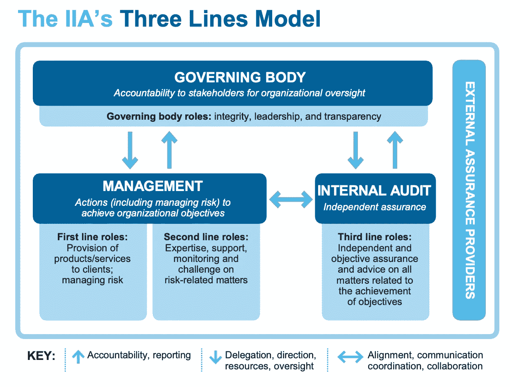
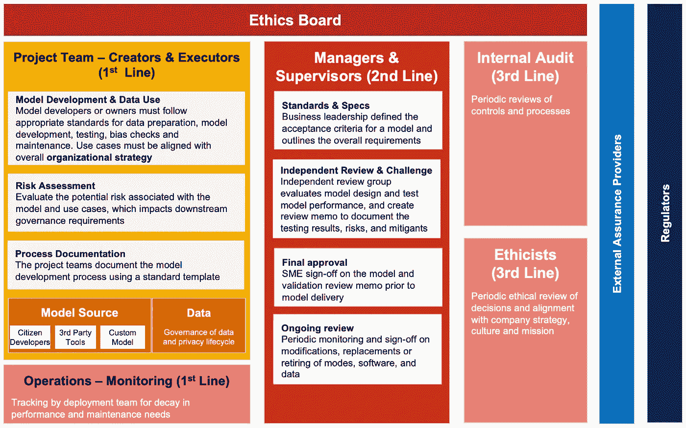
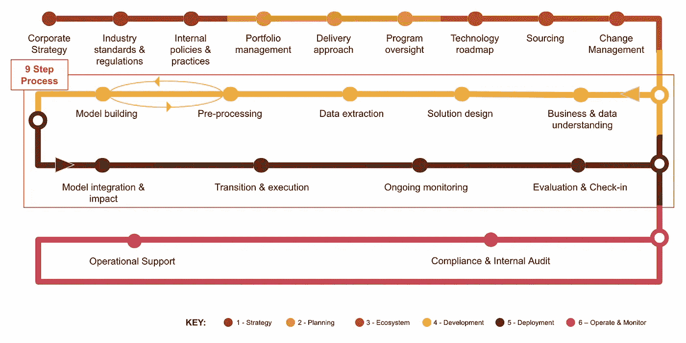

# 负责任地使用人工智能的自上而下和端到端治理

> 原文：<https://towardsdatascience.com/top-down-and-end-to-end-governance-for-the-responsible-use-of-ai-c67f360c64ba?source=collection_archive---------30----------------------->

## [走向负责任的人工智能(第三部分)](https://towardsdatascience.com/tagged/responsible-ai)

## 人工智能治理的三道防线

来源:照片由[安东·波利多维茨](https://unsplash.com/@wrecker2281337?utm_source=unsplash&utm_medium=referral&utm_content=creditCopyText)在 [Unsplash](https://unsplash.com/s/photos/cannons?utm_source=unsplash&utm_medium=referral&utm_content=creditCopyText) 上拍摄

负责任的人工智能是一个广泛的话题，涵盖了被称为人工智能的社会技术系统的多个维度。我们在这里将人工智能称为一个社会技术系统，因为它捕捉了人类之间的交互以及我们如何与人工智能交互。在本系列的第一部分中，我们从五个方面来看人工智能的风险。在本系列的第二部分，我们来看看企业负责任人工智能的十大原则。

在这篇文章中，我们深入探讨了人工智能治理——我们所说的治理到底是什么意思？人工智能治理需要什么？治理过程是什么，公司应该如何着手建立他们的人工智能治理？

# **什么是治理？**

治理的字典定义是*“治理或监督某物(如一个国家或组织)的控制和方向的行为或过程”。*治理不同于管理。管理层制定决策，而治理监督这些决策是如何制定的。

将相同的定义应用于人工智能治理，我们得出了以下公司人工智能治理的定义

***人工智能治理是监督负责任的人工智能应用及其对所有相关利益主体(如个人、社会团体、国家)的影响的过程。***

组织内的数据、分析和人工智能小组通常遵循人工智能模型开发流程，该流程从决定构建(或至少试验)人工智能开始，然后是设计、构建、部署和监控人工智能模型。这是 AI 组的核心管理功能。人工智能治理是关于*谁*监督核心人工智能功能，*他们监督什么*决策或行动，以及*监督如何工作？*

在决定某件事情是否属于人工智能治理的预览范围或者是关键管理功能时，考虑以下问题是有用的:

1.  它大吗？ —人工智能的社会或客户影响越大，人工智能监管就越自然。这里的规模可能由它产生的总收入或利润、它节省的成本或它影响的客户或员工数量决定。
2.  **是战略性的吗？** —决策越具有战略性，例如，要采用的人工智能原则、行为准则、道德政策或领先的人工智能实践，人工智能治理小组参与其中就越好。
3.  **红旗在飘扬吗？** —人工智能应用的风险越大(参见人工智能风险，了解其中一些风险的分类)，它就越与人工智能治理相关。一些关键的“红旗”人工智能应用包括面部识别、招聘人工智能、基于人工智能的决策和建议中的偏见。
4.  我是看门狗吗？ —如果人工智能受到任何现有法规或独立自治专业团体的监管，对主要开发和批准流程进行监督会更好。
5.  **是小说吗？** —如果没有先例可循，那么可能会有没有考虑到的额外风险。

这些关键治理问题改编自[董事会的六个关键问题](https://wyoextension.org/parkcounty/wp-content/uploads/2015/12/Difference-between-Governance-Management.pdf)，并针对人工智能治理进行了修改。

# **三线模式**

治理和风险管理在企业界并不新鲜。有广为接受的标准、指导方针和法规来确保公司的顺利运作。三道防线模型由欧洲风险管理协会联合会(FERMA)和欧洲内部审计协会联合会(ECIIA)于 2008-2010 年开发，作为第 8 号欧盟公司法指令第 41 条的[指南。这是内部审计师协会(IIA)在 2013 年采用的，他们的立场文件是关于](https://www.iia.nl/SiteFiles/ECIIA%20FERMA.pdf)[有效风险管理和控制的三道防线](https://na.theiia.org/standards-guidance/Public%20Documents/PP%20The%20Three%20Lines%20of%20Defense%20in%20Effective%20Risk%20Management%20and%20Control.pdf)。从那时起，它们已经成为评估和管理风险以及执行治理的标准方法。

2020 年 6 月，IIA 更新了指南，发布了关于 IIA 三线模式的立场文件。该文档描述了治理的六个关键原则、三线模式中的关键角色、角色之间的关系以及如何应用三线模式。它明确阐述了管理层、内部审计职能部门和理事机构的责任(见下图)。

图 1:三线模式(来源:[IIA 三线模式](https://global.theiia.org/about/about-internal-auditing/Public%20Documents/Three-Lines-Model-Updated.pdf))

三线模型已在许多组织中广泛使用，并已应用于各种风险，包括金融服务组织中的技术风险和模型风险。银行中的信用风险、市场风险和操作风险模型通常基于这三道防线进行管理。我们没有发明一个全新的治理结构、流程、角色和职责，而是将这个模型应用于人工智能治理。

*   **第一道防线——创建者、执行者和操作者:**那些指定、设计、构建、部署和操作数据、AI/ML 模型、自动化和软件的人；第一线还包括参与操作和监控数据、软件和模型的操作团队。
*   **第二道防线——经理、主管和质量保证:**评估数据、AI/ML 模型、自动化和软件风险的人，以及负责制定战略的人。第二道防线也对正在进行的监控进行审查。此外，第二条线还负责检查第一条线是否按照预期的实践建立了他们的系统。
*   **第三道防线——审计员和伦理学家:**监督其他两道防线的人员，以确保遵守法律、政策和组织的战略，以及合乎道德和负责任地使用技术。
*   **道德委员会:**道德委员会是一个由组织内的高管和员工组成的多元化、包容性团体。一些组织也可能选择任命外部成员进入董事会。

除了组织内的这些角色之外，公司还将与外部审计师、认证机构或其他保证提供者以及监管机构进行互动。下图概述了不同角色的详细信息以及每个角色的主要职责。

图 2:人工智能治理的三条线模型(来源:普华永道分析)

# **端到端治理**

除了“三线模式”规定的自上而下的治理，我们还需要从摇篮到坟墓或从模型和人工智能嵌入式系统的开始到退休的端到端治理。治理的起点不是开始构建模型的时间，而是在生命周期中更早的时候。

它应该真正从**战略**开始——公司整体的企业或业务战略，特别是负责数据、自动化、分析和人工智能战略的团队(见我关于这个[无敌四重奏](https://medium.com/the-innovation/data-automation-analytics-ai-the-unbeatable-quartet-509536b2f097)的文章)。每家公司，尤其是每家消费或生成数据和见解的公司，都应该有一个关于道德的政策，以及适应、采用和实践道德行为的内部政策和程序。这一阶段不可或缺的组成部分还包括了解任何法规以及行业机构或专业协会的最佳实践或指南。例如，数据科学协会的[数据科学专业行为准则](https://www.datascienceassn.org/code-of-conduct.html)和[牛津-慕尼黑专业数据科学行为准则](http://www.code-of-ethics.org/)是数据科学家行为准则的良好起点。同样值得关注的是 IEEE 正在开发的标准，尤其是[IEEE 自主智能系统伦理全球倡议](https://standards.ieee.org/industry-connections/ec/autonomous-systems.html#:~:text=The%20IEEE%20Global%20Initiative's%20mission,for%20the%20benefit%20of%20humanity.%E2%80%9D)。

下一阶段是**策划**。数据、自动化、分析和人工智能这四者应该是规划阶段的一部分。正如我们在别处讨论过的，软件和人工智能模型需要区别对待(见我关于[的文章，数据科学家来自火星，软件开发人员来自金星](/data-scientists-are-from-mars-and-software-developers-are-from-venus-part-1-8dde19fb2eef))。人工智能模型的实验性质需要投资组合方法。在任何时间点，在采用和推广人工智能方面成熟的组织都有一系列处于不同发展阶段的模型——概念、实验、部署、生产或退役。ROI 需要根据整个投资组合来衡量，并且依赖于为业务用例、效率与有效性计划等的正确组合而调整的整体策略。(有关这方面的更多详细信息，请参见关于[十种人类能力和四种智能以开发以人为中心的人工智能](https://medium.com/the-innovation/ten-human-abilities-and-four-intelligences-to-exploit-human-centered-ai-b48c5ea1c8be)的文章)。数据、软件和人工智能模型的融合需要仔细关注交付方法。瀑布和敏捷软件开发方法需要修改和交错，以交付 AI 嵌入式软件或软件 2.0(参见文章[结合敏捷编程和敏捷数据科学的时间](/time-to-combine-agile-programming-and-agile-data-science-26df7532b0e9))。具体的交付方法将决定应该报告和监控的关键指标，以便进行监督。

端到端治理的下一个阶段是整体的**生态系统**。这里我们指的是人工智能模型将被嵌入的生态系统，以及它将被公司内外的其他人使用的环境。公司正在发布的人工智能的更广泛的社会影响应该在这里进行评估。IEEE 的[幸福指标](https://standards.ieee.org/content/dam/ieee-standards/standards/web/documents/other/ead_well_being_v2.pdf)在这里是一个强有力的竞争者。生态系统还必须涵盖人工智能嵌入式软件的使用环境。例如，系统是否具有自动、辅助、增强或自主智能将决定所需的治理和升级级别。对将使用人工智能系统的人的变更管理是成功采用和持续改进人-人工智能结合生态系统的关键因素。最后，鉴于开源和基于厂商的人工智能工具和技术的可用性，很好地理解采购人工智能模型的最低采购标准是绝对必要的。虽然目标是公共部门组织，但世界经济论坛与英国人工智能办公室共同开发的[人工智能采购系统](http://www3.weforum.org/docs/WEF_AI_Procurement_in_a_Box_Project_Overview_2020.pdf)是一个很好的起点。

接下来，我们进入核心模型**开发**和**部署**阶段。此时，治理的焦点从更广泛的涉众转移到开发团队。这个团队不仅包括数据科学家、数据工程师、技术人员、产品经理、运营团队——技术团队，还包括业务领域专家和伦理学家。治理监督涉及价值范围(包括业务和数据理解、解决方案设计)、价值发现(包括数据提取、预处理和模型构建)、价值交付(模型部署、转换和执行)以及最终价值管理(包括持续的监控和评估&检入)的阶段(参见我的文章[模型生命周期:从想法到价值](/model-lifecycle-from-ideas-to-value-14e654b7d4a4)以获得关于底层 9 步过程的更多细节)。

端到端治理流程的最后一个阶段是**操作和监控**阶段。这里的治理分为两个层次。一个层面是特定模型的治理，以及数据、决策、使用、算法和人工智能模型使用的环境在多大程度上发生了变化。另一个是在投资组合层面——监控人工智能模型或人工智能嵌入式软件提供的价值，并淘汰模型或启动新的模型，这可以追溯到模型开发的价值范围阶段，甚至可以追溯到公司的整体战略。除了这种运营和战略支持，还需要定期进行合规性和内部审计评估。正如我们在上一节中所讨论的，这些属于第二道防线和第三道防线。

图 3:负责任的人工智能的端到端治理(来源:普华永道分析)

# **结论**

我们在本文中描述的是管理和减轻关键人工智能风险所需的自上而下和端到端的治理，这些风险在本系列的[第 1 部分](/five-views-of-ai-risk-eddb2fcea3c2)中概述，并遵循本系列的[第 2 部分](/ten-principles-of-responsible-ai-for-corporates-dd85ca509da9)中概述的负责任的人工智能的十项原则。在以后的文章中，我们将深入研究九步过程的细节以及端到端治理的不同阶段。我们将检查三条线需要生产的关键工件或交付物，以确保负责任和有益地使用人工智能。

**作者:** [Anand S. Rao](https://www.linkedin.com/in/anandsrao/) 和 [Ilana Golbin](https://www.linkedin.com/in/ilana-golbin-6167373b/)

# 相关内容

1.  [第一部分——人工智能风险的五种观点:理解人工智能的阴暗面](/five-views-of-ai-risk-eddb2fcea3c2)
2.  [第二部分——企业负责任人工智能的十大原则](/ten-principles-of-responsible-ai-for-corporates-dd85ca509da9)