# 表格编辑器 3 中的顶级特性可促进您的 Power BI 开发

> 原文：<https://towardsdatascience.com/top-features-in-tabular-editor-3-to-boost-your-power-bi-development-6140d90d2cac?source=collection_archive---------19----------------------->

## 希望推动您的 Power BI 开发？查看最新版本的表格编辑器如何帮助您成为真正的强力 Bi 英雄

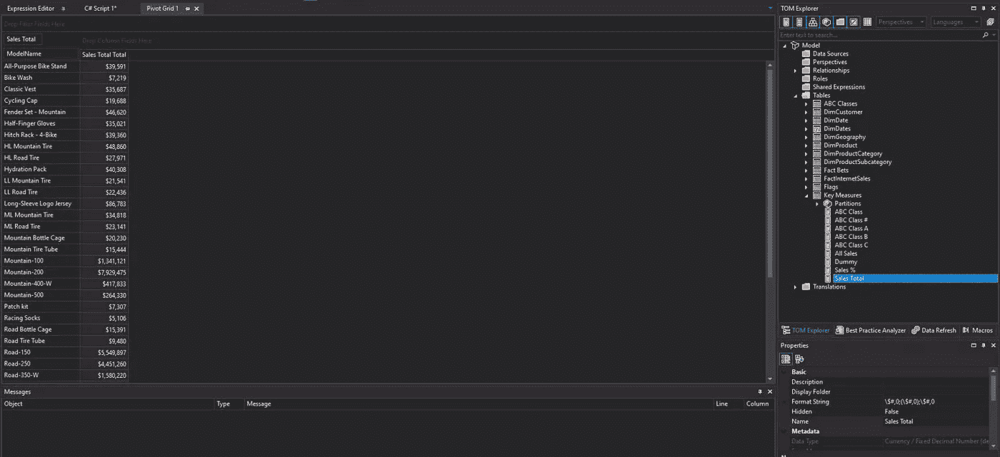

作者图片

从今年开始，微软关于读/写 XMLA 端点的[正式发布的公告，为许多外部工具打开了大门，这些外部工具旨在提供由分析服务引擎支持的、但在 Power BI Desktop 中不支持的额外建模功能。](https://powerbi.microsoft.com/en-us/blog/announcing-the-general-availability-of-read-write-xmla-endpoints-in-power-bi-premium/)

在众多伟大的工具中，由 Daniel Otykier 创建的[表格编辑器](https://tabulareditor.com/)可能是最受欢迎的一个，另外还有 [DAX Studio](https://daxstudio.org/) 。根据定义，TE 是 SSAS 表格模型的轻量级编辑器(因此，它也可以在 Power BI 范围之外使用)，使您能够构建、维护和管理表格模型。直到最近，Tabular Editor 还是完全免费使用的，它仍然可以在这里免费下载。在撰写本文时，最新的版本是 2.16.1，Daniel 承诺将来也会提供对免费版本的支持。

然而，从这个月开始，我们终于得到了许多 Power BI 开发人员最喜欢的工具的新版本——表格编辑器 3！这个版本不再是免费的(你可以在这里找到许可选项)，但是请继续阅读，因为我向你保证，如果你每天都在使用 Power BI，获得 TE 3 的许可将是你最好的投资之一。

## 表格编辑器 Power BI 开发的最佳工具！

我坚决支持上面标题中的声明。在本文的剩余部分，我将分享我在 TE 3 中的 6 大特性，以及为什么我认为如果不使用这个工具，我的 Power BI 开发效率会更低。

特性没有按照重要性排序，我只是列出了它们，没有任何特别的偏好…

## 头号高级脚本

我喜欢强力 BI，真的。但是，有一些默认设置让我很恼火。其中之一是这样一个事实，无论何时你有一个数字列，Power BI 都会自动在它上面应用摘要，这是默认的。现在，当您拥有“真正的”数值列时，这可能会非常方便，但是如果您将 id 作为维度表的外键会怎么样呢？典型的例子是日期维度表:

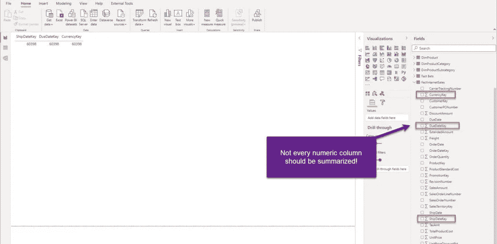

按作者分类的图像:默认情况下，不是每个列都应该聚合

如上图所示，Power BI 自动对列应用聚合(在本例中，它是 Count)，即使这是一种违反直觉的、不可取的显示这些列中数据的方式。

然而，如果我从 TE 3 连接到数据模型，我有两个选择来解决这个挑战:

*   我可以执行以下命令从选定的列中删除默认汇总:

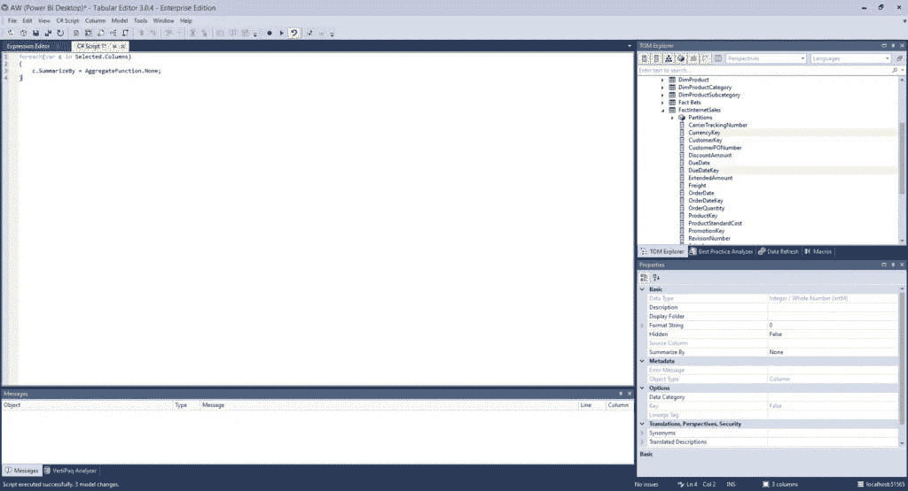

作者图片

```
foreach(var c in Selected.Columns)
{
    c.SummarizeBy = AggregateFunction.None;
}
```

*   我可以执行一个命令来删除数据模型中所有列的默认汇总！

```
foreach(var c in Model.AllColumns)
{
    c.SummarizeBy = AggregateFunction.None;
}
```

## #2 从选定的列创建度量

在之前的一篇文章中，我解释了为什么您应该[总是创建显式的而不是隐式的度量](/understanding-explicit-vs-implicit-measures-in-power-bi-e35b578808ca)。而且，当您处理一个简单的数据模型时，这不是一个问题，不需要创建许多度量。然而，一旦您的模型变得更加复杂，并且您需要构建多个相似但仍然不同的度量，创建显式度量的任务就会变得繁琐。

表格编辑器为您提供了一种自动化该任务的优雅方式，因为您可以在一次运行中选择多个列并创建所需的度量！

```
// Creates a SUM measure for every currently selected column and hide the column.
foreach(var c in Selected.Columns)
{
    var newMeasure = c.Table.AddMeasure(
        "Sum of " + c.Name,                    // Name
        "SUM(" + c.DaxObjectFullName + ")",    // DAX expression
        c.DisplayFolder                        // Display Folder
    );

    // Set the format string on the new measure:
    newMeasure.FormatString = "0.00";

    // Provide some documentation:
    newMeasure.Description = "This measure is the sum of column " + c.DaxObjectFullName;

    // Hide the base column:
    c.IsHidden = true;
}
```

这个脚本将在您选择的所有列上创建基本的 SUM，适当地格式化它们，同时确保最佳实践建议从数据模型中隐藏原始列！

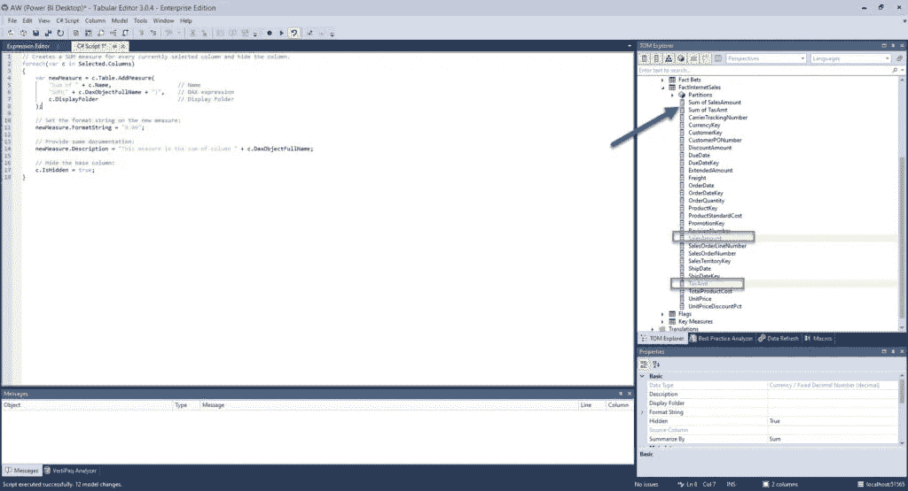

作者图片

在我执行了上面的脚本之后，您会注意到创建了新的度量，而原来的列被隐藏了。

有一堆非常有用的代码片段可以自动完成 Power BI 报告开发中一些最常见的任务，比如创建时间智能计算。你可以在这里找到所有这些片段。

## #3“如果没有格式化，就不是 DAX…”

这是阿尔贝托·法拉利的传奇句子！而且，我敢打赌你已经看过上百次这样的事情了:


作者图片

不要生气，当我们还是 Power BI 新手时，我们都是这样编写我们的度量:)

同样，我将只放一行代码来使我的所有 DAX 公式格式正确:

```
Model.AllMeasures.FormatDax();
```

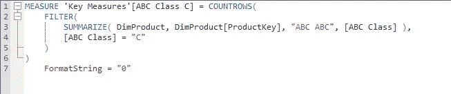

作者图片

这个看起来好多了，对吧？

## #4 DAX 脚本

这个也和达克斯有关。我们都知道 CALCULATE 是如何工作的，以及它接受哪些参数(至少，我希望我们都知道)。但是，当您需要使用一些不经常出现在“菜单”上的 DAX 函数时，会发生什么呢？没错，你可能会忘记正确的语法和/或它的工作方式。

TE 3 凭借其令人敬畏的 DAX 智能感知拯救了我们！

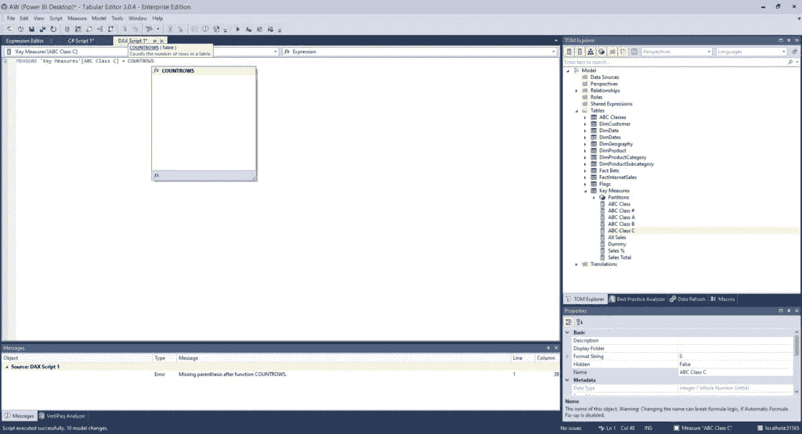

作者图片

一旦我开始编写函数，TE 3 并没有提供完整的函数名，但它也“告诉”我函数做了什么——在这种情况下，我可以看到 *COUNTROWS()* 将计算表中的行数。如果这还不够，我还想更详细地研究这个函数，我可以点击函数链接(上图中的蓝色链接)，我将直接导航到 [dax.guide](https://dax.guide/) 的这个公式参考:

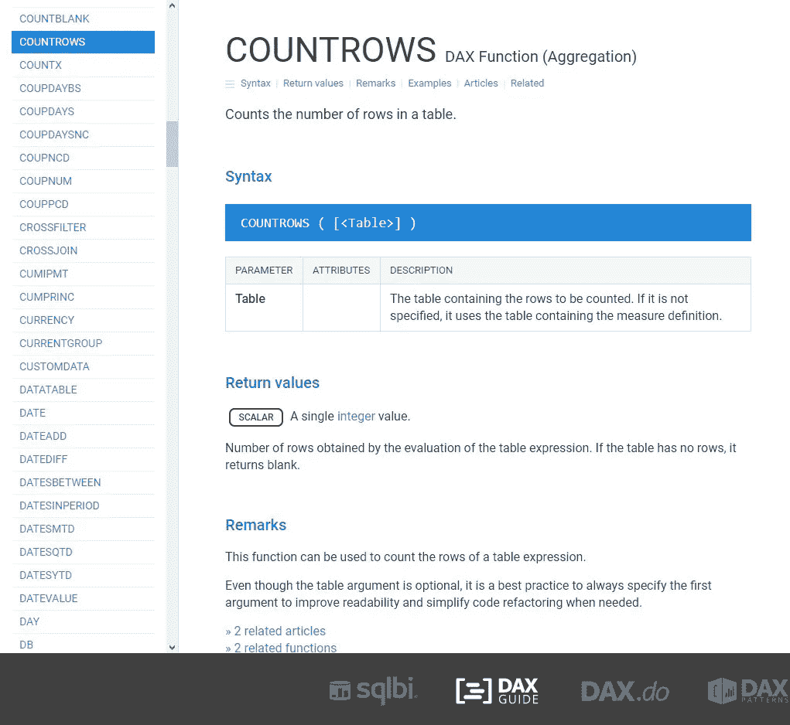

作者图片

这多酷啊！

这里有一个与 DAX 调试相关的额外提示。当您调试一个复杂的 DAX 计算时，很容易发生计算包含不止一个，而是多个不同的错误(听起来很熟悉，是吧？).有了常规的 DAX 编辑器，你可以一个一个的看到你的错误，然后一个一个的解决。另一方面，TE 3 从您的 DAX“杰作”中捕获所有的错误，指出发现错误的行，以及抛出错误的原因:

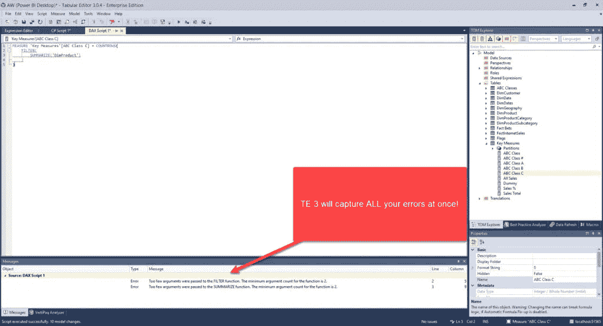

作者图片

不用说这个特性如何帮助您更有效地调试 DAX 代码。

## #5 数据预览

我不知道您怎么想，但是我遇到过“百万”次这样的情况，我想快速检查我的数据模型中的一个表的数据。我做了什么？将可视表格拖到我的报告画布上，在其中放置一些列，然后分析其中的内容…

现在，有了 TE 3，我可以做一件简单的事情:

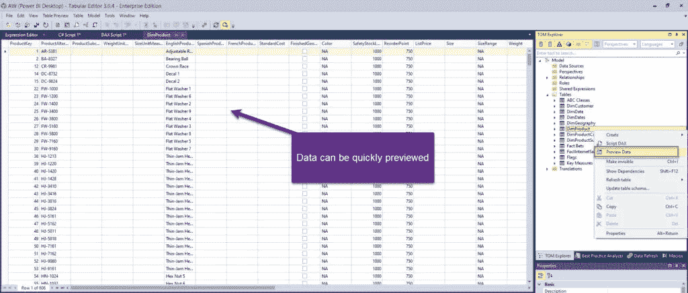

作者图片

只需右键点击表格，选择预览数据，就可以了！你可以立即看到里面有什么…

与此类似，还有一个非常酷的功能叫做 ***透视表网格*** ，类似 Excel 中的透视表。这样，您可以快速评估您的计算结果。

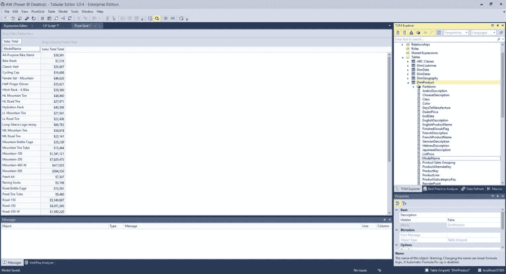

作者图片

## #6 衡量依赖性

我发现这对于有许多度量的大型模型非常有用。在大多数情况下，您的度量标准将相互“链接”,相互引用。而且，在一个包含数百个度量的模型中，很难确定度量之间的依赖关系。

正如你所想，TE 3 也为这个挑战提供了一个解决方案…

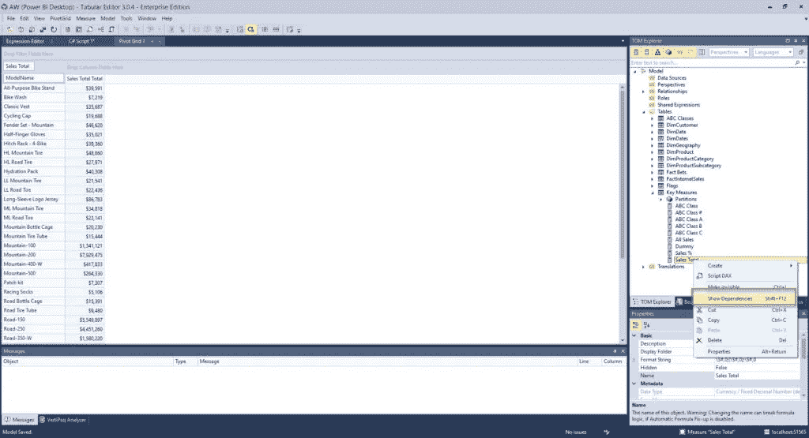

作者图片

如果右键单击度量并选择显示相关性，则可以看到哪些度量依赖于所选度量，以及所选度量依赖于哪些对象:

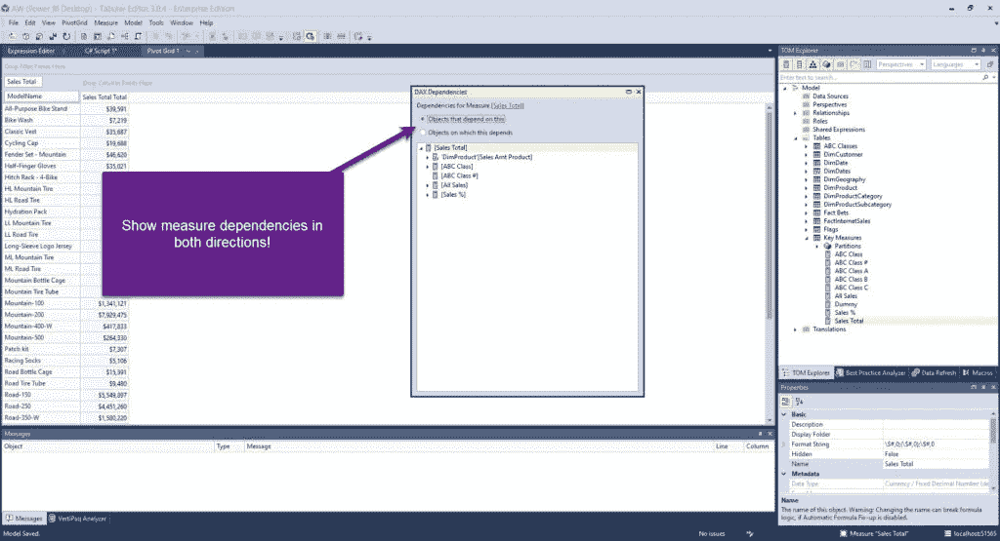

作者图片

## 结论

这只是表格编辑器 3 为支持 Power BI 开发而提供的特性的一个简短列表。TE 3 中有很多更高级的功能，比如记录宏、定制和保存工作空间，或者包括[最佳实践分析工具](https://powerbi.microsoft.com/en-us/blog/best-practice-rules-to-improve-your-models-performance/)。更不用说一些极其重要的功能，如*计算组*或*对象级安全*，甚至不可能从 Power BI 桌面执行，而只能从 TE 执行！

是的，还有一个黑暗模式:)

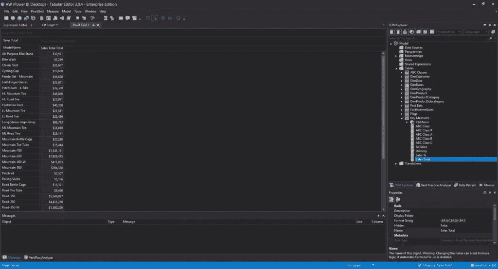

作者图片

严肃地说——如果你认为自己是 Power BI 专业人士，并且你真的想促进你的 Power BI 发展，这是你腰带下的“必备”工具。

如果你有兴趣了解更多关于表格编辑器 3 的特性，或者更好地下载并开始使用它，你可以参考[官方 TE 3 页面](https://tabulareditor.com/)。

感谢阅读！